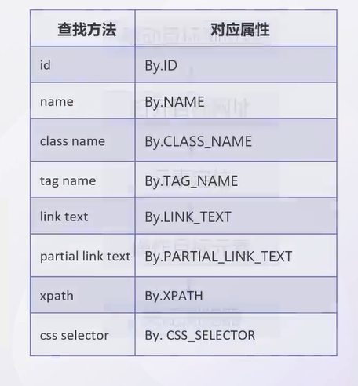
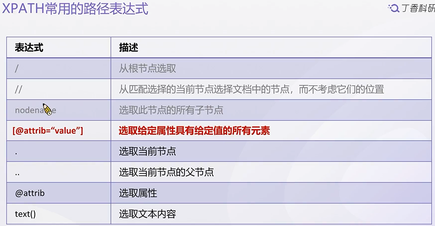
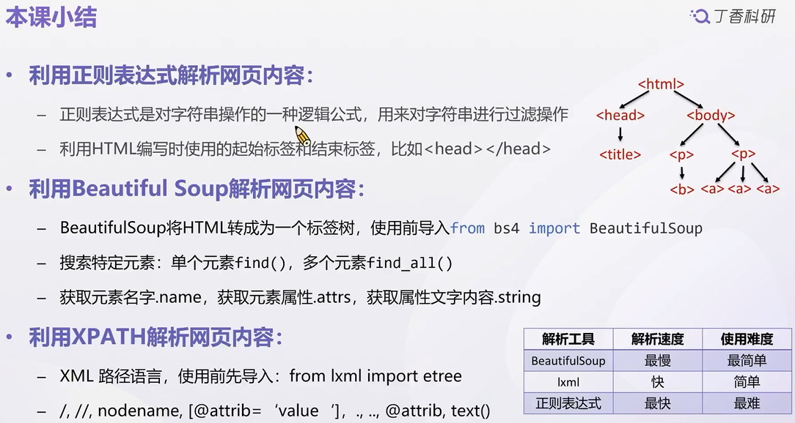
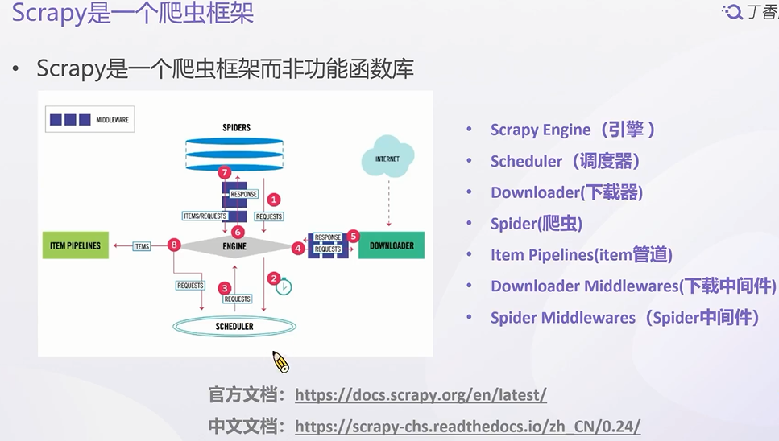
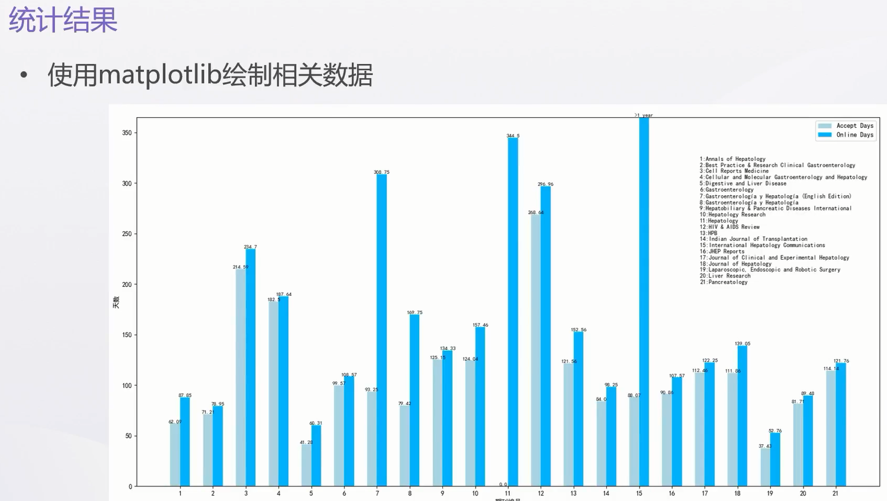

# 爬虫

## 1. 爬虫

1. 获取网页内容:网址发送请求,返回整个网页书库
2. 解析网页内容:提取数据
3. 保存数据

Request(获取)+Beautiful Soup(解析)
Biopython库(Entrez模块),pymed库
利用第三方库直接下载PDF
调用接口实现自动英译汉

Selenium(获取)+Beautiful Soup(解析)
jiba等库进行自然语言分析获取领域热词

爬取生信数据
Biopython处理多种生物信息学问题
pysam处理基因序列工具

## 2. Robots 协议

## 3. 爬虫常用库

1. Urllib库

+ Python内置的HTTP请求库
+ 一系列用于操作URL的功能

2. Requests库

+ 模拟浏览器操作
+ 下载网页内容

3. Selenium库

+ 模拟人自动与网站交互
+ 支持所有主流浏览器

常用解析库

4. re库
   + Python内置正则表达式模块
   + 解析速度快
5. beautifulsoup库
   + 结构化网页数据
   + 轻松获取网页内容
6. lxml库
   + 轻松处理XML和HTML文件
   + 支持XPATH解析房室,解析效率高

常用的数据存储库、爬虫框架
7. pymysql库
8. pymongo库
9. Scrapy爬虫框架
   + 爬取网站数据
   + 提取结构数据
## 5. HTML CSS JS

### Tag标签

- `<head>`:存放网页得元信息,不显示在网页中
- `<body>`存放网页得具体内容

```html
<html>

<head>
<title> 我的第一个HTML文件</title>

<body>
<p>元素得内容显示</p>
</body>
</head>
```

- 标题:`<h1>~<h6>`
- 段落:`<p>`
- 链接:`<a>` `<a href=http://baidu.com/>`
- 图片:`` ``


## 6. HTTP得请求和响应


1. Get请求:从指定得资源请求数据(从服务器获得数据)

   + 不带参数得Get请求:Http:www.baidu.com
   + 带参数得Get请求: http://baidu.com/s?wd=python (参数(key=value格式),多个参数之间使用&连接)

2. Post请求:向置顶得资源请求数据(向服务器上传递数据)

   

+ 响应报文
  + 状态行(response line),响应头部(request header),响应正文3部分组成
  + 状态码(status-code):200(成功),404,403...
### Requests库获取网页源代码
+ `request.get() `    获取网页的数据

  > + Get请求(不带参数):
  >
  >   `request.get('http://www.baidu.com')`
  >
  > + Get请求(带参数):
  >
  >   `request.get('http://www.baidu.com',params={'key1':'value1'})`

+ `request.post()`向网页提交POST请求

  >  ```python
  >  data = {
  >  'key1':'value1',
  >  'key2':'value2',
  >  'arr':['one','two']
  >  }
  >  requests.post('https://www.baidu.com',data=data)
  >  ```

+ Get请求中使用params接收参数,Post请求中使用data接收参数

+ Get请求或Post请求都是可以携带参数,参数通常写成字典的形式

 ```python
import requests
# 1. 无参数的get请求
response=requests.get('http://www.baidu.com/')
response.raise_for_status()
response.encoding=response.apparent_encoding
print(response.text)
#2. 有参数的get请求
url = 'http://www.baidu.com/s'
response = requests.get(url,params={'wd':'python'})
response.raise_for_status()
response.encoding=response.apparent_encoding
file = open('test.html','w',encoding='utf-8')
file.write(response.text)
file.close()
#3. Post请求
data = {'dxy':'python','key2':'value2'}
post = requests.post('http://httpbin.org/post', data=data)
post.raise_for_status()
post.encoding=post.apparent_encoding
file = open('test1.html','w',encoding='utf-8')
file.write(post.text)
file.close()

 ```


### Selenium模拟浏览器操作



+ 等待页面加载

  > 使用前导入:	`form selenium.webdriveer.support.ui import WenDriverWait`
  >
  > 创建brower时,设置全局元素等待超时的时间(隐式等待)
  >
  > ```python
  > browser = webdriver.Chrome()
  > browser.implicitly_wait(10)# 表示查找元素时超时时间是10s
  > element = browser.find_element(By.ID,'kw')
  > ```

+ 模拟鼠标操作

  使用webDriver提供的ActionChains类模拟鼠标事件

  - 导入ActionChains类:`from selenium.webdriver import ActionChains`
  - 调用ActionChains()类,将浏览器驱动brower传入:`chains=ActionChains(browser)`

  ActionChains提供的鼠标操作方法:

  - 左击:`chains.click(elem)`
  - 右击:`chains.context_click(elem)`
  - 双击:`chains.double_click(elem)`
  - 鼠标悬停:`chains.move_to_element(elem)`

执行操作:`perform()`,调用其他操作后,都要再次调用这个方法,表示鼠标某个操作

```python
from selenium import webdriver
from selenium.webdriver import ActionChains
browser = webdriver.Chrom()
chains = ActionChains(browser)
browser.get('...')
elem = browser.find_element(By.LINK_TEXT,'...')
chains.click(elem).perform()
```

+ 使用键盘操作

  - 借助key模块

    form selenium.webdriver.common.keys import Keys

  - 常见的键盘操作

    - `element.sendkeys('Python')`

    - `element.sendkeys('Keys.Back_SPACE')`

    - `element.sendkeys('Keys.CONTROL,'c')`

    - `element.clear()`

      

+ 模拟下拉栏操作

  `from selenium.webdriver.support.select import Select`

  - 返回所有选项

    ```python
    pro = Select(browser.find_element(By.ID,'pro'))
    for opt in pro.options:
    	...
    ```

  - (取消)选中某一个选项

    - 通过value属性选中或取消选中:

      `pro.select_by_value("bj")`,`pro.deselect_by_value("bj")`

    - 通过index索引选中或取消选中:

      `pro.select_by_index(0)`,`pro.deselect_by_index(0)`

    - 通过标签文字

      `pro.select_by_visable_text("广东")` ,`pro.deselect_by_visable_text("广东")`

+ 返回所有选项

  `pro=Select(boreser.find_element(By.ID,'pro))`

  `for option in pro.options:...`

+ (取消)选中某一个选项

  + 通过value属性选中或取消选中

    `pro.select_by_value('bj')`  ---`pro.deselect_by_value('bj')`

  + 通过index索引选中或取消选中

    `pro.select_by_index(0)`-----`pro.deselect_by_index(0)`

  + 通过标签文字选中或取消选中

    `pro.select_by_visible_text('广东')`------`pro.deselect_by_visiable_text('广东')`

+ 整个网页截图保存

  `browser.get_screenshot_as_file('./xxx.png')`

+ 指定元素截图并保存:

  ```python
  #找到目标元素
  elem = browser.find_elem(By.ID,'kw')
  #截图获取搜索框元素
  elem.screenshot('kw.png')
  ```

+ 关闭浏览器

  `browser.close()`

+ 关闭所有窗口

  `browser.quit()`
## 7. 提取信息

### 1. 正则表达式


```python
response = requests.get('http://www.baidu.com/')
response.raise_for_status()
response.encoding = response.apparent_encoding
title = re.findall(r'<title>(.*?)</title>', response.text)
print(title[0])

## 结果：百度一下，你就知道
```

### 3. Beautiful Soup


+ 利用Beautiful Soup解析：

  - 适用前导入：`from bs4 import BeautifulSoup`

  - 常见解析流程：

    - **Step1**：获取某个网页的HTML代码，如Request、Selenium

      ```python
      response = request.get('http://baidu.com')
      html = response.text
      ```

    - **Step2**：利用Beautiful Soup解析获得的html代码

      ```python
      soup = BeautifulSoup(html,'html.parser')
      print(soup.prettify())
      ```

       

  - 在BeautifulSoup中搜索单一对象

    - soup.tag_name()：只能获取当前标签下的第一个标签

      - soup.head：匹配`<head><title>The Dormouse's story</title></head>`
      - soup.title：匹配`<title>The Dormouse's story</title>`

    - soup.find('tag_name')：用于查找符合查询条件的第一个标签节点

      - `soup.find('head')`，与`soup.head`同效果，soup.find('title')与soup.title同效果

      - `soup.find('p',attrs{'class':'story'})`

        

    - soup.find_all('tag_name')：查找所有符合田间的标签节点，返回一个列表

      - `soup.find_all('titlr')`：匹配`[<title>The Dormouse's story</title>]`

      - `soup.find_all('a')`：匹配

        `[<a> class="sister" href="http://example.com/elsie" id="link1">Elsie</a>]`
    
    

### xPath库


- 使用时先导入：`from lxml import etree`

- 使用etree对获取的网页源代码进行解析`data = etree.HTML(response.text)`
- 利用XPATH获取指定元素：`elem = data.xpath('元素的XPAT和路径')`




- `/html`：匹配html节点

- `/html/head`：匹配html节点下的head节点

- `/html/body/p/b`等价于`//b`

- //：从匹配选择的当前节点选择文档中的节点，而不考虑他们的位置

  - `//*`可以查找所有的节点
  - `//body//a`：匹配body的后代节点种的a节点

- @：获取属性 使用@属性获取某个节点中的属性值：`节点的位置XPATH    /@属性`

  - //a/@href:
    - 匹配`['http://example.com/elsie','http://example.com/lacie','http://example.com/tillie']`
  - `//a/@class`：匹配`['sister','sister','sister']`

- text()：实现文本获取：节点的位置的XPATH   `\text()`

  - `//a[@href='http://example.com/elsie']/text()`：匹配elsie 
  - `//body/text()`：匹配`[''\n','\n\n','\n\n']`。只得到第一层内容
  - `//body//text()`遍历节点中所有的文本内容

  ```python
  a3 = data.xpath('//a[@href="http://example.com/tillie"]/text()')
  print(a3)
  a2_href = data.xpath("//a[@id='link2']/@href")
  print(a2_href)
  
  ```

  




## 4. 框架与反爬虫机制

### 1. Scrapy框架



- Scrapy安装:conda install -c conda-forge scrapy
- Scrapy的使用:
  - 创建爬虫项目:`scrapy startproject mySpider`
  - 定义需要抓取的数据(items.py)文件
  - 编写提取数据的爬虫(在Spider文件夹内)
  - 执行爬虫并保存数据:`scrapy crawl mySpider -o items.json`


### 2. 反爬虫

- 限制爬虫程序访问服务器资源和获取数据的行为称为反爬虫，常见反爬虫操作：
  - **User-Agent 请求头验证**：服务器端校验请求头中User-Agent值来区分正常用户和爬虫程序
  - **IP地址验证/限制访问频率**：如果单个IP访问超过阔值或访问频率过快，予以封锁
  - **图形验证码**：当系统怀疑当前的请求是来自于机器人或者爬虫之时，将弹出验证码对话框，要求用户填入正确的验证码，方可正常访问

### 3. 应对方法

1. 基于`user-agent`请求头的反爬虫

   + 浏览器在发送请求的时候，会附带一部分浏览器及当前系统环境参数

   + 反爬策略:

     + 将要请求的User-Agent值伪装成一般用户登录网站时使用的User-Agent值
     + 使用selenium模拟使用浏览器

   + 随机生成`user-Agent`添加到header中

     - 借助fask_useragent库:`pip install fake-useragent`
     - 使用前导入:`form fake_useragent import UserAgent`

   + 使用fake_useragent库随机生成User_Agent:

     ```python
     import requests
     form fake_useragent import UserAgent
     header={'useragent':UserAgent().random}
     response = request.get('http://baidu.com',headers=header)
     ```

2. 基于IP/限制访问频率的反爬虫

   + 反爬策略

     - 使用IP代理池
     - 降低访问频率

   + 降低访问频率:

     + 每次访问后设置等待时间

     + 使用`times.sleep()`实现请求间隔

       ```python
       import time
       import random
       time.sleep(random.randint(1.9))
       ```

   + 设置代理访问

     ```python
     proxie = {
       'http': 'http://175.42.129.xxx:9999'
       'http': 'http://175.44.108.xxx:9999'
       ...
     }
     response = request.get(url,proxies=proxies)
     ```

   + 基于图形验证码的反爬虫

     反爬策略

     + 下载或截图验证码，使用图像识别程序进行自动识别使用

     + Selenium实现鼠标的按下、拖动、释放等行为

     + 利用pytesseract识别验证码:对于没有斜线、噪点等干扰元素的验证码，可以用pytesseract库进行识别.Python-tesseract是-个基于google's Tesseract-OCR的独立封装包

       * 先安装Tesseract-OCR并配置环境变量

       * 然后安装 pip install pytesseract

       * 先下载或截图验证码,再识别验证码

         ```python
         import pytesseract
         from PIL import Image
         image = Image.open('./code.png')
         code = pytesseract.image_to_string(image)
         ```

### 4. 小结


## 爬虫数据

+ 三个重要的结构:获取网页内容$\rightarrow$网页解析内容$\rightarrow$保存数据

  按一定的规则,在网页源代码(HTML)提取需要的内容

+ 请求与内容抓取

  - HTTP请求Get请求(带参数,不带参数),post请求
  - Requests库:requests.get(),requests.post()
  - Selenium:驱动浏览器,模拟人类的浏览器操作(访问网页,定位元素,操作元素,关闭浏览器)

+ 解析信息提取

  - BeautifulSoup库:`soup.title`,`soup.find('title')`,`soup.find_all('a',attrs={...})`
  - XPATH库,/,//,nodename,[@attrib='value'],.,..,@attrib,text()

**简单的使用Beautiful,网页复杂多使用XPATH**


 

## 附录

从Pubmed上面爬取论文题目,作者,摘要,DOI
```python
# 从Pubmed上面爬取论文题目,作者,摘要,DOI
# 关键词lung cancer
# 爬取前5页的论文信息
# 题目h1下面的a标签
# 作者 class为authors-list的div标签
# 摘要 class为abstract-content selected的div标签
# DOI class为id-link的a标签
from urllib import response
import requests
from fake_useragent import UserAgent
from bs4 import BeautifulSoup
import pandas as pd

paper_data = pd.DataFrame(columns=['title','authors','doi',"abstract"])

url = 'https://pubmed.ncbi.nlm.nih.gov/'
kw = 'lung cancer'
fmt = 'abstract'
for num in range(1,6):
    response = requests.get(url,
                params={'term':kw,
                        'page':str(num),
                        'format':fmt},
                headers={"User-Agent":UserAgent().random})
    response.raise_for_status() #防止没正确解析出现错误运行
    response.encoding = response.apparent_encoding # 防止乱码

    # print(response.url)
    soup = BeautifulSoup(response.text,'html.parser')

    paper_list = soup.find_all('div',attrs={"class":"results-article"})
    
    title = []

    paper_record = {}
    for paper in paper_list:
        article = paper.article
        titles = article.h1.a.strings
        # strip函数用于删除头尾的空白符,包括\n\t等
        for s in titles:
            title.append(s.strip())
        # print(''.join(title))
        paper_record['title'] = ''.join(title)
        
        ## find author
        authors= []
        if article.find('em',attrs={"class":"empty-authors"}):
            authors.append('No author listed')
        else:
            author_list = article.find_all('a',attrs={'class':'full-name'})
            for author in author_list:
                authors.append(author.string.strip())
        # print(','.join(authors))
        paper_record['authors'] = ''.join(authors)

        # 获取DOI信息
        doi = article.find('span',attrs={"class":"citation-doi"})
        if doi is None:
            paper_record['doi'] = 'No doi'
        #     print(doi)
        else:
        #     print(doi.string.strip())
            paper_record['doi'] = doi.string.strip()

        # 获取摘要信息
        abstract = []
        if article.find_all("em",attrs={"class":"empty-abstract"}):
            print("No abstract")
        else:
            content = article.find("div",attrs={"class":"abstract-content selected"})
            abstracts = content.find_all('p')

            for item in abstracts:
                for sub_content in item.strings:
                    abstract.append(sub_content.strip())
            # print('\n'.join(abstract))
            paper_record['abstract'] = ''.join(abstract)
        paper_data = paper_data.append(paper_record,ignore_index=True)

paper_data.to_excel('./paper.xlsx',index=False)
```

**[⬆ 回到顶部](#1-爬虫)**