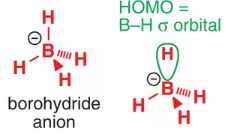
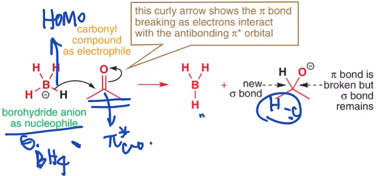
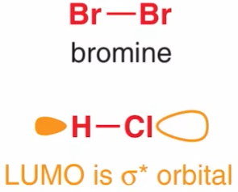

## 有机反应理论
### 电负性 偶极矩 杂化效应

1. 引言

   结构理论$\to$反应理论

   极性分子, 电负性, 偶极矩

   反应发生的可能性$\to$条件$\to$碰撞理论

   基本试剂, 亲核, 亲电试剂

   机理的描述

2. 电负性($\chi$)  ($\chi^2$分布)

   鲍林 电负性

   + $\chi$定义:原子对于键和电子的吸引能力大小

   + F = 4.0(最大)

     

   + 同周期内主族序数 $\to$ 核电荷数  $\to$ 层数不变 $\to$ 吸引力上升$\uparrow$ $\to$ $\chi\uparrow$ 

     $\chi_F>\chi_O>\chi_N>\chi_C$

   + 同主族内,周期数$\uparrow$  $\to$层数$\to$  原子对外层电子的约束力下降

     $\chi_F>\chi_{Cl}>\chi_{Br}>\chi_I$

3. 分子电荷的分布

   假设:分子化学键的两端平均分布着电子$e^-$

   

   如果分子化学键两端e分布不均匀

   ​				

   + 部分电荷中心: 

     

     eg1:  CH键的电负性差异小，不考虑

     eg2: $\ce{CH3-OH}$ 由于$\chi_O>\chi_C$, O 更倾向于拉到"键" $\to$ $\rho_0>\rho_C \to \rho_0(\delta^-)>\rho_C(\delta^+)$ 

     eg3:$\ce{CH3-Li}$, 由于 $\chi_C>\chi_{Li}$, C更倾向于拉到键合e,$\to \rho_c>\rho_{Li} \to \rho_C(\delta^-) > \rho_{Li}(\delta^+)$

     eg4:$\ce{CH3-Mg-Cl}$

4. 比较基团整体的电负性

   1. $\ce{-CF3}\quad \ce{-CCl3}$  $\chi_F>\chi_{Cl} \to \chi_\ce{-CF3}>\chi_\ce{-CCl3}$

   2. $\ce{-CH2CH3} \quad \ce{-CH=CH2} \quad \ce{-C#CH}$

      分析:$\chi$越大,电子越被吸引  离核越近(几何)

      电负性:$sp>sp^2>sp^3$

   3. 杂化效应:基团电负性差异的原因(单, 双, 三)电负性差异

      $\chi_{sp}>\chi_{sp^2}>\chi_{sp^3}$

      5. 偶极矩

   + 偶极矩$(\overrightarrow{\mu})= q\cdot \overrightarrow{r}$, 方向:部分正电中心指向部分负电中心

     eg: $\ce{A(\delta^+)-B(\delta^-)}$ 

     

   + 衡量该分子是否为极性分子:
     $$
     \mu
     \begin{cases}
     =0 \quad 极性分子\\
     \neq 0 \quad 非极性分子
     \end{cases}
     $$
     eg: 顺反式二氯甲烷 

     

### 有机反应理论本质

​		有效碰撞理论
束缚碰撞能量因素

 + 外层电子的库伦斥力(大,次要)
 + 分子间作用力(微弱,忽略)
 + 轨道重叠(大, major effect)

有效碰撞理论: 碰撞不一定使反应发生;

活化能(阻止反应的能量 min)=分子核外电子的库伦斥力+分子间作用力产生的能量+轨道无法有效重叠

挣脱活化能:$\underset{minor}{库仑力(电荷引力)}$+$\underset{major}{轨道作用}$

举例Org Rxns

  + 乙烯

    

  + 甲醛

    

### 亲核试剂(Nu:) 亲电试剂($E^\oplus$)

分子轨道理论的观点: 氧的sp3轨道的成键电子对 重叠到HCHO中空的$\pi^*_{C=O}$上,形成新轨道

乙烯有有一个$\pi_{c-c}$成键轨道, Br-Br有成键的$\sigma$和空$\sigma^*$轨道, 电子从满的$\pi_{c-c}$轨道到空的$\sigma^*_{Br-Br}$, 导致Br单键的断裂形成一个溴鎓离子和$\ce{Br^\ominus}$,

亲核加成 亲核取代 亲电加成 亲电取代

水的sp3轨道的孤对电子填充$\pi^*_\ce{C-O}$轨道

$\begin{cases}\text{curly arrow }弯曲箭头:电子云流动 \text{electron movement}\\\text{straight arrow} 直箭头: 反应方向\text{Rxn arrow}\end{cases}$

$\ce{NH3}$含有一对孤电子对, 填充到$\ce{BH3}$的空2p轨道, 形成一个$\sigma$键:$\sigma_{B-H}$和$\sigma*_{B-H}$轨道, $\sigma_{B-H}$填充一对电子:
 

review:

​	

如图, 如果E和Nu的能量相近, 那么能够获得更大的能量差, 反应更趋于形成; $\delta_{E'}增大\to\delta E\downarrow\to\text{反应更不倾向发生}$

> the best reactions are ones in which the energies of the interacting orbitals are similar in energy

### 前线轨道Lumo Homo

1. 理论

根据前面,只有$\ce{Nu:}$的最高占据轨道与$\ce{E^\oplus}$的最低未占据轨道的**$\Delta E'$**最小, 即形成新的轨道越稳定==>最好的反应.如图:

::: tip 重要
其他的轨道都可忽略, 即前线轨道

• The best nucleophiles have **high-energy occupied molecular orbitals** (HOMOs).
• The best electrophiles have **low-energy unoccupied molecular orbitals** (LUMOs).
:::
$$
关注
\begin{cases}
亲核试剂Nu:\to HOMO\\
亲电试剂E^\oplus \to LUMO
\end{cases}
$$

2. 如何判断亲核试剂

   + 有孤电子对的可作为亲核试剂

     eg:

     

     HOMO:sp3

   + 常见阴离子也可作亲核试剂

     eg:

     

     Br HOMO : 4p

   + $\pi$ 电子也可作亲核试剂

   + $\sigma$ 电子作为亲核试剂的情况

     C-金属 键(格氏试剂)

     eg: 
     

 

**起点是Nu:HOMO的位置**
3. 亲电试剂 $E^\oplus$

   接收电子  LUMO

   + 有空轨道

     eg:
     

     LUMO=H 1s

     缺电子体系

     eg:
     

     空p轨道

     醚的HOMO再O的孤电子,LUMO为B的空轨道

   + 强极性 $\pi$体系可作为亲电试剂

     

   + 单键连一个电负性大的原子可作为 $E^\oplus$

     eg:  

     卤素的电负性大, 其LUMO是Br-Br的$\sigma^*$

**终点表示电子的流向**

4. 总结

HOMO:最高占据(Nu:)

LUMO:最低空轨道($E^\oplus$)

::: tip Nu:

1. 孤电子对的体系:$\ce{NH3 NR3 \cdot** OH2}$

   HOMO:孤电子对所在的轨道

2. pi 体系 C=C

   HOMO: \pi电子占据的轨道

3. C-Li, $\ce{\overset{\ominus}{B}H4} $

   HOMO: 特殊的\sigma轨道

:::
  
::: tip E^\oplus:

1. 缺电子体系: $\ce{\overset{C}{\ominus}H3}, \ce{\overset{H}{\ominus}, \ce{BH3}, \ce{AlCl3}}$

   LUMO: 空轨道

2. 强极性\pi体系

   LUMO: $\ce{\pi^*_{C-O}}, \ce{\pi^*_{N-H}}$

3. \sigma键连了电负性大的元素$\ce{H-Cl , R-X}$

   LUMO: $\ce{\sigma^*_{H-Cl}, \sigma^*_{R-X}}$

:::

### 有机反应机理

1. 硝酸, 硝酸根, 硝基, 亚硝酸, 亚硝酸根, 亚硝基的lewis结构式

   

2. HPO3的结构式 

​	P在第三周期, 3s3p3d可以满足18个e, 故,P能够充满10个e

3. 箭头代表轨道重叠的过程

   

   eg1: 以H3O+\overset{\oplus}{O}H \to H2O为例

   