##  绪论

特点：

1. 碳通常以共价键与其它原子相连
2. 自身成键能力强
3. 同分异构现象普遍存在

物理性质

 	1. 熔点低
 	2. 沸点低
 	3. 挥发性大
 	4. 多数难溶于水
 	5. 比重一般比水小 
常见的官能团

## 2-1 Lewis结构式书写，形式电荷
### lewis结构式

$$
物质
\begin{cases}
中性分子 \\
自由基（中性） \\
离子--带电
\end{cases}
$$

离子的形成中发生$e^-$的转移/迁移

1. 简单分子

   依据2：简单原子核外的电子排布和lewis电子配对学说

   eg：

   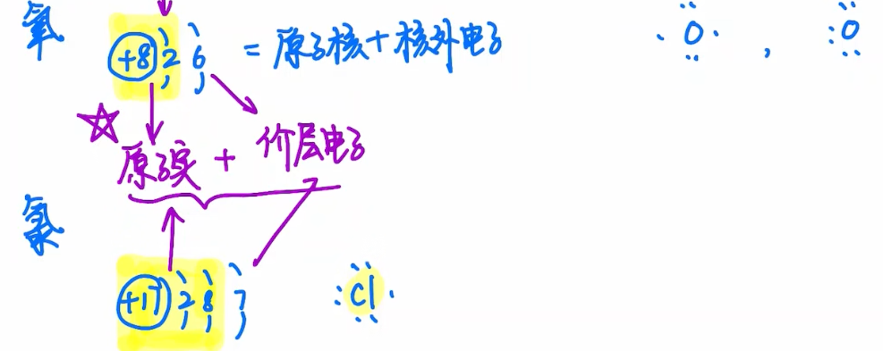

​	lewis配对学说：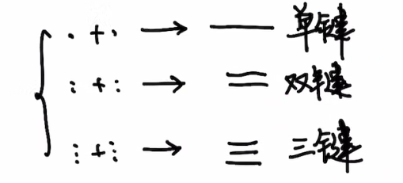

​	尽量配成$8e^-$的稳定结构(II周期)  

​	eg：$\ce{H2O}$=>$2\ce{H*}$ +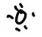

$$
\ce{O}周围8e^-
\begin{cases}
4e^-:位于\ce{O-H}之间 \\
\ce{O}独享:\begin{cases}
孤电子\\
未共享电子\ce{e-}
\end{cases}
\end{cases}
$$
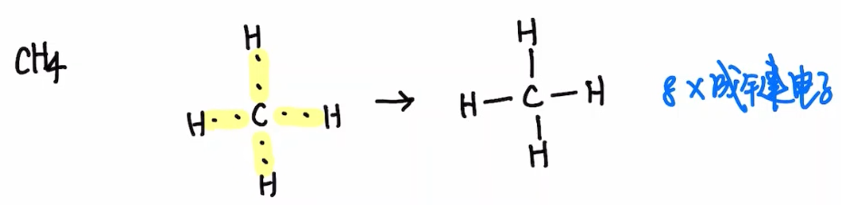

2. 简单的自由基

$$
简单的自由基
\begin{cases}
配对法:两个电子配对形成化学键(尽量满足八隅体规则)\\
结构未知:倒推法,皴裂思想
\end{cases}
$$

​	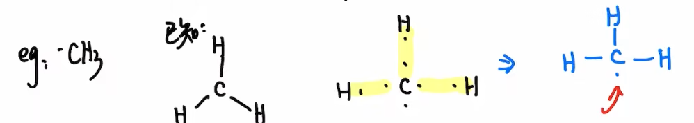

3. 简单的离子
   $$
   \text{离子形成一定有电子的转移}
   \begin{cases}
   \text{中性物质得}\ce{1e-} \to \text{阴离子}\\
   \text{中性物质失}\ce{e-} \to \text{阳离子}
   \end{cases}
   $$

   + 电子得失

     $\ce{Na*}\rightarrow\ce{Na^+}+\ce{e-}$

     $\ce{e-}+\overset{..}{\underset{..}{:\ce{cl*}}} \to [{\overset{..}{\underset{..}{:\ce{cl}:}}}]^-$ 

   + 异裂

     

     eg:$\ce{CH3-CH3} \to \ce{{}^-CH3}+\ce{{}^+CH3}$,两个甲基共享一个电子对

     

4. 标记形式电荷

   形式电荷=主族序数(**最外层电子数**)-不包括单电子的未共享电子数-1/2成键电子数

   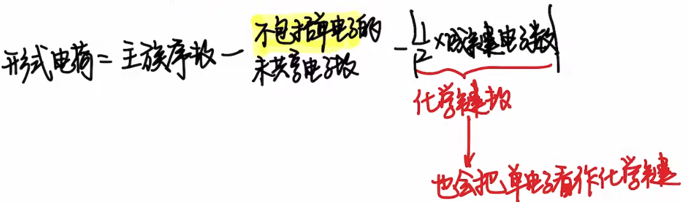

   eg: 甲基自由基 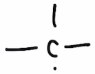 C:4-0-4=0

   + 得电子: 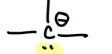 C:4-2-3=-1
   + 失电子: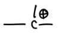 C:4-0-3=1

   eg: 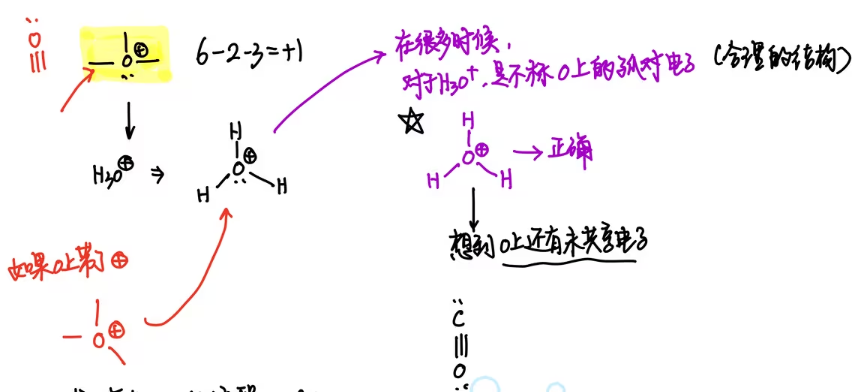

5. 复杂分子:$\ce{CO}$

   eg: $\overset{.}{\underset{.}{\ce{*C*}}}$ 与$\overset{.}{\underset{.}{:\ce{O:}}}$配对, 形成   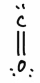, 不符合八隅体规则, 那么O上的一对电子结合到C上,形成配位键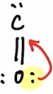,即C提供轨道, O提供电子, 形成 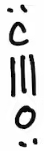, 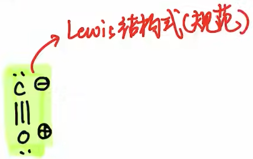

   eg: NO$\to$长命自由基, N上不满足$8\ce{e-}$规则:

   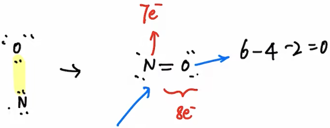

6. 总结 : 书写lewis结构$\to$ 配对电子+ 标记电荷

    1. 公式法

       知道原子系数\化学键数\未共享电子数

    2. 灵活
       $$
       \begin{cases}
       知道自由基
       \begin{cases}
       得\ce{e-} \to \oplus \\
       失\ce{e-} \to \ominus
       \end{cases}\\
       中性分子(大多数)
       \begin{cases}
       异裂(化学键)\\
       配位键(类似于\ce{CO})
       \begin{cases}
       进攻:形式电荷+1\\
       被进攻:形式电荷-1
       \end{cases}
       \end{cases}
       \end{cases}
       $$
       

    3. 记住结构片段 

	