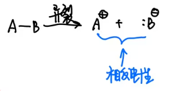
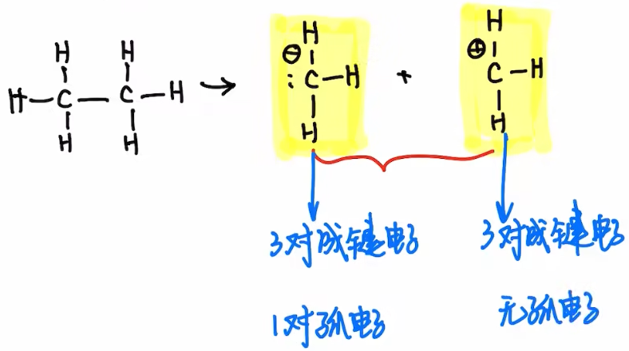
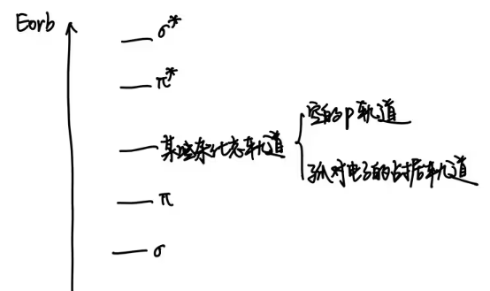
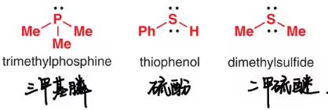
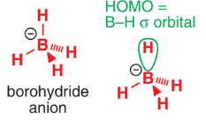
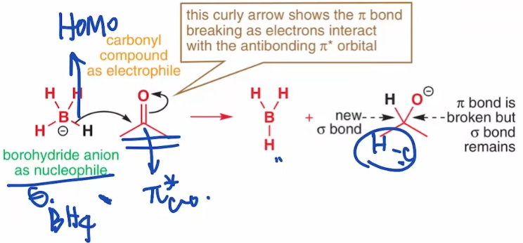
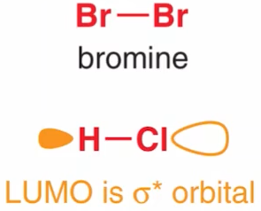

##  绪论

特点：

1. 碳通常以共价键与其它原子相连
2. 自身成键能力强
3. 同分异构现象普遍存在

物理性质

 	1. 熔点低
 	2. 沸点低
 	3. 挥发性大
 	4. 多数难溶于水
 	5. 比重一般比水小 
常见的官能团

## 2-1 Lewis结构式书写，形式电荷
### lewis结构式

$$
物质
\begin{cases}
中性分子 \\
自由基（中性） \\
离子--带电
\end{cases}
$$

离子的形成中发生$e^-$的转移/迁移

1. 简单分子

   依据2：简单原子核外的电子排布和lewis电子配对学说

   eg：

   

​	lewis配对学说：

​	尽量配成$8e^-$的稳定结构(II周期)  

​	eg：$\ce{H2O}$=>$2\ce{H*}$ +

$$
\ce{O}周围8e^-
\begin{cases}
4e^-:位于\ce{O-H}之间 \\
\ce{O}独享:\begin{cases}
孤电子\\
未共享电子\ce{e-}
\end{cases}
\end{cases}
$$

2. 简单的自由基

$$
简单的自由基
\begin{cases}
配对法:两个电子配对形成化学键(尽量满足八隅体规则)\\
结构未知:倒推法,皴裂思想
\end{cases}
$$

​	

3. 简单的离子
   $$
   \text{离子形成一定有电子的转移}
   \begin{cases}
   \text{中性物质得}\ce{1e-} \to \text{阴离子}\\
   \text{中性物质失}\ce{e-} \to \text{阳离子}
   \end{cases}
   $$

   + 电子得失

     $\ce{Na*}\rightarrow\ce{Na^+}+\ce{e-}$

     $\ce{e-}+\overset{..}{\underset{..}{:\ce{cl*}}} \to [{\overset{..}{\underset{..}{:\ce{cl}:}}}]^-$ 

   + 异裂
	
    
     eg:$\ce{CH3-CH3} \to \ce{{}^-CH3}+\ce{{}^+CH3}$,两个甲基共享一个电子对

	

4. 标记形式电荷

   形式电荷=主族序数(**最外层电子数**)-不包括单电子的未共享电子数-1/2成键电子数

   

   eg: 甲基自由基  C:4-0-4=0

   + 得电子:  C:4-2-3=-1
   + 失电子: C:4-0-3=1

   eg: 

5. 复杂分子:$\ce{CO}$

   eg: $\overset{.}{\underset{.}{\ce{*C*}}}$ 与$\overset{.}{\underset{.}{:\ce{O:}}}$配对, 形成   , 不符合八隅体规则, 那么O上的一对电子结合到C上,形成配位键,即C提供轨道, O提供电子, 形成 , 

   eg: NO$\to$长命自由基, N上不满足$8\ce{e-}$规则:

   

6. 总结 : 书写lewis结构$\to$ 配对电子+ 标记电荷

    1. 公式法

       知道原子系数\化学键数\未共享电子数

    2. 灵活
    
       $$
       \begin{cases}
       知道自由基
       \begin{cases}
       得\ce{e-} \to \oplus \\
       失\ce{e-} \to \ominus
       \end{cases}\\
       中性分子(大多数)
       \begin{cases}
       异裂(化学键)\\
       配位键(类似于\ce{CO})
       \begin{cases}
       进攻:形式电荷+1\\
       被进攻:形式电荷-1
       \end{cases}
       \end{cases}
       \end{cases}
       $$
       

    3. 记住结构片段 

	​		

​		总结(H B C N O X)

**形式电荷 = 主族序数 - 未共享电子数-1/2成键电子数**

|   原子式种类   |    外层电子数  |  化学键数    |   孤电子对数   |   形式电荷   |   记法   |
| :--: | :--: | :--: | :--: | :--: | :--: |
| H | 0 | 0 | 0 | +1 | $\ce{H^\oplus}$ |
| H | 1 | 0 | 0 | 0 | $\ce{H*}$ |
| H | 2 | 0 | 1 | -1 | $\ce{{:}H^\ominus}$ |
| H | 2 | 1 | 0 | 0 | $\ce{R-H}$ |
| B | 6 | 3 | 0 | 0 |  |
| B | 8 | 4 | 0 | -1 |  |
| C | 8 | 4 | 0 | 0 |  |
| C | 8 | 4 | 0 | 0 |                         $\ce{H-C#C}$                         |
| C | 8 | 4 | 0 | 0 |  |
| C | 6 | 3 | 0 | $4-3=+1$ |  |
| C | 8 | 3 | 1 | $4-3-2=-1$ |  |
| C | 8 | 3 | 1 | $4-3-2=-1$ |  |
| N | 8 | 3 | 1 | $5-3-2=0$ |  |
| N | 8 | 3 | 1 | 0 |  |
| N | 8 | 4 | 0 | $5-4=+1$ | $\ce{\overset{\oplus}{N}H4}$ |
| N |  |  |  | +1 |  |
| N |  |  |  | +1 | $\ce{{}#\overset{\oplus}{N}-{}}$ |
| N | 8 | 2 | 2 | $5-2-4=-1$ |  |
| O | 8 | 1 | 3 | $6-1-6$ | $\ce{R-{\overset{..}{\underset{..}{\ce{O}:}}}^{\ominus}}$ |
| O | 8 | 2 | 2 | $6-2-4=0$ |  |
| O |  |  |  | 0 |  |
| O | 8 | 3 | 1 | $6-3-2=+1$ |  |
| O |  |  |  |  |  |
| O |  |  |  |  |  |
| X(F,Cl,Br,I) | 8 | 0 | 4 | $7-0-8=-1$ | $\ce{X-}$ |
| X(...) | 8 | 1 | 3 | $7-1-6=0$ | $\ce{C-{\overset{..}{\underset{..}{\ce{X}:}}}}$ |
| X | 8 | 2 | 2 | $7-2-4=+1$ | $\ce{C=\overset{..}{\underset{..}{X}}^\ominus}$ |

形式电荷($\ominus \quad \oplus \quad + \quad -$ ) 与部分电荷中心(${\delta+} \quad {\delta-}$)的区别：

以$\ce{HCl}$为例，Cl的电负性大于H，吸引更多的电子，Cl在HCL中显负电性$\delta-$，H显示正电性$\delta+$

$$
形式电荷\ominus \quad \oplus
\begin{cases}
在简单离子中表示带电情况\\
在复杂体系中不能理解为电性分布\\
但是能体现Lewis结构式中的价电子数
\end{cases}\\
$$

$$
形式电荷\delta+ \quad \delta-
\begin{cases}
物理意义：表示每个原子实的电性(静电势)\\
在简单体系中可以使用电负性来预测\\
如今常使用计算软件来表征分子的静电势
\end{cases}
$$

### 原子轨道、价电子互斥理论、杂化轨道理论

1. 轨道的分布

   其在笛卡尔坐标系的集合表示 $不同的区域\begin{cases} 形态不同\\符号不同（相位）\end{cases}$

   有机：S、P

   

   **相位：**

2. 轨道的能量draw diagram

   单原子：$E_{1s}<E_{2s}<E_{2p}<E_{3s}<E_{3p}$

3. 价层电子互斥理论

   中心原子

   配基							CH4

   斥力因素：$F(孤立电子对)>F(孤立电子-成键电子)> F(成键电子-成键电子)$

   

4. 杂化轨道理论

   定量地描绘空间结构

   巧妙运用“轨道”概念

   ​		eg: $\ce{CH4}$   两个电子在2s轨道，两个电子在2p轨道，四个电子是不等价的。

   ​		$\begin{cases}		判断杂化方式(sp1,sp2,sp3) \\		轨道的几何关系\\		Diagram作图\end{cases}$

   + 价层电子对数 = 1/2(中心原子主族序数+配体数+阴正阳负)

     O,S作端基为0,

     $\begin{cases}m=4 \quad sp3\\m=3 \quad sp2\\ m=2 \quad sp\end{cases}$

     eg1: $\ce{CH3OH}$ 公式 $m=\frac{4+4}{2}=4$,即为Sp3杂化

     eg2:羰基$\ce{HCHO}$ $m=\frac{4+2}{2}=3$,为sp2杂化

     eg3:$\ce{{}^+CH3}$,$m=\frac{4+3-1}{3}=3$,为sp2杂化

   

### 分子轨道理论

1. 找到两个轨道

   C-H: C:sp3 H:s

2. 标轨道

   $\begin{cases}\ce{C:sp3} \psi_1 \to 轨道一种数字表示\\H:s:\psi_2 \end{cases}$

3. 组合

   $\begin{cases} \psi_1^\prime = \psi_1+\psi_2\\\psi_2^\prime = \psi_1-\psi_2\end{cases}$

4. 重叠与轨道生成-->头碰头 $\sigma$键 $\sigma$轨道

5. 标轨道能量:轨道有效重叠的成都越高,整体质量能量越低

6. 填电子

​	简单的轨道能量关系

$$
\begin{cases}
给电子能力:单键< 双键 < 孤电子对\\
断键: 优先 \pi ,其次\sigma
\end{cases}
$$
​	共价键总结: $\ce{CH3-CH3}$,如何看待C-C

​	lewis配对 => C-C 满足八隅体 配对

​	VBT 价键理论 $\ce{C..C}$,电子共享交换

​	杂化理论    轨道杂化,组合

​	分子轨道理论MOT:   $\to$ 化学键本质

### 电负性 偶极矩 杂化效应

1. 引言

   结构理论$\to$反应理论

   极性分子, 电负性, 偶极矩

   反应发生的可能性$\to$条件$\to$碰撞理论

   基本试剂, 亲核, 亲电试剂

   机理的描述

2. 电负性($\chi$)  ($\chi^2$分布)

   鲍林 电负性

   + $\chi$定义:原子对于键和电子的吸引能力大小

   + F = 4.0(最大)

     

   + 同周期内主族序数 $\to$ 核电荷数  $\to$ 层数不变 $\to$ 吸引力上升$\uparrow$ $\to$ $\chi\uparrow$ 

     $\chi_F>\chi_O>\chi_N>\chi_C$

   + 同主族内,周期数$\uparrow$  $\to$层数$\to$  原子对外层电子的约束力下降

     $\chi_F>\chi_{Cl}>\chi_{Br}>\chi_I$

3. 分子电荷的分布

   假设:分子化学键的两端平均分布着电子$e^-$

   

   如果分子化学键两端e分布不均匀

   ​				

   + 部分电荷中心: 

     

     eg1:  CH键的电负性差异小，不考虑

     eg2: $\ce{CH3-OH}$ 由于$\chi_O>\chi_C$, O 更倾向于拉到"键" $\to$ $\rho_0>\rho_C \to \rho_0(\delta^-)>\rho_C(\delta^+)$ 

     eg3:$\ce{CH3-Li}$, 由于 $\chi_C>\chi_{Li}$, C更倾向于拉到键合e,$\to \rho_c>\rho_{Li} \to \rho_C(\delta^-) > \rho_{Li}(\delta^+)$

     eg4:$\ce{CH3-Mg-Cl}$

4. 比较基团整体的电负性

   1. $\ce{-CF3}\quad \ce{-CCl3}$  $\chi_F>\chi_{Cl} \to \chi_\ce{-CF3}>\chi_\ce{-CCl3}$

   2. $\ce{-CH2CH3} \quad \ce{-CH=CH2} \quad \ce{-C#CH}$

      分析:$\chi$越大,电子越被吸引  离核越近(几何)

      电负性:$sp>sp^2>sp^3$

   3. 杂化效应:基团电负性差异的原因(单, 双, 三)电负性差异

      $\chi_{sp}>\chi_{sp^2}>\chi_{sp^3}$

5. 偶极矩

   + 偶极矩$(\overrightarrow{\mu})= q\cdot \overrightarrow{r}$, 方向:部分正电中心指向部分负电中心

     eg: $\ce{A(\delta^+)-B(\delta^-)}$ 

     

   + 衡量该分子是否为极性分子:
     $$
     \mu
     \begin{cases}
     =0 \quad 极性分子\\
     \neq 0 \quad 非极性分子
     \end{cases}
     $$
     eg: 顺反式二氯甲烷 

     

### 有机反应理论本质

​		有效碰撞理论

束缚碰撞能量因素

 + 外层电子的库伦斥力(大,次要)
 + 分子间作用力(微弱,忽略)
 + 轨道重叠(大, major effect)

有效碰撞理论: 碰撞不一定使反应发生;

活化能(阻止反应的能量 min)=分子核外电子的库伦斥力+分子间作用力产生的能量+轨道无法有效重叠

挣脱活化能:$\underset{minor}{库仑力(电荷引力)}$+$\underset{major}{轨道作用}$

举例Org Rxns

  + 乙烯

    

  + 甲醛

    

### 亲核试剂(Nu:) 亲电试剂($E^\oplus$)

分子轨道理论的观点: 氧的sp3轨道的成键电子对 重叠到HCHO中空的$\pi^*_{C=O}$上,形成新轨道

乙烯有有一个$\pi_{c-c}$成键轨道, Br-Br有成键的$\sigma$和空$\sigma^*$轨道, 电子从满的$\pi_{c-c}$轨道到空的$\sigma^*_{Br-Br}$, 导致Br单键的断裂形成一个溴鎓离子和$\ce{Br^\ominus}$,

亲核加成 亲核取代 亲电加成 亲电取代

水的sp3轨道的孤对电子填充$\pi^*_\ce{C-O}$轨道

$\begin{cases}\text{curly arrow }弯曲箭头:电子云流动 \text{electron movement}\\\text{straight arrow} 直箭头: 反应方向\text{Rxn arrow}\end{cases}$

$\ce{NH3}$含有一对孤电子对, 填充到$\ce{BH3}$的空2p轨道, 形成一个$\sigma$键:$\sigma_{B-H}$和$\sigma*_{B-H}$轨道, $\sigma_{B-H}$填充一对电子:
 

review:

​	

如图, 如果E和Nu的能量相近, 那么能够获得更大的能量差, 反应更趋于形成; $\delta_{E'}增大\to\delta E\downarrow\to\text{反应更不倾向发生}$

> the best reactions are ones in which the energies of the interacting orbitals are similar in energy

### 前线轨道Lumo Homo

1. 理论

根据前面,只有$\ce{Nu:}$的最高占据轨道与$\ce{E^\oplus}$的最低未占据轨道的**$\Delta E'$**最小, 即形成新的轨道越稳定==>最好的反应.如图:

::: tip 重要
其他的轨道都可忽略, 即前线轨道

• The best nucleophiles have **high-energy occupied molecular orbitals** (HOMOs).
• The best electrophiles have **low-energy unoccupied molecular orbitals** (LUMOs).
:::
$$
关注
\begin{cases}
亲核试剂Nu:\to HOMO\\
亲电试剂E^\oplus \to LUMO
\end{cases}
$$

2. 如何判断亲核试剂

   + 有孤电子对的可作为亲核试剂

     eg:

     

     HOMO:sp3

   + 常见阴离子也可作亲核试剂

     eg:

     

     Br HOMO : 4p

   + $\pi$ 电子也可作亲核试剂

   + $\sigma$ 电子作为亲核试剂的情况

     C-金属 键(格氏试剂)

     eg: 
     

 

**起点是Nu:HOMO的位置**

3. 亲电试剂 $E^\oplus$

   接收电子  LUMO

   + 有空轨道

     eg:
     

     LUMO=H 1s

     缺电子体系

     eg:
     

     空p轨道

     醚的HOMO再O的孤电子,LUMO为B的空轨道

   + 强极性 $\pi$体系可作为亲电试剂

     

   + 单键连一个电负性大的原子可作为 $E^\oplus$

     eg:  

     卤素的电负性大, 其LUMO是Br-Br的$\sigma^*$

**终点表示电子的流向**

4. 总结

HOMO:最高占据(Nu:)

LUMO:最低空轨道($E^\oplus$)

:::tip Nu:

1. 孤电子对的体系:$\ce{NH3 NR3 \cdot** OH2}$

   HOMO:孤电子对所在的轨道

2. pi 体系 C=C

   HOMO: \pi电子占据的轨道

3. C-Li, $\ce{\overset{\ominus}{B}H4} $

   HOMO: 特殊的\sigma轨道

:::

:::tip $E^\oplus$

1. 缺电子体系: $\ce{\overset{C}{\ominus}H3}, \ce{\overset{H}{\ominus}, \ce{BH3}, \ce{AlCl3}}$

   LUMO: 空轨道

2. 强极性\pi体系

   LUMO: $\ce{\pi^*_{C-O}}, \ce{\pi^*_{N-H}}$

3. \sigma键连了电负性大的元素\ce{H-Cl , R-X}

   LUMO: $\ce{\sigma^*_{H-Cl}, \sigma^*_{R-X}}$

:::

