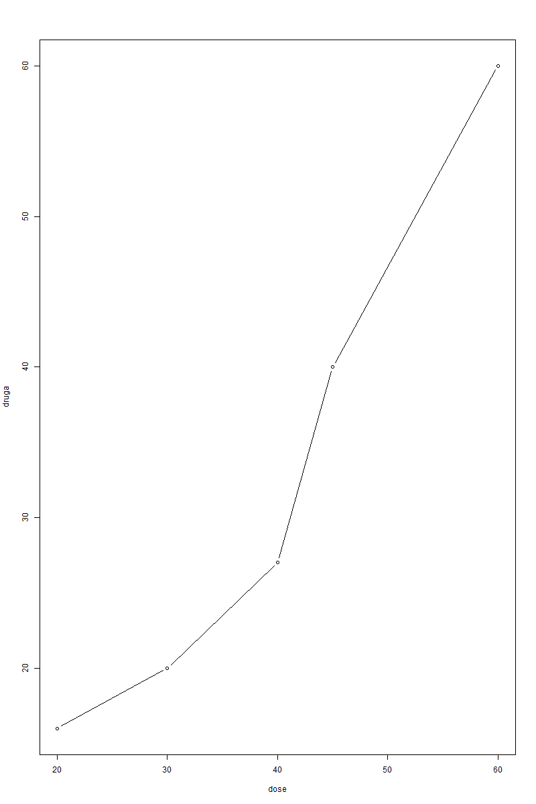
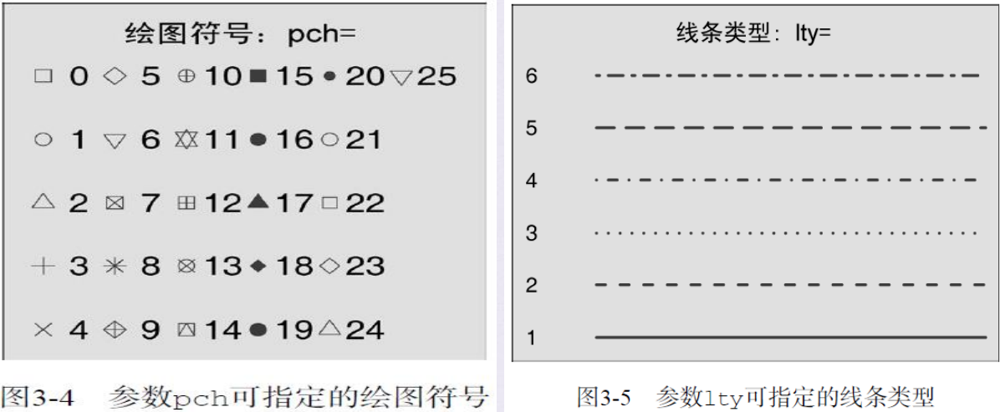
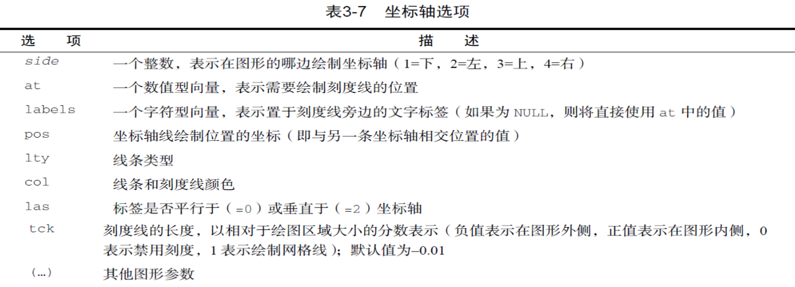
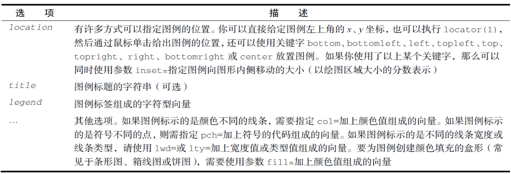
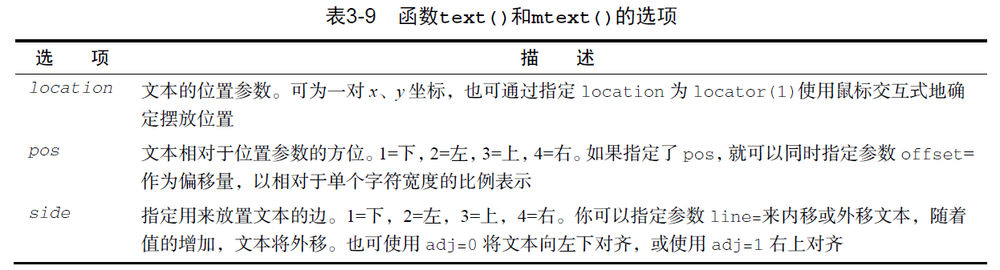

# R语言基础
## 基础知识
### 工作空间
工作空间（workspace）就是当前R的工作环境，它存储 着所有用户定义的对象（向量、矩阵、函数、数据框、列表）
| 函数 | 功能 |
| --- | --- |
| `getwd()` | 显示当前的工作目录 |
| `setwd("mydirectory")` | 修改当前的工作目录为mydirectory |
| `ls()` | 列出当前工作空间中的对象 |
| `rm(objectlist)` | 移除(删除)一个或多个对象 |
| `help(options)` | 显示可用选项的说明 |
| `options()` | 显示或设置当前选项 |
| `history(#)` | 显示最近使用过的#个命令 (默认值为25) |
| `savehistory("myfile")` | 保存命令历史到文件myfile中(默认值为.Rhistory) |
| `loadhistory("myfile")` | 载入一个命令历史文件(默认值为Rhistory) |
| `save.image("myfile")` | 保存工作空间到文件myfile中(默认值为.RData) |
| `save(objectlist, "myfile")` | 保存指定对象到一个文件中 |
| `load("myfile")` | 读取一个工作空间到当前会话中(默认值为RData) |
| `q()` | 退出R，将会询问你是否保存工作空间 |

### R 包

+ R自带了一系列默认包（包括`base、datasets、utils、grDevices、graphics、stats以及methods`），它们提供了种类繁多的默认函数和数据集。其他包可通过下载来进行安装。安装好以 后，它们必须被载入到会话中才能使用。命令search()可以告诉你 哪些包已加载并可使用。
+ 用命令 `install.packages(“gclus”)`, 下载和安装包
+ 使用命令 `update.packages()`, 更新已经安装的包
+ 使用命令 `installed.packages()`, 列出已安装的包
+ 使用`library()`命令载入这个包。例如，要使用`gclus`包，执行命令`library(gclus)`即可。当然，在载入一个 包之前必须已经安装了这个包。在一个会话中，包只需载入一次。

### 获取帮助

| 函数 | 功能 |
| --- | --- |
| `help.start()` | 打开帮助文档首页 |
| `help("foo")` 或 `?foo` | 查看函数 foo 的帮助（引号可以省略） |
| `help.search("foo")` 或 `??foo` | 以 foo 为关键词搜索本地帮助文档 |
| `example("foo")` | 函数 foo 的使用示例（引号可以省略） |
| `Rsitesearch("foo")` | 以 foo 为关键词搜索在线文档和邮件列表存档 |
| `apropos("foo", mode="function")` | 列出名称中含有 foo 的所有可用函数 |
| `data()` | 列出当前已加载包中所含的所有可用示例数据集 |
| `vignette()` | 列出当前已安装包中所有可用的 vignette 文档 |
| `vignette("foo")` | 为主题 foo 显示指定的 vignette 文档 |


### 常见错误

- 使用了错误的大小写。`help()`、`Help()` 和 `HELP()` 是三个不同的函数（只有第一个是正确的）。
- 忘记使用必要的引号。`install.packages("gclus")` 能够正常执行，然而 `Install.packages(gclus)` 将会报错。
- 在函数调用时忘记使用括号。例如，要使用 `help()` 非 `help`。即使函数无需参数，仍需加上 `()`。
- 在 Windows 上，路径名中使用了 `\`。R 将反斜杠视为一个转义字符。`setwd("c:\mydata")` 会报错。正确的写法是 `setwd("c:/mydata")` 或 `setwd("c:\\mydata")`。
- 使用了一个尚未载入包中的函数。函数 `order.clusters()` 包含在包 `gclus` 中。如果还没有载入这个包就使用它，将会报错。

## 数据集

<center>
    
    <br>
    <div style="color:orange; border-bottom: 1px solid #d9d9d9;
         display: inline-block; color: #999; padding: 2px;">R语言中的数据结构</div>
</center>

### 标量和向量
+ 标量是只含一个元素的向量，例如：`f <- 3`、`g <- “US”`和 `h <- TRUE`。它们 用于保存常量。
+ 向量是用于存储数值型、字符型或逻辑型数据的一维数组。执行组合功能的函数 c()可用来创建向量。各类向量如下例所示：
```R
a <- c(1, 2, 5, 3, 6, -2, 4)
b <- c("one", "two", "three")
c <- c(TRUE, TRUE, TRUE, FALSE, TRUE, FALSE)
```

### 矩阵
+ 矩阵是一个二维数组，只是每个元素都拥有相同的模式（数值型、 字符型或逻辑型），可通过函数 matrix() 创建矩阵，一般使用格式 如下：
```R
myymatrix <- matrix(vector, nrow=number_of_rows, 
ncol=number_of_columns,byrow=logical_value, dimnames=list(char_vector_rownames, char_vector_colnames))
```

### 数组
+ 数组（array）与矩阵类似，但是维度可以大于2。数组可通过array 函数创建，形式如下：
`myarray <- array(vector, dimensions, dimnames)`
+ 其中vector包含了数组中的数据，dimensions是一个数值型向量， 给出了各个维度下标的最大值，而dimnames是可选的、各维度名 称标签的列表。

### 数据框
+ 由于不同的列可以包含不同模式（数值型、字符型等）的数据，数 据框的概念较矩阵来说更为一般。它与通常在SAS、SPSS和Stata 中看到的数据集类似。数据框将是R中最常处理的数据结构。数据 框可通过函数 data.frame() 创建：
`mydata <- data.frame(col1, col2, col3,...)`
+ 其中的列向量col1、col2、col3等可为任何类型（如字符型、数值 型或逻辑型）。每一列的名称可由函数names指定。
### 因子
+ 类别（名义型）变量和有序类别（有序型）变量在R中称为因子 （factor）。因子在R中非常重要，因为它决定了数据的分析方式以
及如何进行视觉呈现。函数factor()以一个整数向量的形式存储类别 值，整数的取值范围是[1...k]（其中k是名义型变量中唯一值的个 数），同时一个由字符串（原始值）组成的内部向量将映射到这些 整数上。
### 列表
+ 列表（list）是R的数据类型中最为复杂的一种。一般来说，列表就 是一些对象（或成分，component）的有序集合。列表允许你整 合若干（可能无关的）对象到单个对象名下。
+ 例如，某个列表中可能是若干向量、矩阵、数据框，甚至其他列表 的组合。可以使用函数list()创建列表：
`mylist <- list(object1, object2, ...)`
+ 其中的对象可以是目前为止讲到的任何结构。你还可以为列表中的 对象命名：
`mylist <- list(name1=object1, name2=object2, ...)`

### 其他
+ 对象名称中的句点（.）没有特殊意义，但美元符号（$）却有着和其他语言中的句点类似 的含义，即指定一个数据框或列表中的某些部分。例如，A$x是指数据框A中的变量x。 
+ R不提供多行注释或块注释功能。你必须以#作为多行注释每行的开始。出于调试目的，你 也可以把想让解释器忽略的代码放到语句if(FALSE){... }中。将FALSE改为TRUE即允许这块代 码执行。
+ 将一个值赋给某个向量、矩阵、数组或列表中一个不存在的元素时，R将自动扩展这个数据 结构以容纳新值。举例来说，考虑以下代码：
```R
> x <- c(8, 6, 4)
> x[7] <- 10
> x
```
通过赋值，向量x由三个元素扩展到了七个元素。x <- x[1:3]会重新将其缩减回三个元素。 
+ R中没有标量。标量以单元素向量的形式出现。
+ R中的下标不从0开始，而从1开始。在上述向量中，x[1]的值为8。 ❑
+ 量无法被声明。它们在首次被赋值时生成。

### 可供R导入的数据源


## 数据管理

+ 变量赋值 最新版本的 R 语言的赋值可以使用左箭头 <-、等号 = 、右箭头 -> 赋值:

## 逻辑运算符
下表列出了 R 语言支持的逻辑运算符，可用于数字、逻辑和复数类型的向量。

非 0 的数字（正数或负数）都为 TRUE。

逻辑运算符比较两个向量，将第一向量与第二向量的每个元素进行比较，结果返回一个布尔值。
| 运算符 | 描述 |
| --- | --- |
| & | 元素逻辑与运算符，将第一个向量的每个元素与第二个向量的相对应元素进行组合，如果两个元素都为 TRUE，则结果为 TRUE，否则为 FALSE。 |
| \| | 元素逻辑或运算符，将第一个向量的每个元素与第二个向量的相对应元素进行组合，如果两个元素中有一个为 TRUE，则结果为 TRUE，如果都为 FALSE，则返回 FALSE。 |
| \! | 逻辑非运算符，返回向量每个元素相反的逻辑值，如果元素为 TRUE 则返回 FALSE，如果元素为 FALSE 则返回 TRUE。 |
| && | 逻辑与运算符，只对两个向量对第一个元素进行判断，如果两个元素都为 TRUE，则结果为 TRUE，否则为 FALSE。 |
| \|\| | 逻辑或运算符，只对两个向量对第一个元素进行判断，如果两个元素中有一个为 TRUE，则结果为 TRUE，如果都为 FALSE，则返回 FALSE。 |
### 变量的重命名
+ fix() 函数
+ names()函数`names(leadership)[2] <- "testdate"`
+ plyr包rename()函数
```R
library(plyr)
leadership <- rename(leadership, c(manager="managerID",date='testdate'))
```

### 缺失值
+ 函数`is.na()`允许你检测缺失值是否存在`is.na(leadership[,6:10])`
+ 重编码某些值为缺失值
+ 在分析中排除缺失值`leadership[age==99,'age'] <- NA`


### 日期值

R中处理日期和时间可以使用`as.Date()`、`as.POSIXct()`等函数。日期格式通常遵循特定的模式，以下是一些常见的日期格式符号及其含义：

| 符号 | 示例 | 含义 |
| --- | --- | --- |
| %d | 01-31 | 数字表示的日期(0-31) |
| %a | Mon | 缩写的星期名 |
| %A | Monday | 非缩写星期名 |
| %b | Jan | 缩写的月份 |
| %B | January | 非缩写月份 |
| %y | 07 | 两位数的年份 |
| %Y | 2007 | 四位数的年份 |

### 类型转换


### 数据集的合并
+ 向数据框添加列
要横向合并两个数据框（数据集），请使用merge()函数。在多数情 况下，两个数据框是通过一个或多个共有变量进行联结的（即一种内 联结，inner join）。例如：
`total <- merge(dataframeA, dataframeB, by="ID")`
+ 向数据框添加行
要纵向合并两个数据框（数据集），请使用rbind()函数： `total <- rbind(dataframeA, dataframeB)`
### 数据集取子集
从一个大数据集中选择有限数量的变量来创建一个新的数据集是常 有的事。通过dataframe[row indices, column indices]这样的记 号来访问选择变量。例如：
`newdata <- leadership[, c(6:10)]`

## 绘图基础
### 例子
```R
dose  <- c(20, 30, 40, 45, 60)
drugA <- c(16, 20, 27, 40, 60)
drugB <- c(15, 18, 25, 31, 40)
plot(dose, drugA, type="b")
```

<!--  -->
<center>
</center>

### 图形参数
+  字体、颜色、坐标轴、标签等
+  通过函数`par()`来指定选项。以这种方式设定的参数值除非被再次修改，否则将在 会话结束前一直有效。其调用格式为：`par(optionname=value,optionname=name,...)`。
+  不加参数地执行par()将生成一个含有当前图形参数设置的列表。添加参数 `no.readonly=TRUE`可以生成一个可以修改的当前图形参数列表。

### 符号和线条
| 参数 | 描述 |
| --- | --- |
| 指定绘制点时使用的符号 | pch |
| 指定符号的大小 | cex |
| 指定线条类型 | lty |
| 指定线条宽度 | lwd |




### 颜色
| 参数 | 描述 |
| --- | --- |
| col | 默认的绘图颜色。某些函数(如lines和points)可以接受一个含有颜色值的向量并自动循环使用。例如，如果设定col=c("red","blue")并需要绘制三条线，则第一条线将为红色，第二条线为蓝色，第三条线又将为红色 |
| col.axis | 坐标轴刻度文字的颜色 |
| col.lab | 坐标轴标签(名称)的颜色 |
| col.main | 标题颜色 |
| col.sub | 副标题颜色 |
| fg | 图形的前景色 |
| bg | 图形的背景色 |
| <font color=red>文本</font>  |  |
| cex     | 表示相对于默认大小缩放倍数的数值。默认大小为1。1.5表示放大为默认值的1.5倍，0.5表示缩小为默认值的50%，等等 |
| cex.axis | 坐标轴刻度文字的缩放倍数。类似于cex                           |
| cex.lab | 坐标轴标签(名称)的缩放倍数。类似于cex                         |
| cex.main | 标题的缩放倍数。类似于cex                                     |
| cex.sub  | 副标题的缩放倍数。类似于cex                                   |
| <font color=red>文本属性</font>  | |
| font    | 整数。用于指定绘图使用的字体样式。1-常规，2-粗体，3-斜体，4-粗斜体，5-符号字体(以 Adobe 符号编码表示) |
| font.axis | 坐标轴刻度文字的字体样式                                     |
| font.lab | 坐标轴标签(名称)的字体样式                                   |
| font.main | 标题的字体样式                                               |
| font.sub | 副标题的字体样式                                             |
| ps      | 字体磅值(1磅约为1/72英寸)。文本的最终大小为ps*cex           |
| family  | 绘制文本时使用的字体族。标准的取值为serif (衬线)、sans (无衬线)和mono (等宽) |
| <font color=red>图形尺寸与边界尺寸</font> |  |
| pin | 以英寸表示的图形尺寸（宽和高） |
| mai | 以数值向量表示的边界大小，顺序为“下、左、上、右”，单位为英寸 |
| mar | 以数值向量表示的边界大小，顺序为“下、左、上、右”，单位为英分"。默认值为 `c(5, 4, 4, 2) + 0.1` |


### 添加文本、自定义坐标轴和图例

+ 可使用title()函数为图形添加标题和坐标轴标签，调用格式： `title(main="main title", sub="subtitle", xlab="x-axis label", ylab="y-axis label")`
+ 你可以使用函数axis()来创建自定义的坐标轴，而非使用R中的默认坐标轴，其格 式为： `axis(side, at=, labels=, pos=, lty=, col=, las=, tck=, ...)`
+ 函数text()和mtext()将文本添加到图形上。text()可向绘图区域内部添加文本， 而`mtext()`则向图形的四个边界之一添加文本。使用格式分别为：
  `text(location, "text to place", pos, ...)`
  `mtext("text to place", side, line=n, ...)`




**图形的组合**

+ par()函数中使用图形参数 `mfrow=c(nrows, ncols)` 来创建按行填充的、行数为 nrows、列数为ncols的图形矩阵。另外，可以使用 `mfcol=c(nrows, ncols)` 按 列填充矩阵

## R基本图形绘制
### 条形图
+ 若height是一个向量，则它的值就确定了各条形的高度，并将绘制一幅垂直的条 形图。使用选项`horiz=TRUE`则会生成一幅水平条形图。你也可以添加标注选 项。选项main可添加一个图形标题，而选项xlab和ylab则会分别添加x轴和y轴 标签。
堆砌条形图和分组条形图
+ 如果`height`是一个矩阵而不是一个向量，则绘图结果将是一幅堆砌条形图或分组 条形图。若`beside=FALSE（默认值）`，则矩阵中的每一列都将生成图中的一个 条形，各列中的值将给出堆砌的“子条”的高度。若b`eside=TRUE`，则矩阵中 的每一列都表示一个分组，各列中的值将并列而不是堆砌。
均值条形图
+ 条形图并不一定要基于计数数据或频率数据。你可以使用数据整合函数并将结果 传递给`barplot()`函数，来创建表示均值、中位数、标准差等的条形图。
条形图的微调
+ 有若干种方式可以微调条形图的外观。例如，随着条数的增多，条形的标签可能 会开始重叠。你可以使用参数`cex.names`来减小字号。将其指定为小于1的值可 以缩小标签的大小。可选的参数names.arg允许你指定一个字符向量作为条形的 标签名。你同样可以使用图形参数辅助调整文本间隔。
棘状图
+ 在结束关于条形图的讨论之前，让我们再来看一种特殊的条形图，它称为棘状图 （spinogram）。棘状图对堆砌条形图进行了重缩放，这样每个条形的高度均为
1，每一段的高度即表示比例。棘状图可由vcd包中的函数 spine() 绘制。
饼图
+ 饼图可由以下函数创建：pie(x, labels)
+ 其中x是一个非负数值向量，表示每个扇形的面积，而labels则是表示各扇形标签 的字符型向量。

直方图

+ 直方图通过在x轴上将值域分割为一定数量的组，在y轴上显示相应值的频数，展 示了连续型变量的分布。可以使用如下函数创建直方图：`hist(x)`
+ 其中的x是一个由数据值组成的数值向量。参数 freq=FALSE 表示根据概率密度 而不是频数绘制图形。参数breaks用于控制组的数量。在定义直方图中的单元 时，默认将生成等距切分
核密度图
+ 在上节中，你看到了直方图上叠加的核密度图。用术语来说，核密度估计是用于 估计随机变量概率密度函数的一种非参数方法。虽然其数学细节已经超出了本书 的范畴，但从总体上讲，核密度图不失为一种用来观察连续型变量分布的有效方 法。绘制密度图的方法（不叠加到另一幅图上方）为：plot(density(x))
+ 其中的x是一个数值型向量。由于`plot()`函数会创建一幅新的图形，所以要向一幅 已经存在的图形上叠加一条密度曲线，可以使用`lines()`函数
+ 使用sm包中的`sm.density.compare()`函数可向图形叠加两组或更多的核密度 图。使用格式为：`sm.density.compare(x, factor)`

箱线图
+ 箱线图（又称盒须图）通过绘制连续型变量的五数总括，即最小值、下四分位数 （第25百分位数）、中位数（第50百分位数）、上四分位数（第75百分位数）
以及最大值，描述了连续型变量的分布。箱线图能够显示出可能为离群点（范围 ±1.5*IQR以外的值，IQR表示四分位距，即上四分位数与下四分位数的差值）的 观测。例如：
`boxplot(mtcars$mpg, main="Box plot", ylab="Miles per Gallon")`使用并列箱线图进行跨组比较
+ 箱线图可展示单个变量或分组变量。使用格式：`boxplot(formula,data=dataframe)` 

使用并列箱线图进行跨组比较

+ 箱线图可展示单个变量或分组变量。使用格式：`boxplot(formula,data=dataframe)` 其中的formula是一个公式，`dataframe代表提供数据的数据框（或列表）。一个示 例公式为y ~A，这将为类别型变量A的每个值并列地生成数值型变量y的箱线图。公 式y ~ A*B则将为类别型变量A和B所有水平的两两组合生成数值型变量y的箱线图。
+ 添加参数`varwidth=TRUE` 将使箱线图的宽度与其样本大小的平方根成正比。参数 `horizontal=TRUE`可以反转坐标轴的方向。
+ 线图灵活多变，通过添加`notch=TRUE`，可以得到含凹槽的箱线图。若两个箱的凹 槽互不重叠，则表明它们的中位数有显著差异

小提琴图

+ 小提琴图是箱线图与核密度图的结合。你可以使用`vioplot`包中的vioplot()函数 绘制它。请在第一次使用之前安装vioplot包。
+ vioplot()函数的使用格式为：`vioplot(x1, x2, ... , names=, col=)` 其中x1, x2, ... 表示要绘制的一个或多个数值向量（将为每个向量绘制一幅小提琴图）。参数 names是小提琴图中标签的字符向量，而col是一个为每幅小提琴图指定颜色的 向量。

点图与散点图

+ 点图提供了一种在简单水平刻度上绘制大量有标签值的方法。你可以使用 `dotchart()`函数创建点图，格式为：dotchart(x, labels=)
+ 其中的x是一个数值向量，而labels则是由每个点的标签组成的向量。你可以通过 添加参数groups来选定一个因子，用以指定x中元素的分组方式。如果这样做， 则参数gcolor可以控制不同组标签的颜色，cex可以控制标签的大小。
+ R中创建散点图的基础函数是`plot(x, y)`，其中，x和y是数值型向量，代表着图形 中的(x, y)点。

折线图
+ 如果将散点图上的点从左往右连接起来，就会得到一个折线图。以基础安装中的 Orange数据集为例，它包含五种橘树的树龄和年轮数据。

[top](./Rbasis.md#r语言基础)

[统计分析](./Rstat.md)