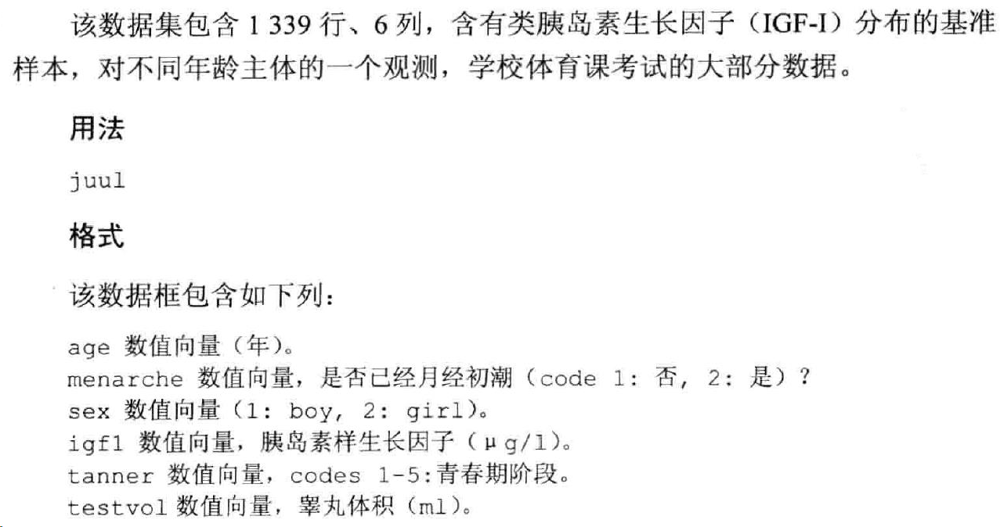

# 统计基础
描述性统计分析:
+ 均数、标准差、中位数、分位数计算
+ 统计描述过程中的缺失值处理
+ ISwR包中的 juul 数据集
+ 图形描述

相关分析:
+ Pearson相关系数
+ Spearman秩相关
+ Kendall相关系数

t检验

秩和


## 均数、标准差、中位数、分位数计算
```R
x <- rnorm(50)
mean(x)
sd(x)
var(x)
median(x)
quantile(x)
```

```R
# install.packages("ISwR")
library(ISwR)
attach(juul)
mean(igf1)
mean(igf1,na.rm=T) #缺失值处理
sum(!is.na(igf1))
summary(igf1)
summary(juul)
detach(juul)
```

箱图
```R
mid.age <- c(2.5,7.5,13,16.5,17.5,19,22.5,44.5,70.5)
acc.count <- c(28,46,58,20,31,64,149,316,103)
age.acc <- rep(mid.age,acc.count)
brk <- c(0,5,10,16,17,18,20,25,60,80)
hist(age.acc,breaks=brk)

n <- length(x)
plot(sort(x),(1:n)/n,type="s",ylim=c(0,1))

qqnorm(x)

par(mfrow=c(1,2))
boxplot(IgM)
boxplot(log(IgM))
par(mfrow=c(1,1))
```
+ `tapply`: 分组计算统计量
+ `aggreate`和by函数：分组计算统计量

生成表格
```R
caff.marital <- matrix(c(652,1537,598,242,36,46,38,21,218
                         ,327,106,67),
                       nrow=3,byrow=T)
caff.marital
colnames(caff.marital) <- c("0","1-150","151-300",">300")
rownames(caff.marital) <- c("Married","Prev.married","Single")
caff.marital
names(dimnames(caff.marital)) <- c("marital","consumption")
caff.marital
as.data.frame(as.table(caff.marital))
```


## 相关分析
+ `cor`: 计算相关系数
+ `cor.test`: 计算相关系数和p值
+ `cov`: 计算协方差
+ `cov.test`: 计算协方差和p值


[top](#统计基础)
