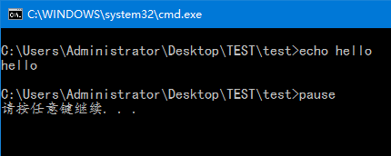
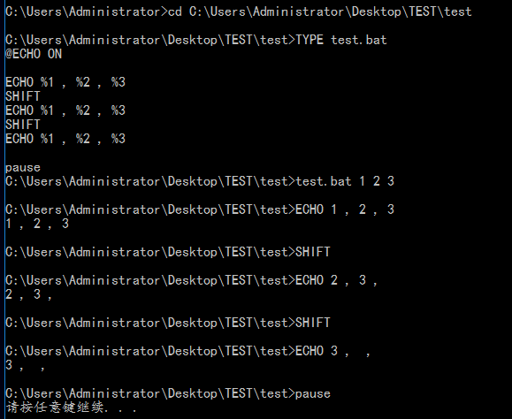

# windows批处理脚本Batch Script编写
## bat脚本编写
### 基础
编辑bat脚本的话推荐UltraEdit，有高亮显示，如果不需要高亮，任意文本编辑器都可以。脚本后缀名为.bat 或者 .cmd，双击即可运行。

bat脚本的命令和环境变量是大小写不敏感的，但是自定义变量是大小写敏感的！所以推荐大家使用大写书写命令和环境变量，使用小写书写自定义变量。

### 注释
注释使用 REM 或者 :: (两个英文冒号，不推荐使用)。:: 有时候会出现莫名其妙的错误，导致脚本运行不正常，所以推荐使用 rem 。
```bat
REM  This is a comment!
:: This is a comment! (usually!)
```

### 回显
在脚本不是注释的第一行 @ECHO ON 打开回显，这样脚本在执行的时候，cmd（linux下叫终端，windows下叫什么？）会显示脚本每一行命令，然后再显示执行结果，例如：
```bat
@ECHO ON
ECHO hello
PAUSE
```

打开回显可以先显示脚本命令，然后再执行脚本，这样可以用来检查脚本的运行，有点像编程语言的断点调试（只不过这里不停顿）。这个功能并不是很好用，比如碰到 FOR 或者其他的复杂的语句，内部的命令就只能一次性显示出来，而无法一条一条显示。

注意，这里的 @ 的用法是不显示其后的一条语句，即不显示 ECHO ON。ECHO 后面接 ON/OFF 的意义是打开或者关闭回显，所以如果要打印 `NO/OFF` 的话就需要加上引号了，`ECHO "ON" / ECHO "OFF"`

## 变量
### 声明、赋值、调用
bat脚本里的变量是不需要声明的，或者说在其第一次赋值时声明。

`SET var=hello`
这里使用 `SET` 命令给变量 var 赋值，如果 var 在之前并没有被赋值时，也可以认为这里是声明了一个变量 var，并且赋值 hello。
::: info
注意：`SET var=hello` 等号前后不允许有空格 ，否则不能正常赋值！！！
:::


bat脚本中的变量是没有强制类型的，如果使用上面的赋值方法，所有值将被认为是一个字符串，即使赋值一个数字，或者一个数学表达式。如果需要使用数学表达式的结果去赋值变量时，则需要加上 /A 选项：
```bat
SET /A four=2+2
ECHO %four%      REM 结果为 4
```
这时，变量 four 的值为 4。如果后续需要调用的话，则需要使用 `%four%`，即用两个百分号括起来。

### 环境变量
Windows下会有许多系统的环境变量，这些变量在bat脚本运行时是已经赋值的，如果在脚本中不小心使用了与系统变量同名的变量名，可能会覆盖系统变量的值，并在脚本运行环境中产生影响。

SET 命令单独使用时（后面不接任何赋值语句），可以在cmd中打印所有的环境变量，大家可以作为参考，设置变量名时尽量避免这些已有的变量名。

当然还可以使用 `SETLOCAL ENDLOCAL` 命令，在这两个命令之间的所有变量都会被认为是局部变量，离开命令区域后，重名的环境变量会自动恢复原值。
:::info
小提示 ： 在脚本第一行写下 SETLOCAL ENABLEEXTENSIONS 可能排除因环境变量导致的错误，建议每次写脚本都加上。ENABLEEXTENSIONS 参数是启动命令扩展。
:::
### 传入参数变量
这一部分与 shell 脚本很类似，bat使用 %数字 来表示脚本运行时的输入变量，例如 %1 代表第一个穿入变量，以此类推，最多允许9个输入变量，即 %1 ~ %9。%0 则表示脚本自身的名字，如果使用 ECHO %0 输出的话则会打印引号括起来的脚本完整的路径名。

使用 `SHIFT` 命令会将第一个参数从参数队列里弹出（pop），后续的参数往前移动。例如：



### 处理参数处理
bat提供了处理传入参数很简单的方法：
```
%~I         — 去除参数的引用附号

%~fI        – 将 %I 扩充到一个完全合格的路径名

%~dI        – 仅将 %I 扩充到一个驱动器号

%~pI        – 仅将 %I 扩充到一个路径

%~nI        – 仅将 %I 扩充到一个文件名

%~xI        – 仅将 %I 扩充到一个文件扩展名

%~sI        – 扩充的路径只含有短名

%~aI        – 将 %I 扩充到文件的文件属性

%~tI        – 将 %I 扩充到文件的日期/时间

%~zI        – 将 %I 扩充到文件的大小
```

这里有几个处理的小技巧：

+ `%~f1` 获取输入参数完整的路径

+ `%~dp1` 获取输入参数所在文件夹的完整路径

+ `%~nx1` 获取输入参数的文件名

### 返回值

### ERRORLEVEL
一个健壮的程序都会提供返回值供使用者判断其是否成功运行，脚本的每条命令也一样。在bat中，默认返回值 0 代表成功，非0 代表失败。

bat提供了一个专门的环境变量 `%ERRORLEVEL%` 来存储上一条命令或可执行程序运行的返回值，我们可以利用它和 IF 来让脚本根据不同的情况执行不同的语句。
```bat
IF %ERRORLEVEL% NEQ 0 (
  REM failed!
)
IF %ERRORLEVEL% EQU 0 (
  REM succeed!
)
```
NEQ 为不等于， EQU 为等于，IF 的使用后续会继续深入，这里暂时不做讨论。

这里提供一个简单的例子来说明 %ERRORLEVEL% 的用法：

这里有一个简单的 `bat_test.exe` ，由C编写，作用是判断第一个参数是不是字符 s ，如果是则输出 succeed! 返回 0，如果 failed! 返回 -1。

执行以下脚本，就可以查看 `%ERRORLEVEL%` 的值了。
```bat
@ECHO ON
SETLOCAL ENABLEEXTENSIONS

bat_test.exe 1
ECHO %ERRORLEVEL%

bat_test.exe s
ECHO %ERRORLEVEL%
PAUSE
```
### && ||
除了判断 `%ERRORLEVEL%` 的值，bat还提供了更加简单的判断方法————利用 `&&` `||` 操作符。这两个操作符都是用来连接两条命令的，不同点是，`&&` 后续的命令只有当前一条命令执行成功之后才会执行，如果前一条命令执行失败，则跳过。 `||` 后续的命令只有当前一条命令执行失败时才会执行，如果前一条命令执行成功，则跳过。

小技巧：如果需要使用脚本执行可执行文件，并且如果失败，就中止脚本，则可以有如下写法：
```bat
SomeCommand.exe || EXIT /B 1

SomeCommand.exe || GOTO :EOF
```
`EXIT /B 1` 的作用是退出脚本，并返回 1。 `GOTO :EOF` 的作用是跳转到 `:EOF` 标签，即退出（End-Of-File）。

**技巧** ：可以定义1,2,4,8四个变量来判断返回值，利用位运算便可以很方便的设置详细的错误信息。
```bat
SET /A ERROR_HELP_SCREEN=1
SET /A ERROR_FILE_NOT_FOUND=2
SET /A ERROR_FILE_READ_ONLY=4
SET /A ERROR_UNKNOWN=8

SomeCommand.exe
IF %ERRORLEVEL% NEQ 0 SET /A errno^|=%ERROR_SOMECOMMAND_NOT_FOUND%

OtherCommand.exe
IF %ERRORLEVEL% NEQ 0 (
    SET /A errno^|=%ERROR_OTHERCOMMAND_FAILED%
)

EXIT /B %errno%
```
### 标准输入输出
与 *nix 类似，DOS 也用类似的文件来代表键盘输入，输出文本到屏幕，输出错误到屏幕，即 stdin 、 stdout 、 stderr ，他们分别用文件编号 0 ， 1， 2 来表示。

### 重定向
> 和 >> 操作符能将其左边命令的运行结果重定向输出到右边的文件中。它们的区别在于： > 总是覆盖文件原有的内容写入，而 >> 则是在原文件后面追加写入。

默认情况下，输出重定向操作符都是标准输出 Stdout ，即只会输出运行结果到右边的文件中，但是可以通过在操作符前加上文件编号来改变，比如，如果想将一条命令执行报错信息输出到文件中，可以这样做：
```bat
RECHO hello 2> log.txt
```
这一条语句就是将刚才的错误信息重定向输出到标准输出，即屏幕上。不过一定要注意 > 和 &1 之间不能有空格，否则脚本无法运行。

相反的，输入重定向只有 < 操作符，其可以将右边的命令或者文件内容重定向输入到左边的命令中。
`SORT < output.txt`
这条命令的作用就是将 output.txt 中的内容作为 SORT 命令的输入，即将文件内容进行排序。

### 管道符和 NUL
`|` 称为管道符（编程语言中的位运算或），其用来连接两条命令，作用是将前一命令的输出作为后一条命令的输入。所以刚刚对 output.txt 的排序又可以写成以下形式：

```bat
TYPE output.txt | SORT
```
我们通常可以根据脚本运行的过程中的输出信息来判断其是否运行正常，但有时候某些命令或者应用程序会输出一些我们并不需要知道的信息，这时我们可以将其输出重定向到 NUL 中丢弃，这样就不会在cmd中看到其的输出信息了。例如 :
```bat
PING 127.0.0.1 > NUL
```
这条 PING 的输出信息就不会打印到屏幕上了。

条件结构
bat中的条件判断的格式如下：
```bat
IF 判断语句 (
  ···
) ELSE (
  ···
)
```
:::tip
注意： ELSE 命令必须与 IF 命令的尾端在同一行上，不能另起一行！
:::

其中的判断语句有以下关键词及参数：1

-   `NOT` : 附加在条件语句最前表示结果取反。
    
-   `ERRORLEVEL num` ：只有当上一条命令返回值大于或等于 num 时，结果才为真。
    
-   `str1==str2` ：如果指定的字符串相匹配，结果为真
    
-   当启动命令扩展 `ENABLEEXTENSIONS` 时，还可以进行 `IF [/I] str1 compare-op str2 cmd` 字符串比较，`/I` 开关表示比较时不区分大小写，compare-op 可以是：
    -   `EQU` : 等于
    -   `NEQ` : 不等于
    -   `LSS` : 小于
    -   `LEQ` : 小于或等于
    -   `GTR` : 大于
    -   `GEQ` : 大于或等于
-   `EXIST filename` ：当制定文件名存在时，结果为真
    
-   `DEFINED variable` ： 如果定义了变量 variable，则制定条件为真。


#### 循环结构

`FOR` 用于构建循环，

`FOR` 的基本结构：

```bat
FOR [/D/R/L/F] %%variable IN (set) DO (
  command [command-parameters]
)
```

`%%variable` ：指定一个 **单一字母** 可替换的参数，即遍历参数。注意： **在 cmd 中遍历参数前缀为一个 %** 例如： `%I` ，但是 **在 bat 脚本中遍历参数前缀则是两个 %** 。这一点非常容易出错，如果在脚本中少写了一个%，则会导致整个FOR循环出错。

`(set)` : 指定一个或一组文件的集。可以使用通配符，也可以是 _(a,”b c”,d)_ 的形式。

`command` 和 `command-parameters` ： 指定对每个文件执行的命令，和为特定命令指定参数或命令行开关。

如果启用命令扩展，则会支持下列 FOR 命令的其他格式: