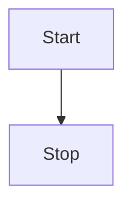
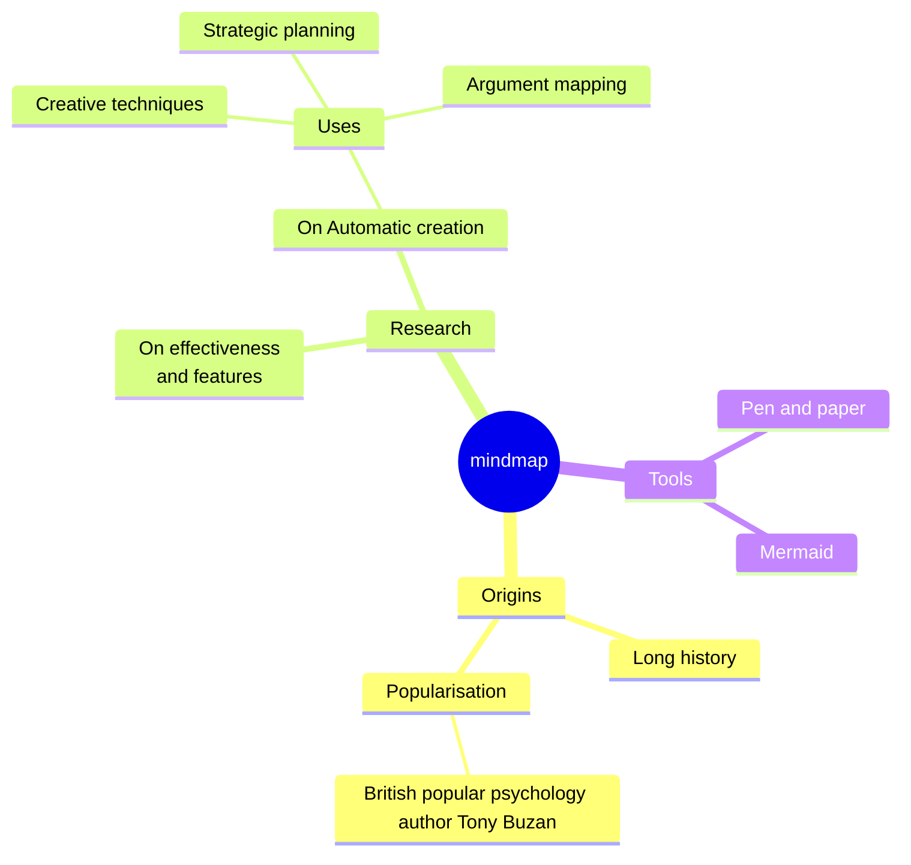

# Python

生成随机数：random.randint 是生成整数随机数（左右都包括），random.uniform 是生成小数随机数，random.rand 是 0-1 的随机数（包左不包右）

列表推导式：new_x_list=[x.append(1) for x in x_list]。简化书写，把后面循环的每一个变量传递给前面的变量

判断数据类型：isinstance(my_list , list)。返回一个 bool 类型的值

- 对于 for 循环，while 循环，if 语句，函数等来说，python 使用缩进代表层次关系，如果你在缩进语句下加了一行不符合缩进规则的代码，则解释器会认为这行代码下面的代码不属于上面的层级
- 如果双引号之间包括了双引号，就用单引号来代替。
- 对 if key in dict.keys 是一个判断语句，有这种语法，一个元素是否在元组里面
- 还有 if "/" not in title。这些语句都是数据容器常见的语法，在里面，不在里面

## python 基础语法

### 基础概念
<!---any-file.md-->

