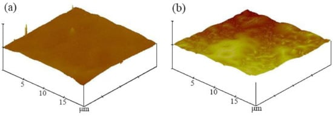

##  [心脏支架样品的 PLGA 涂层和 PLGA 载药涂层：降解特性和血液相容性](https://doi.org/10.3390/coatings11111427)

目前通过在支架表面制备药物涂层达到药物缓释抑制平滑肌细胞的过渡增殖已成为治疗再狭窄的有效方法。血管支架表面的聚合物载体涂层是通过浸涂法制备的，但聚合物涂层存在缠绕、粘连、不均匀等缺陷。而静电喷涂沉积（ESD）利用高压将聚合物溶液裂解成细小的液滴，利用强电场吸附到基材表面以获得均匀、光滑的涂层。因此，文章以316L不锈钢为涂层支撑，PLGA 75/25为载体，RAPA为药物，采用ESD法制备了PLGA载药涂层；对涂层的表面形貌、降解特性和血液相容性进行研究，以期为载药涂层支架的研究提供理论依据。

1. 概述：

   文章通过静电喷涂沉积（ESD）在316L不锈钢上制备了PLGA和PLGA载药涂层，通过SEM、AFM和XDS观察图层的表面形貌、三维形貌和晶体结构；差示扫描量热法 (DSC)、凝胶渗透色谱 (GPC) 和 NMR 研究热性能、分子量和涂层成分；通过质量变化、相对分子质量和分布、聚合物组成、热性能和表面形貌研究了涂层的降解行为；血小板粘附测试和动态凝血时间研究涂层的血液相容性。实验结果显示：SEM显示以33%的RAPA的载药涂层效果最佳，具有最光滑、最致密的形貌。此外，RAPA 的添加降低了 PLGA 涂层的 Tg，并伴有部分结晶，从而减慢了载药涂层的降解速率。PLGA载药涂层的形貌比PLGA涂层更粗糙。线扫描和面扫描的平均表面粗糙度值分别为16.232 nm和39.538 nm。载药涂层表面微观凹凸不平，宏观光滑、微观多相分离结构有利于提高其血液相容性。

2. 实验设计：

   （i）将316L医用不锈钢样品（Φ10mm×2mm）抛光后依次放入丙酮、乙醇和蒸馏水中超声清洗20min ，并在80℃真空干燥箱中干燥24小时。 (ii)将PLGA75/25溶解在1，4-二恶烷中以制备均匀溶液，并将RAPA溶解在该溶液中以制备涂料。 (iii)不锈钢基板通过导体接地至电中性。将涂料注入静电喷涂装置的涂料容器中，涂料容器与高压泵连接，高压泵将加压的涂料通过输送管输送到喷枪的喷嘴。涂料一旦通过喷嘴，立即减压，剧烈膨胀，雾化成小液滴；它们通过静电发生器放电并充电，在喷嘴和血管支架之间形成静电场。带电涂层在电场重力和高压推力的共同作用下吸附在不锈钢表面并形成均匀的涂层。

3. 实验结果

   $\qquad$

   **图2描绘了PLGA和PLGA载药涂层的表面形态。**图2a所示的形貌相对致密，致密度略低于图2b所示。相比之下，图2b所示的表面致密且均匀，并且涂层是透明的。涂层表面出现单个点（图2c），涂层颜色由透明变为微白色。斑点数量显着增加（图2d），涂层颜色呈白色。当 RAPA 含量为 33% 时，涂层的形态与 PLGA 涂层没有显着差异。药物在载体溶液中没有完全分散，当 RAPA 水平增加到 50% 时，导致单个分子聚集（图 2e）。由于 RAPA 是白色固体晶体，因此涂层呈微白色。当RAPA浓度为66%时，更多的非分散药物分子导致聚集增加，涂层变得明显白色。

   

   **PLGA 和 PLGA 载药涂层的热性能分析如图 3 所示。** PLGA的DSC曲线中仅观察到Tg(52.6℃)，表明其为非晶态。 RAPA在191.6℃(154.39J/g)和201.8℃(41.49J/g)处有两个熔化峰,为药物晶体的吸热峰。当添加33%的RAPA时，Tg变为39.7℃，并观察到微弱的吸热峰，表明药物仍以无定形状态分散在PLGA中。当RAPA浓度为°°66%时,在174.5℃(14.52J/g)和196.5℃(15.26J/g)处观察到两个熔化峰。这说明药物与载体形成共晶，药物以微晶形式存在于PLGA中[20]。

   

   **图4为不同药物含量的PLGA载药涂层的X射线衍射图。**当RAPA含量为33%时，XRD曲线呈现弥散峰，呈无定形。 RAPA晶体的特征峰出现在°°°2θ角7.1、10.1、14.4处。当剂量为50%时,扩散峰增强,但仍无药物衍射峰。因此，我们可以推测，当药物含量为33%时，分散的药物受到相邻聚合物分子的保护，具有较高的物理稳定性，并以无定形状态存在。当剂量增加到50%时，部分药物分子从聚合物中分离出来；载药涂层从无定形状态转变为部分结晶状态，药物分子没有受到聚合物的保护而产生重结晶[21-23]。

   

   **图 5a-d 分别显示了降解前以及 8 周、11 周和 14 周后 PLGA 涂层的 SEM 形貌。** PLGA 表面涂层在降解前是致密的。降解8周后表面形成微孔，11周后孔径增大并形成一些中空结构。 14周后，涂层的中心变成了柔软的无孔聚合物，而外围仍然存在一些较粗的孔。图5e-h分别显示了降解前8周、11周和14周后PLGA载药涂层的SEM形貌。 PLGA载药涂层表面致密，降解前有少量白点，8周后，微孔形成，斑点残留。 11周后，微孔扩大，白斑消失，14周后，部分毛孔消失，新毛孔出现。由于药物颗粒分散不完全而形成白点。药物降解后扩散到介质中，并在 PLGA 中形成孔。水分子的进入使得涂层在这些孔处优先降解。

   

   **PLGA 和 PLGA 载药涂层在 Hank 的模拟体液中的降解如图 6 所示。**在降解的第一周，由于单体聚合不完全，导致涂层质量略有下降（约 10%）。此后，两种涂层都经历了大约七周的恒重期。然而，七周后PLGA涂层的质量下降速度比载药涂层快得多。 PLGA 和 PLGA 载药涂层的 pH 值列于表 1。最低 pH 水平对应于 PLGA 涂层的最大质量损失，而载药涂层溶液的 pH 值仅发生轻微变化。八周后，产生了许多酸性小分子，降低了培养基的pH值。

   

   **[图 7](https://www.mdpi.com/2079-6412/11/11/1427#fig_body_display_coatings-11-01427-f007)显示了 PLGA 和 PLGA 载药涂层的 DSC 曲线。** PLGA涂层的玻璃化转变温度（Tg）从52.6℃下降到18.2℃，并且没有熔化峰（[图7a](https://www.mdpi.com/2079-6412/11/11/1427#fig_body_display_coatings-11-01427-f007)）。添加RAPA后PLGA的Tg从52.6℃降低至39.7℃，并在194.9℃处观察到熔融峰，熔融热为15J/g（[图7b](https://www.mdpi.com/2079-6412/11/11/1427#fig_body_display_coatings-11-01427-f007)）。当降解进行到第8周时，Tg从39.7℃升高到51.3℃，熔融峰从194.9℃升高到198.4℃。这些结果表明载药涂层的Tg逐渐升高并接近PLGA涂层；熔融峰也逐渐右移，熔点趋于降低。纯PLGA 涂层是无定形的。随着降解的进行，涂层完整性下降，导致 Tg 持续下降 [ [24](https://www.mdpi.com/2079-6412/11/11/1427#B24-coatings-11-01427) , [25](https://www.mdpi.com/2079-6412/11/11/1427#B25-coatings-11-01427) ]。 RAPA 的添加降低了 PLGA 涂层的 Tg。此外，还观察到熔化峰，这表明药物分子结晶。载药涂层降解后，小药物分子逐渐扩散到介质中，使得载药涂层的Tg接近PLGA涂层，熔点逐渐降低。当降解进行到第11周时，比热仅为3.78 J/g，表明涂层中药物分子的水平非常低。

   

   [图8](https://www.mdpi.com/2079-6412/11/11/1427#fig_body_display_coatings-11-01427-f008)显示了PLGA和50%-RAPA-PLGA载药涂层的AFM形貌照片（扫描范围0-20μm）。 PLGA涂层表面均匀、光滑、变化小，而PLGA载药涂层表面凹凸不平。

   

   [图9](https://www.mdpi.com/2079-6412/11/11/1427#fig_body_display_coatings-11-01427-f009)显示了PLGA涂层的AFM照片和表面粗糙度分析。线扫描和面扫描的平均表面粗糙度值分别为0.471 nm和0.931 nm。

   

   [图10](https://www.mdpi.com/2079-6412/11/11/1427#fig_body_display_coatings-11-01427-f010)显示了PLGA载药涂层的AFM照片和表面粗糙度分析。线扫描和面扫描的平均表面粗糙度分别为16.232 nm和39.538 nm。涂层表面存在微观不均匀性。 PLGA载药涂层比PLGA涂层粗糙，但其Ra值仍小于50 nm。 RAPA和PLGA具有不同的化学性质。载药包衣将它们混合在一起，形成不均匀的物理形态和不均匀的化学性质，从而产生微相分离结构并增加临界张力。而且界面自由能下降，极性色散比增大，有效提高了涂层的血液相容性。涂层光滑度对其生物相容性影响很大，微粗糙表面（Ra ≈ 1 μm）有利于涂层的生长。与血液直接接触的较粗糙的植入物表面可增加凝血，而高表面光滑度（Ra < 50 nm）有助于改善血液相容性。研究[ [27,28,29,30](https://www.mdpi.com/2079-6412/11/11/1427#B27-coatings-11-01427) ]表明，生物体的血管壁从宏观[上看](https://www.mdpi.com/2079-6412/11/11/1427#B29-coatings-11-01427)非常光滑——血管内皮的内皮表面膜是双层脂质液体基质[，](https://www.mdpi.com/2079-6412/11/11/1427#B28-coatings-11-01427)膜内嵌入有颗粒[。](https://www.mdpi.com/2079-6412/11/11/1427#B30-coatings-11-01427)宏观光滑、微观多相分离结构具有优异的抗凝血性能。

   img src="./assets/coatings-11-01427-g011b-550.jpg" alt="涂料 11 01427 g011b 550" style="zoom:50%;" />

   

   

   **[图13](https://www.mdpi.com/2079-6412/11/11/1427#fig_body_display_coatings-11-01427-f013)展示了不同时间在316L不锈钢基底、PLGA涂层和不同药物量的PLGA载药涂层上测量的OD。**以OD=0.100时的时间作为凝固时间，涂层的吸光度随时间缓慢下降。基质下降最快，凝固时间为44分钟，而PLGA涂层的凝固时间为53分钟。载药层1 h未凝固，含50%RAPA的载药层下降最慢；当药物剂量为 33% 和 66% 时，下降率几乎相同。因此，载药涂层的凝血时间较长，凝血因子活化程度较低，其中RAPA含量为50%的载药涂层活化程度最低。

4. 结论：

   (1)

   在316L不锈钢表面成功制备了RAPA含量分别为33%、50%和66%的PLGA和PLGA涂层。 SEM结果表明，当RAPA含量为33%时，载药涂层形貌光滑平整，与纯PLGA涂层相似。 DSC结果表明，添加RAPA后观察到熔化峰，并且涂层的熔化热随着药物含量的增加而增加，并且药物以微晶形式存在。

   (2)

   XRD结果中未观察到药物晶体的特征峰，载药包衣仍为非晶态。添加 RAPA 降低了 PLGA 涂层的 Tg，同时部分结晶降低了载药涂层的降解率。

   (3)

   PLGA载药涂层表面粘附的血小板数量明显少于PLGA涂层，并且没有变形或伪足。当RAPA含量为50%时，载药涂层的凝血时间较长，凝血因子的激活程度最小。通过RAPA和PLGA混合生成微相分离结构，有效提高临界张力，降低晶面自由能，提高涂层的血液相容性。

