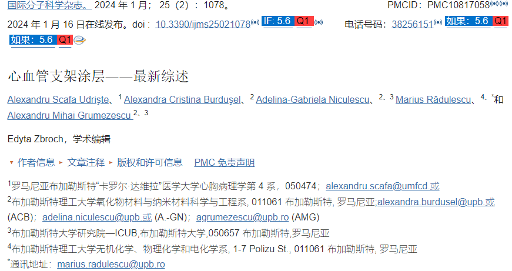
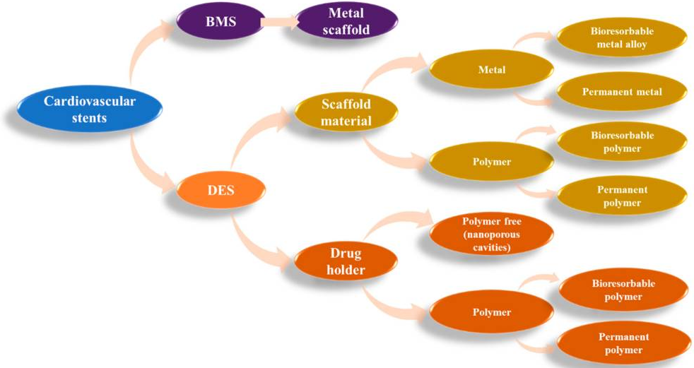

##  [心血管支架涂层——最新综述](https://doi.org/10.3390%2Fijms25021078)

1. 背景：心脏支架能够保持人体内血管通畅，能够挽救冠心病患者，降低长期死亡率和发病率。DES目前是冠脉疾病患者的重要治疗选择，由表面涂层和支架本体组成。对于涂层需保持结构的完整性、剂量一致和受控释放动力学、非血栓形成、非炎症且对细胞无毒性，同时能够促进动脉愈合和再内皮化。文章从支架的演变、支架表面有机涂层、金属涂层、无机非金属涂层等角度详细描述。
2. 支架的演变

各种支架的材料选择示意图<a href="#1">1</a>

3. 支架的有机涂层

   1. 合成聚合物：

      + 支架的有机涂层一般是具有重复结构单元的大分子化合物，通常通过共价化学键连接。例如聚（乙烯-醋酸乙烯酯）（PEVA）、聚（甲基丙烯酸正丁酯）（PBMA）或三嵌段共聚物聚（苯乙烯-b-异丁烯-b-苯乙烯）（SIBS）。

      + 涂层方法：直写喷墨、静电纺丝、浸涂和喷涂。

        浸涂和/或喷涂技术用于当前的 DES 聚合物涂层技术 [ [49](https://www.ncbi.nlm.nih.gov/pmc/articles/PMC10817058/#B49-ijms-25-01078) ]。这些技术适用于用西罗莫司等强亲脂性药物涂覆支架，但不适用于水溶性药物或 DNA。

        + 目前，血管支架表面采用浸涂法开发聚合物载体涂层；但该方法存在不均匀、堵塞、缠绕等缺点。
        + 静电喷涂沉积将聚合物溶液还原成微小的液滴，当暴露于高电场时，这些液滴粘附在基材表面上，从而形成均匀且光滑的涂层。

      + 采用无聚合物支架平台（PF，polymer-free stent platforms）、可生物降解聚合物（BP，biodegradable polymers）和耐用聚合物（DP，durable polymers）。通过消除 DP-DES 支架中聚合物持续暴露于血管愈合的情况，可生物降解的聚合物可减少炎症反应并降低晚期和极晚期支架血栓形成的情况。然而，最近比较 BP-DES 和 DP-DES 临床结果的研究产生了不同的结果，其中一些研究无法证明 BP-DES 更优越。BP聚合物主要使用聚(L-乳酸)、聚(D,L-丙交酯)、聚己内酯(PCL)和聚(丙交酯-乙交酯)或聚(D,L-丙交酯-共己内酯（PLCL）]，最后一种聚合物分解成二氧化碳和水，前三种分解成乳酸。与DP-DES支架相比，引起炎症的能力更低。目前尚不清楚BP是否具有更好的结果。BP 的主要不良心脑血管事件 (MACCE) 或临床驱动的靶血管血运重建 (CD-TLR) 的频率较低。 - 5年后DES支架与DP-DES支架进行比较，尽管多项研究尚未证明BP-DES相对于DP-DES支架的优越性。

      ::: tip

      可生物降解聚合物是当前研究的主要课题。由于它们一旦达到目的就会分解，因此使用它们可能有助于防止支架内再狭窄、晚期支架血栓形成和过敏反应等负面结果。

      :::

      + 作为一种更为安全的BVS，身体可以完全吸收，无需后续手术来移除永久性支架。这降低了患者患其他慢性疾病的风险。生物可降解支架整合了生物可吸收和生物可吸收支架技术，消除了晚期支架血栓形成的风险。但生物可吸收支架的成分可引起超敏反应和局部异物反应。聚合物支架的PLGA降解过程中产生的13种酸性分解产物（如乳酸和乙醇酸）会降低周围组织的pH值，从而引起体内异物反应和炎症。

      

   2. 天然聚合物涂层:壳聚糖、肝素、透明质酸(HA)、纤维蛋白等。

   3. 无聚合物支架：没有聚合物，支架不会与活组织相互作用，从而最大程度降低炎症、内皮愈合和再狭窄的风险。。药物支架粘合到支架的表面。通常在近腔侧。一般在支架表面创建多孔纳米结构（例如纳米管、纳米叶、纳米草、纳米薄片、纳米柱和纳米线等），然后涂覆药物等材料。研究表明，血小板细胞无法粘附到微/纳米结构上。

      最近的研究尚未证明 PF-DES 相对于其他支架类型的优越性。大型研究表明，PF-DES 比 BP-DES 更容易导致 MACCE、TLR 和支架内晚期管腔丢失。此外，两项重要的荟萃分析研究表明，DP-DES 和 PF-DES 在 MI、心源性死亡、全因死亡、支架血栓形成、TLR、TVR 和直径狭窄方面没有差异。作为未来开发的一部分，制造的支架（包括 PF-DES）的功效和安全性将在冠状动脉支架中得到改善。

   4. 含有内皮细胞的涂层：所有血管都衬有单层内皮细胞，控制血流与周围组织之间的交换。构成血管壁外层的结缔组织细胞的生长和发育是由内皮细胞的信号协调的。两种最常见的心肌细胞类型是心肌细胞（CM）和内皮细胞（EC），它们对于心脏重塑和再生至关重要。通过多种途径，包括 Notch 和 Wnt 信号传导途径，心脏中的 EC 对心脏的健康发育至关重要。内皮分泌组对于成人心脏维持正常心脏功能并对一系列血流动力学刺激（例如压力超负荷）做出适当反应至关重要。在支架表面接种内皮祖细胞（EPC）是最近的一项创新尝试。

4. 支架金属涂层

   钛基涂料（ Ti-O 薄膜与基底的结合很弱并且非常薄）、镁基涂料(用Mg(OH) 2涂层作为物理屏障；然而，这不足以赋予镁合金长期的耐腐蚀性)、层状双氢氧化物 (LDH) 涂层(由于其耐磨性较低，LDH涂层的纳米微结构很容易剥落，剥落的微结构可能进入血液并对身体产生负面影响)

5. 无机、非金属涂料

   磷酸盐涂料、氟化物转化涂层（由于MgF 2较薄且易于破坏，因此常被用作有机涂层之前的预处理方法）、碳基涂料、

6. 总结

   |   涂层类型   |                   材料                   |                           观察结果                           |
   | :----------: | :--------------------------------------: | :----------------------------------------------------------: |
   |  合成聚合物  |           聚(乙烯-醋酸乙烯酯)            | 用于第一代 DES 装载西罗莫司 与晚期支架血栓形成相关 由于再内皮化不良和药物释放后聚合物涂层的持久性导致伤口愈合延迟 |
   |  合成聚合物  |          聚（甲基丙烯酸正丁酯）          | 用于第一代 DES 装载西罗莫司 在 支架植入多年后仍保持化学完整性 与 晚期支架血栓形成有关 由于再内皮化不良和药物释放后聚合物涂层的持久性而导致伤口愈合延迟 |
   |  合成聚合物  | 三嵌段共聚物聚(苯乙烯-b-异丁烯-b-苯乙烯) | 用于第一代 DES 装载紫杉醇 允许药物提前爆发释放 由于再内皮化不良和药物释放后聚合物涂层的持久性而延迟伤口愈合 |
   |  合成聚合物  |                 磷酰胆碱                 | 用于第二代 DES 能够装载和释放多种治疗药物 减少血小板粘附和随后的血栓形成 |
   |  合成聚合物  |    共聚物聚（偏二氟乙烯-共六氟丙烯）     | 用于第二代 DES 装载依维莫司 在支架植入多年后仍保持化学完整性 |
   |  合成聚合物  |                  聚乳酸                  | 用于第三代 DES 降解为无害化合物，并由人体进一步代谢 与耐用聚合物涂层相比，降低了心脏事件的风险 |
   |  合成聚合物  |             聚(乳酸-乙醇酸)              | 用于第三代DES 降解为无害化合物，并由人体进一步代谢 能够持续、定向释放高分子生物化合物 |
   |  天然聚合物  |                  壳聚糖                  | 减缓支架平台的腐蚀速度 可与其他材料（例如聚-L-谷氨酸、氧化石墨烯、肝素）结合使用，以提供协同效果 |
   |  天然聚合物  |                   肝素                   |  抗凝特性 抑制动脉平滑肌细胞增殖 减少支架内血栓形成和再狭窄  |
   |  天然聚合物  |                 透明质酸                 |   显着减少血小板血栓的形成 良好的抗增殖作用并降低抗炎反应    |
   |  天然聚合物  |                 纤维蛋白                 | 通过抗血栓形成或抗增殖治疗提供完整的腔内铺路 刺激细胞粘附、扩散、迁移和排列 |
   |    金属色    |                  氧化钛                  | 改善化学/腐蚀稳定性 改善质量损失、再狭窄和目标血管化 减少血小板粘附和纤维蛋白原结合 |
   |    金属色    |                 二氧化钛                 | 耐腐蚀性强 减缓镁锌合金支架的降解 促进内皮细胞的粘附和增殖 具有抗血栓特性 |
   |    金属色    |                 氢氧化镁                 |          提高耐腐蚀性 增强再内皮化 抗炎和抗血栓作用          |
   | 无机、非金属 |                氧化石墨烯                | 减少血小板的粘附和活化 减少 VSMC 的迁移和增殖 促进再内皮化 抑制血栓形成和内膜增生 |

   为了尽量减少DES的潜在危害，用适当的涂层覆盖支架的金属结构可以实现所掺入药物的受控释放动力学、均匀的剂量和装置的结构完整性。涂层须具有具有生物相容性、非血栓形成、非炎症性且对细胞无毒，以促进动脉愈合和再内皮化，成为支架和血管组织之间的界面。