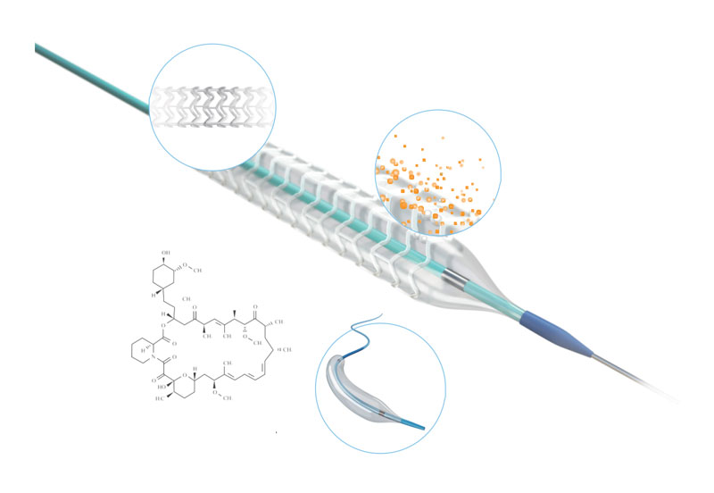
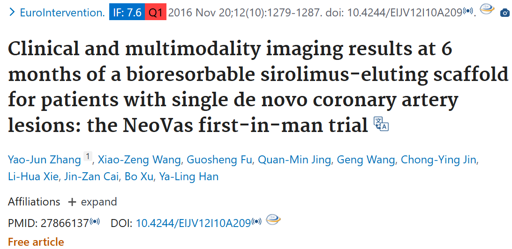

方法:使用关键词"NeoVas stent trials"在谷歌学术搜索得到相关文献

概述: 此支架由北京乐普公司研究制造，沈阳军区总医院韩雅玲院士牵头，由浙江邵逸夫医院傅国胜教授和北京阜外医院徐波教授担任CO-PI。Neovas脚手架（LEPU医疗）是一个气球膨胀的BR，由四个组件组成：PLLA平台：Poly（d，l-lactide）聚合物，抗增生药物sirolimus（15.3μg/mm ），以及在末端（图1）。 支架规格如下表。Neovas支架的总支撑厚度为170μm，由160μm的骨架厚度和10μm的聚合物厚度组成。到24年为止，有3项乐普医疗的可降解支架的临床试验已经完成,包括首次人体研究(n=31),随机对照试验(n=560,1:1),以及真实世界研究(n=10000)。
“单组目标值研究”（OPC 研究）

|  |         支架长度 (毫米)     |       |        |        |       |
| ------------- | :----: | :----: |:----: |:----: |:----: |
|  支架直径 (毫米)|         12    | 15    | 18    | 21    | 24    |
| 2.75           | LPS2712 | LPS2715 | LPS2718 | LPS2721 | LPS2724 |
| 3.0            | LPS3012 | LPS3015 | LPS3018 | LPS3021 | LPS3024 |
| 3.5            | LPS3512 | LPS3515 | LPS3518 | LPS3521 | LPS3524 |

|  | 压力 kPa（大气压）|     |       |       |       |       |       |       |       |       |       |
| ------------- | :----: | :----: |:----: |:----: |:----: |:----: |:----: |:----: |:----: |:----: |:----: |
|  球囊直径      |203(2  ) |405(4  ) |608 (6  )| 709(7  ) | 810(8  ) | 1013(10  ) | 1216 (12  ) | 1418(14  ) | 1621(16  ) | 1824 (18  ) | 2027   (20  ) | 
|2.75	|2.6	|2.66	|2.71	|2.73	|2.75	|2.82	|2.88	|2.94	|3	    |3.06|	3.12|
|3	    |2.84	|2.89	|2.95	|2.97	|3	    |3.06	|3.12	|3.18	|3.25	|3.3    |3.3|
|3.5	|3.37	|3.42	|3.47	|3.5	|3.54	|3.61	|3.68	|3.75	|3.81	|3.88|	3.95|

# 首次人体试验(FIM)

首次人体试验与2014年6月至9月完成。到目前为止，多项临床试验已经证实了药物洗脱支架的安全性和有效性，但是金属支架存在着潜在风险，且不能二次手术以及血管生理功能的损坏。此FIM研究是一项在 研究是一项前瞻性、双中心、单臂试验