[TOC]

# 病例

患者术中诊断：持续性心房颤动，

麻醉方式：局部麻醉

手术简要经过：患者今日至导管室，心电监护下，取平卧位，常规消毒铺巾，1%利多卡因局麻后，穿刺右股静脉，置入7F动脉鞘，送十极标测电极入冠状静脉窦（CS），另穿刺右股静脉2处，分别置入8.5F、8.5F Swartz SL1长鞘，并分别经房间隔穿刺送入左房，予行左心-肺静脉造影，后予以肝素化。送入Smart Touch 压力监测冷盐水灌注消融导管（STSF橘把）及星型标测电极（Pentaray）至左房，在三位标测系统CARTO指导下行三维重建，在其指导下，于肺静脉前庭左房面行环形线性消融，笑容后标测左肺前交叉、左肺静脉底部、右肺静脉底部、右肺静脉前交叉有碎裂电位。予以加左房顶部线性消融（顶部线阻滞），并予左房底部线、左房前壁Y线、左房后壁毁损消融。消融后仍为房颤，但冠状窦激动较规律，药物镇静后，在临时起搏保护下，予以双向同步直流电200J 1次成功转复窦性心律。线性消融完成后送入Pentaray电极入各肺静脉标测验证肺静脉达完全电隔离，并可见右下肺静脉有自发电位，与心房电活动无关。验证左房顶部线、左房前壁线、左房后壁线达双向传导阻滞。

静滴异丙肾上腺素(浓度1mg/500ml)，未诱发出房性快速性心律失常，未见肺静脉电传导恢复，行多部位心房S1S1频率递增刺激及S1S2程序刺激均未诱发出心动过速，未见房室结双经路观象。观察30分钟，复查肺静脉，未见电传导恢复，手术成功，拔除鞘管，局部压迫止血，加压包扎，送回病房。术中患者生命体征平稳，术后安返病房，嘱患者平卧位，注意患者伤口情况及生命体证。
术后处理措施;注意伤口渗血情况。

# CP房颤消融术流程

## 术前准备

1. 术中所需设备及耗材

|           **耗材**           | **型号**                    | **设备及**和其他              | 型号 |
| :--------------------------: | --------------------------- | ----------------------------- | ---- |
|       冠状窦导管及尾线       | **10极**                    | 脉冲消融仪                    |      |
|      心室电极导管及尾线      | **2极或4极**                | **数字减影血管造影机（DSA）** |      |
|         房间隔穿刺针         |                             | 多道电生理记录仪              |      |
|          房间隔穿刺          | L1                          | **除颤仪**                    |      |
|           静脉短鞘           | **6F\*2,8F\*1,11F\*1**      | **监护仪**                    |      |
| 一次性脉冲电场消融导管及尾线 | **28**，**32**，**36mm**    | **临时起搏器/刺激仪**         |      |
|         可调弯导管鞘         | 12F                         | **除颤仪**                    |      |
|           加硬导丝           | J头, 260cm, 0.032in/0.035in | **监护仪**                    |      |
|   心腔内超声/食道超声导管    | 非必须                      | **临时起搏器/刺激仪**         |      |

+ 心室电极导管:用于心室电极起搏保护
+ 加硬导丝:相较于普通导丝具有更好的支撑性,更有利于导引系统沿导丝过房间隔到达左上肺静脉口；J头设计安全性更高；

2. 束缚患者

   + 粘贴心电图电极贴片——记录体表心电图
   + 利用束缚带将患者手腕和膝盖束缚——防止肌颤损伤导管

3. 设备连接

   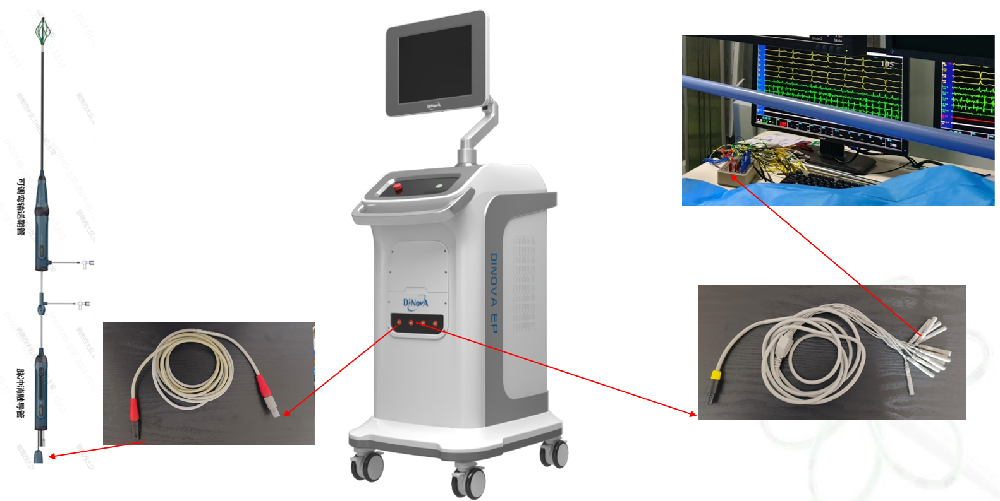

​	脉冲消融导管尾线连接射频消融仪，黄色信号线连接到多道仪的BOX盒中

4. 射频仪操作

   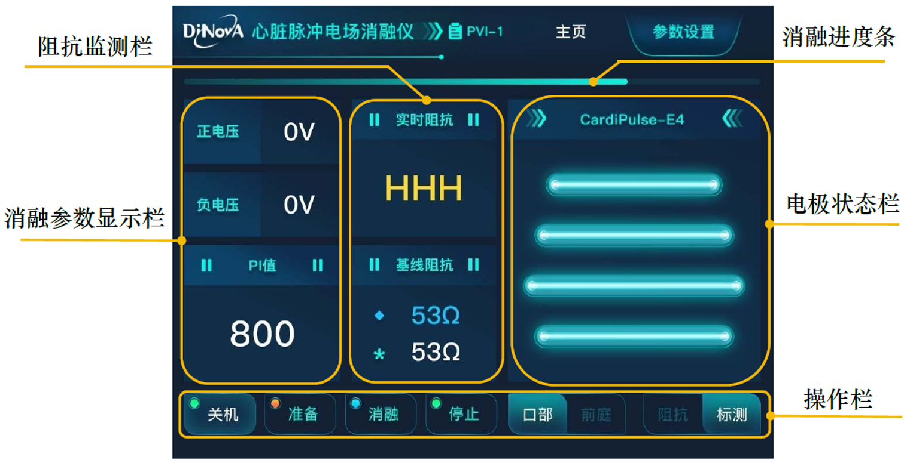

   + 操作栏：关机、准备、消融和停止四个按钮均有一个指示灯
     + 蓝色：提示不可执行
     + 绿色：提示当前可执行
     + 橙色：提示当前操作正在执行
   + 关机按钮：点击关机按钮，正/负电压值逐渐降至0V
   + 准备按钮：点击准备按钮，正负按钮逐渐升值设定值
   + 消融按钮：进入消融模式，消融放电开始
   + 停止按钮：放电过程中停止放电
   + 口部/前庭按钮：肺静脉口部和前庭消融参数的切换
   + 阻抗/标测按钮：阻抗模式和标测模式的切换
   + 参数设置：

   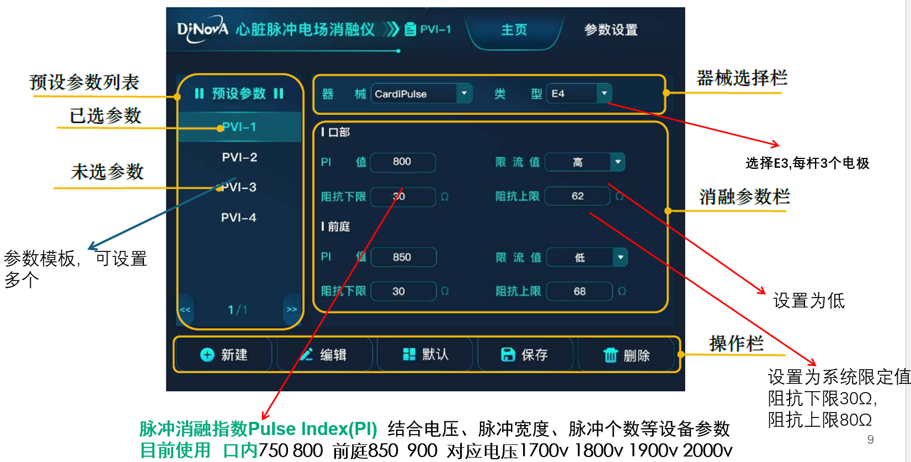

   ​	口内一般设置为800，前庭设置为850，对应电压为1800和1900V

5. 患者左房CT建模

   术前通过3Mensio影像评估软件，对肺静脉形态进行评估，进行术前导管选型和笑容路径规划

   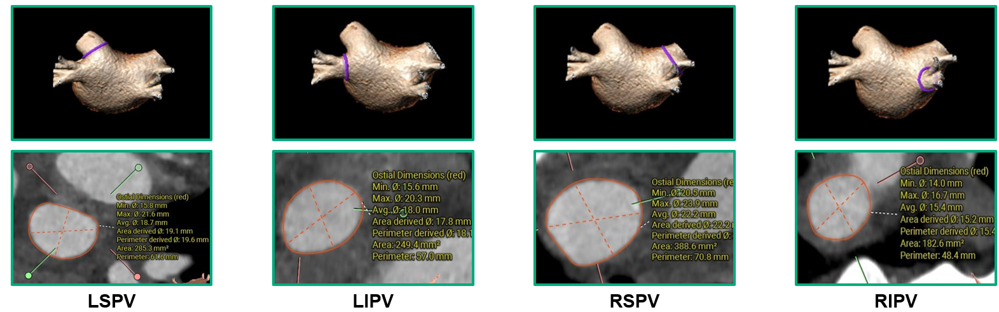

6. 导管型号选择

   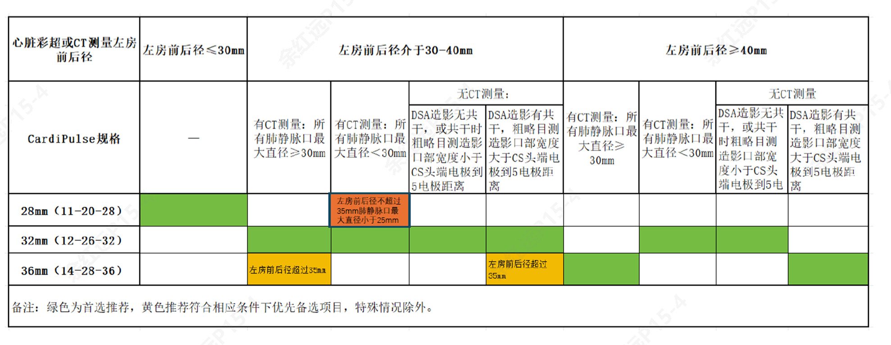

7. 麻醉方案

   全麻和静脉深度镇静麻醉

## 12导联连接

+ 肢体导联：

  	+ 右手：红（R）
	
  	+ 左手：黄（L）
	
  	+ 左脚：绿（F）
	
  	+ 右脚：黑（N）

 + 胸导联：
   + （C1）V1：红色在体表的位置：胸骨右缘第四肋间
   + （C2）V2：黄色在体表的位置：胸骨左缘第四肋间
   + （C3）V3：绿色在体表的位置：V2，V4连线的中点
   + （C4）V4：棕色在体表的位置：左锁骨中间第五肋间
   + （C5）V5：黑色在体表的位置：左腋前线与V4同水平
   + （C6）V6：紫色在体表的职位：左腋中线与V4导联同一水平

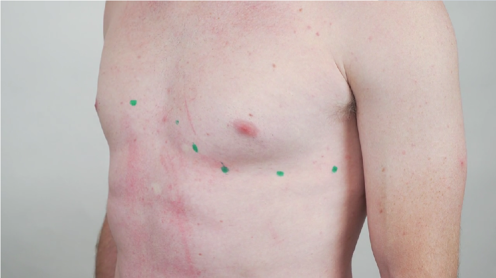

## 手术操作流程

1. 等待患者心电、血压、氧饱和度监测

2. 股静脉及房间隔穿刺

   1. 左侧股静脉穿刺，放置CS电极、RVA电极（备用起搏）、ICE导管（非必须）；
   2. 右侧股静脉穿刺，脉冲消融系统（可调弯导管鞘+CardiPluse导管）、标测导管（非必须）；
   3. 肺静脉造影**：**对患者四个肺静脉进行造影，确定肺静脉位置；若术前无左房CT重建，则可对肺静脉开口尺寸进行测量；
   4. （非必须）消融前三维电压标测
   5. 器械（脉冲电场导管+可调弯导管鞘）准备
   6. 测量基线阻抗值+脉冲电场消融
   7. 肺静脉隔离电位验证：运用脉冲电场消融导管，切换标测模式，即可直接进行电位验证；
   8. （非必须）消融后三维电压标测

3. 房间隔穿刺和肺静脉造影

   **房间隔穿**：刺一次,穿刺完成后交换到CP可调弯导管鞘，穿刺点在RAO体位**偏前下**;

   **肺静脉造影**：

   	+ 非选择性造影时，需要能同时显示一侧肺静脉，建议每侧肺静脉都采用LAO和RAO双体位造影
    + 如果选择单体位非选择性造影
      + LPV：LAO45°-60°
      + RPV：RAO30°

​	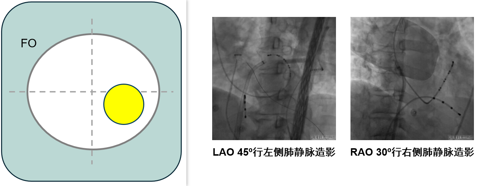

4. 导管排气

   1. 用注射器装满无菌肝素化生理盐水注入鲁尔接头B，直至电极支架末端有液滴冒出，将支架浸入无菌肝素化生理盐水充分排气，将鲁尔B用鲁尔帽封堵住或连接加压盐水持续滴注

      
    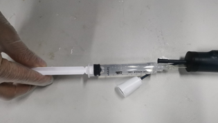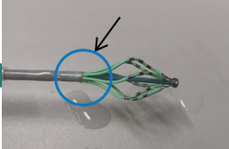 

   2. 将Y阀连接至鲁尔接头A，用注射器装满无菌肝素化生理盐水注入Y阀侧口，直至电极支架头端有液滴冒出， 将支架浸入无菌肝素化生理盐水充分排气

      
  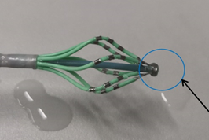 

   3. 往前推手柄滑块，使得电极支架伸直，将电极支架收入装载器中，通过三通阀对装载器进行注射排气，至装载器末端有液滴冒出，术中Y阀侧口连接加压盐水持续滴注。

      
    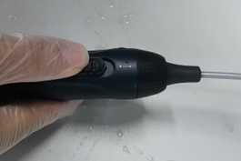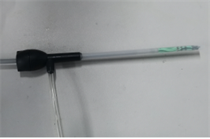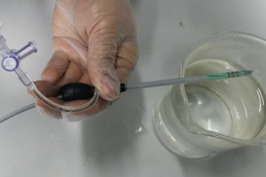 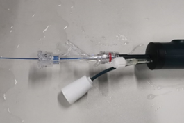

## 手术规范

1. CP脉冲消融推荐术式231

   导丝推进到肺静脉口，将导管调整至网篮形以匹配肺静脉直径；将导管调整至花瓣形态，覆盖至肺静脉前庭部位。

   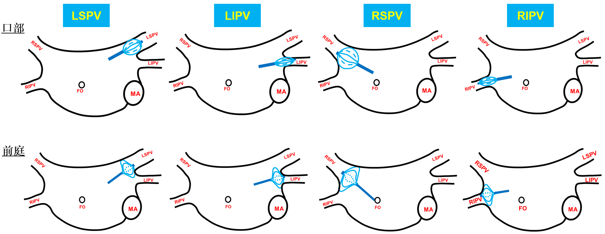

   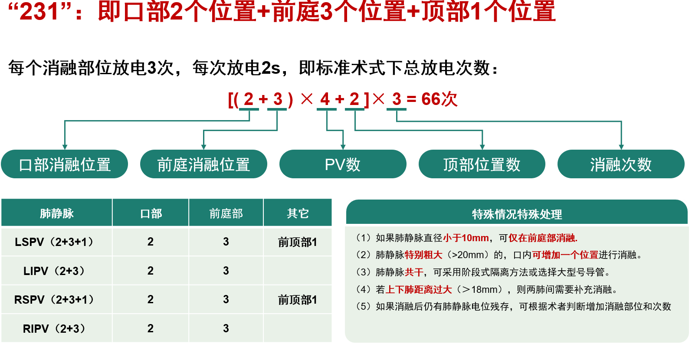

   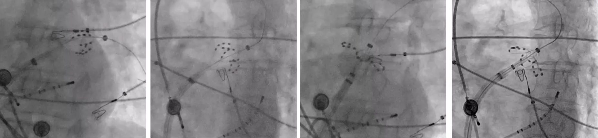

2. 顶部消融

   ​				**RSPV顶部消融**					**LSPV顶部消融**	

   
  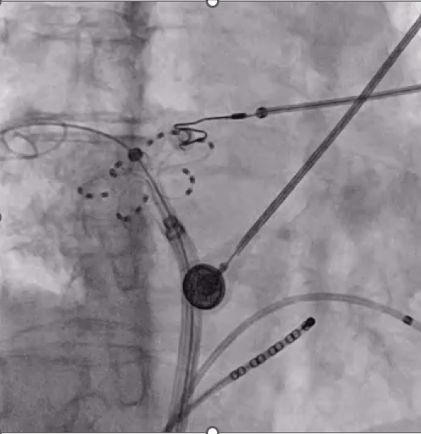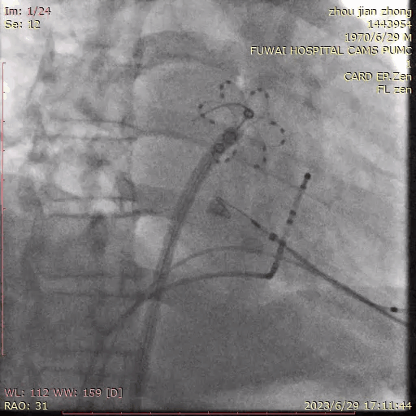 

   + 双侧肺静脉顶部标准消融时贴靠面积不足，是复发的常见部位
   + 双侧肺静脉顶部较平直时可以调整导管方向以花瓣状去贴靠
   + 双侧肺静脉顶部呈V型时可以以网篮状去贴靠

   > [!NOTE]
   >
   > 导管在出鞘管后以及在心腔内操作须有导丝在头端保护
   >
   > 在操作脉冲消融导管从一侧肺静脉转移到另外一侧肺静脉时，需要**将导管收入鞘内**，转动鞘管至另外一侧，再重新送出导管

3. 术中消融效果

   

4. 过程中可能出现的情况

   1. 咳嗽
   2. 疼痛
   3. 迷走神经反射：左侧肺静脉消融多见，保护性心室起搏或者消融前给予**0.5-1mg阿托品**推注
   4. 膈肌运动

## 肺静脉电位识别

1. 左房结构

   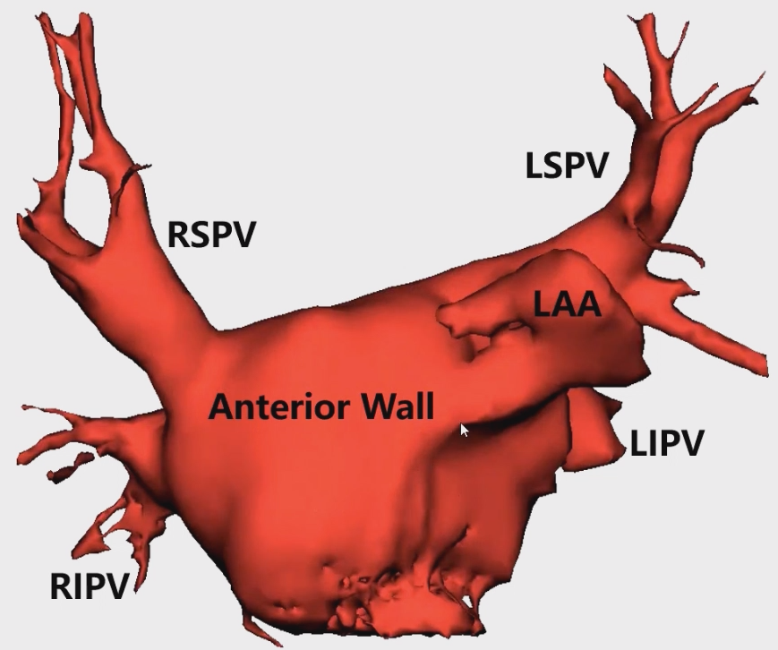

   + 左房相比右房更靠上、靠后
   + 肺静脉从后壁汇入左房，左高右低
   + 气管分叉、食管、降主动脉紧贴于左房后壁的心外膜 
   + 迷走神经在左心房、4条肺静脉口部的密度较高

2. 肺静脉电位

   窦律下，激动由窦房结发出经心房传入肺静脉。在肺静脉内可记录到落后或融合于心房A波的**尖锐、高频肺静脉电位**

   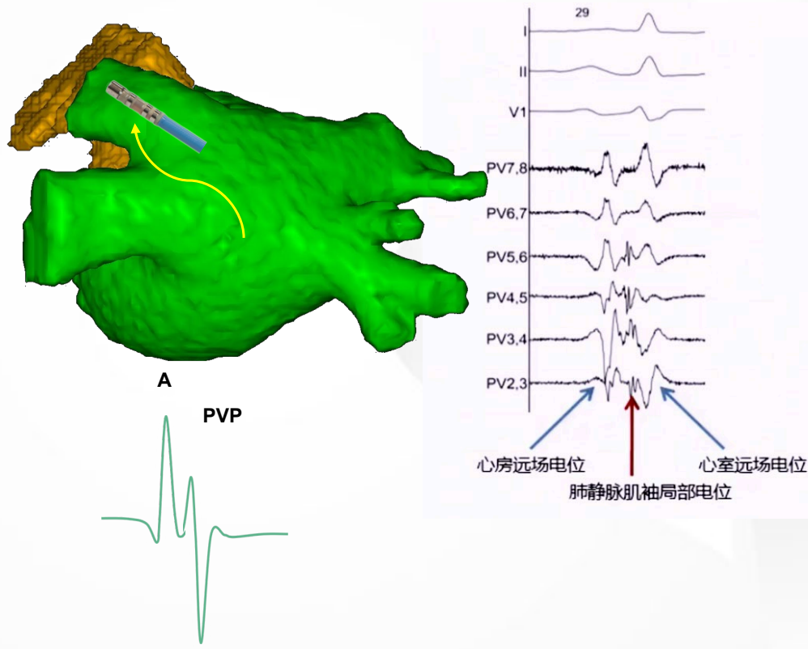

   房颤发作时，激动由肺静脉肌袖已位兴奋灶发出经肺静脉传出激动心房

   在肺静脉内可记录到领先于心房A波的**尖锐、高频肺静脉电位**

   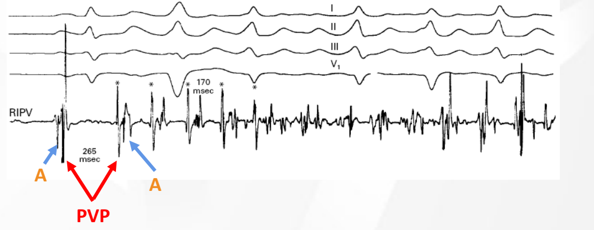

   肺静脉存在的电位

   | 肺静脉分支 | 毗邻结构                                  | 可能存在的电位                                               |
   | ---------- | ----------------------------------------- | ------------------------------------------------------------ |
   | LSPV       | + LA + LAA + Marshall韧带  | + LA电位 + LAA电位 + Marshall电位 + LSPV电位  |
   | LIPV       | + LA + LAA + Marshall韧带  | + LA电位 + LAA电位 + Marshall电位 + LIPV电位  |

   ​											**LSPV消融前的电位**

   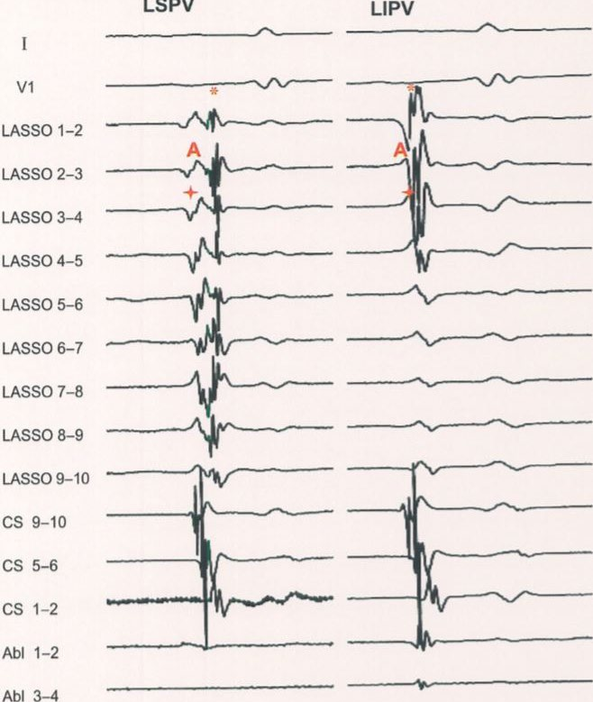

   消融前电位比较复杂，难以区分

   | 肺静脉分支 | 毗邻结构               | 可能存在的电位                           |
   | ---------- | ---------------------- | ---------------------------------------- |
   | RSPV       | + SVC + LA   | + SVC 电位 + LA电位 + RSPV电位 |
   | RIPV       | + LA                   | + LA电位 + RIPV电位                 |

     								**RPV窦律下消融前的电位**

   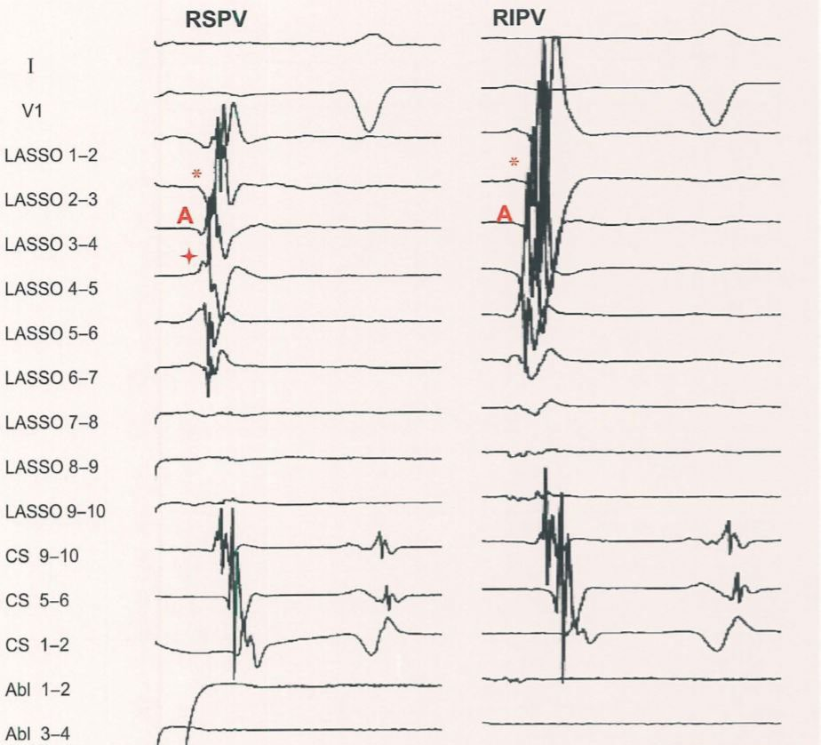

3. 肺静脉电位的识别

   1. 观察电位形态（尖锐/低钝）

   2. 消融过程中记录到电位脱落

   3. 改变激动顺序是否拖后——起搏远场起源或靠近远程起源的位置，根据电位是否拖后来判断

      + 观察电位形态

        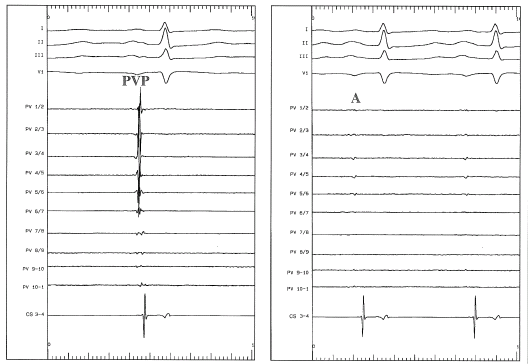

        
心房远场电位和PVP形态对比
 

      + 消融记录到电位脱落

        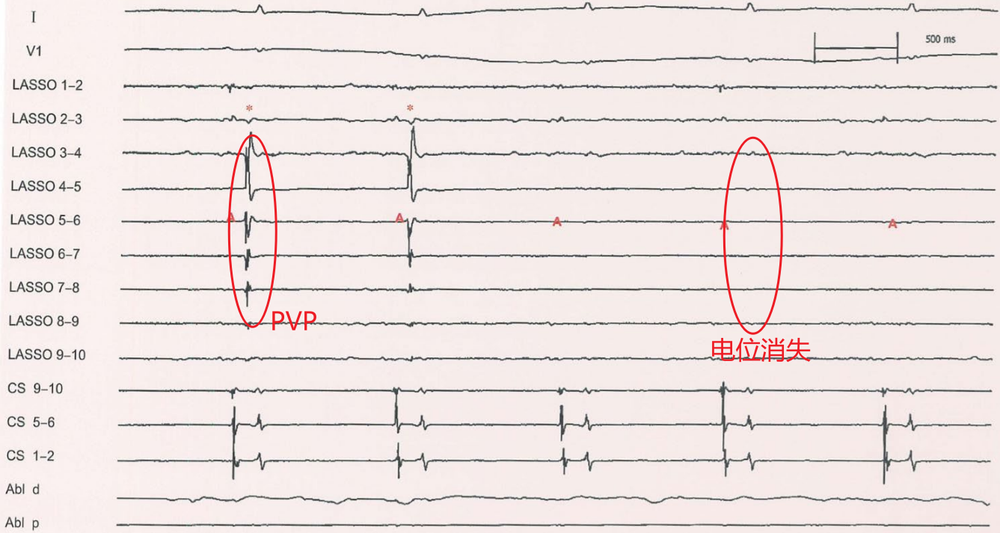

      + 改变激动顺序：

        + IF 左上肺 or 左下肺

          起搏CS远端或LAA

        + IF　右上肺

          起搏SVC

        + 原理：起搏远场起源或靠近远场起源的位置时，远场电位离起搏钉很近，肺静脉电位会拖后

   4. LSPV电位鉴别

      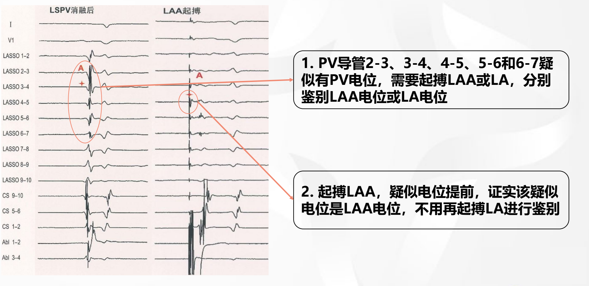

   5. 例子

      1. 

      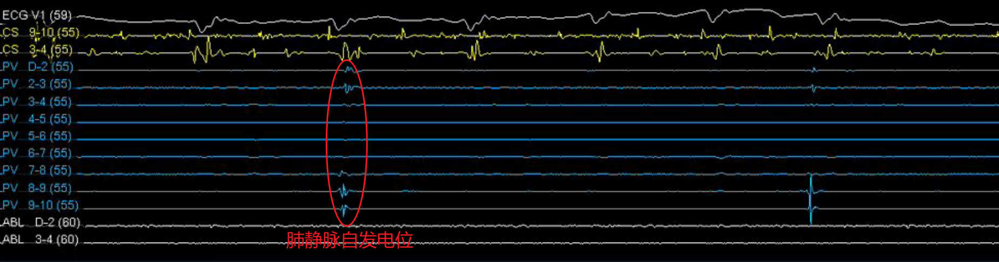

      心房电位（AF）没有传入肺静脉，PV导管上是肺静脉自发电位

      2. 

      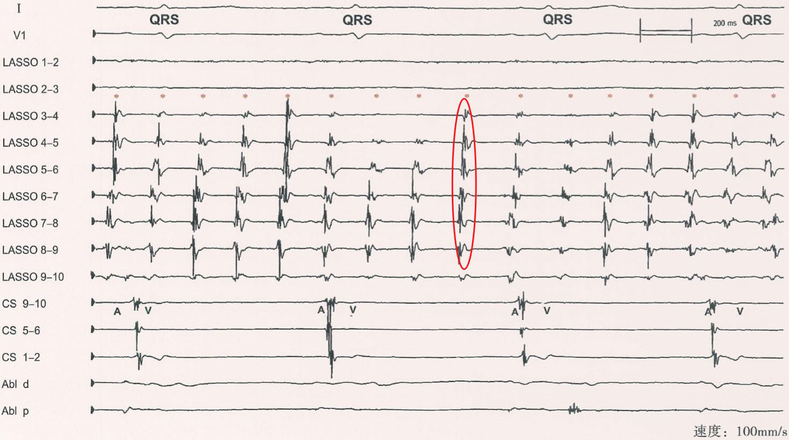

      肺静脉内的房颤电位没有传出到左心房

      3. 肺静脉消融后电位消失

      

          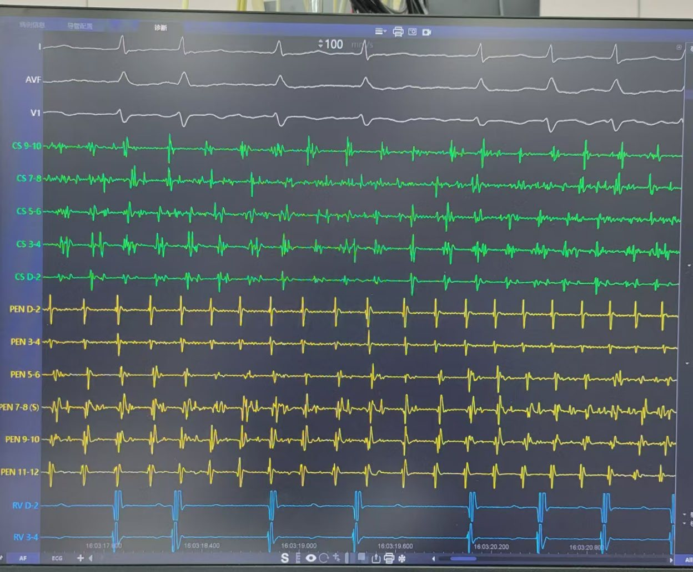
          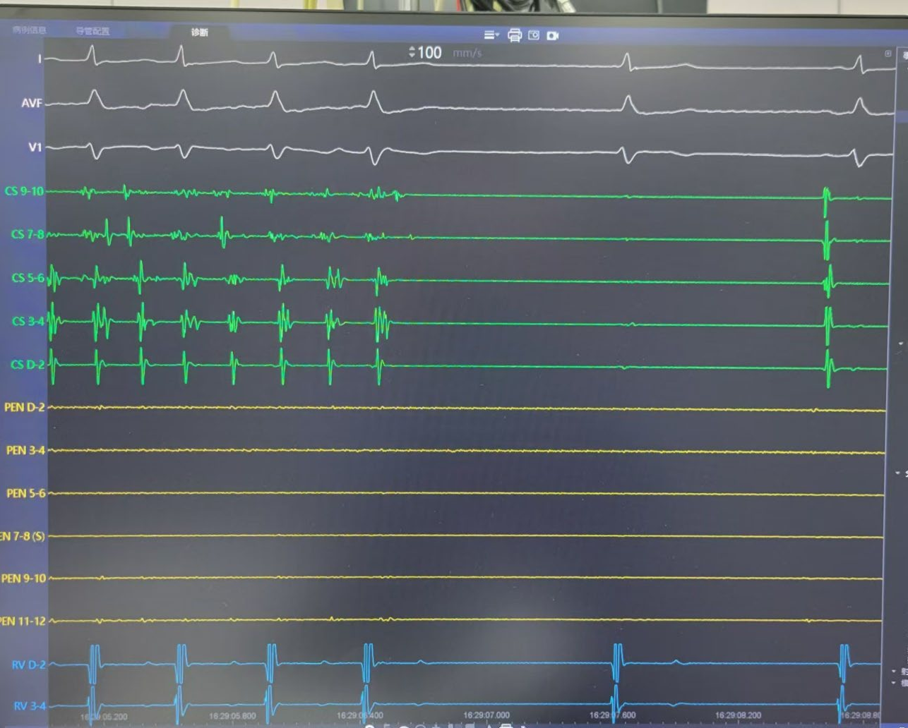
      

# 心脏电生理疾病分类和简单心电图识别

## 心律失常概念及机制

**折返型**：冲动传导异常

**局灶型**：自发性-自律性增高-冲动形成异常

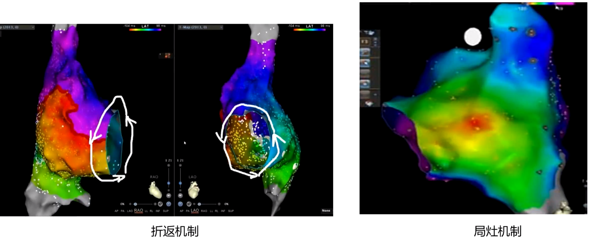

红色发生时间最早，紫色最晚，挨在一起的证明传导是连在一起的

## 快速性心律失常分类

1. 房颤

   房颤是指新房规则有序的电活动丧失，代之以快速无序的颤动波，表现为P波消失，代之以大小、形态不规则的f波

   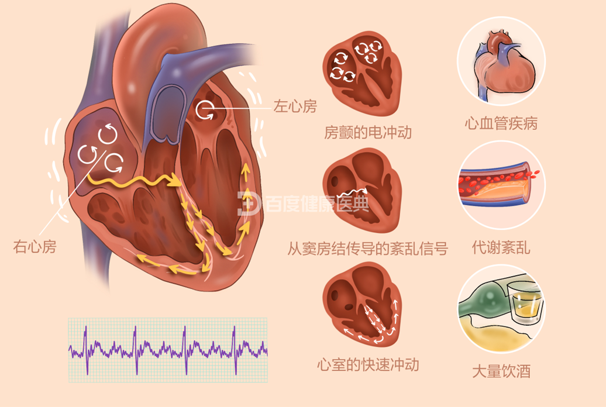

   体表心电图鉴定：

   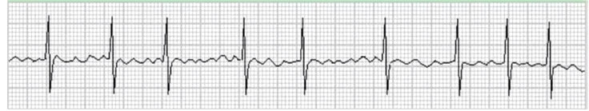

   + 没有P波，代替为大小形态及时限不等的颤动f波，有时不易看清

   + **心室率绝对不齐**

     > 房室结将窦房结产生的激动进行必要的延迟和“滤过”，只允许一定量的心电信息通过，以防止大量的心电信息造成心室肌细胞无所适从，但房颤由于颤动无规则无法规则过滤。

     ​		正常窦律									房颤

   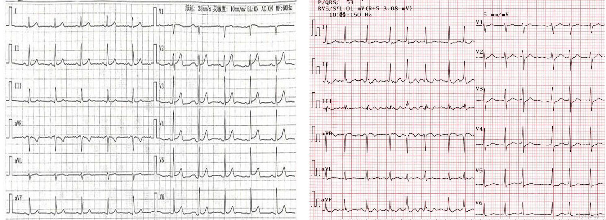

2. 心房早搏

   > 房性期前收缩是指早于基础心律 (多为窦性心律) 而提前出现的房性异位搏动,，是临床上常见的心律失也称为房性早搏(简称房早，相对于p波称p‘)，机制为局灶心房肌自律性增高

   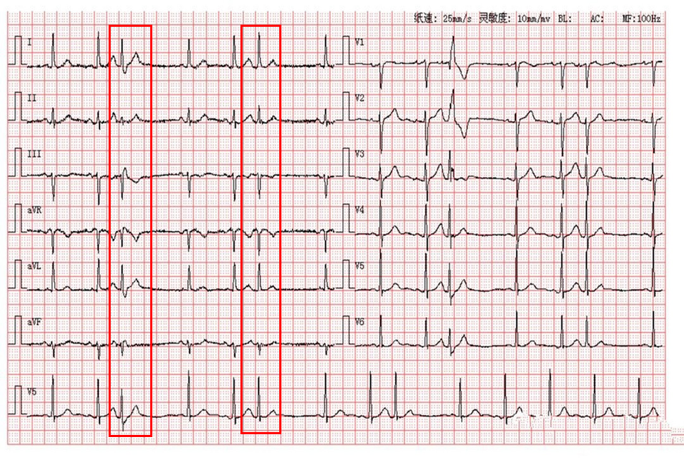

   标记QRS波，体表心电图p波有时看不清，而p’波被t波掩盖。为什么不是室早？因为室早宽大畸形

   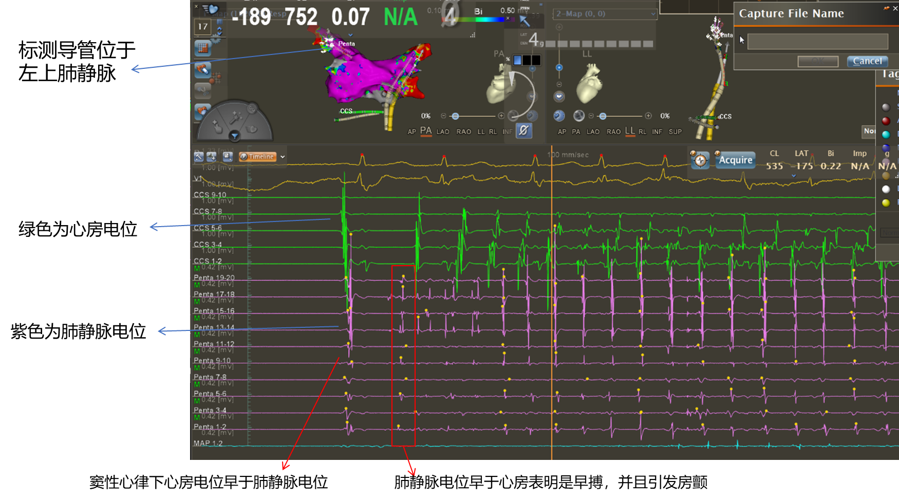

   标测导管位于LSPV。第一跳是**窦律**（cs电极心房电位早于肺静脉电位）

   第二跳，肺静脉电位先行，心房电位稍晚，证明发生了房早，引发房颤

3. 室上性心动过速

   室上性心动过速是指异位激动形成的局灶部位或折返环路在心室以上的一组快速性心律失常。

   + 局灶性室上性心动过速=房速
   + 折返性室上性心动过速=狭义室上速

   房性心动过速（atrial tachycardia、AT）又被称为**局灶房速**，是指信号起源于心房局灶且无需房室结参与维持的一种快速心律异常（心率＞100次／分钟）。

   狭义室上速：分为**双径路**和旁道，发生机理为折返性，频率160～220次/分。

   室上速心电图特点包括：

   + 心房率通常为150-200bpm
   + 房室比例多为1：1
   + 节律通常规整
   + 三种类型体表心电图不易鉴别，需通过电生理检查或三维激动标测鉴别

   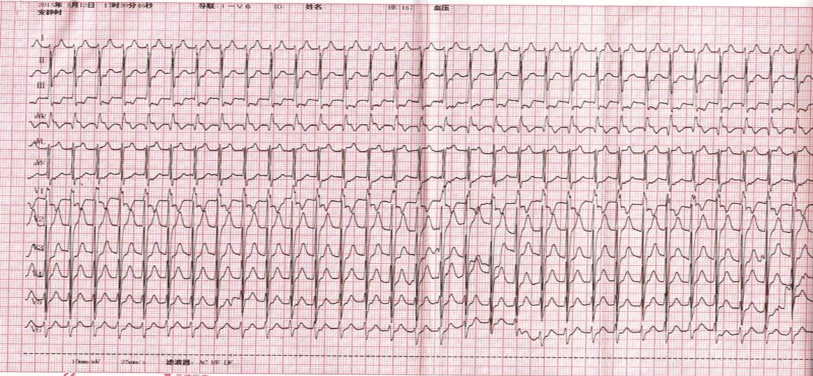

   室上性心动过速的消融位置：

   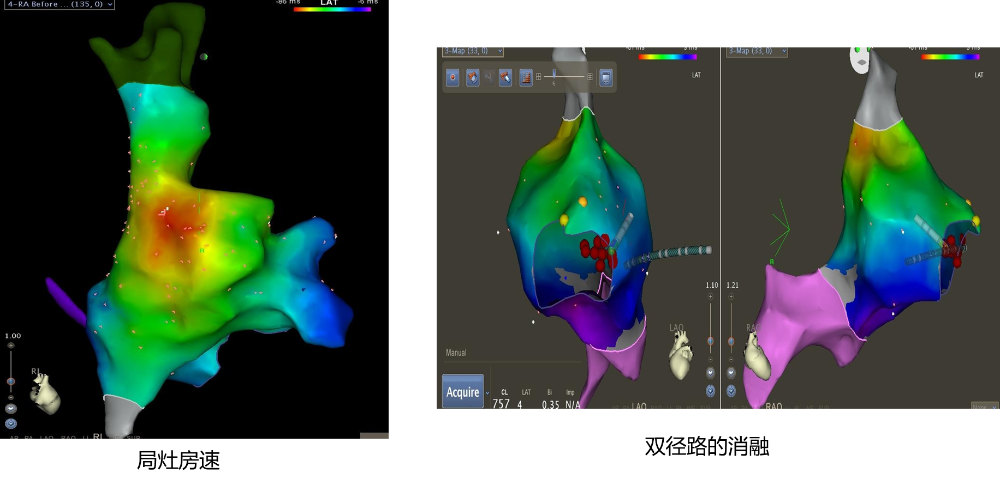

   找到局灶位置（红色位置）消融即可，双径路消融房室结附近一条通路

4. 房颤伴旁道的危险性

   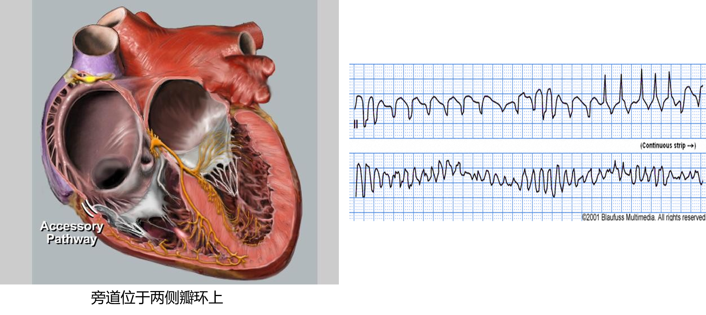

   旁道和双径路的区别：双径路通常在房室结附近，旁道第二条路经可以长在瓣环（二尖瓣、三尖瓣环）上。旁道没有房室结的延迟和”滤过“作用，因而很危险。

5. 房扑

   房扑是一种发生在心房内的快速型异位心律失常，常有固定**折返**环路

   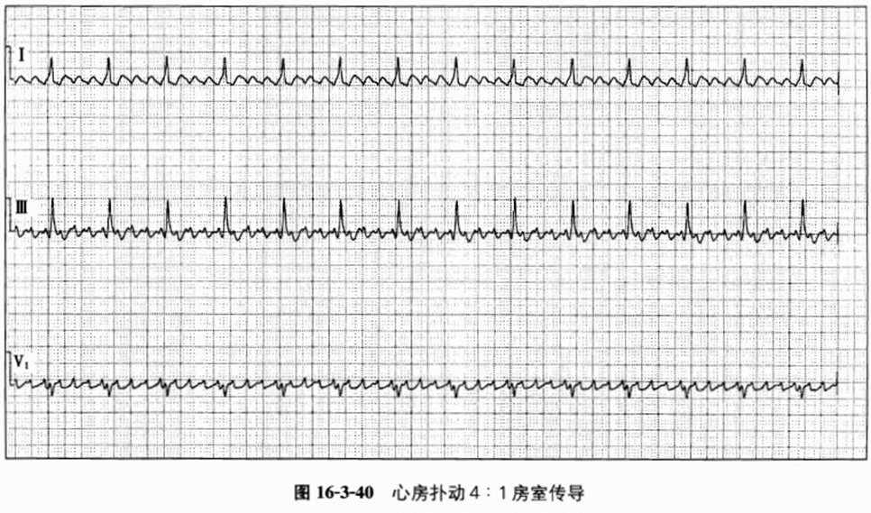

   分类：

   + I型房扑（典型的AFL）：三尖瓣峡部依赖型房扑，折返环路围绕三尖瓣
   + II型房扑（非典型AFL）：除了典型房扑外的房扑类型，折返环路不一

   特点：

   + 窦性P波消失，代之以频率250-350bpm的锯齿状或波浪状F波
   + QRS波群形态受F波影响，可能存在差异性
   + 房室传导比例异常，通常为2：1或3：1，4：1现象
   + 典型房扑锯齿波明显，容易判断

   从体表心电图判断：体表心电图中，注意锯齿样的F波，根据心电向量的原理，II、III、AVF导联为负向时提示传导由心房峡部逆传到房间隔，进而激动整个心房

   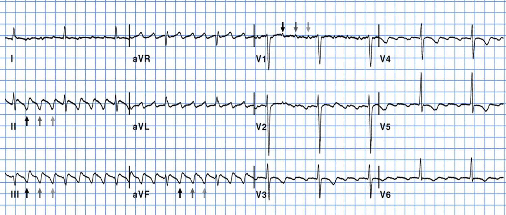

   典型房扑可不依赖三维标测直接判断为典型房扑，确定消融位置为三峡

   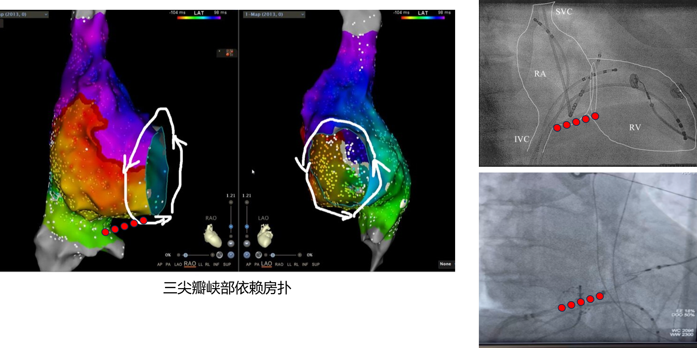

   可以使用花瓣状脉冲消融导管进行三尖瓣峡部消融

6. 室早（室性期前收缩）室速

   + 室早：起源于心室内部的异位期前收缩。宽大畸形的QRS波，发生机制**局灶**

   + 室速：连续三个以上的宽大畸形QRS波，发生机理有的为**局灶**，有的为折返

   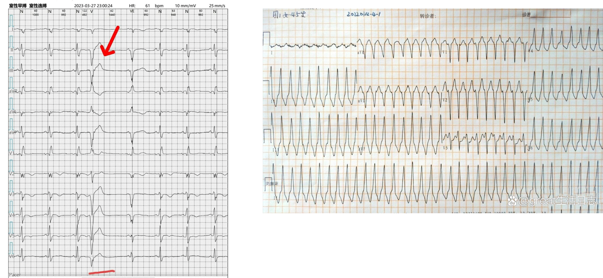

   > [!NOTE]
   >
   > 为什么室早室速QRS宽大畸形，房早房速QRS波正常？
   >
   > 早房速电信号通过房室结经希浦系统传入心室走的是高速通道，而室早室速电信号通过心肌细胞间传导速度慢房早房速电信号通过房室结经希浦系统传入心室走的是高速通道，而室早室速电信号通过心肌细胞间传导速度慢

7. 脉冲放电迷走反射心室起搏保护

   **迷走神经反射**的表现及处理如下：心率减慢，迷走神经兴奋可导致心率减慢，严重的可出现窦性停搏。迷走神经在肺静脉附近由分布，射频消融或脉冲消融都有可能刺激迷走神经，引起迷走反射

   

   ​								心室起搏即人为制造有规律的室早

8. **快速性心律失常疾病分类总结**

   1. 房颤是心房心律失常的最终进展，发生机制为肺静脉的局灶房早，心电图特点就是颤动的f波，绝对不齐的qrs波。

   

   2. 房早可通过提前的窄qrs波简单鉴别，发生机制为局灶，通常24小时小于1万次用药处理即可，房颤的引发通常来自肺静脉的房早。

   

   3. 广义室上速中局灶机制为房速，折返机制为双径路和旁道，旁道伴房颤可能引发室颤，这种情况优先处理旁道。

   

   4. 房扑的体表心电图为锯齿状F波，成比例下传，qrs波规整。发生机制为折返，其中典型房扑有固定折返环路，即围绕三尖瓣折返，花瓣脉冲导管有消融案例。

   

   5. 室早室速心电图特点为宽大畸形的QRS波，心室起搏的波形和其类似。

# 消融后左房房扑/房速

> 电生理肺静脉隔离可引起局灶性房速，多发生在恢复传导的肺静脉内或周围，在此进行静脉再隔离或关键折返的峡部进行消融是有效的。解剖指导环肺静脉隔离与大折返房扑有关，可由消融线上的缝隙，同侧肺静脉（顶部依赖性房扑）或二尖瓣环（二尖瓣上房扑）及冠状窦内大折返形成。对于消融后房扑，需在三尖瓣峡部进行拖带，证实心动过速并非三尖瓣峡部依赖性，而是之前的左房消融引起的非典型房扑。
>
> 如何标测？
>
> 1. 三维
> 2. 拖带标测

# 心电图学习

## 1. 正常窦性心律

1. 正常窦性心律的冲动起源于窦房结，频率为 60－100 次/分。

2. ECG显示窦性心律的P波在I、II、aVF导联直立，aVR导联倒置

3. P-R间期0.12-0.2s

   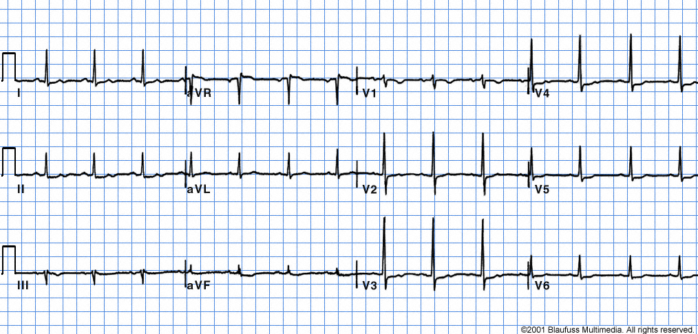

   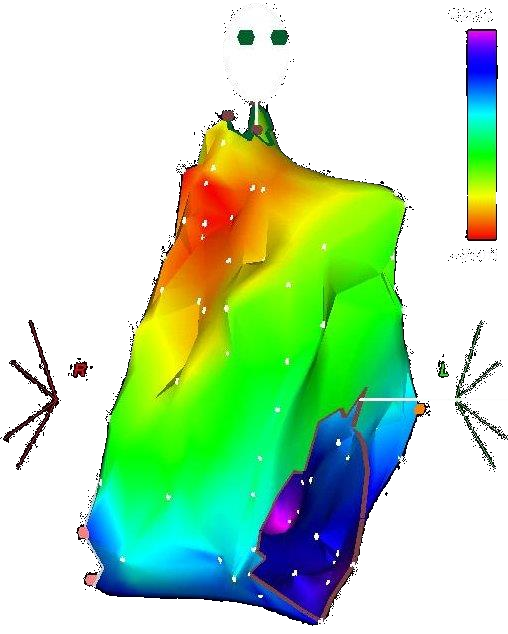

> 窦性心律的 CARTO 图：可以看到，窦性心律起源于窦房结部位(红色区域)，激 动传导至其他部位(传导顺序为红>橙>黄>绿>青>蓝>紫)。

## 2. 心律失常

心率失常的定义和分类

### 1. 房颤{#af}

### 2. 房早

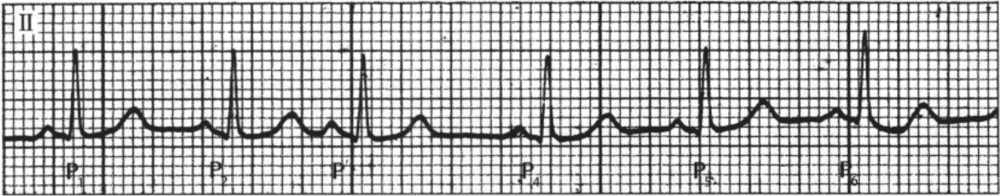

看图步骤：

1. 图中QRS波是窄的

心电图特点：

1. 提前出现的P‘-QRS-T波群，P’波形态与窦性P波不同
2. P‘-R<0.12s
3. P’波后紧跟着的QRS波群一般与窦性心率相似，如无QRS波群时称房性早搏未下传，有相关的宽QRS波群时称房性早搏伴室内差异性传导
4. 代偿间歇不完全

## 总结

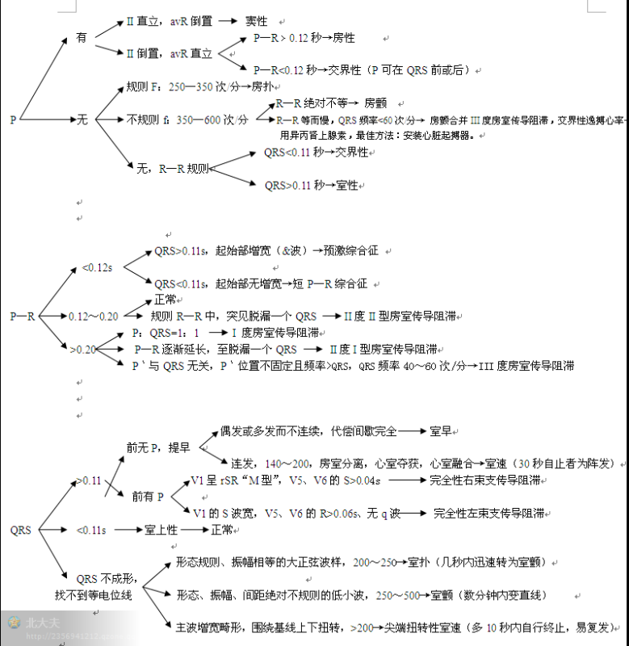

.png)

> P > 0.11s 左房大；肢体导联上> 0.25 mv，高尖，右房大
>
> QT 间期（正常0.32~0.44）一般采用 QTc 为标准，QTc = QT除以（R-R）的平方根，电脑会计算出来。
>
> QTc 延长的意义：男性 ≥ 0.45s，女性 >≥ 0.46s。
>
>  QTc延长的意义：低钙，以及洋地黄、奎尼丁、胺碘酮、索他洛尔的影响或中毒。QTc缩短：高钙。
>
> 
>
> **记住这个很重要：窦房结、房室结、心室的自律性分别是：60～100、40～60、<40次/分。**

+++

## 房颤总论

参考 [房颤](#af)

### 房扑、房颤、房苏鉴别

临床上假别AFL、AF、AT，往往是根据P波的频率，并界定以250次/分为界限，鉴别AFL和AF时往往是根据F（f）波的大小、频率和规则程度，并界定以350次/分为限。

1. AT和AFL的本质区别

   **AT**时，尽管心房的除极和复极过程都因房率较快而变得较短，但由于心房率还不是太快，以至除极和复极过程还都能达到完全的程度。也就是说，心房除极后还能回到静息电位状态，心电图表现为相邻的P-P之间存在等位线。这时的心房机械活动表现为，收缩和舒张都能圆满完成全过程。这种情况，是房速。

# 病例

## FARAPULSE

1. 成都医学院第一附属医院院心血管内科**王沛坚主任团队**

2. 女性患者，63岁，反复阵发性心悸10+年，先后两次在外院行房颤射频消融术。本次再发1周伴头晕入院；心电图提示心房颤动并伴快速心室率，门诊以“心房颤动”收入院。

3. 心脏超声提示左房前后径37mm；食道超声提示左房及左心耳内未见血栓，房间隔未见明显连续中断。

   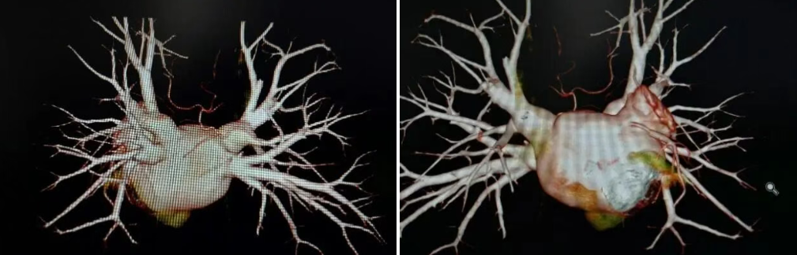

肺静脉CTA
 

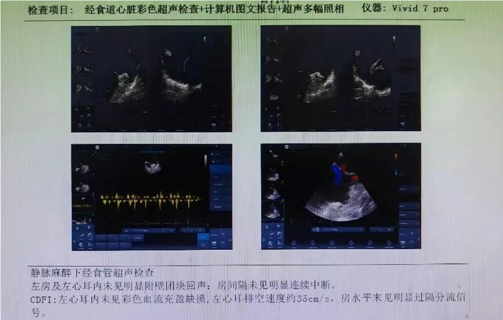

食道超声
 

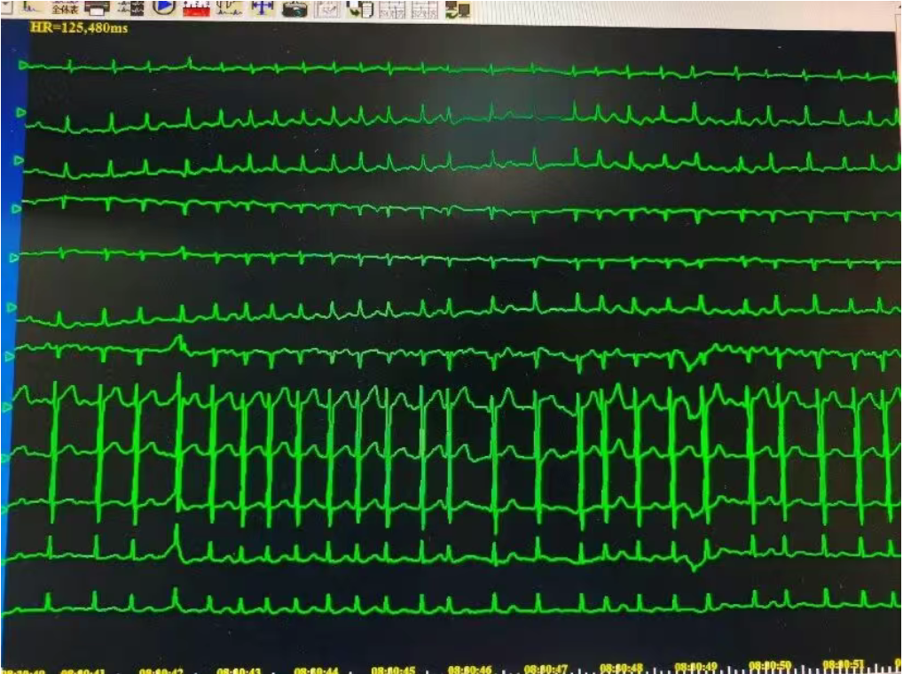

 上台心电图
 

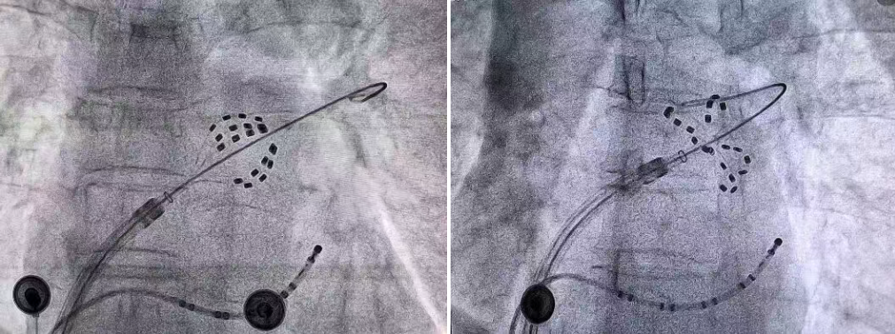

（左上肺静脉4次网篮状+4次花瓣状消融）
 

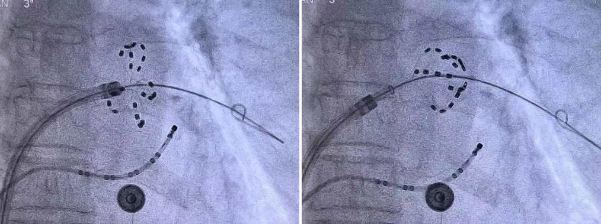

（左下肺静脉4次花瓣状+4次网篮状消融）
 

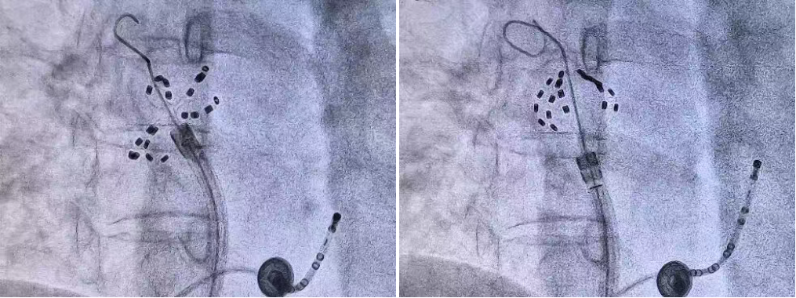

（右上肺静脉4次花瓣状+4次网篮状消融）
 

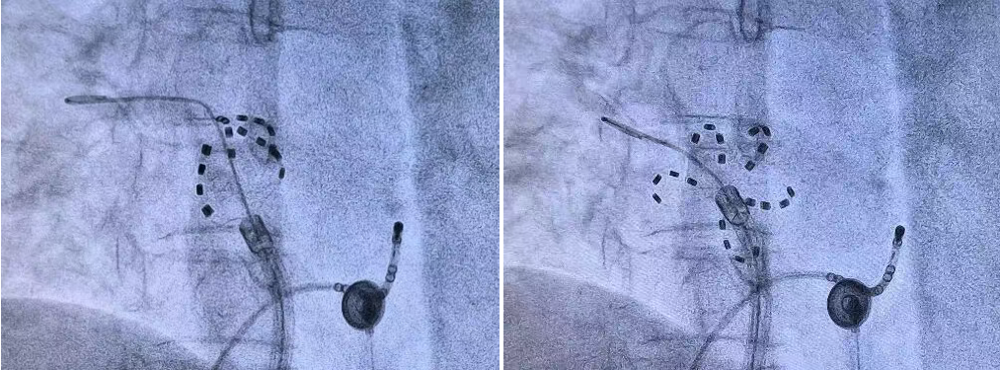

 （右下肺静脉4次网篮状+4次花瓣状消融）
 

每支肺静脉首次放电即消除电位，1次放电2.5秒，共5组脉冲串；完成4支肺静脉电隔离后患者仍是房颤心律，于是决定行后壁BOX消融，以花瓣状对后壁进行均质化消融

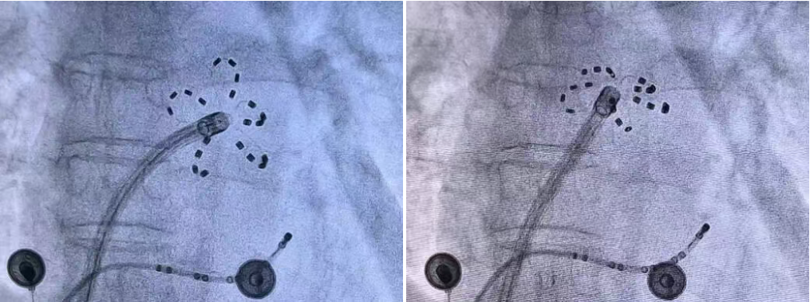

顶部线8次花瓣状消融+底部线8次花瓣状消融，每个位置放电2次，两个位置间重叠50%
 

完成后壁BOX消融后患者由房颤转为房扑，CL-230ms；用CS1-2电极以201ms的频率拖带，PPI-TCL＞30ms，然后用CS5-6电极以210ms的频率拖带，拖带结束后房扑转房颤，结合此时CS电极的位置判断二尖瓣峡部大概率未参与折返；房颤持续几分钟后又转为CL-300ms,且CS9-0领先的房扑，但是不稳定，用CS9-0电极以270ms频率拖带，拖带后即刻转为房颤，于是决定将FARAWAVE导管撤至右房，对三尖瓣峡部进行消融治疗，同时隔离上腔静脉。

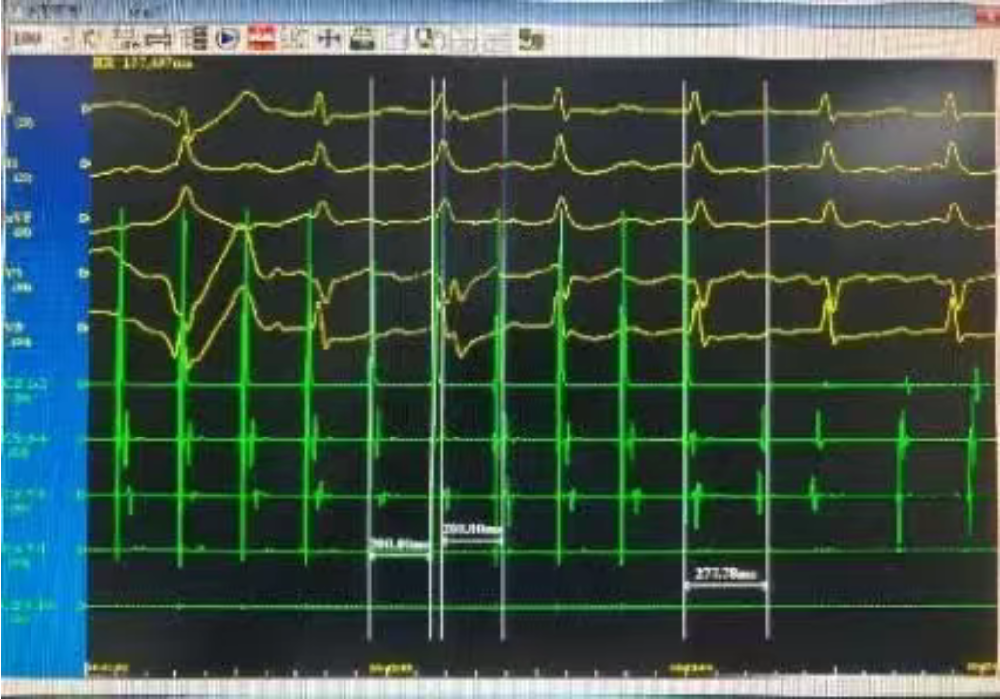

CS1-2拖带
 

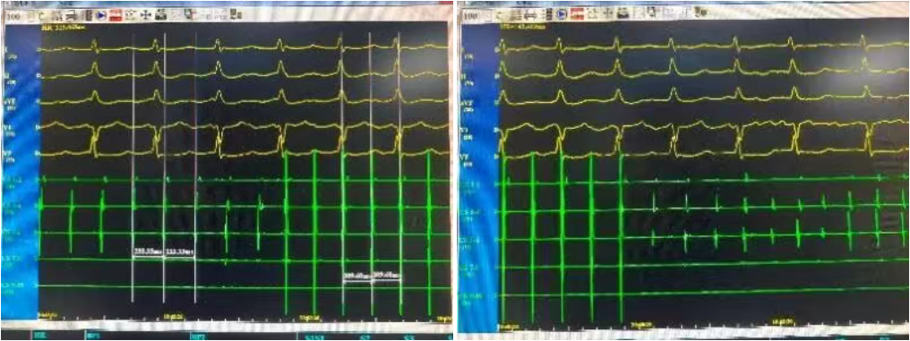

CS5-6拖带
 

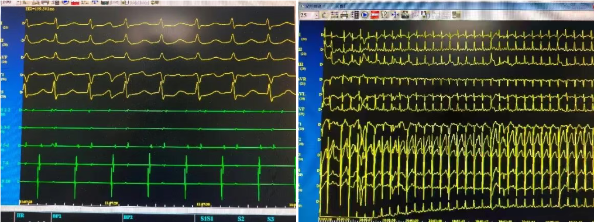

CL300ms
 

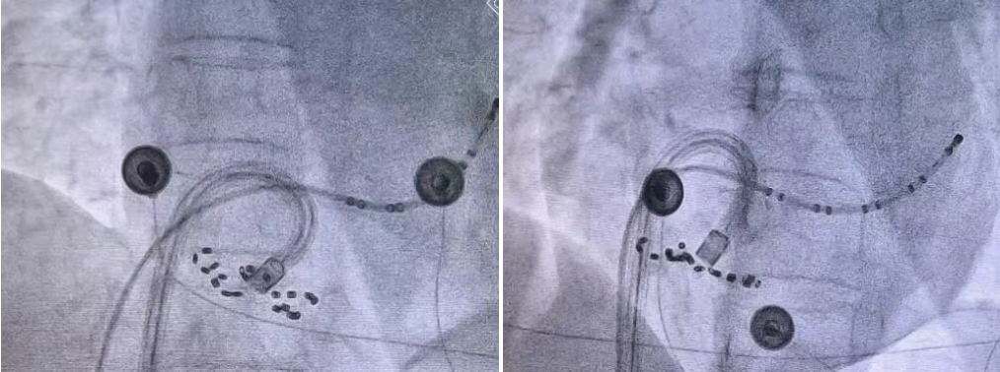

(4次花瓣状+2次网篮状放电)
 

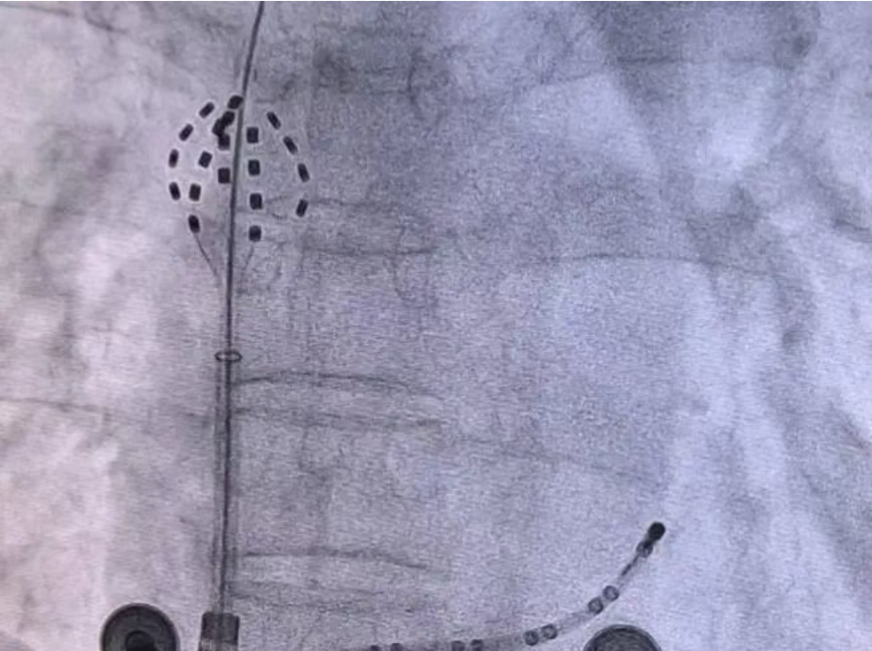

 （上腔静脉4次网篮状放电）
 

​	上腔静脉放电结束后房颤自行终止。

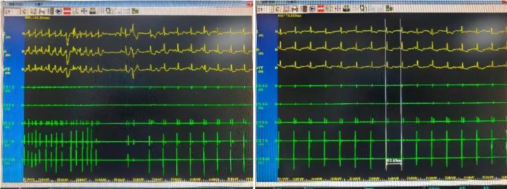

消融验证：三尖瓣峡部双向阻滞，上腔静脉完成电隔离，四支肺静脉完成电隔离；准备行左心耳封堵术。

术后随访：患者术后1月仍维持窦性心律，无心悸头晕不适。

# CTA影像解剖

## 1. 心的方位

> 右室并不完全位于右侧，而是位于**右前方**；左心室并不完全位于左侧，而是位于**左侧靠后**的位置。
>
> 
>
> 此外，心脏在纵隔内并不总是保持相同的位置，**年轻人的心轴**往往更**垂直**，而**老年人**的心脏往往停留在**横膈**上，**心轴往往更水平**。

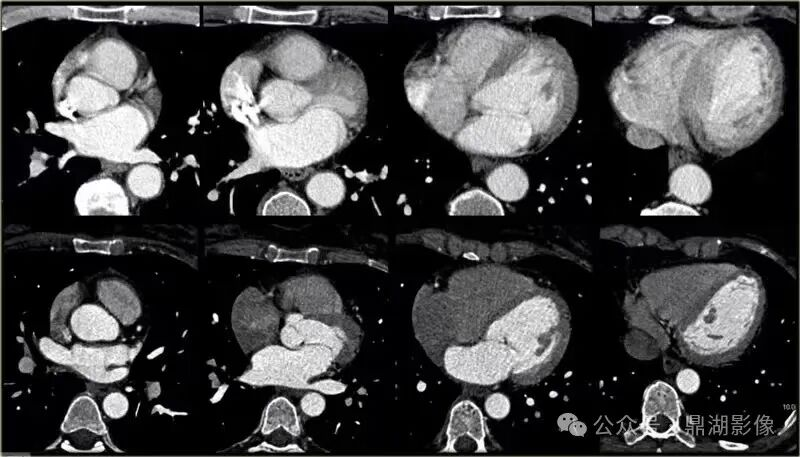

 心脏横断位
 

下图是四腔心位，相当于在横断位基础上，X线从心尖部向上射入得到。在四腔心位，右心室右心房旁边，左心室位于左心房旁边，同时可见二尖瓣进入视野。根据造影方案，三尖瓣有时可见。四腔心位的另一个特征是**心尖界限分明**。另外，心尖由左心室构成。

 四腔心位
 

**三腔心位**相当于在横断位的基础上，X线经过二尖瓣和主动脉瓣之间的交界处射入得到。三腔心位可以见到左心房、左心室、二尖瓣和近端升主动脉。

 三腔心位
 

五腔心位和四腔心位类似，但还显示了主动脉瓣和左室流出道。五腔心位相当于是在四腔心位的基础上，X线入射角度稍微向头侧旋转。

 五腔心位
 

二腔心位相当于是X线入射方向垂直于二尖瓣并平行于室间隔得到的投影。此断面概述了心房和二尖瓣。这是**分析心室功能的良好视图，尤其是下壁和前壁的功能**。为了获得功能数据，必须利用三腔心位和四腔心位重建连续的横断面图像。

 二腔心位
 

## 2. 心脏解剖

正常情况下，手臂静脉注射后，造影剂将通过上腔静脉SVC到达右心房。右心房位于心脏的前外侧，并且位置相对左心房较低。

+ **上腔静脉**通过右心房顶部进入右心房。
+ **下腔静脉**进入右心房的位置稍微靠下一点，差不多是在房间隔位置进入右心房。

将血液输送回右心房的另一个结构是**冠状窦**（冠状动脉的静脉回流），冠状静脉在下腔静脉的前面和左侧进入下腔静脉。

 心脏横轴位（左）和冠状斜向（右）重建，显示了右心房及其主要血管：冠状窦（蓝色箭头）以及上腔静脉和下腔静脉。IVC=下腔静脉，A表示患者的前方，SVC=上腔静脉
 

右心房内有**界嵴**，这是一条从上腔静脉入口延伸到下腔静脉入口的肌肉脊。这种结构将右心房的光滑部分（静脉窦）与小梁化的右心耳分开。在左侧的图像中，可以看到它是一个平滑的线性结构（蓝色箭头）。

 心脏横轴位（左）和冠状（右）重建显示了界嵴（蓝色箭头）及其在右心房中的位置
 

**冠状窦**是心肌的主要引流静脉，它在心脏后表面的房室沟中行进，并在三尖瓣附近进入右心房。

 心脏横轴位（左）和冠状斜位（右）重建显示冠状窦进入右心房（蓝色箭头）。A表示患者的前面，P表示患者的后面。
 

 重建图，显示了心脏后表面房室沟中冠状窦的走向
 

**右心耳**是右心房的小梁化部分。它部分覆盖房室沟和在其中运行的右冠状动脉。其特点是**呈扁平三角形**，包含平行于心房本身的小肌束。

 心脏的横轴位（左）和3D 重建（右）显示右心耳（蓝色箭头）。Ao=主动脉，LA=左心房
 

血液通过**三尖瓣**从右心房进入右心室。该瓣膜具有**三个小叶和三个乳头肌**，它们部分**插入室间隔上**（与二尖瓣的乳头肌相反，二尖瓣的乳头肌不插入室间隔）。

**右心室的形状与左心室不同**：左心室呈圆柱形，右心室的腔有效地包裹在左心室周围。

**右心室**的壁也更薄，小梁化程度更高，尤其是朝向心尖部。**隔缘肉柱**是右心室的另一个显着特征。它从室间隔延伸至右心室侧壁，在右心室游离壁（蓝色箭头）的电生理传导中发挥关键作用。

 显示右心室的横轴位（左）和矢状斜位（右）重建。蓝色箭头表示调节带。RA=右心房，RV=右心室，LV=左心室
 

接下来，血液进入右心室光滑、肌肉发达的漏斗部，接着流向肺动脉瓣。**肺动脉瓣**有三个瓣，并通过称为室上嵴的厚肌肉与三尖瓣分开（左图中的蓝色箭头）。这与左心室流出道不同，左室流出道的二尖瓣和主动脉瓣几乎并排。

 重建显示三尖瓣 (TV) 和肺动脉瓣 (PV) 以及右心室 (RV) 腔。蓝色箭头表示室上嵴
 

 右心室的特征：隔缘肉柱，间隔乳头肌，漏斗部，右房室瓣和流出道无纤维连续性
 

富氧血液通过肺静脉进入左心房。在大多数情况下，左侧有两条肺静脉，右侧也有两条肺静脉。右肺静脉中叶静脉血通常汇入上肺静脉。

 横轴位重建重建显示肺静脉（蓝色箭头）进入左心房
 

然而，肺静脉解剖结构经常存在变化，特别是**右肺静脉的异常汇入**，异常汇入通常与心房颤动相关。

 3D 重建显示肺静脉进入左心房
 

**左心耳**是手指状的小梁结构，起源于左心房的外侧。它位于左房室沟上方，并部分覆盖其中的左冠状动脉。**左心耳的肌肉小而平行，注意不要误认为是血栓**。

 轴向和 3D重建显示左心耳的形状和位置（黄色箭头）
 

当评估冠状动脉时，必须切除左心耳，以便可以看到LCX和近端LAD。

3D重建显示左心耳切除后的左心耳（蓝色箭头）和左冠状动脉（黄色箭头）。A表示患者的前面，S表示患者的头端。
 

血液通过二尖瓣从左心房进入左心室。**二尖瓣**是一个复杂的瓣膜，由瓣环以及后叶和前叶组成。

小叶通过称为腱索的绳状肌腱连接到乳头肌。乳头肌深入左心室的侧壁和后壁以及心尖。

正常情况下，左心室厚度均匀，舒张末期厚度在0.6 至1.0厘米之间变化。血液通过左心室流出道进入主动脉瓣。请注意，**二尖瓣和主动脉瓣之间有时存在纤维连接**。

 心脏的横轴位（左）重建、三腔心位（中）和冠状重建（右）显示了左心房、心室和主动脉根部之间的关系。LA=左心房，R=右冠状动脉窦，L=左冠状动脉窦，N=无冠状动脉窦，Ao=主动脉，LV=左心室
 

与肺动脉瓣一样，主动脉瓣也有三个瓣。主动脉根部瓣膜靠上处有轻微扩张，即构成主动脉窦。在舒张期，主动脉窦充满血液，为冠状动脉提供富氧血液。

 三腔心位（左）和冠状（右）重建，同上
 

主动脉瓣的每个窦根据其与冠状动脉的关系而命名，即右冠状动脉窦、左冠状动脉窦和无名动脉窦（R、L和N）。

 心脏横轴位显示了主动脉瓣及其右冠状动脉窦、左冠状动脉窦（分别为R和L）和无名动脉窦（N）
 
