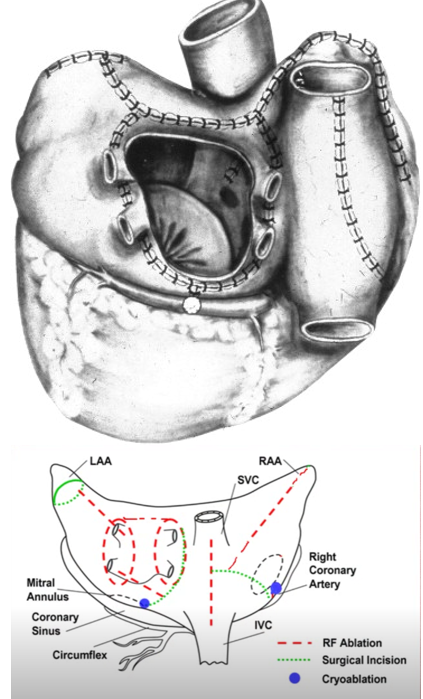
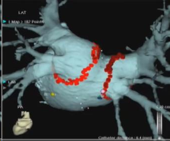
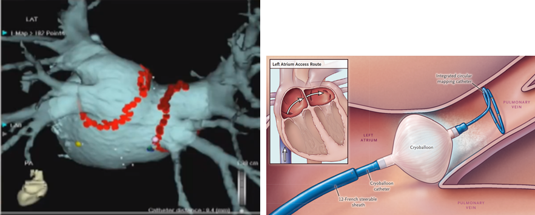
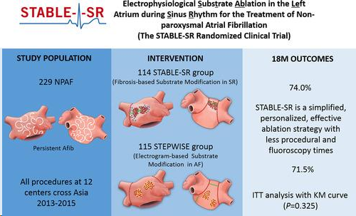
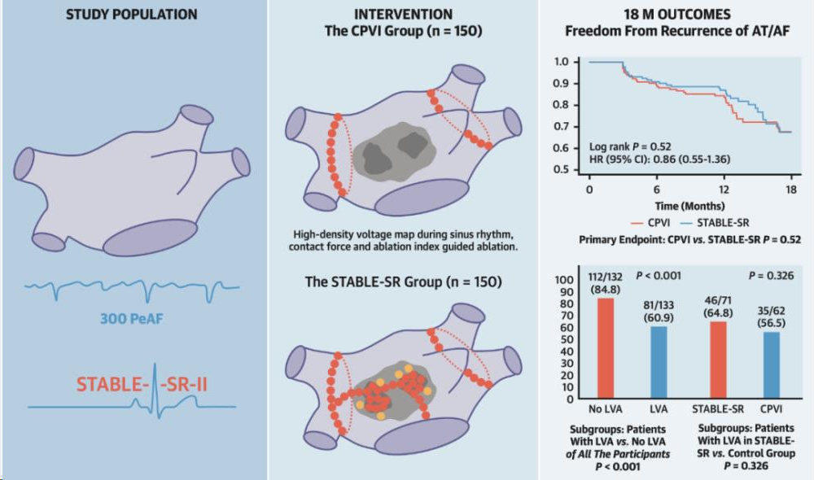
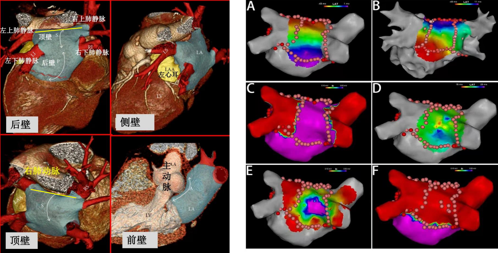

[toc]

# 特殊位置消融

## 房颤术式的演变

外科迷宫术（Cox-MAZE）
 

早期房颤的外科治疗，通过在左右心房进行一系列的切开缝合，达到既保留从窦房结到房室交界区的正常电传导，又阻止房颤波的扩散的作用。方法包括分别环绕左右肺静脉、从左侧肺静脉到二尖瓣环及右心房的一系列切割，同时还进行左心耳切除。

后来演变成肺静脉节段隔离，进行肺静脉的干预。

<!-- 

逐点环肺静脉隔离
 

肺静脉one-shot隔离
  -->

逐点环肺静脉隔离       肺静脉one-shot隔离
 

## 当前的消融策略

+ **解剖消融**
    + PVI/CPVI
    + SVC（上腔静脉）隔离
    + 左心房后壁及后壁消融（BOX）
    + 二尖瓣峡部
    + Marshall静脉酒精消融
    + 三尖瓣峡部
    + CS冠状窦隔离
+ **腔内心电图指导的消融**
    + 碎裂点位（CFAE）消融
    + 心房转子消融
    + 基质消融
+ **递进式消融**
    + PVI联合SVC消融、线性消融及CAFE消融的房颤基质改良策略
+ **非肺静脉触发灶消融**
    + 对常规解剖结构进行经验性电隔离
    + 在异丙肾上腺素诱发下标测并消融
+ **心脏自主神经节消融**
    + 对双侧肺静脉周围及Marshall韧带神经 节进行干预，依靠术中高频刺激诱发的迷走反射来定位

### 安贞经验：酒精消融+ 2C3L

### STABLE-SR研究——南京方法

STABLE-SR术式即“南京方法”（在环肺静脉隔离基础上，根据其基质进行个体化基质改良及碎裂电 位消融），相比于传统的步进式消融策略，STABLE-SR优化手术流程，缩短了手术时间，同时降低了 医源性房速的发生，让房颤治疗向前迈进了一大步

### STABLE-SR II研究——南京方法

STABLE-SR II研究比较了STABLE-SR术式与单纯肺静脉隔离的临床结局，尽管18个月的随访结果并没有 显示两组之间在房颤复发率之间的差异(67.2% vs. 67.4%，HR 0.89, 95% CI 0.55-1.36，p=0.521)，但表 现出改善的趋势。

## 顶部线消融操作

**顶部线解剖位置**

**操作建议**

迷走神经反应定义：在脉冲电场施加期间或紧接发生窦性心动过缓（<40 bpm）、心脏停搏或房室阻滞的情况下，已确认手术内迷走神经反应。确定了迷走神经反应的频率和最大停顿时长（即最大RR间隔）。临时备份配速根据操作员的偏好执行[^1]。

[^1]: DEL MONTE A, DELLA ROCCA D G, PANNONE L, 等. Pulsed field ablation of the right superior pulmonary vein prevents vagal responses via anterior right ganglionated plexus modulation[J/OL]. Heart Rhythm, 2024, 21(6): 780-787[2025-11-24]. DOI:10.1016/j.hrthm.2024.01.040.
