[[toc]]

# 特殊位置消融

## 房颤术式的演变

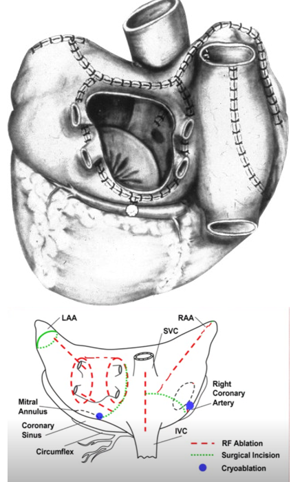

外科迷宫术（Cox-MAZE）
 

早期房颤的外科治疗，通过在左右心房进行一系列的切开缝合，达到既保留从窦房结到房室交界区的正常电传导，又阻止房颤波的扩散的作用。方法包括分别环绕左右肺静脉、从左侧肺静脉到二尖瓣环及右心房的一系列切割，同时还进行左心耳切除。

后来演变成肺静脉节段隔离，进行肺静脉的干预。

<!-- 
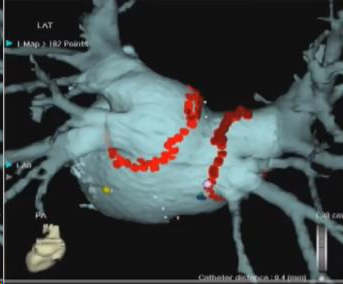

逐点环肺静脉隔离
 

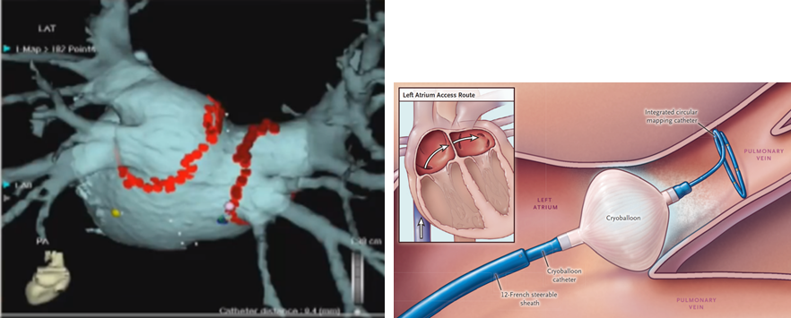

肺静脉one-shot隔离
  -->

逐点环肺静脉隔离       肺静脉one-shot隔离
 

## 当前的消融策略

+ **解剖消融**
    + PVI/CPVI
    + SVC（上腔静脉）隔离
    + 左心房后壁及后壁消融（BOX）
    + 二尖瓣峡部
    + Marshall静脉酒精消融
    + 三尖瓣峡部
    + CS冠状窦隔离
+ **腔内心电图指导的消融**
    + 碎裂点位（CFAE）消融
    + 心房转子消融
    + 基质消融
+ **递进式消融**
    + PVI联合SVC消融、线性消融及CAFE消融的房颤基质改良策略
+ **非肺静脉触发灶消融**
    + 对常规解剖结构进行经验性电隔离
    + 在异丙肾上腺素诱发下标测并消融
+ **心脏自主神经节消融**
    + 对双侧肺静脉周围及Marshall韧带神经 节进行干预，依靠术中高频刺激诱发的迷走反射来定位

### 安贞经验：酒精消融+ 2C3L

### STABLE-SR研究——南京方法

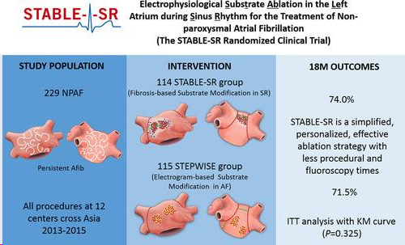

STABLE-SR术式即“南京方法”（在环肺静脉隔离基础上，根据其基质进行个体化基质改良及碎裂电 位消融），相比于传统的步进式消融策略，STABLE-SR优化手术流程，缩短了手术时间，同时降低了 医源性房速的发生，让房颤治疗向前迈进了一大步

### STABLE-SR II研究——南京方法

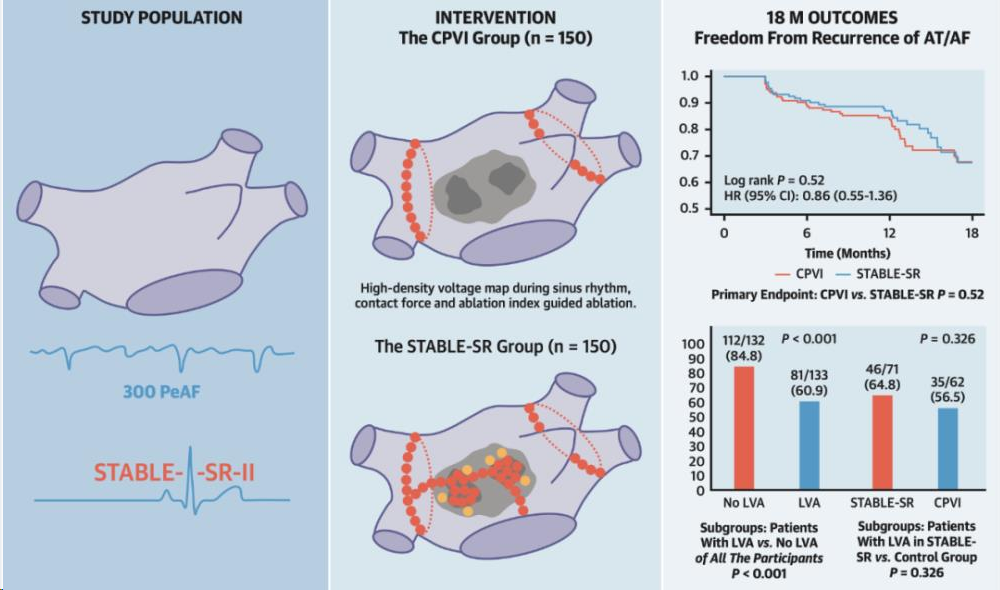

STABLE-SR II研究比较了STABLE-SR术式与单纯肺静脉隔离的临床结局，尽管18个月的随访结果并没有 显示两组之间在房颤复发率之间的差异(67.2% vs. 67.4%，HR 0.89, 95% CI 0.55-1.36，p=0.521)，但表 现出改善的趋势。

## 顶部线消融操作

**顶部线解剖位置**

房顶部线的定义为：房顶部是指两上肺静脉之间的区域，房顶线是指两上肺静脉之间的连线，该线尽可能地靠近左心房最顶端。

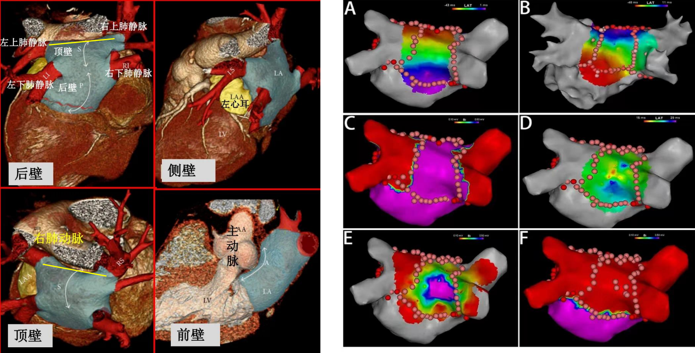

**操作建议**

::: danger 操作方法
1. 若房顶线短于3cm时，可采用花瓣后旋法完成顶部消融，即右上肺前庭消融时充分逆转鞘管，左上肺前庭消融时充分顺转鞘管，使花瓣充分贴靠后壁，完成后壁消融。
2. 若房顶线长于3cm时，可采用花瓣后旋法+网篮侧贴法完成顶部消融。即完成上述花瓣后旋操作后，辅助下列操作：
   1. 将导丝送人LSPV，导管调整成网篮状，借助鞘管使导管的部分杆身侧贴房顶。
   2. 将导丝送人RSPV，导管调整成网篮状，借助鞘管使导管的部分杆身侧贴房顶。
   3. 通过鞘管打弯or松弯、前送or后退来调整导管在顶部的不同位置。

消融策略：根据导管的形态决定消融参数
:::

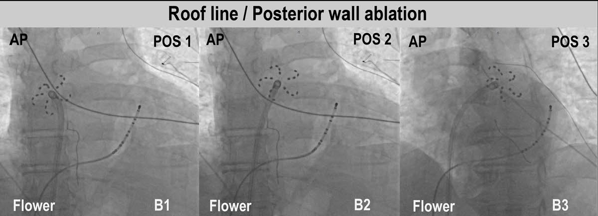

::: info faraware建议
在导丝位于上肺静脉后，首先将导管呈花瓣状放置，并将可操控鞘管旋转至后壁，进行锚定消融。然后，在导丝回撤至导管内的情况下，以花瓣状重叠消融覆盖左上肺静脉（LSPV）和右上肺静脉（RSPV）锚定病灶之间的剩余距离（图 2）。一次消融包括四次花瓣状消融，在完成前两次消融后将装置旋转30°–40°以实现环周覆盖。在后壁更下方的位置，以相同方式进行另一组消融，以完成左肺静脉后壁（LAPW）隔离（图 1）。通过三维电解剖标测（3D-EAM）确认LAPW已完全隔离，后壁上无残留信号。如果仍有残留信号，则重复脉冲场消融（PFA）直至LAPW完全隔离[^2]。
:::

**顶部线验证：**

。。。

## 二尖瓣峡部线

二尖瓣峡部定位：经典的二尖瓣峡部线是指左前斜（LAO45°）时二尖瓣环3-4点钟区域至左下肺静脉前庭之间的连线。

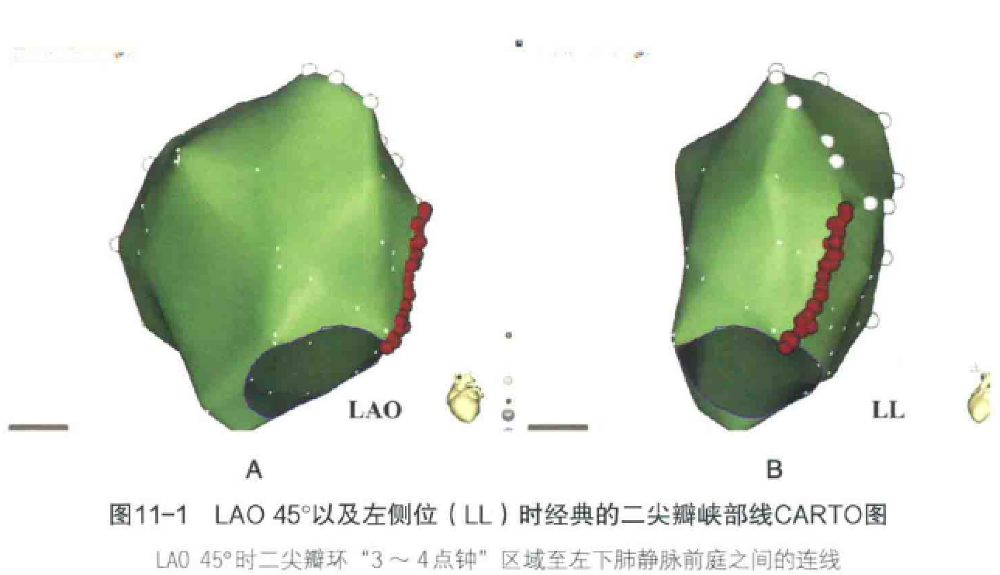

**操作方法：**
::: danger 操作方法
1. 根据DSA影像和CS电极可确定二尖瓣峡部的位置，必要时可造影或辅助三维
2. 将导管打成花瓣形状，导丝送入左下肺，向下打弯直至看到大V，回撤导丝保留软端在导管头部，缓慢松弯至小V大A，使用2000V电压依次松弯开始消融，每个位置2次。
3. 通过松弯鞘管从心室侧消融至左下肺前庭（无电位处）完成二峡线消融。

根据二峡线长度确认消融几个位置，每个位置两次。

**并发症预防：**
1. 消融位置不宜过高，避免出现冠脉痉挛。为避免CTI消融期间冠状动脉痉挛，建议采取预防性硝化甘油治疗方案：
    + 国外版本：首次PFA施用前1分钟注射3毫克，病灶形成前每2分钟追加2毫克。18静脉内升压药（如苯肾上腺素）的同时给药有助于避免低血压[^3]。
    + 国内版本：给药时机：消融开始前 1-2 分钟给予硝酸甘油。给药方式与剂量：静脉推注：0.25 mg～0.5 mg；或冠脉内注射：0.2 mg（需经导管到位后给药）。循环支持：若出现血压下降（收缩压<90 mmHg），可联合去甲肾上腺素维持灌注压力。

2. 靠近二尖瓣时，应随时注意电位，避免出现大V波消融，图[^4]。
3. 消融前应准备好除颤贴片。如出现导管滑落到心室放电，出现室颤及时进行除颤。

:::

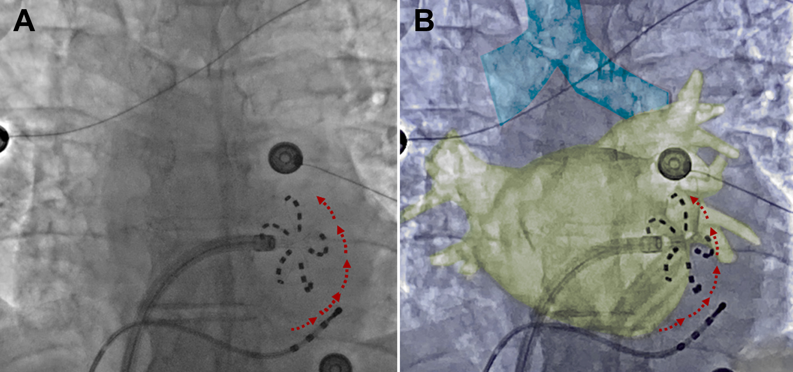

 图：（A）左前斜30°视角;（B）左侧斜视30°视角，配合计算机断层重建。五针管法拉波导管位于二尖瓣动脉，处于花式。红色箭头代表在冠状窦与左下肺静脉之间消融过程中导管的不同位置。

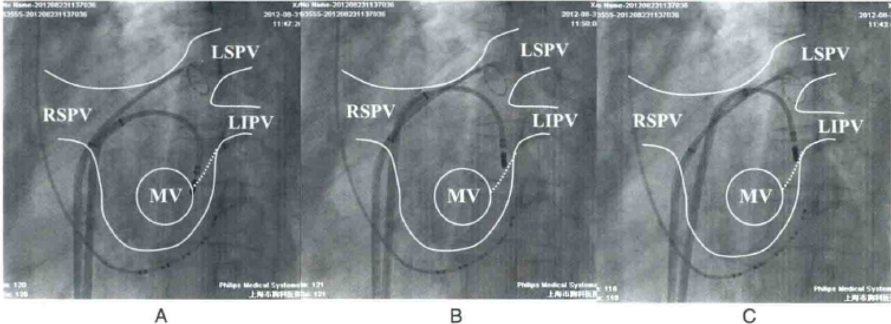

 图：以LAO45°体位消融二尖瓣峡部经典线时X线下的导管形态。A.导管先以90°~180°弯度弓行贴靠于起点处（LAO45°时二尖瓣环3~4点钟区域）；导管应适当松弯，保持鞘管和导管同轴且鞘管高度不变，使导管逐渐松弯且保持顺时针的力量逐渐回撤至图B、C，消融终点左下肺静脉前下壁。

验证方法   

::: warning 验证方法1：
方法一[^5]：

将PV放置于左心耳处，PV导管和CS分别位于二尖瓣峡部消融线两侧，分别起搏CS近端和远端，测量CS电极近端和远端到PV导管的电位传导时间。

二尖瓣峡部未阻滞时，CS远端至左心耳的传导时间短于CS近端至左心耳的传导时间；

如果CS远端至左心耳的传导时间长于CS近端至左心耳的传到时间，则说明二尖瓣峡部阻滞。

起搏左心耳时，如果CS的激动顺序由近端传向远端，则说明二尖瓣峡部线阻滞。反之，则说明二尖瓣峡部线未阻滞。

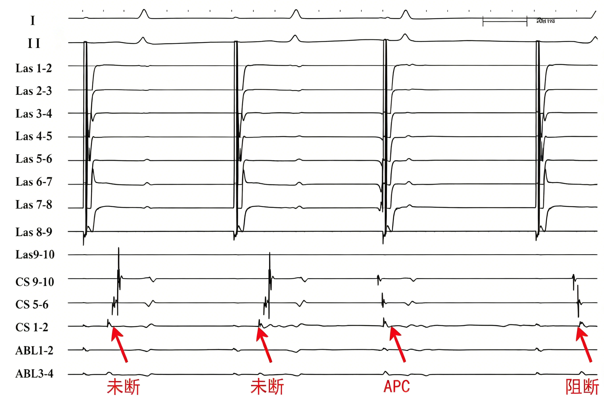

 图：LASSO位于左心耳内并起搏，可见两次起搏CS的激动顺序为CS12领先，说明左心耳激动顺序优先传导至CS12，二尖瓣峡部线未阻断。随着消融过程延长冠状窦激动顺序变为CS90领先，说明左心耳激动顺序优先传导至CS90，二尖瓣峡部线阻断。

:::

::: warning 验证方法2：
方法二[^6]：

导管于左心房后下壁取两点，一点距二尖瓣峡部线较劲（A点），另一点较A点距二尖瓣峡部线远（B点），分别于A、B两点起搏导管远端，测量A、B两点到左心耳的电位传导时间。未行二尖瓣峡部消融时，A点距左心耳较近，因此A点至左心耳的传导时间短于B点至左心耳的传导时间；而二尖瓣峡部线阻滞后，A点的刺激信号无法直接通过二尖瓣峡部传导至左心耳，而只能通过房顶部或间隔部传导至左心耳，因此A点至左心耳的传导时间长于B点至左心耳的传导时间。

同样原理。起搏左心耳，如果左心耳的刺激信号至A点的传导时间长于左心耳至B点的传导时间，说明二尖瓣峡部线阻滞。如果两种情况均存在，说明二尖瓣峡部线双向阻滞。

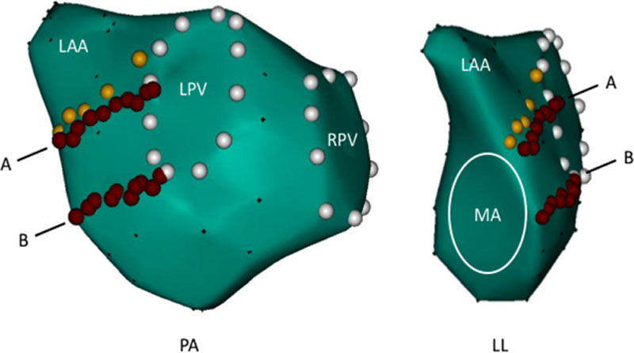

 图：左心房解剖图（Carto 3；Biosense Webster）的后前位 (PA) 和左侧位 (LL) 视图。图中用白点标记同侧右肺静脉 (RPV) 和左肺静脉 (LPV) 的开口。黄点指示通过选择性血管造影（如图 1所示）显示的左心耳 (LAA) 后基底部。红点标示了二尖瓣峡部线的两种潜在设计。上外侧二尖瓣峡部线 (MIL) (A) 是通过在 LAA 开口后基底部下方绘制一条水平线性病灶，将围绕同侧左肺静脉 (PV) 的宽环形病灶的前上部与二尖瓣后环连接起来而形成的。线 B 是传统的 MIL 设计，连接左下肺静脉与二尖瓣环。

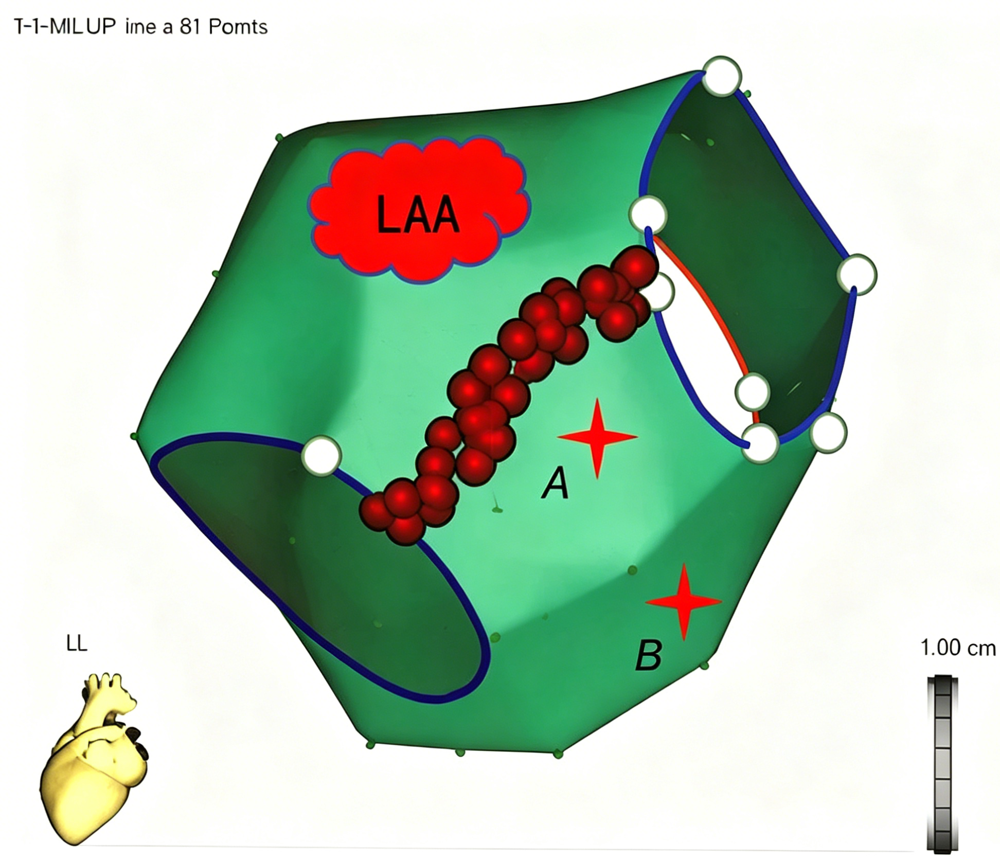

 图：导管于左心房后下壁取两点，一点距二尖瓣峡部线较近(A点);另一点较A点距二尖瓣峡部线部线远(B点)，分别于A、B两点起搏导管远端，测量A、B两点距左心耳的电位传导时间

:::

**CASE1：**

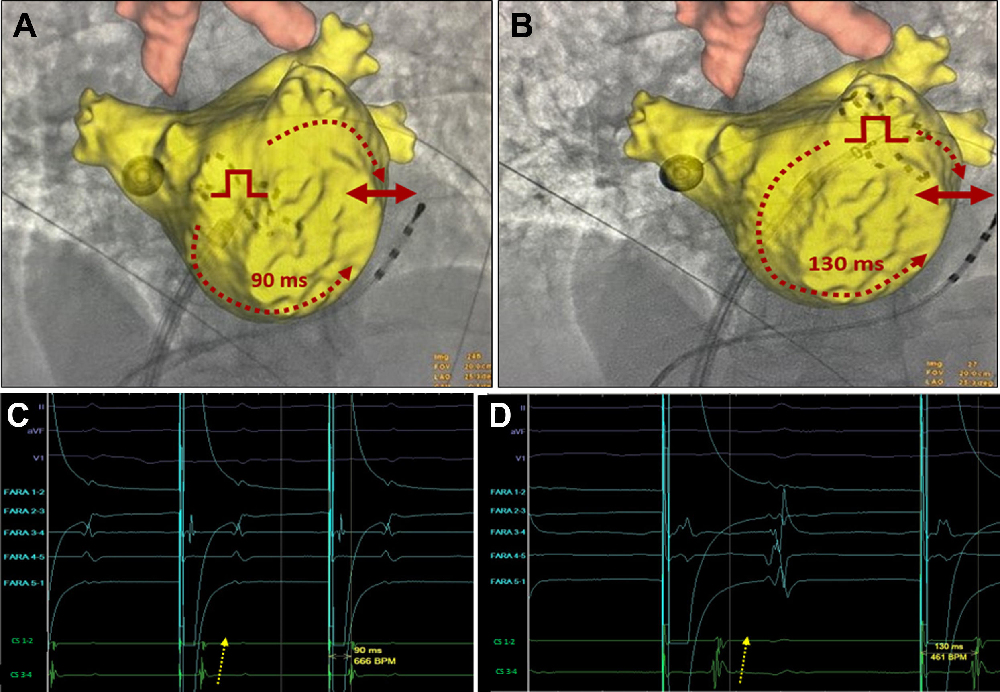

 图：（A）前壁起搏时的前后视图及计算机断层重建。（B）左肢起搏时的前后视图及计算机断层重建。（C，D）在差速起搏时，离心激活进入冠状窦，两位置相差40毫秒，确认完全阻滞。CS 1-2 = 远端冠状窦;CS 3-4 = 近端冠状动脉窦。

**Case2：Marshall 静脉酒精消融[^9]**

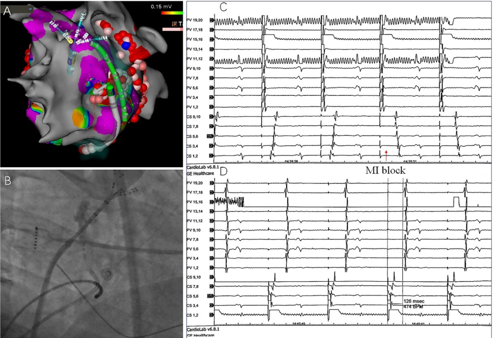

 Marshall静脉酒精消融：（A）心外膜和心内膜消融后，二尖瓣峡部（MI）未被阻滞（B）进行EIVOM消融时DSA图（C）在EIVOM期间，LAA持续起搏，最开始CS的激动顺序从CS远端（CS12）到CS近端（CS90）。当MI被阻滞时，CS激动顺序从CS近端到CS远端；（D）通过起搏冠状窦远端证实了MI阻滞，导管位于左心耳，左心耳的激动晚于冠状窦近端

## 三尖瓣峡部线（CTI）

**三峡线定位：**
三尖瓣峡部是指三尖瓣环与下腔静脉之间的狭长区域。三尖瓣峡部线起点位于三尖瓣环6点附近，消融导管局部点位显示为“小A大V”。
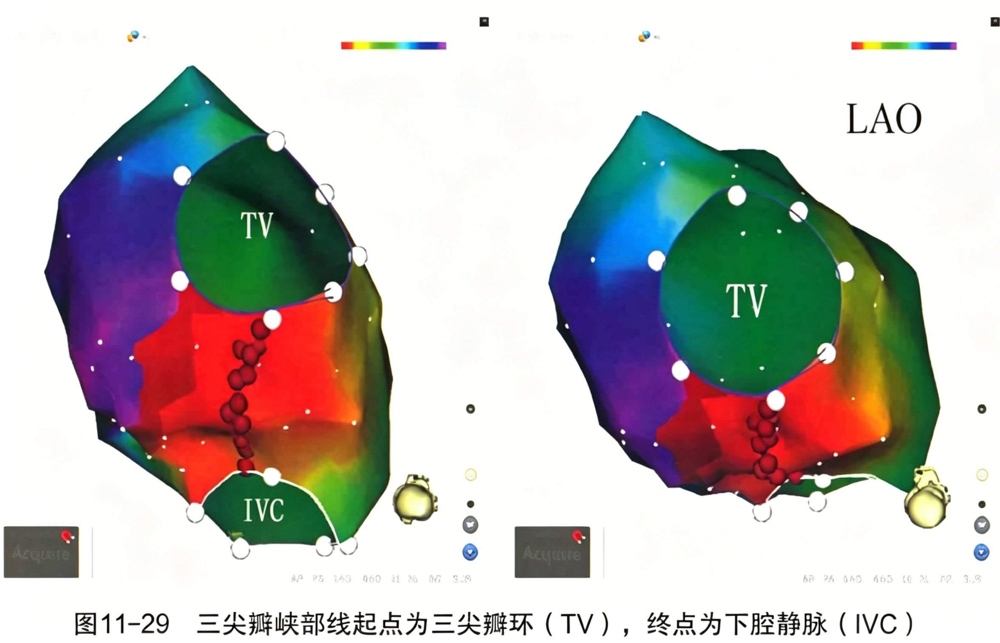

**消融策略：**
1. 根据DSA影像和CS \& RV 电极可确定三尖瓣及下腔的位置，可用三维标测辅助
3. 将导丝送入到右心室，导管根据电位及影像情况送至三尖瓣（避免出现大V波放电），理想情况下为观察到电位出现小V波时，略微回撤导管，此时为理想放电位置。原因为记录电位为2-3电极，放电电极为123电极。如果电位记录到V波，那么1号电极此时可能会位于心室。
3. 调整导管形态至网篮形态、鞘管打弯保证贴靠；消融完一个位置后，回撤导管消融至下腔。
4. 根据三峡线长度确认消融几个位置，每个位置两次，PI800。

**并发症预防：**

1. 消融前给与硝酸甘油，避免出现一过性冠脉痉挛：
> 对于 CTI 依赖性和二尖瓣环周围心房扑动，在心房扑动消融前预防性静脉给予硝酸甘油以降低冠状动脉血管痉挛的风险。硝酸甘油给药方案包括：靠近二尖瓣或三尖瓣环时静脉给予 3 mg，等待 2 分钟后进行 PFA放电，这为 PFA 放电提供了 2 到 3 分钟的时间窗。根据需要，可额外给予最多 3 次单独的 2 mg 剂量，并遵循类似的等待时间（2 分钟）和 PFA 放电时间窗（2-3 分钟）。为预防低血压而预先使用血管升压药由术者和麻醉团队决定。
2. 消融位置应位于三尖瓣环6-7点钟方向至下腔；靠近游离壁侧有可能会出现冠脉痉挛；靠近间隔可能距离传导系统过近。

**三尖瓣峡部线验证[^7]：**

::: warning 验证方法1：

LAO体位下，将导管放在阻滞线的游离侧，且紧贴阻滞线。起搏CS90电极，测量CP导管上电位距离。反过来，起搏导管，测量CS90到导管的电位距离。一般认为双向大于120 ms为阻滞。

**Case:**

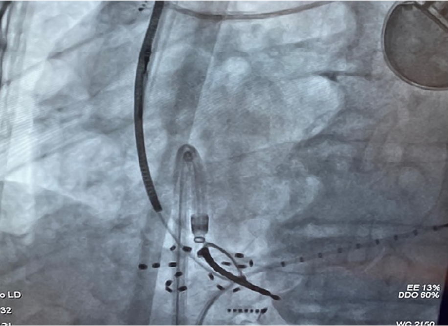

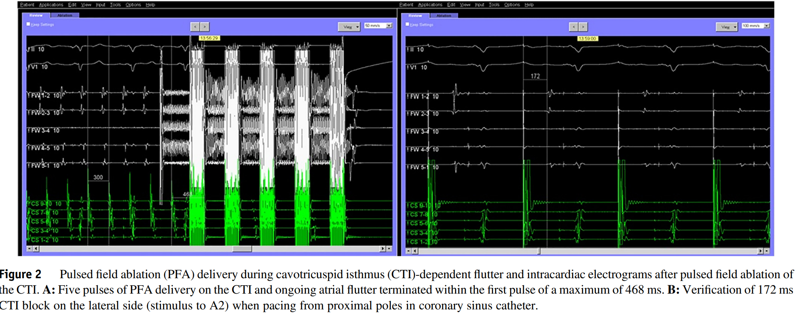

对CTI进行5次PFA消融，房扑在第一个脉冲内终止，持续时间最长为468 ms。通过起搏CS 90验证CTI阻滞，CS90到导管A2电极的时间为172 ms。

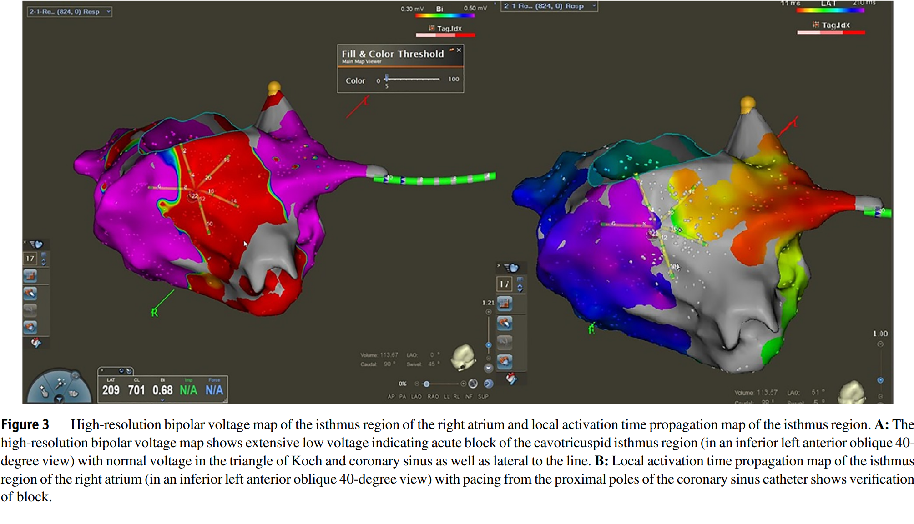

:::

::: warning 验证方法2：

应用导管在三尖瓣峡部线的游离壁侧取两点，一点距离峡部线较近（A点），位置偏低；另一点距峡部线较高（B点），分别在A、B两点起搏导管远端，测量A、B两点距冠状窦口（CS90）的电位传导时间，未行CTI时，A点距离冠状窦口较近，因此A点至CS90的传导时间短于B点至CS90的传导时间；当CTI阻滞后，A点的刺激信号无法直接通过三尖瓣峡部传导至冠状窦口，而只能通过游离壁传导至右房上部，再经间膈部传导至冠状窦口，因此A点至CS90的时间长于B点至CS90的时间。同样，起搏CS90，如果CS90到A点的传导时间长于左心耳至B点的传导时间，说明三尖瓣峡部阻滞。如果以上两种情况都存在，说明三尖瓣峡部双向阻滞。

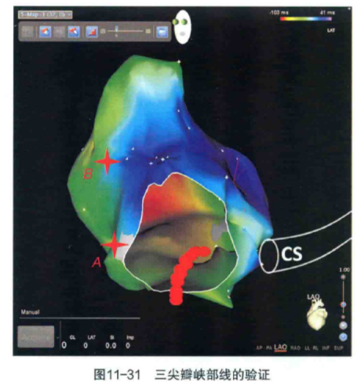

:::

## 上腔消融操作

**上腔定位：**

1. 通过上腔造影，判断上腔与右房交界处；
2. 通过电位判断，上腔与右房交界处的电位是双电位；
3. 花瓣变形定位发，将导管打成花瓣状后从心房侧送向上腔，当花瓣出现形变时，可定位出上腔与右房的交界处；
4. 参考RSPV造影

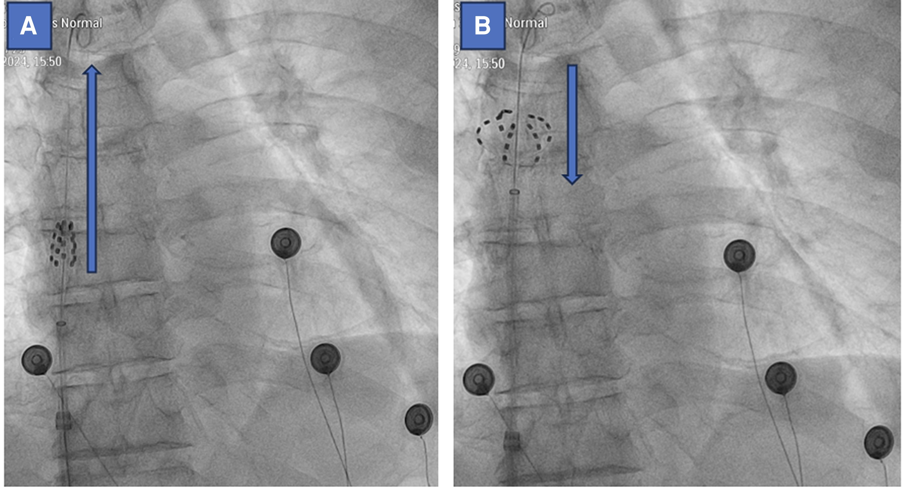
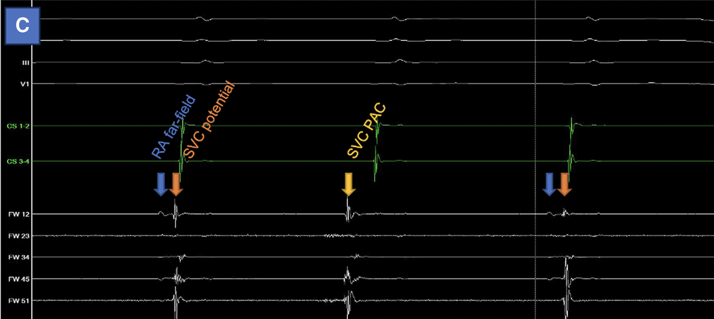
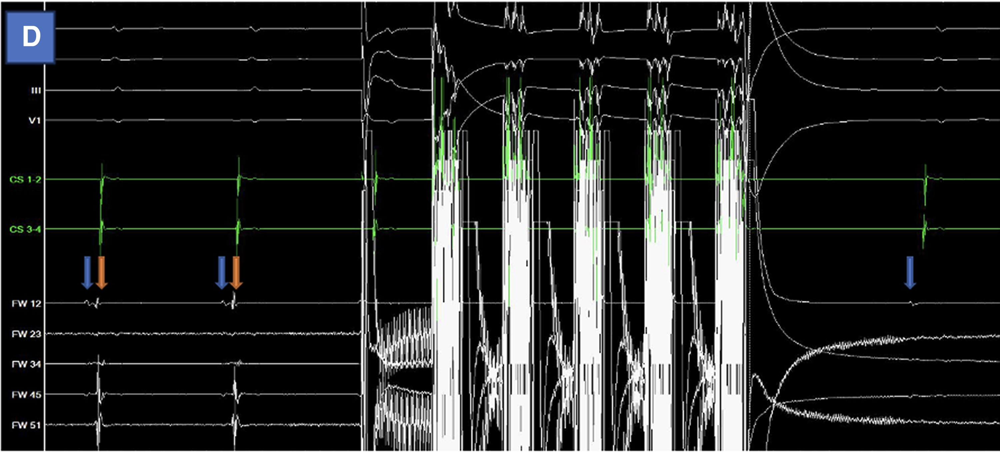

将导管放置再SVC内，缓慢向SVC推。此时可明显看到RA远场电位和SVC近场电位、和SVC的PAC早搏电位，使用PFA后SVC电位消失[^8]。

**消融策略：“**

$2 \times 2$，即消融两个位置（相差30°），每个位置消融两次，设置PI 750

**并发症预防：**

1. 膈神经损伤，以网篮状消融，调整电极恰好接触官腔，避免电极贴靠太紧、挤压管壁
2. 窦房结损伤，三维标测判断窦房结位置，再窦房结上方约2cm消融。二维下，建议上腔和右房交界处（即窦房结所在位置）以上约2/3个锥体处进行消融。

迷走神经反应定义：在脉冲电场施加期间或紧接发生窦性心动过缓（<40 bpm）、心脏停搏或房室阻滞的情况下，已确认手术内迷走神经反应。确定了迷走神经反应的频率和最大停顿时长（即最大RR间隔）。临时备份配速根据操作员的偏好执行[^1]。

[^1]: DEL MONTE A, DELLA ROCCA D G, PANNONE L, 等. Pulsed field ablation of the right superior pulmonary vein prevents vagal responses via anterior right ganglionated plexus modulation[J/OL]. Heart Rhythm, 2024, 21(6): 780-787[2025-11-24]. DOI:10.1016/j.hrthm.2024.01.040.
[^2]: Kueffer T, Seiler J, Madaffari A, 等. Pulsed-field ablation for the treatment of left atrial reentry tachycardia. J Interv Card Electrophysiol, 2023, 66(6): 1431～1440
[^3]: REDDY V Y, GERSTENFELD E P, SCHMIDT B, 等. Pulsed Field Ablation of Persistent Atrial Fibrillation With Continuous Electrocardiographic Monitoring Follow-Up: ADVANTAGE AF Phase 2[J/OL]. Circulation, 2025, 152(1): 27-40[2026-04-17]. DOI:10.1161/circulationaha.125.074485.
[^4]: LA FAZIA V M, MOHANTY S, GIANNI C, 等. Feasibility and Safety of Pulsed Field Ablation for Coronary Sinus and Left Atrial Appendage Isolation and Mitral Isthmus Ablation: Acute and Chronic Findings[J/OL]. Circulation. Arrhythmia and electrophysiology, 2025, 18(9)
[^5]: Miyazaki, S., Shah, A. J., Liu, X., Jadidi, A., Nault, I., Wright, M., … & Haïssaguerre, M. (2011). Preprocedural Clinical Parameters Determining Perimitral Conduction Time During Mitral Isthmus Line Ablation. Circulation Arrhythmia and Electrophysiology, 4(3), 287-294
[^6]: MAURER T, METZNER A, HO S Y, 等. Catheter Ablation of the Superolateral Mitral Isthmus Line[J/OL]. Circulation: Arrhythmia and Electrophysiology, 2017, 10(10)[2026-04-19]. DOI:10.1161/circep.117.005191.
[^7]: Notaristefano F, Zingarini G, Cavallini C, 等. Typical Atrial Flutter Mapping and Ablation. Cardiac Electrophysiology Clinics, 2022, 14(3): 459～469
[^8]: Ollitrault P, Chaumont C, Font J, 等. Superior vena cava isolation using a pentaspline pulsed-field ablation catheter: feasibility and safety in patients undergoing atrial fibrillation catheter ablation. Europace, 2024, 26(7)
[^9]: Sun Y, Dai S, Xiao X, 等. Tailored bi-atrial linear ablation guided by electrophysiological mapping for persistent atrial fibrillation. BMC Cardiovasc Disord, 2024, 24(1): 658