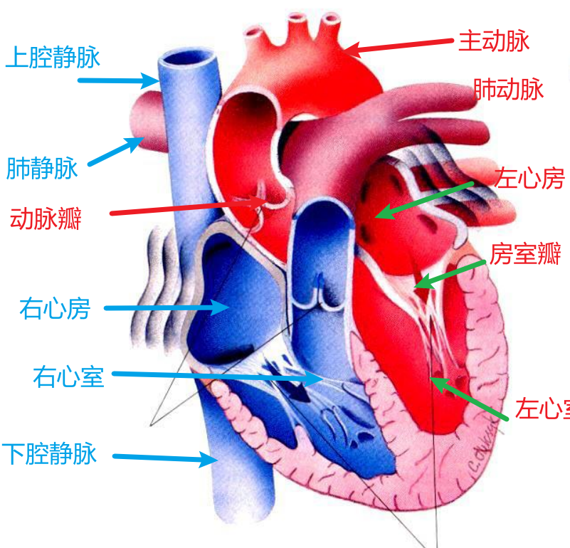
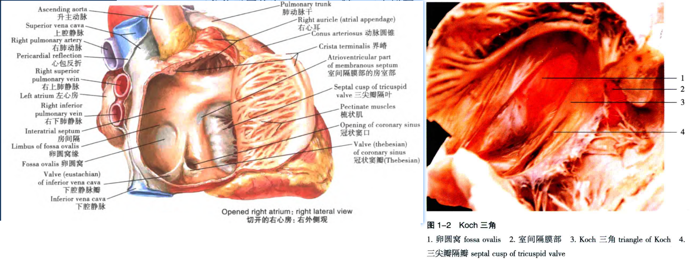
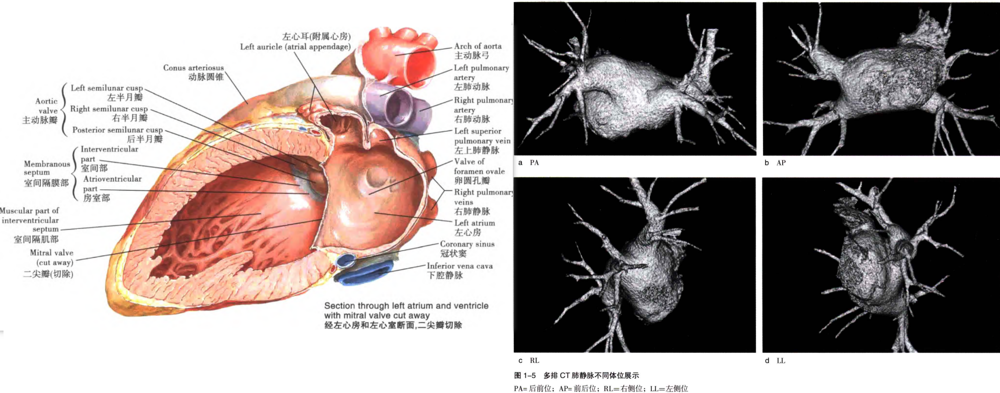
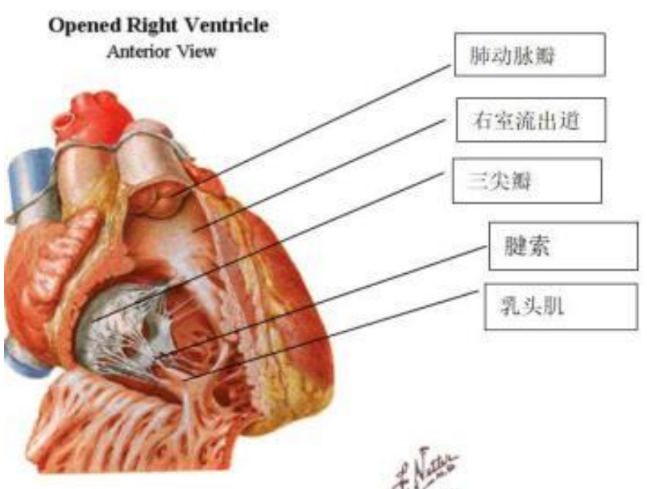
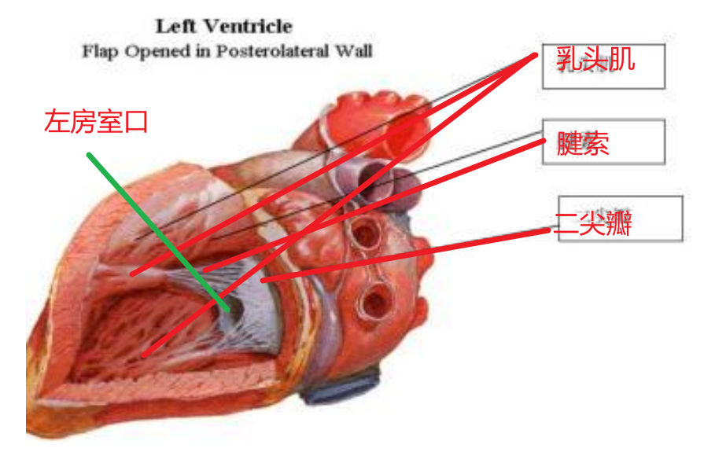
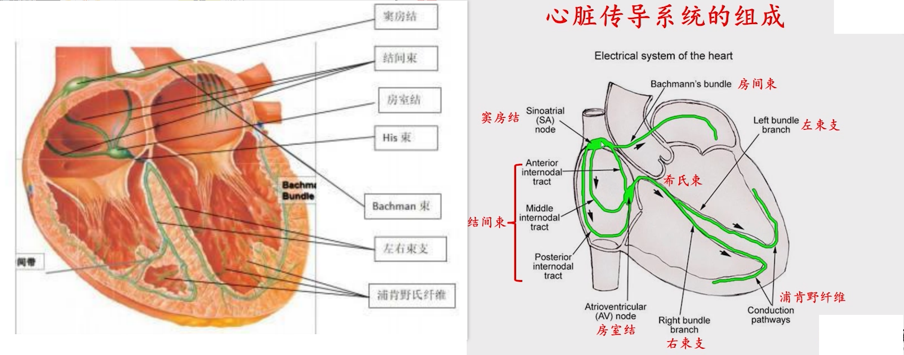
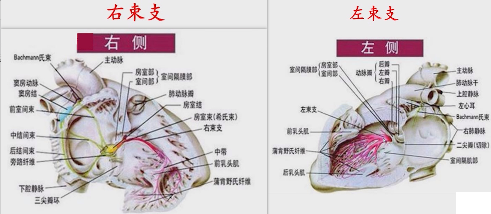
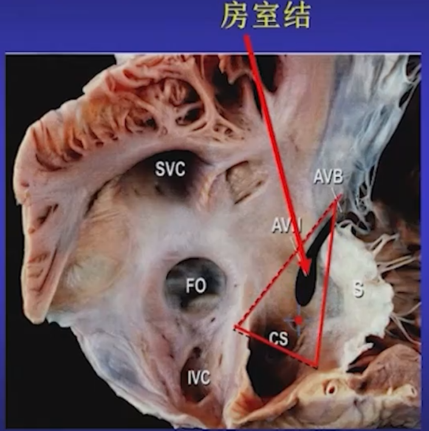
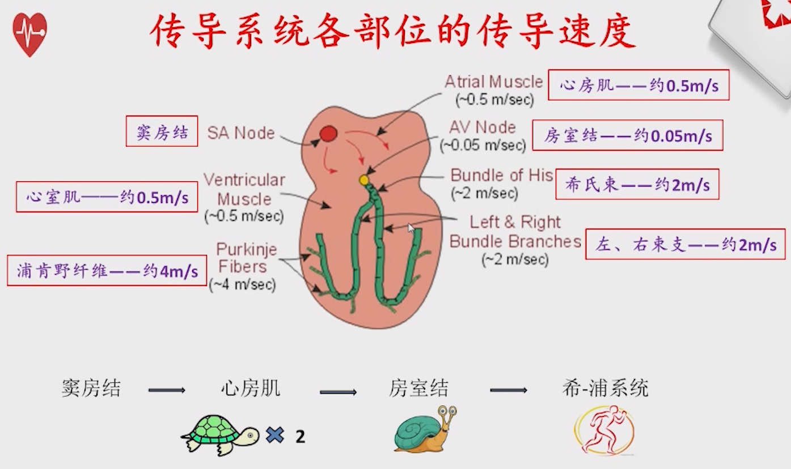

<!-- 心脏解剖 -->

# 心脏解剖
---

## 1. 循环系统

> 心血管系统是由心脏、血管、毛细血管及血液组成的一个封闭的运输系统，具 有运输功能、调节功能和保护功能。人体的循环系统由体循环和肺循环两部分组成。

* 体循环：<kbd>左心室</kbd> $\rightarrow$ <kbd>主动脉</kbd> $\rightarrow$ <kbd>各级动脉</kbd> $\rightarrow$ <kbd>全身毛细血管</kbd> $\rightarrow$ <kbd>各级静脉</kbd> $\rightarrow$ <kbd>上下腔静脉</kbd> $\rightarrow$ <kbd>右心房</kbd> $\rightarrow$ <kbd>右心室</kbd>

* 肺循环：<kbd>右心室</kbd> $\rightarrow$ <kbd>肺动脉</kbd> $\rightarrow$ <kbd>肺泡周围的毛细血管网</kbd> $\rightarrow$ <kbd>肺静脉</kbd> $\rightarrow$ <kbd>左心房</kbd>

+ 与心脏相连的大血管

+ 

---

## 2.右心房

上腔静脉(Superior vena cava, SVC) 、下腔静脉(Inferiorvena cava, IVC)和冠状窦(coronarius sinus, CS)静脉血进入右心房，经三尖瓣送入右心室(RV)。

---

## 3. 左心房

左心房由心房窦（固有房腔）和左心耳构成。左心房后方两侧分别有左上、左下、右上和右下肺静脉开口，分别称上腔静脉窦，下腔静脉窦，冠静脉窦和中间静脉窦。二尖瓣环位于左心房前下壁。左心房后壁除了肺静脉开口外，无其他特殊结构，后壁平坦。

肺静脉存在有窦房结样细胞，并可作为正常心脏的潜在起搏点。肺静脉粗大者易成为房颤的罪犯静脉，上肺静脉心肌袖较下肺静脉发育好，可以解释大多数诱发房颤的早搏来源于**上肺静脉**。

---
## 4. 右心室

+　构成
   + 游离壁
   + 室间隔
   + 心尖部
   + <kbd>右室流入道</kbd> 
   + <kbd>右室流出道</kbd> 

## 5.左心室

# 2. 传导系统
冲动在窦房结形成后经节间束（Backman 束）、房室结、His 束、左右束支和浦肯野纤维网，最终抵达心 室并使之激动。

Koch三角底部冠状静脉窦，前面三尖瓣环，界脊、欧氏脊组成后面，上段是房室结快径，koch三角和三尖瓣环连接部位是慢径部位，顶端是希氏束，希氏束分为左束支和右束支，左束支从房室结心房侧插入到主动脉瓣下（左束支），左束支分支丰富，右束支细长，最早激动点在右室侧壁。

## 房室结
位于Koch三角顶端

## 电生理特性
 + 自律性

+ 传导性

