<!-- 
| |心率整齐| 心律不齐 |
|--|--|--|
|范围| 正常、窦速、窦缓、室上速、束支阻滞、AMI、室肥、一或三度房室传导阻滞| 房性（房早、房颤）、室上速、室性（室早、室速、室颤）、二度房室传导阻滞 |
| 口诀 | 小三大五窦速缓，三五之间无异变。一度三度阻滞剂，缺血梗死ST。P波缺如室上速，心率整齐难不住。| 房早室早瞥一眼，室速室颤怪简单。房产P波月亮湾，二度阻滞不难看|
| |V1和V5，区分右和左。V1上为右，V5上为左。宽大是束支，高尖为室肥。| | -->

# 体表心电图

## 简介

常规心电图12导联体系：标准导联（双极肢体导联I、II、III）和单极导联（加压单极肢体导联（aVR、aVL、aVF）和胸壁导联（V1~V6））

> 标准导联（双极肢体导联）：以右下肢体电极作为电学参照可以消除不必要的噪音，这样就存在了3对电极。在每一对电极中，其中一个电极作为导联的阳极端，电流流向这个电极时被描记成向上的方向（正向），而流向另一个电极时则描记成相反的波形，即标准导联（双极肢体导联）。
> + I导联：左上肢（\+）与右上肢（\-）之间的电位差（LA\-RA），反应的是心脏高侧壁的电位变化
> + II导联：左下肢（\+）与右上肢（\-）之间的电位差（LL\-RA），反应的是心脏下壁的电位变化
> + III导联：左下肢（\+）与左上肢（\-）之间的电位差（LL\-LA），反应的是心脏下壁的电位变化

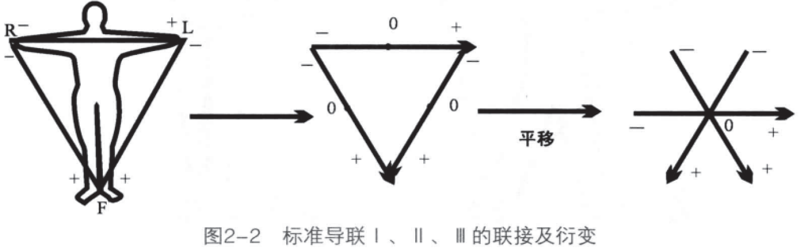

> 单极肢体导联
> + Wilson“中心电端”：把安在左上肢、右上肢与左下肢的电极连通，为了消除皮肤阻力的干扰，在没跟导线上各加上5000 Ω的电阻，中心电端电极（WCT）的电压接近为0。`WCT=(RA+LA+LL)/3`

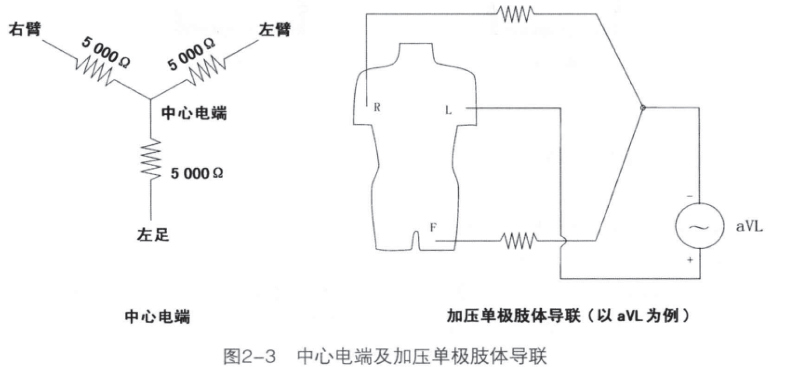

> 加压单极肢体导联：
> + aVR：探查电极-右手腕内侧，中心电端-左手腕+右下肢，反应心室腔内的电位变化
> + aVL：探查电极-左手腕内测，中心电端-右手腕+左下肢，心脏高侧壁的电位变化
> + aVF：探查电极-左下肢，中心电端-左手腕+右手腕，心脏下壁的电位变化

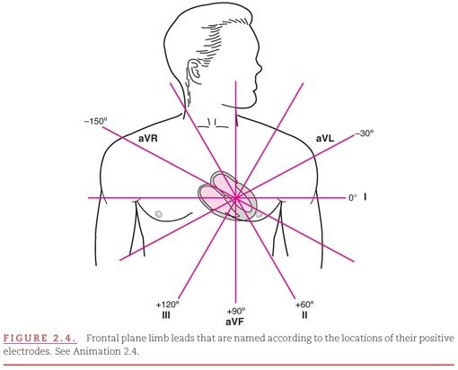

> 胸壁导联(单极)
> + 胸壁导联是一种单极导联，把探测电极放在胸前一定部位，这就是单极胸导联。这种导联方式离心脏很近，只隔着一层胸壁，因此心电图波形振幅很大。
> + 胸前导联测量的是各胸前电极与Wilson中心电端的电位差。
> + Wilson中心电端以肢体电极为基础计算出一个新的参照电位，等于RA、LA、LL电极电位的平均值，即WCT = (RA+LA+LL)/3。

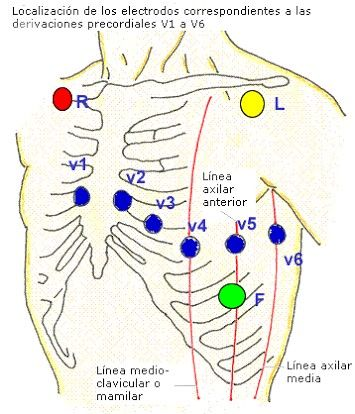

> + 胸壁导联所反映的心电活动，仅为前、后、左、右的一个横平面。

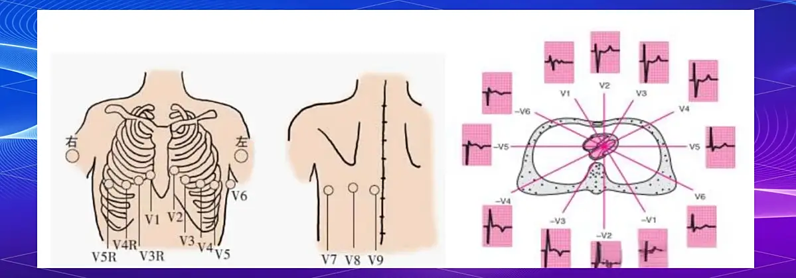

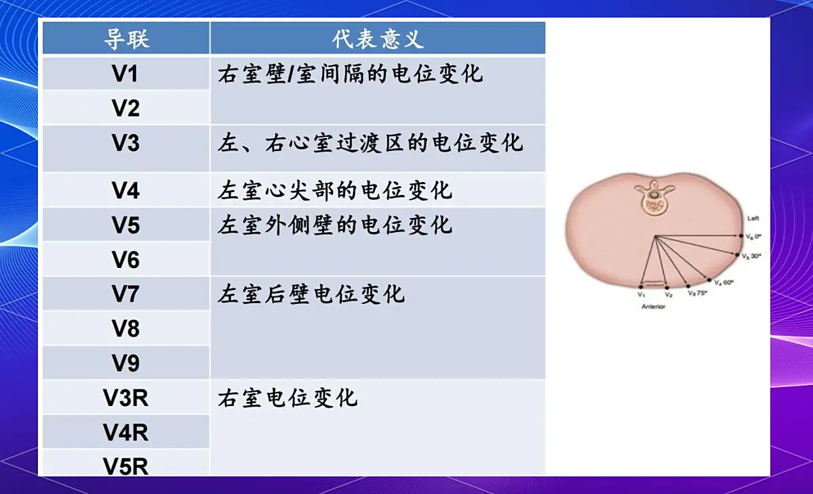

* **如果心脏激动方向朝向记录电极（+）在心电图上表现为正向波，若激动方向背离记录电极在心电图上表现为负向波**
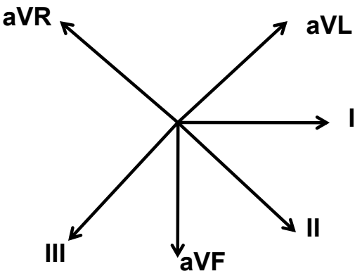

### 案例一

1. 如何诊断典型房扑

+ 下壁导联锯齿波（F波），前支缓，后支陡，没有等电位线，周长至少200ms（即标准描记走速的一个大格）
+ V1导联P波直立，V5/6导联P波负向
+ 如果下壁导联锯齿波（F波）不典型、V1和V5/6的形态学标准均不满足的话，大多数情况下亦为环三尖瓣环逆钟向运行的典型房扑（即心电图不典型的典型房扑）

## 心电向量图（VCG）的基本原理

> + 任何时刻的心脏电活动都可以用一个单一向量表示，其幅度和方向可以由一个从心脏的中心发出的箭头标明。
> + 该向量在每个心动周期的幅度和方向的变化可以被视为一个环，并且与ECG上的各个波对应
> + 分别形成P、QRS、T环

❗这是一个空间的立体结构 

**描记心电向量图的Feank系统：**

+ 共7个电极，3个导联，3个平面；
+ 身体前侧为正极，后侧为负极

| **导联**        |      **正极**      |      **负极**      |
| ------------- | :-----------: | ----: |
| X      | A（左腋中线第五肋间）+C | I：右腋中线第五肋间 |
| Y     |   F（左腿）+M（脊柱正中线第五肋间）    |   H：右后头颈部|
| Z |   A+C+E（前正中线第五肋间）+I    |   M：脊柱正中线第五肋间 |

| **平面**        |      **组成导联**      |
| ------------- | :-----------: |
| 额面（F） | X、Y轴 |
| 侧面（S） | Y、Z轴 |
| 横面（H） | X、Z轴 |
C：E、A之间相距45°

E：心电向量起点，三轴三面交点均在E点处

  

    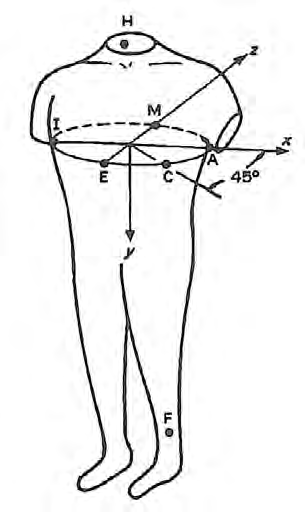
  

  

    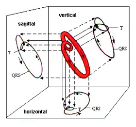
  

### 心脏各部位除极与心电图波形的关系

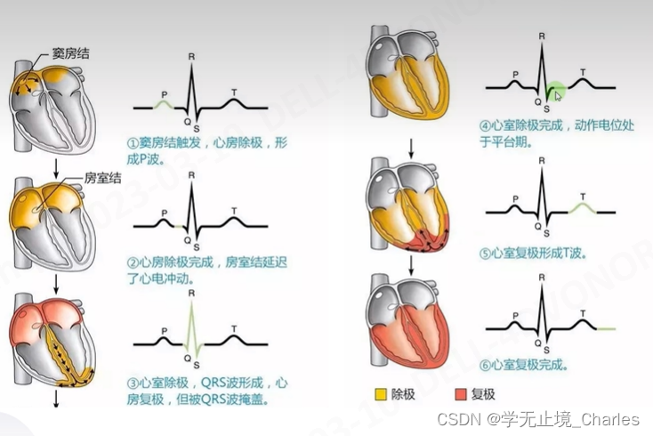

心脏的除极从窦房结开始，房室结通过心室，室间部和心尖部

### 心电向量投影于各导联后的波形

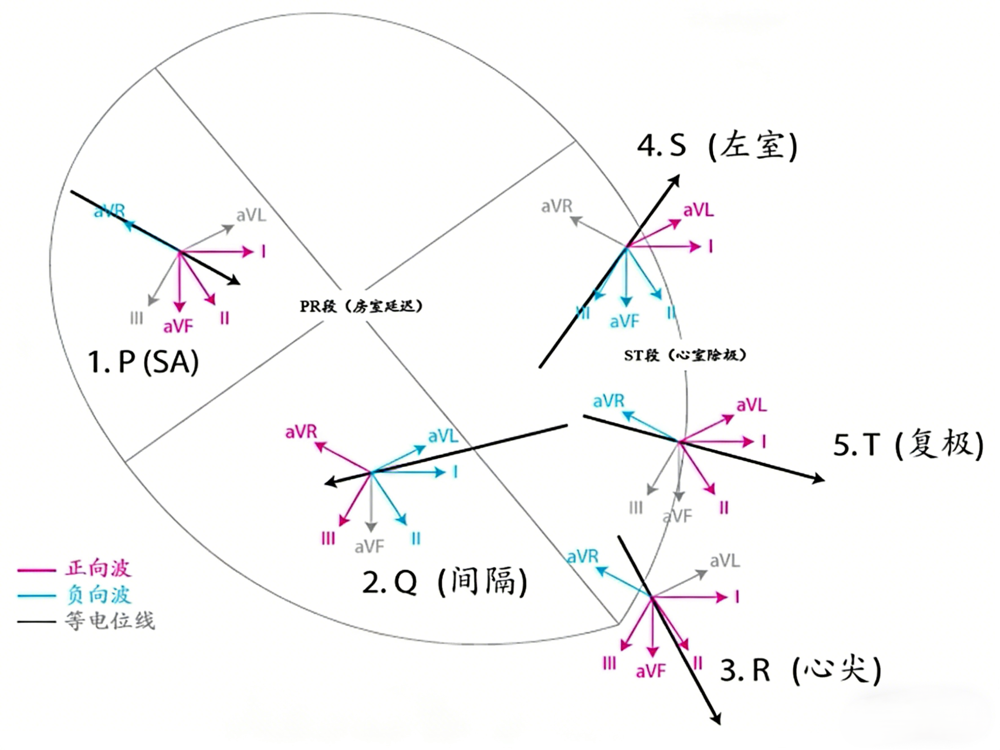

### P环（心房除极的向量环）的形成

+ 反应心房的除极
+ 方向：位于右心房的窦房结发出冲动，同时：
  1. 向下经节间束&rarr;房室结
  2. 向左：激动左心房。综合向量：右上&rarr;左下，基本与额面平行
+ 综合P向量：前一部分&rarr;右房除极 
  + 后一部分&rarr;左房除极
  + 中间部分&rarr;两个心房共同除极

心电图P波的形成机制

P波额面电轴正常范围在0-75°之间

I、II、aVF、V4-V6导联直立

aVL、III导联可直立或倒置

  

    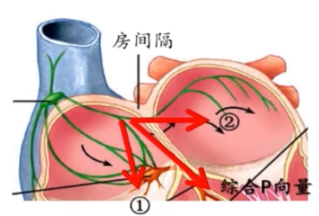
  

  

    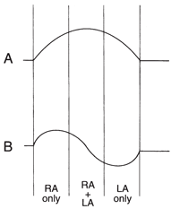
  

可以判断P波前期是来自于右房激动，P波后半段是右房的激动，P波中间段是左房和右房的共同激动

### QRS环（心室除极的向量环）的形成

+ 主要反应心室的除极活动
+ 心内膜&rarr;心外膜
+ 初始部：室间隔从左向右除极&rarr;右前方偏上。
+ 主体部：左室除极占优势，右、前、上&rarr;左、后、下
+ 终末部：心室和时间额后底部除极，指向右上方偏右，有时偏左

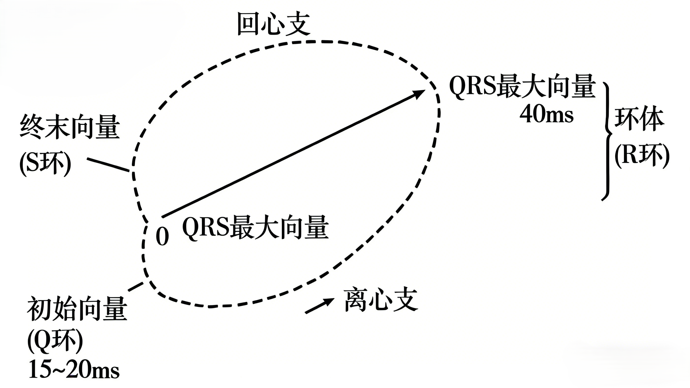

**QRS波的形成机制--Q波**

+ V1、V2、V3导联出现Q波为异常现象
+ 其余导联Q波很小--间隔Q波
+ III、aVR导联任何幅度的Q波均为正常
+ V5、V6导联导联无P波异常现象

**Q波异常：**
1. 心梗时局部梗死心肌不能除极，其余部分心肌除极产生的综合向量背离梗死部位，故形成心梗相关的Q波；
2. 心室肌肥大
3. 室内传导异常

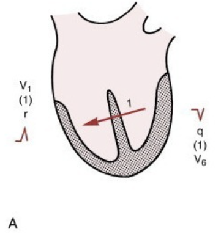

**QRS波的形成机制--R波**

+ 左室游离壁与右室除极
+ 右室室壁壁薄，左室室壁厚，故从V1到V4或V5导联R波幅度逐渐增加&rarr;R波幅度高低反映除极向量的大小，从而判断心室肥厚或左室心肌梗死。

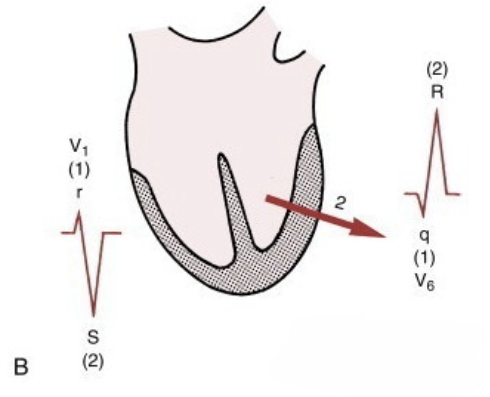

### **心室除极向量简化模型：**

心室除极可以简化为三个主要向量：
**向量一（间隔向量）**：
间隔除极（可产生间隔QS波）&rarr;向前、右

**向量二（左室向量）**

左右室同时除极，左室向量占优势，&rarr;向左、下、后

**向量三（基底向量）**

双侧心室基底部除极&rarr;向后、左、上
（可产生V1导联的r‘波形&rarr;室上嵴图形）

### 心室除极与肢体导联的QRS波形

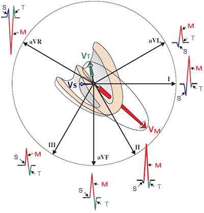

Vm正好来，会产生一个向上的R波，II导联就会出现一个R波，如果背离，就会出现一个一个Q波，比如aVL导联就会出现一个小Q波

深颜色可以看到心室除极的方向

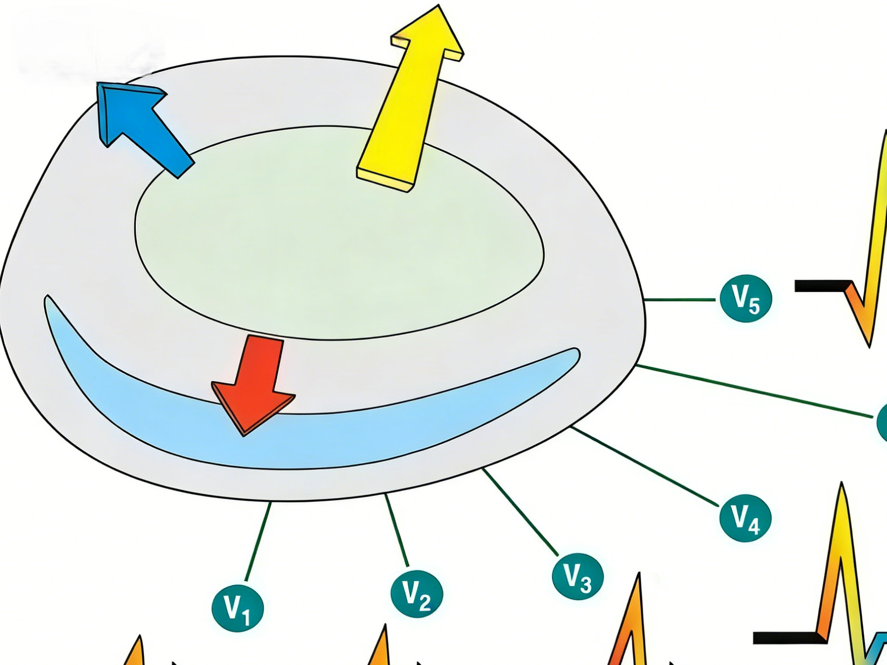

心室的除极和胸导联的关系，从横断面来看，右室像个月牙形，左心室像一个圆柱形，黄色的向量最长，代表左室游离壁的向量方向，所以V5、V6的R波更高。比如心室变厚，V5的R波就会更高。

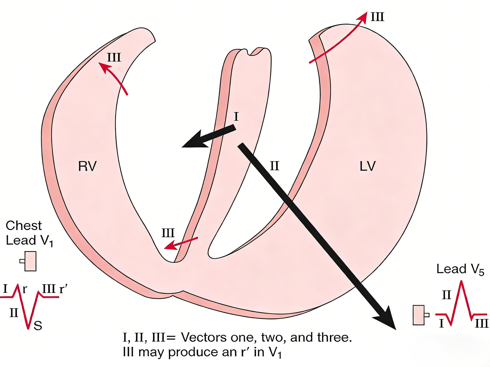

### QRS电轴：由QRS综合向量决定

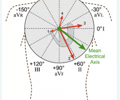

所有瞬时心电向量的综合被称为心电向量，平均心电向量的方向被称为平均心电轴。

> ①正常心电轴的范围0°～ + 90°,其中+ 30°～ + 90°电轴无偏移, + 30°～0°电轴轻度左偏;
> 
> ②电轴左偏0°～ - 90°,其中0°～ -30°为电轴中度左偏, - 30°～ - 90°电轴重度左偏;
> 
> ③电轴右偏+ 90°～ + 180°,其中+ 90°～ + 120°为电轴轻度右偏, + 120°～ + 180°电轴显著右偏;
> 
> ④电轴重度右偏+ 180°～ - 90°(图3) 。心电轴是评价心电图的一项重要指标,其中额面及水平面心电轴临床最常用,是心电图报告中的一项重要内容。

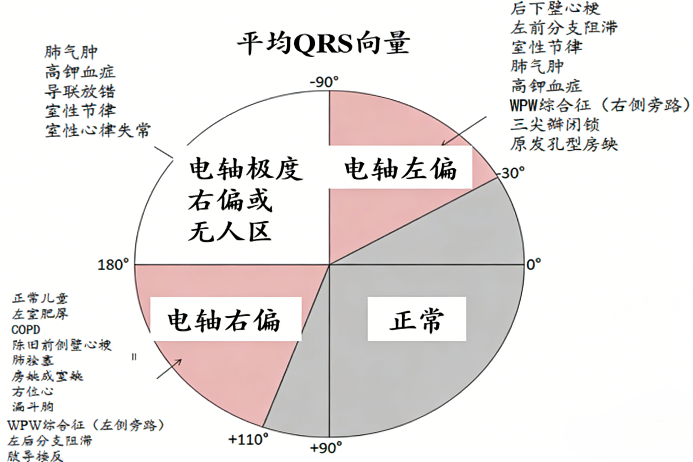

整个正常的心脏除极方向应该是往绿色方向走的，很难到无人区域，因此当朝向第四象限时，心脏往往是有问题，比如高钾血症。

### T环（心室复极向量环）的形成

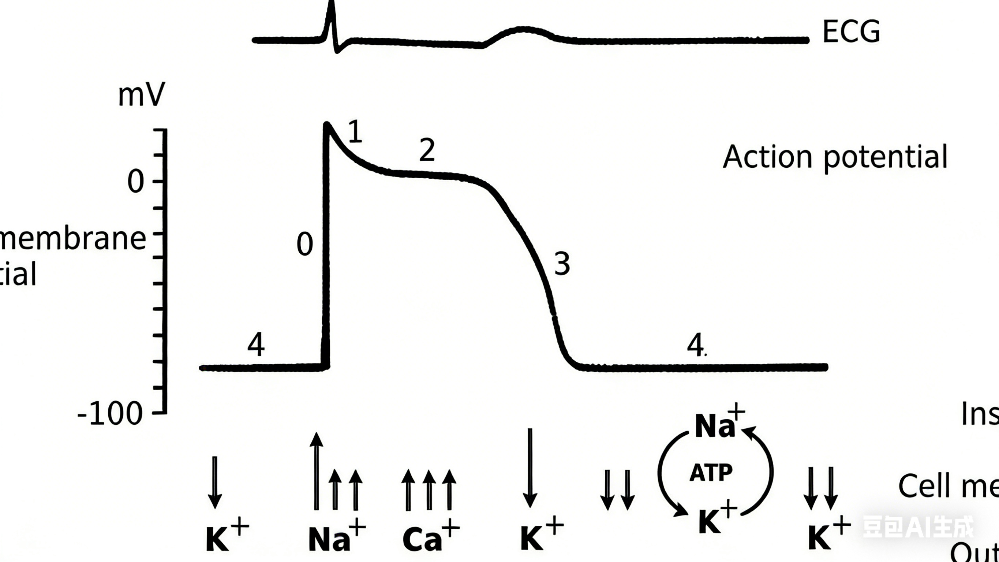

+ 心室复极相当于动作电位中的1-4相，但1相时间极短，2相平台期细胞内外电位差极小，临近细胞之间不形成电偶，故在 向量图上不产生向量环，相当于ECG的ST段

+ T环相当于3相，复极时由心外膜向心内膜进展的过程
+ 心室各部位对T波形成的影响：
  + 右心室：影响小（室壁薄，电位活动远不如左室明显）
  + 室间璧肌：左右两侧同时复极，电活动相互抵消
  + T环的产生主要是左心室壁肌从心外膜&rarr;内膜3相复极的过程

### QRS、T向量的空间位置关系

T环方向与QRS环大致一。但二者并不完全一致，存在QRS-T角

+ 额面：
  + T向量方向在一生中基本保持恒定
  + QRS向量由垂直指向转为水平指向，
  + 额面QRS-T角一般不超过45°
+ 水平面：
  + T向量在儿童中可指向后方，导致V5、V6导联出现负向波，逐渐指向V5导联正极方向
  + QRS向量逐渐转向正后方
  + 成人水平面QRS-T角一般不超过60。

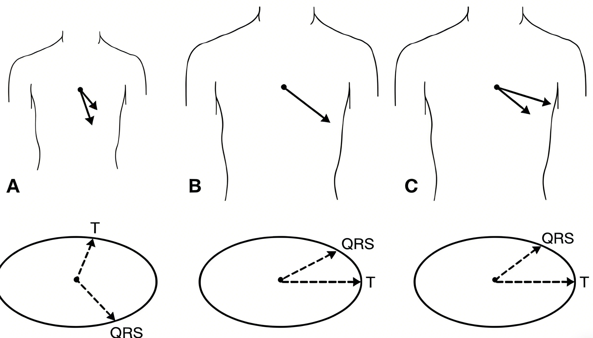

QRS向量和T向量夹角随年龄改变：A.正常儿童；B. 正常青年；C. 正常成年
 

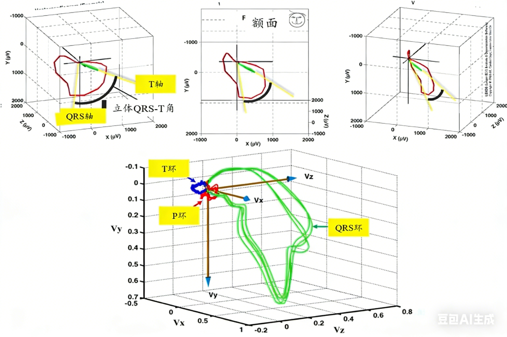

**临床意义：**

+ 空间QRS-T角可基本用额面QRS-T角近似简化
+ NHANCES III：QRS-T角增大，但无临床心脏病的个体全因死亡率以及未来14年内心血管的发病率显著均升高（全因死亡率多因素风险比1.30~1.87），心血管疾病的发病率多因素风险比1.82~2.21）

### 心电向量诊断心肌缺血、梗死（很少用）

**心电向量基础：梗死部位不能除极，其余心肌除极产生的综合向量背离梗死区域**

| 梗死部位 | 梗死向量方向 | 梗死瞬间向量及时限 | QRS环异常特点及发生面 | 梗死心电图发生导联 |
| :--- | :--- | :--- | :--- | :--- |
| 前间壁 | 左后 | 0.01~0.02s 蚀缺向前 | H面QRS环离心支凹面向前 | V1、V2、V3 |
| 前壁 | 向后 | 0.02~0.04s 蚀缺向前 | H面QRS环离心支凹面向前 | V2~V4 |
| 侧壁 | 右后 | 初段向右>22ms 向右力>0.16mV | H面QRS环离心支呈CW 顺逆“8”字形运行 | Ⅰ、aVL、V5~V6 |
| 前侧壁 | 右前 | 初段向右>22ms 向右力>0.16mV | F面QRS最大>40° 离心支移向回心支右后，顺逆“8”字形运行 | Ⅰ、aVL、V2~V4 |
| 广前壁 | 右后 | 0.01~0.06s | F面QRS呈CW运行，位右后，F面QRS呈CCW运行 | Ⅰ、aVL、V1~V6 |
| 后侧壁 | 右前 | 20ms 右前向量力>0.16mV | H面QRS呈CCW运行，F面QRS环CW运行，20° 指右下 | Ⅰ、aVL、V5~V6 |
| 纯后壁 | 向前 | — | 回心支及终末向量向前移，QRS环的50%~70%位X轴前50ms | Rv1,v2高宽 QRSv1,v2/R≥1 |
| 下壁 | 向上 | F面QRS呈CW运行，向上时限>25ms | F面QRS初始向上>0.2mV | QⅡ、Ⅲ、aVF |
| 下侧壁 | 右上前 | F面QRS环呈CW运行20~30ms 右上 | H面QRS环向右前>0.16mV | QⅡ、Ⅲ、aVF QⅠ、aVL |

**说明**：CW=顺时针，CCW=逆时针；H面=水平面，F面=额面

**心梗后的心电向量图形**

**心电向量诊断束支阻滞**

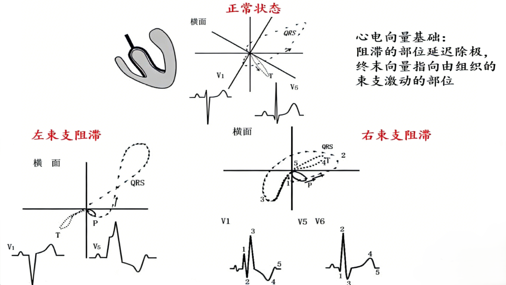

### 心脏形态异常时心电向量的改变
+ **心房肥大——P向量、P波异常：**
  为什么左房扩大时P波正负双向？

  开始时P波仍为向前，但左房扩大后出现向后向左的综合P向量，故V₁导联多见正负双向P波→**PtƒV₁**的重要性

+ **心室肥厚——QRS向量方向、幅度改变，QRS波异常**

  - **左室肥厚**：QRS环振幅增大、指向左后下、最大QRS向量延迟出现、横面QRS-T夹角增大、ST向量、T环改变

  - **右室肥厚**：主要是定性诊断，右室变化抵消左室向量，反而使QRS环较正常缩小

## 总结

1. 心电向量的形成
2. 心电向量的概念
3. 如何通过心电向量理解心电图波形
4. 如何应用心电向量解读异常心电图表现

### 思考？

::: details 为什么III导联的QRS波会出现q波可以是正常现象？什么情况下容易出现此种情况？临床上如何鉴别其是生理性还是病理性的？其机制又是如何？
？
:::

::: details 左心房和右心房、左心室和右心室在空间上大致是一个什么关系?这种解剖关系对P波及ORS波的综合向量有什么影响？
？
:::

::: details 举例来说，如果左房显著增大，那么P波综合向量会有何变化?心电图上的P波会有何特征？
？
:::