<!-- 
| |心率整齐| 心律不齐 |
|--|--|--|
|范围| 正常、窦速、窦缓、室上速、束支阻滞、AMI、室肥、一或三度房室传导阻滞| 房性（房早、房颤）、室上速、室性（室早、室速、室颤）、二度房室传导阻滞 |
| 口诀 | 小三大五窦速缓，三五之间无异变。一度三度阻滞剂，缺血梗死ST。P波缺如室上速，心率整齐难不住。| 房早室早瞥一眼，室速室颤怪简单。房产P波月亮湾，二度阻滞不难看|
| |V1和V5，区分右和左。V1上为右，V5上为左。宽大是束支，高尖为室肥。| 

刘兴鹏大夫心电图时间2.0版

| -->

## 体表心电图

### 简介

常规心电图12导联体系：标准导联（双极肢体导联I、II、III）和单极导联（加压单极肢体导联（aVR、aVL、aVF）和胸壁导联（V1~V6））

> 标准导联（双极肢体导联）：以右下肢体电极作为电学参照可以消除不必要的噪音，这样就存在了3对电极。在每一对电极中，其中一个电极作为导联的阳极端，电流流向这个电极时被描记成向上的方向（正向），而流向另一个电极时则描记成相反的波形，即标准导联（双极肢体导联）。
> + I导联：左上肢（\+）与右上肢（\-）之间的电位差（LA\-RA），反应的是心脏高侧壁的电位变化
> + II导联：左下肢（\+）与右上肢（\-）之间的电位差（LL\-RA），反应的是心脏下壁的电位变化
> + III导联：左下肢（\+）与左上肢（\-）之间的电位差（LL\-LA），反应的是心脏下壁的电位变化

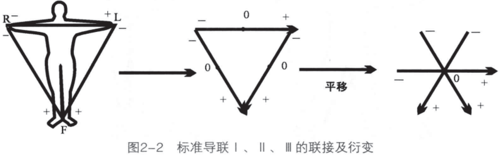

> 单极肢体导联
> + Wilson“中心电端”：把安在左上肢、右上肢与左下肢的电极连通，为了消除皮肤阻力的干扰，在没跟导线上各加上5000 Ω的电阻，中心电端电极（WCT）的电压接近为0。`WCT=(RA+LA+LL)/3`

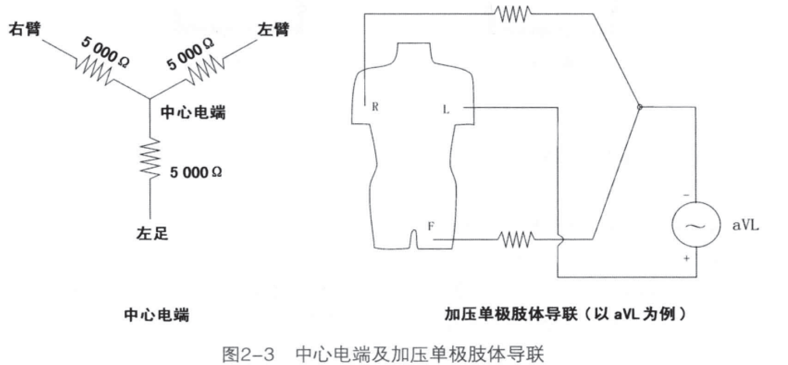

> 加压单极肢体导联：
> + aVR：探查电极-右手腕内侧，中心电端-左手腕+右下肢，反应心室腔内的电位变化
> + aVL：探查电极-左手腕内测，中心电端-右手腕+左下肢，心脏高侧壁的电位变化
> + aVF：探查电极-左下肢，中心电端-左手腕+右手腕，心脏下壁的电位变化

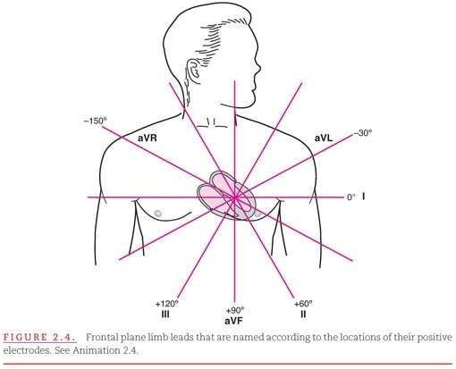

> 胸壁导联(单极)
> + 胸壁导联是一种单极导联，把探测电极放在胸前一定部位，这就是单极胸导联。这种导联方式离心脏很近，只隔着一层胸壁，因此心电图波形振幅很大。
> + 胸前导联测量的是各胸前电极与Wilson中心电端的电位差。
> + Wilson中心电端以肢体电极为基础计算出一个新的参照电位，等于RA、LA、LL电极电位的平均值，即WCT = (RA+LA+LL)/3。

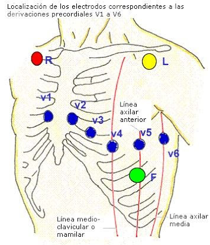

> + 胸壁导联所反映的心电活动，仅为前、后、左、右的一个横平面。

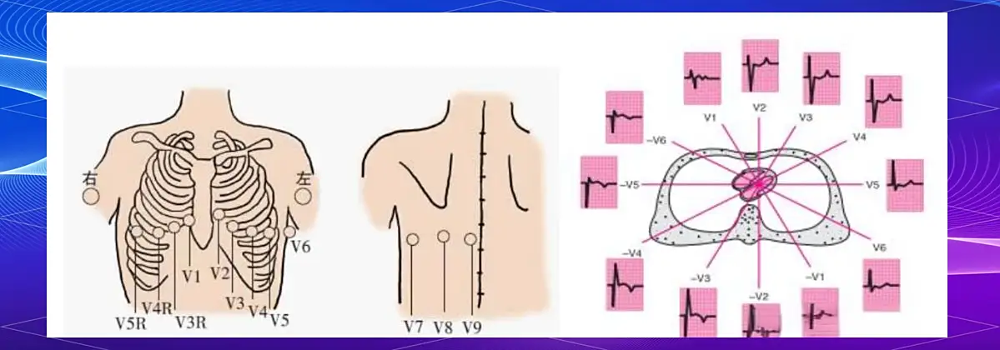

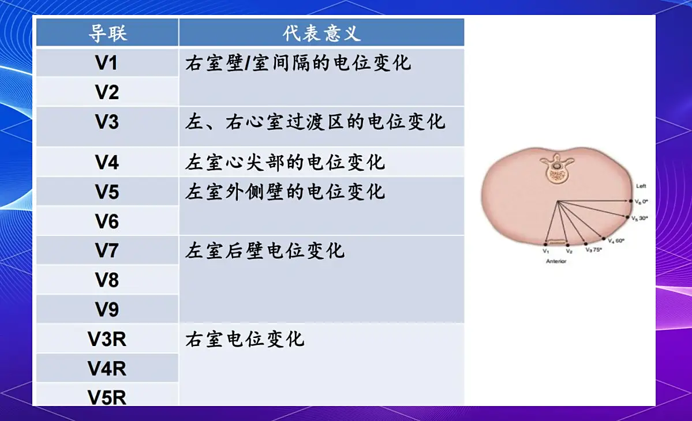

* **如果心脏激动方向朝向记录电极（+）在心电图上表现为正向波，若激动方向背离记录电极在心电图上表现为负向波**
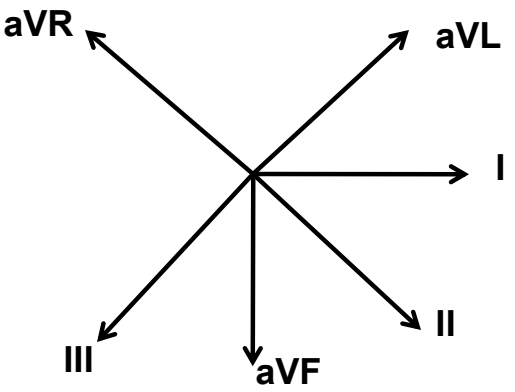

### 案例一

1. 如何诊断典型房扑

+ 下壁导联锯齿波（F波），前支缓，后支陡，没有等电位线，周长至少200ms（即标准描记走速的一个大格）
+ V1导联P波直立，V5/6导联P波负向
+ 如果下壁导联锯齿波（F波）不典型、V1和V5/6的形态学标准均不满足的话，大多数情况下亦为环三尖瓣环逆钟向运行的典型房扑（即心电图不典型的典型房扑）

::: details 利用P波极性定位房速起源
+ aVL何V1导联P波有助于鉴别有房房速和左房房速：aVL导联P波呈正向或双向说明起源于右房，V1导联P波呈正向说明起源于左房
+ aVR导联P波负向通常是提示右房局灶起源性房速
+ 胸前和下壁导联P波均负向提示为三尖瓣环下方起源的房速
+ V6导联P波负向，V1导联P波正向，三个下壁导联均负向提示后间隔房速或冠状窦口下方的房速
+ V1导联P波直立可以是房室结周围和间隔左侧起源的房速
+ 界嵴上部的房速在窦性心动过速和窦房折返性心动过速时的P波形态几乎相同。
:::

## 心电向量图（VCG）的基本原理

> + 任何时刻的心脏电活动都可以用一个单一向量表示，其幅度和方向可以由一个从心脏的中心发出的箭头标明。
> + 该向量在每个心动周期的幅度和方向的变化可以被视为一个环，并且与ECG上的各个波对应
> + 分别形成P、QRS、T环

❗这是一个空间的立体结构 

**描记心电向量图的Feank系统：**

+ 共7个电极，3个导联，3个平面；
+ 身体前侧为正极，后侧为负极

| **导联**        |      **正极**      |      **负极**      |
| ------------- | :-----------: | ----: |
| X      | A（左腋中线第五肋间）+C | I：右腋中线第五肋间 |
| Y     |   F（左腿）+M（脊柱正中线第五肋间）    |   H：右后头颈部|
| Z |   A+C+E（前正中线第五肋间）+I    |   M：脊柱正中线第五肋间 |

| **平面**        |      **组成导联**      |
| ------------- | :-----------: |
| 额面（F） | X、Y轴 |
| 侧面（S） | Y、Z轴 |
| 横面（H） | X、Z轴 |
C：E、A之间相距45°

E：心电向量起点，三轴三面交点均在E点处

  

    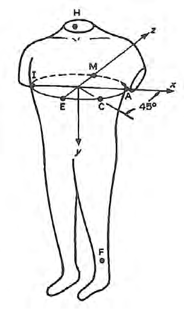
  

  

    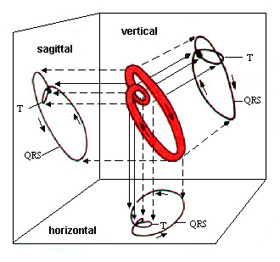
  

### 心脏各部位除极与心电图波形的关系

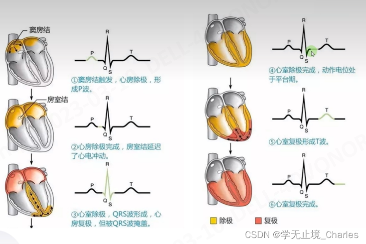

心脏的除极从窦房结开始，房室结通过心室，室间部和心尖部

### 心电向量投影于各导联后的波形

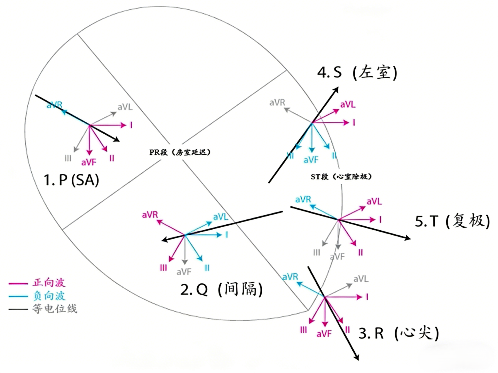

### P环（心房除极的向量环）的形成

+ 反应心房的除极
+ 方向：位于右心房的窦房结发出冲动，同时：
  1. 向下经节间束&rarr;房室结
  2. 向左：激动左心房。综合向量：右上&rarr;左下，基本与额面平行
+ 综合P向量：前一部分&rarr;右房除极 
  + 后一部分&rarr;左房除极
  + 中间部分&rarr;两个心房共同除极

心电图P波的形成机制

P波额面电轴正常范围在0-75°之间

I、II、aVF、V4-V6导联直立

aVL、III导联可直立或倒置

  

    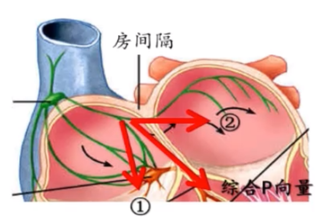
  

  

    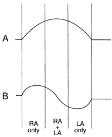
  

可以判断P波前期是来自于右房激动，P波后半段是右房的激动，P波中间段是左房和右房的共同激动

### QRS环（心室除极的向量环）的形成

+ 主要反应心室的除极活动
+ 心内膜&rarr;心外膜
+ 初始部：室间隔从左向右除极&rarr;右前方偏上。
+ 主体部：左室除极占优势，右、前、上&rarr;左、后、下
+ 终末部：心室和时间额后底部除极，指向右上方偏右，有时偏左

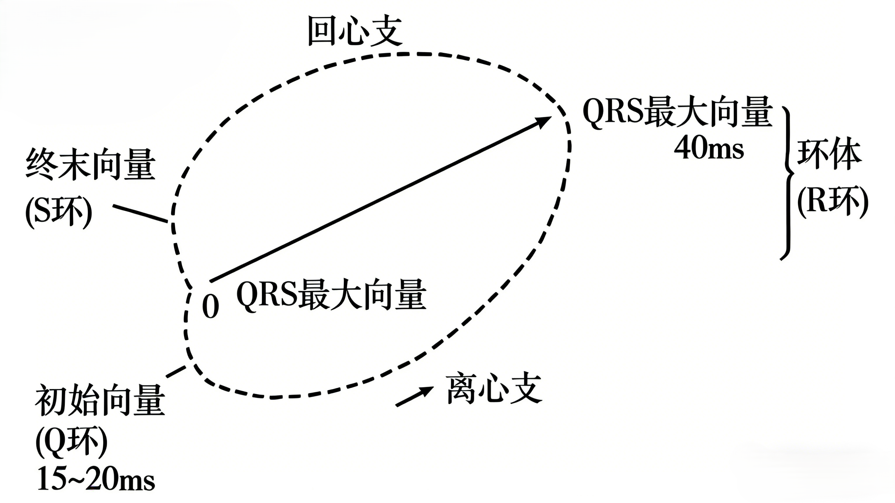

**QRS波的形成机制--Q波**

+ V1、V2、V3导联出现Q波为异常现象
+ 其余导联Q波很小--间隔Q波
+ III、aVR导联任何幅度的Q波均为正常
+ V5、V6导联导联无P波异常现象

**Q波异常：**
1. 心梗时局部梗死心肌不能除极，其余部分心肌除极产生的综合向量背离梗死部位，故形成心梗相关的Q波；
2. 心室肌肥大
3. 室内传导异常

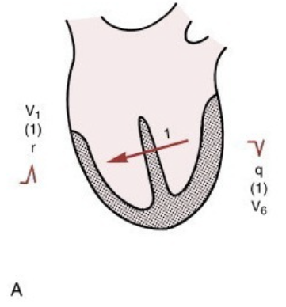

**QRS波的形成机制--R波**

+ 左室游离壁与右室除极
+ 右室室壁壁薄，左室室壁厚，故从V1到V4或V5导联R波幅度逐渐增加&rarr;R波幅度高低反映除极向量的大小，从而判断心室肥厚或左室心肌梗死。

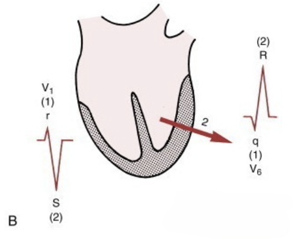

### **心室除极向量简化模型：**

心室除极可以简化为三个主要向量：
**向量一（间隔向量）**：
间隔除极（可产生间隔QS波）&rarr;向前、右

**向量二（左室向量）**

左右室同时除极，左室向量占优势，&rarr;向左、下、后

**向量三（基底向量）**

双侧心室基底部除极&rarr;向后、左、上
（可产生V1导联的r‘波形&rarr;室上嵴图形）

### 心室除极与肢体导联的QRS波形

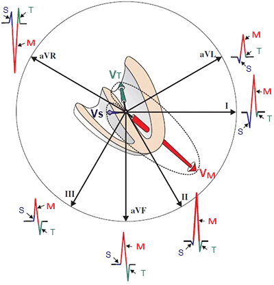

Vm正好来，会产生一个向上的R波，II导联就会出现一个R波，如果背离，就会出现一个一个Q波，比如aVL导联就会出现一个小Q波

深颜色可以看到心室除极的方向

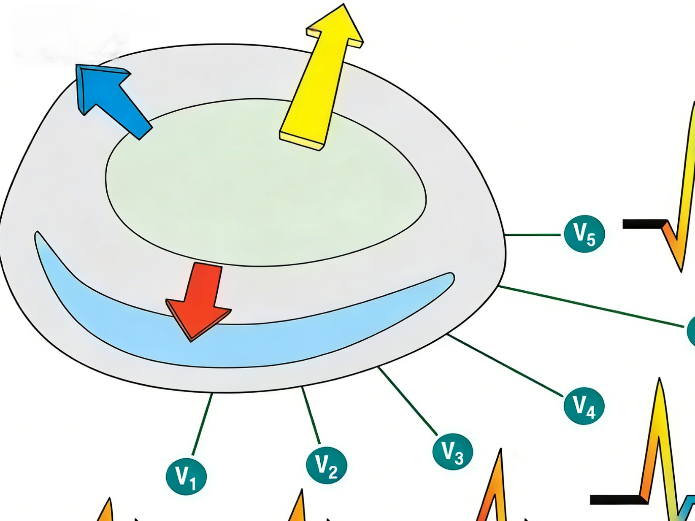

心室的除极和胸导联的关系，从横断面来看，右室像个月牙形，左心室像一个圆柱形，黄色的向量最长，代表左室游离壁的向量方向，所以V5、V6的R波更高。比如心室变厚，V5的R波就会更高。

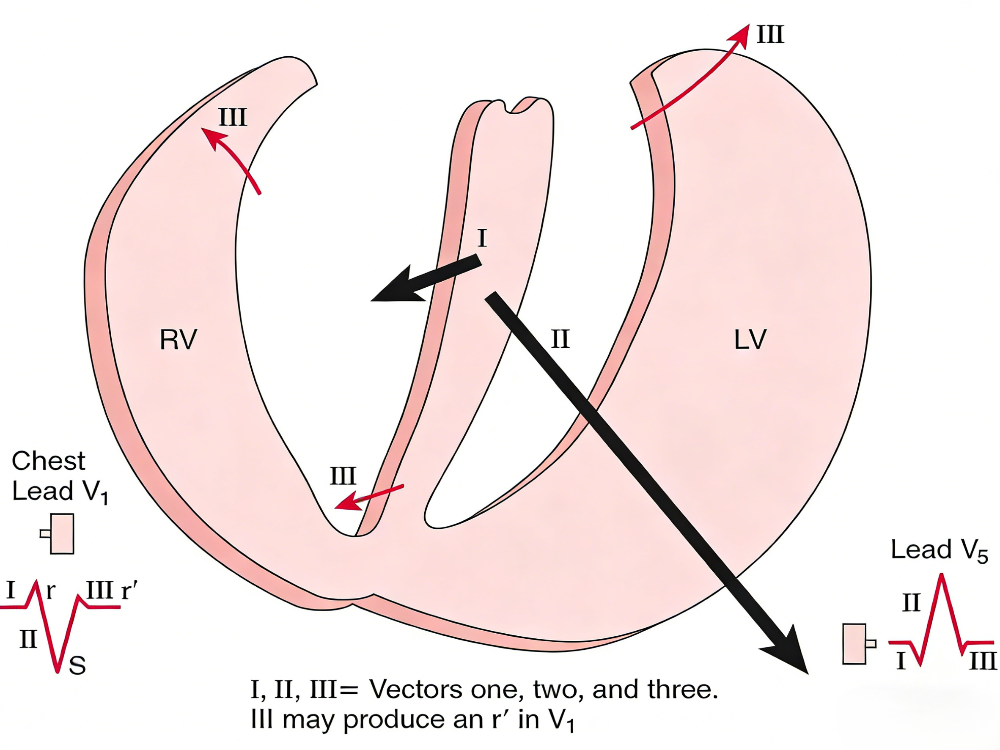

### QRS电轴：由QRS综合向量决定

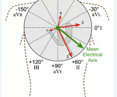
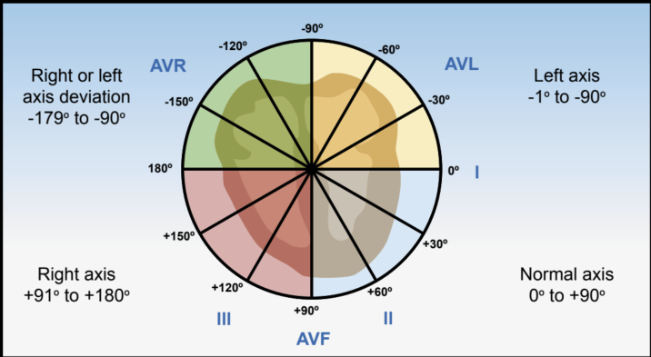

所有瞬时心电向量的综合被称为心电向量，平均心电向量的方向被称为平均心电轴。

> ①正常心电轴的范围0°～ + 90°,其中+ 30°～ + 90°电轴无偏移, + 30°～0°电轴轻度左偏;
> 
> ②电轴左偏0°～ - 90°,其中0°～ -30°为电轴中度左偏, - 30°～ - 90°电轴重度左偏;
> 
> ③电轴右偏+ 90°～ + 180°,其中+ 90°～ + 120°为电轴轻度右偏, + 120°～ + 180°电轴显著右偏;
> 
> ④电轴重度右偏+ 180°～ - 90°(图3) 。心电轴是评价心电图的一项重要指标,其中额面及水平面心电轴临床最常用,是心电图报告中的一项重要内容。

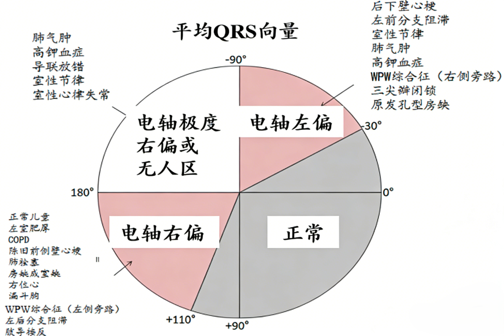

整个正常的心脏除极方向应该是往绿色方向走的，很难到无人区域，因此当朝向第四象限时，心脏往往是有问题，比如高钾血症。

::: details training

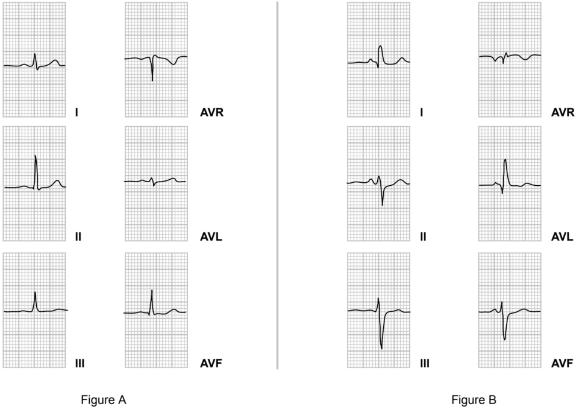

+ 要计算QRS电轴，需要寻找电压最高的QRS波群（12导联中最高的R波，可能为正向或负向）

eg：图A中，II导联的R波电压最高，其偏转方向为正向，因此QRS的综合向量的平均方向直接指向II导联，电轴为+60°；图B中，III导联的R波电压最高，其偏转方向为负向，因此QRS的综合向量的平均方向直接指向III导联，电轴为-60°。

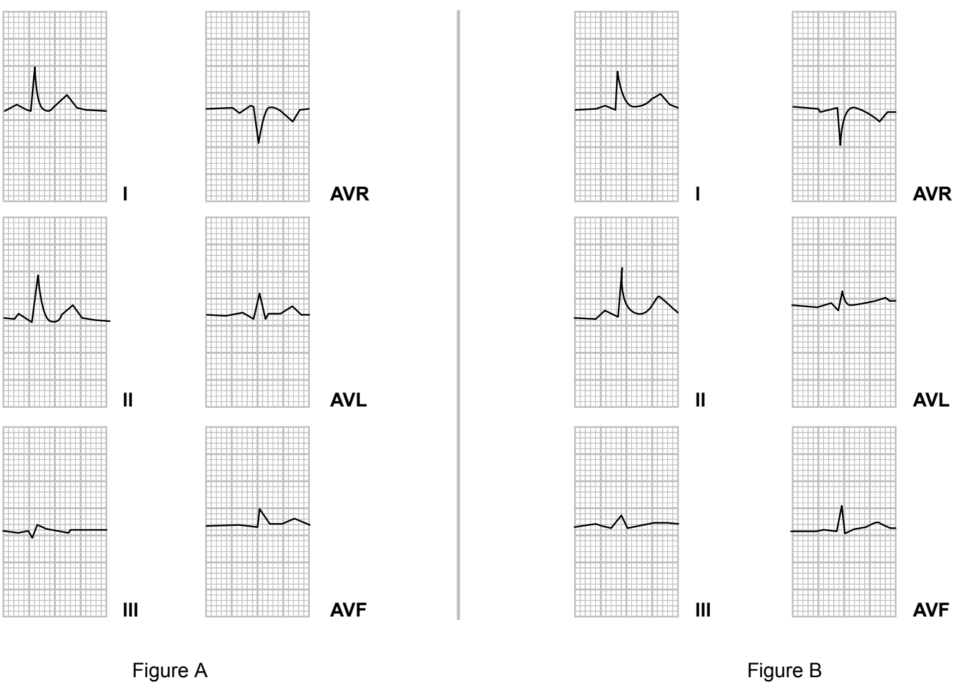

eg：图A中，I导联和II导联的QRS波的电压幅度最高，且两个导联的正向电压大小相等，平均QRS电轴正好指向二者中间的位置，+30°；图B中，II和AVR的QRS电压幅度最高，AVR的电压为负，说明QRS向量指向背离该导联的方向，对应电轴为+30°，II导联的波形为正，说明平均QRS向量指向朝向该导联的方向，对应电轴为+60°，取二者平均值为+45°，属于正常心电轴范围。
:::

### T环（心室复极向量环）的形成

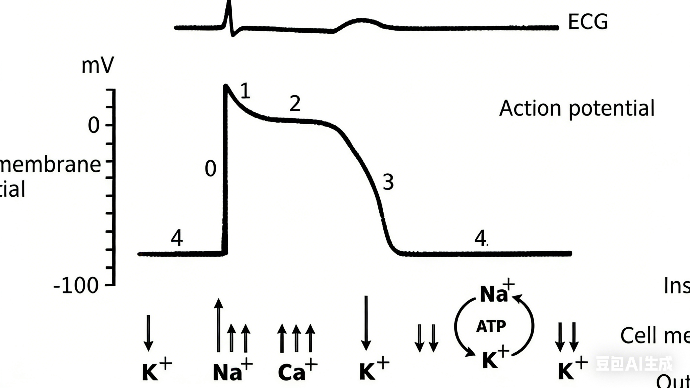

+ 心室复极相当于动作电位中的1-4相，但1相时间极短，2相平台期细胞内外电位差极小，临近细胞之间不形成电偶，故在 向量图上不产生向量环，相当于ECG的ST段

+ T环相当于3相，复极时由心外膜向心内膜进展的过程
+ 心室各部位对T波形成的影响：
  + 右心室：影响小（室壁薄，电位活动远不如左室明显）
  + 室间璧肌：左右两侧同时复极，电活动相互抵消
  + T环的产生主要是左心室壁肌从心外膜&rarr;内膜3相复极的过程

### QRS、T向量的空间位置关系

T环方向与QRS环大致一。但二者并不完全一致，存在QRS-T角

+ 额面：
  + T向量方向在一生中基本保持恒定
  + QRS向量由垂直指向转为水平指向，
  + 额面QRS-T角一般不超过45°
+ 水平面：
  + T向量在儿童中可指向后方，导致V5、V6导联出现负向波，逐渐指向V5导联正极方向
  + QRS向量逐渐转向正后方
  + 成人水平面QRS-T角一般不超过60。

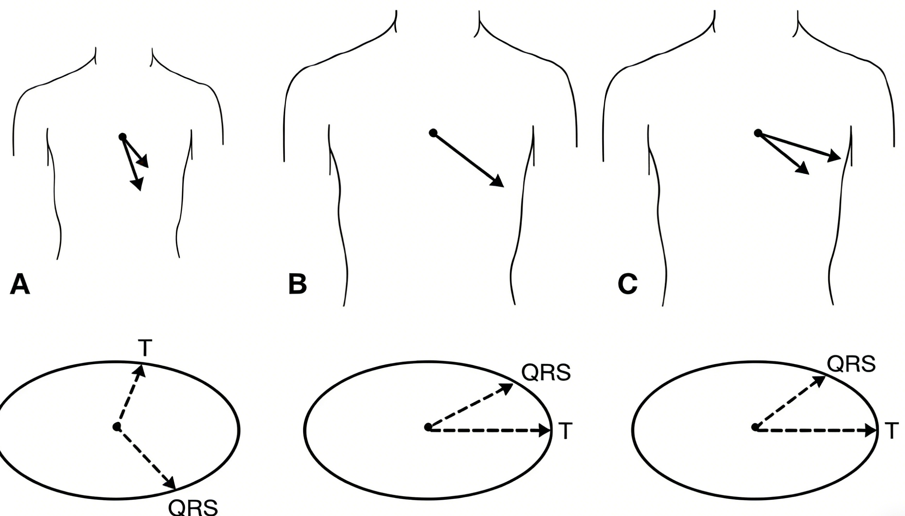

QRS向量和T向量夹角随年龄改变：A.正常儿童；B. 正常青年；C. 正常成年
 

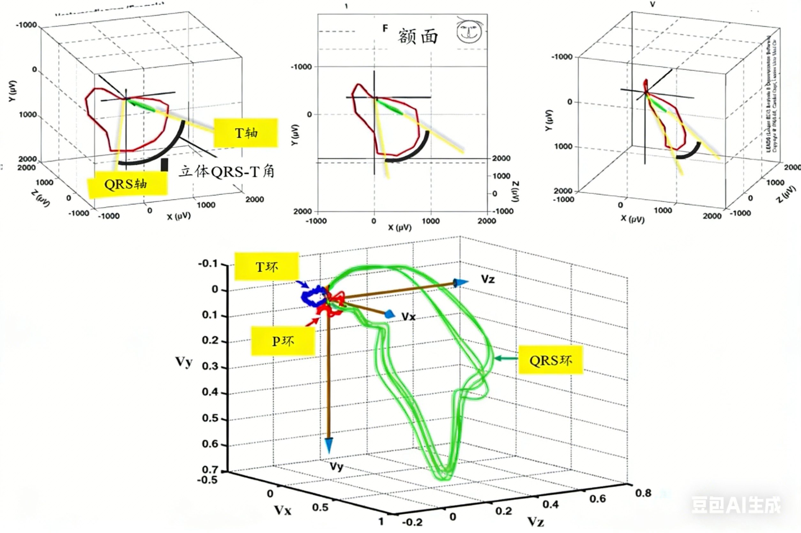

**临床意义：**

+ 空间QRS-T角可基本用额面QRS-T角近似简化
+ NHANCES III：QRS-T角增大，但无临床心脏病的个体全因死亡率以及未来14年内心血管的发病率显著均升高（全因死亡率多因素风险比1.30~1.87），心血管疾病的发病率多因素风险比1.82~2.21）

### 心电向量诊断心肌缺血、梗死（很少用）

**心电向量基础：梗死部位不能除极，其余心肌除极产生的综合向量背离梗死区域**

| 梗死部位 | 梗死向量方向 | 梗死瞬间向量及时限 | QRS环异常特点及发生面 | 梗死心电图发生导联 |
| :--- | :--- | :--- | :--- | :--- |
| 前间壁 | 左后 | 0.01~0.02s 蚀缺向前 | H面QRS环离心支凹面向前 | V1、V2、V3 |
| 前壁 | 向后 | 0.02~0.04s 蚀缺向前 | H面QRS环离心支凹面向前 | V2~V4 |
| 侧壁 | 右后 | 初段向右>22ms 向右力>0.16mV | H面QRS环离心支呈CW 顺逆“8”字形运行 | Ⅰ、aVL、V5~V6 |
| 前侧壁 | 右前 | 初段向右>22ms 向右力>0.16mV | F面QRS最大>40° 离心支移向回心支右后，顺逆“8”字形运行 | Ⅰ、aVL、V2~V4 |
| 广前壁 | 右后 | 0.01~0.06s | F面QRS呈CW运行，位右后，F面QRS呈CCW运行 | Ⅰ、aVL、V1~V6 |
| 后侧壁 | 右前 | 20ms 右前向量力>0.16mV | H面QRS呈CCW运行，F面QRS环CW运行，20° 指右下 | Ⅰ、aVL、V5~V6 |
| 纯后壁 | 向前 | — | 回心支及终末向量向前移，QRS环的50%~70%位X轴前50ms | Rv1,v2高宽 QRSv1,v2/R≥1 |
| 下壁 | 向上 | F面QRS呈CW运行，向上时限>25ms | F面QRS初始向上>0.2mV | QⅡ、Ⅲ、aVF |
| 下侧壁 | 右上前 | F面QRS环呈CW运行20~30ms 右上 | H面QRS环向右前>0.16mV | QⅡ、Ⅲ、aVF QⅠ、aVL |

**说明**：CW=顺时针，CCW=逆时针；H面=水平面，F面=额面

**心梗后的心电向量图形**

**心电向量诊断束支阻滞**

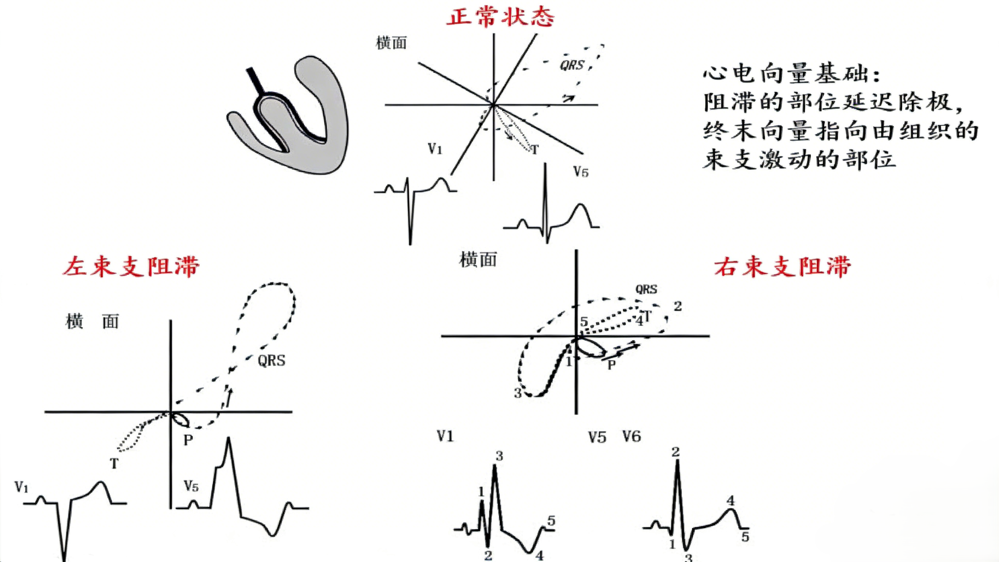

### 心脏形态异常时心电向量的改变
+ **心房肥大——P向量、P波异常：**
  为什么左房扩大时P波正负双向？

  开始时P波仍为向前，但左房扩大后出现向后向左的综合P向量，故V₁导联多见正负双向P波→**PtƒV₁**的重要性

+ **心室肥厚——QRS向量方向、幅度改变，QRS波异常**

  - **左室肥厚**：QRS环振幅增大、指向左后下、最大QRS向量延迟出现、横面QRS-T夹角增大、ST向量、T环改变

  - **右室肥厚**：主要是定性诊断，右室变化抵消左室向量，反而使QRS环较正常缩小

### 总结

1. 心电向量的形成
2. 心电向量的概念
3. 如何通过心电向量理解心电图波形
4. 如何应用心电向量解读异常心电图表现

### 思考？

::: details 为什么III导联的QRS波会出现q波可以是正常现象？什么情况下容易出现此种情况？临床上如何鉴别其是生理性还是病理性的？其机制又是如何？
？
:::

::: details 左心房和右心房、左心室和右心室在空间上大致是一个什么关系?这种解剖关系对P波及ORS波的综合向量有什么影响？
左心房和右心房、左心室和右心室并不是一个并列的关系，左心房在左边偏后，右心房在右边偏前，**二者有一定的左右前后关系**，左心室和右心室一样。
:::

::: details 举例来说，如果左房显著增大，那么P波综合向量会有何变化?心电图上的P波会有何特征？
左房变大，P波综合向量会向左后偏移，心电图上前面的一些导联，比如横断面额向量是往后去的，表现为一个比较深的负向波，比如V1导联的P波终末电位会出现正负双向的P波，PTFV1。

心室也一样，比如V5V6导联已经偏左偏后，如果出现左室肥厚，那么他们的R波会变得很高，最厚的向量是向着他们去的，心肌越后，那么除极需要的时间相对越长，R波就越高。
:::

## 第二节案例

[第二节案例](./ECGcase#第二节)

## 心脏传导系统

See [心脏传导系统](./Taolearn.html#心脏传导系统)

### 思考？

::: details 根据窦房结的解剖部位及上节课所讲的心电向量理论，解释一下为何正常情况下V1导联的P波起始部是直立的？反映的是哪里的除极？
？
:::

::: details 根据房室结的血供特点，分析一下在急性下壁ST段抬高的心肌梗死时lI导联ST段最高者和II导联ST段抬高最高者之间，哪种情况更易出现三度房室传导阻滞?
？
:::

::: details 根据束支的解剖特点，解释一下为何临床上“右束支传导阻滞最常见
？
:::

::: details 根据浦肯野纤维激动心室的特点，解释一下为何多种宽QRS心动过速鉴别诊断中都强调QRS起始部除极较快 (RS时间短、aVR导联前40ms的dp/dt大于后40ms的dp/dt...) 是室上速伴差传的重要特征？
？
:::

## 与心电图相关的心脏解剖知识

**右心房解剖的左手模式：**

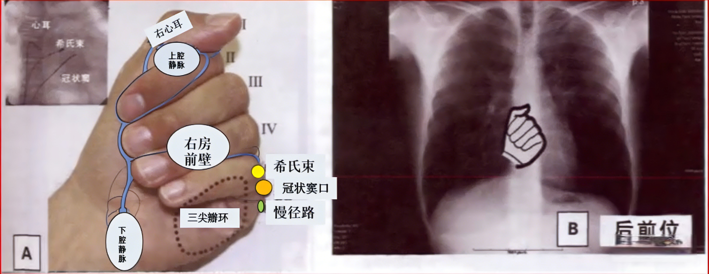

用左手代表右心房后前位时x线下的投影特点及位置
 

**冠状动脉**

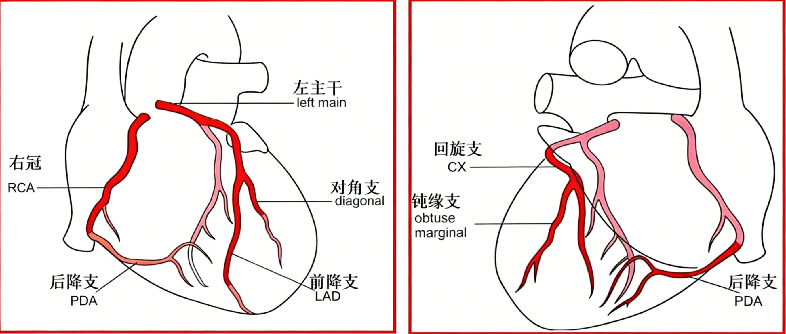

AP位和PA位心脏投影
 

### 思考？

::: details 根据心房解剖特点，分析如何通过V1导联的P波形态鉴别房速是起源于左房、右房或者房间隔？
？
:::

::: details 根据心室的解剖特点，总结一下左室乳头肌起源的室速的QRS波形态?
？
:::

::: details 根据冠状动脉的解剖特点，分析一下前降支近段、中段及远段不同部位的闭塞所导致的急性心肌梗死的心电图改变及其机制？
？
:::

### Cardiac Rhythms

1. 正常窦性心律

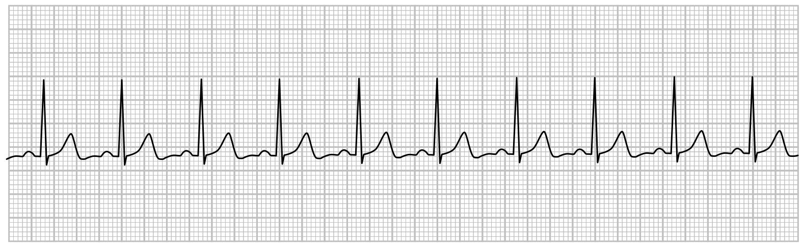

正常窦性心律下，电冲动起源于窦房结，且发放节律规整，心电图上各同类波形之间间距相等。

+ 成年人的正常心率为每分钟60至100次，儿童则为每分钟100至120次。心率通常会因运动或情绪压力而加快，在运动结束或压力消退后则会下降。
+ 正常窦性心律节律规整——即R-R间期（从一个R波到下一个R波的距离）变化不超过120毫秒（3个小方格）。P波形态（小而圆钝）和方向（正向）均正常。每个QRS波群前均有一个P波。
+ 正常的PR间期为120至200毫秒（3至5个小方格），正常的QRS波群时限为120毫秒或更短（3个小方格）。
+ 部分人群静息基础心率本身偏低，睡眠时心率会进一步下降。例如长期运动的运动员静息心率更低，这是因为心脏经长期锻炼后，单次搏血效率更高，无需频繁搏动即可满足全身供血需求。

2. 窦性心动过缓

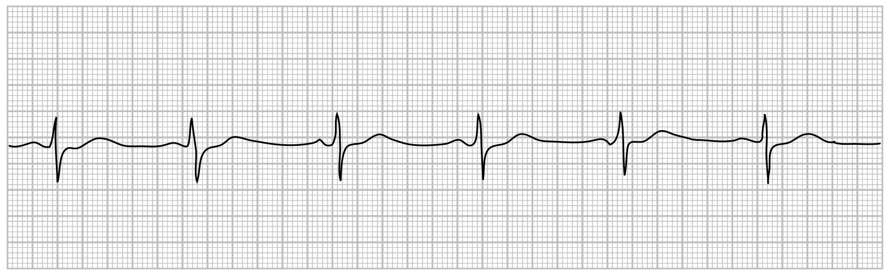

窦性心动过缓时，窦性心率通常在40-60次每分钟

+ 窦性心动过缓的心电图显示相似波形之间存在较大间距。心率规整，P波的形态和方向均正常
+ 心动过缓是一直缓慢的心律，仅在出现症状时才需要治疗。窦性心动过缓时窦性心律的一种正常变异，它可能出现在睡眠期间，也常见于运动员身上。

3. 窦性心动过速

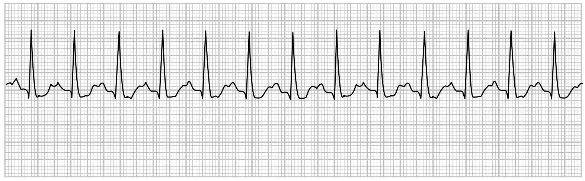

窦性心动过速时，窦性心率通常在 100～160 次 / 分钟。

+ 窦性心动过速的体表心电图可见各同类波形间距缩短；心律规整，P 波形态、极性均正常。
+ 窦性心动过速是健康心脏在运动增加、情绪应激下的生理性正常反应，心率升高与回落均呈渐进过程。病理性心动过速则突发突止，会引发相关症状，需要临床干预治疗。

4. 窦性心律失常

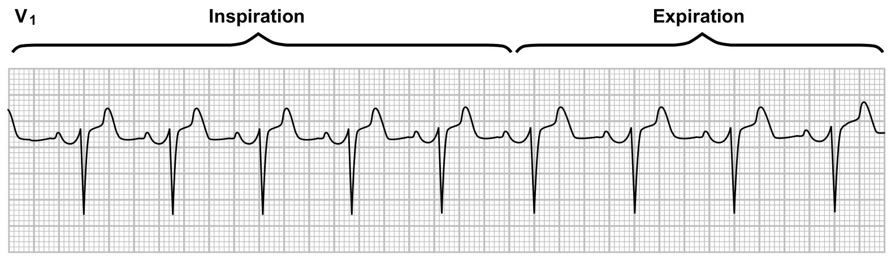

窦性心律不齐时，窦房结发放电冲动的速率不恒定。心率可处于正常范围，但通常偏慢。

+ 窦性心律不齐的体表心电图表现为心律不齐，也就是各 R 波之间的间距长短不一，但 R 波的形态与极性均正常。
+ 窦性心律不齐是一种随呼吸出现的生理性心率波动：吸气时心率轻度增快，呼气时心率减慢。

5. 窦房传导阻滞

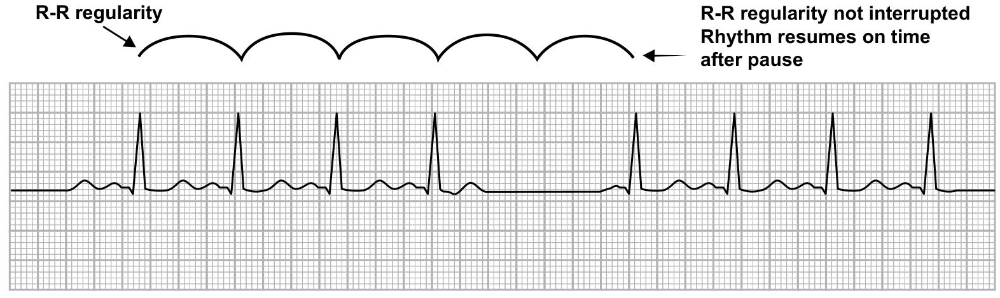

在窦房传导阻滞中，窦房结会有一个或多个周期无法发起电冲动。

+ 窦房传出阻滞的体表心电图可见心律突发间歇性长间歇（一组完整的 P-QRS-T 波形消失）；间歇过后窦性心律恢复正常，且长间歇的时长通常为基础 R-R 间期的整数倍。
+ 心脏传导阻滞是指电冲动在心脏传导通路某处发生延迟或中断的一类病症。轻度、间歇性阻滞仅造成传导异常延缓；完全阻滞则会出现传导严重异常甚至传导中断。窦房传出阻滞属于间歇性阻滞。

6. 窦性停搏

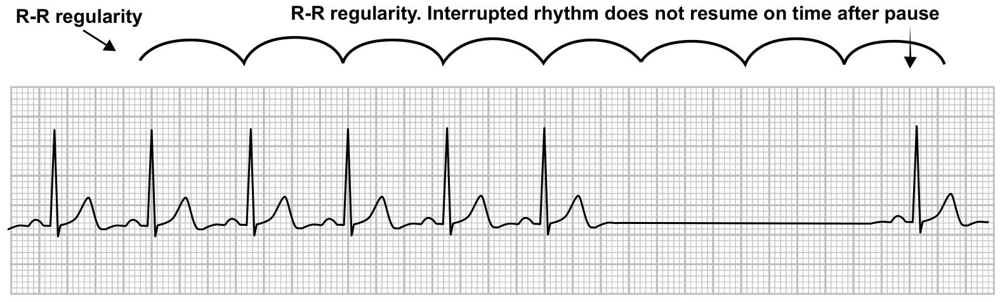

窦性停搏是因窦房结自律性功能丧失，进而打乱窦性心律的发放节律。

+ 窦性停搏的体表心电图可见正常波形之间出现长间歇（整组 P-QRS-T 波形消失），间歇结束后不会自行恢复原有窦性节律，且该长间歇的时长并非基础 R-R 间期的整数倍。
+ 部分患者出现的长间歇会让异位自律起搏灶接管心脏节律；仅当患者出现相关症状时，才需要进行治疗。

7. 房性心动过速（AT）

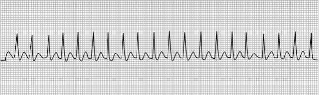

房性心动过速（简称房速，AT）是节律规整的心律失常，心房率为 120～250 次 / 分钟；若无房室传导阻滞，心室率与心房率数值相等。

+ 正常窦性心律的 P 波是圆润直立的；但房速的电信号起源于心房异位位点，不是窦房结，所以 P 波形态会变形、低矮或叠加在前一个 T 波里，读图时很难区分。若心房率低于 200 次 / 分，P 波呈尖峰状，且可重叠于前一次心动周期的 T 波之上。若心房率超过 200 次 / 分钟，P 波可埋藏于 QRS 波群内无法分辨。
+ 房速发作时，房室结会将每一次心房电冲动下传至心室，因此心室率与心房率相等，表现为每个 QRS 波群对应 1 个 P 波。

8. 3:1传导的心房扑动

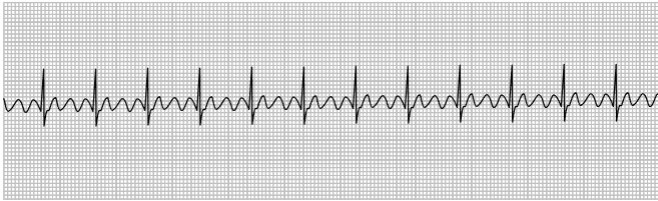

心房扑动的心房率为250至400次/分钟。心室率可能会加快，但始终慢于心房率。

+ 体表心电图上，心房扑动表现为窄 QRS 波群之间连续出现密集的 V 型扑动波；扑动波之间无清晰等电位线，T 波被掩盖。这类扑动波使心电波形呈现特征性的锯齿样形态。
+ 心房扑动发作时，心房电冲动会以多种不同比例下传至心室。
  + 偶数传导比例（2:1、4:1）比奇数传导比例（3:1、5:1）更为多见。2:1 传导比例指每 1 组 QRS 波群对应 2 个扑动波。
  + 固定传导比例（例如 2:1）会形成规整的心室节律，此类型最为常见；传导比例不固定（如 4:1、2:1、5:1 交替）则会导致心室节律不齐。
+ 和房速一样，心房扑动通常呈阵发性发作。持续性房扑（发作时长超过 24 小时）虽不常见，但有可能进展为心房颤动。

9. 心房颤动（AF）

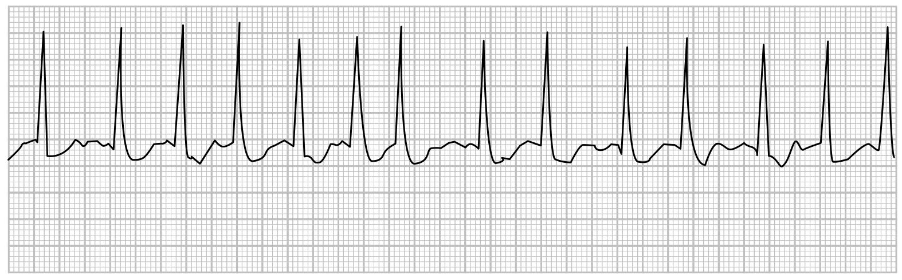

心房颤动（房颤）的特征是心房心肌发生杂乱无章、毫无规律的收缩。患者心房率可达 400 次 / 分钟及以上，速度过快，心电图上无法逐一计数；心室率会增快，但始终慢于心房率。

+ 体表心电图上，心房颤动表现为窄 QRS 波群之间形态不规则、呈波浪样的波动（纤颤波）。纤颤波的形态、振幅与方向均不统一，无等电位线，T 波无法辨认。
+ 心房颤动本身电活动紊乱，会造成心室节律绝对不齐。心室率＜100 次 / 分时称为心室率控制达标；心室率＞100 次 / 分则为心室率控制不佳。
+ 心房颤动往往会由阵发性进展为持续性，最终发展为永久性房颤。房颤最严重的并发症是血栓栓塞性卒中。临床治疗主要围绕三大目标：转复并维持窦性心律、控制心室率以及预防卒中。

10. 游走性心房起搏点（WAP）

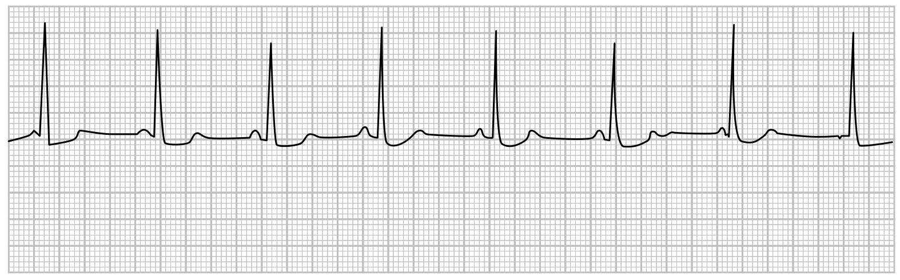

游走性心房起搏点（WAP）中，电冲动起源于窦房结或异位心房位点。心率通常为60至100次/分钟。

+ 体表心电图显示P波的振幅、形态和方向均存在变化。心律通常不规则，PR间期长度也可能有所不同。房性早搏并不常见，且很少需要治疗。

11. 交界性心律失常

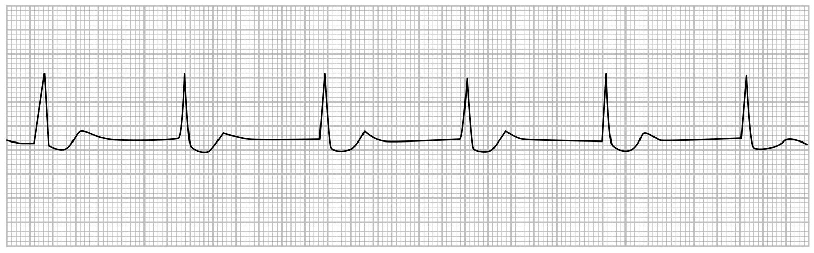

房室交界区性心律失常起源于房室结及其周围区域。交界心律通常在40-60bpm，且规律平整。

+ 房室交界性心律失常发作时，房室结产生的电冲动可双向传导：逆向传导激动心房，前向传导激动心室。心电图可见倒置 P 波，QRS 波群形态正常；倒置 P 波可出现在 QRS 波群之前、之后，或埋藏于 QRS 波群内部。

12. 一度房室传导阻滞

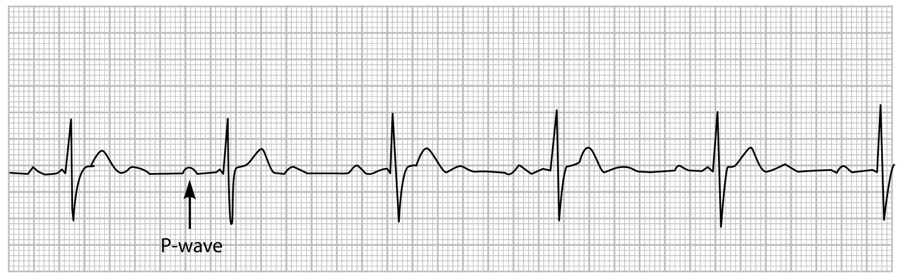

一度房室传导阻滞是心房电冲动下传至心室的过程出现传导延迟。

+ 心电图表现为 PR 间期时长超过 200 毫秒，每个 QRS 波群均对应 1 个 P 波，且 QRS 波形态狭窄；心率与基础心律的心率一致。
+ 一度房室传导阻滞无任何症状，无需治疗，但该病有可能进展为更高程度的房室传导阻滞。

13. 二度房室传导阻滞（I型）

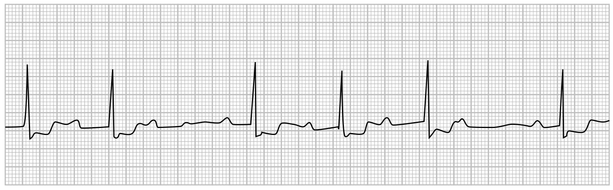

二度房室传导阻滞（一型），又称莫氏一型或文氏型，部分窦性冲动无法传导至心室。

+ 体表心电图可见 PR 间期进行性延长，继而出现 QRS 波群脱落。P 波与 QRS 波的传导比例可表现为 3:2、4:3、5:4 等，心室率通常低于正常水平。
+ 莫氏 Ⅰ 型房室传导阻滞的传导阻滞部位位于房室结，因此 P 波形态正常、QRS 波群狭窄。除非心室率过缓，否则莫氏 Ⅰ 型通常无临床症状。该病虽少见，但仍有可能进展为更高程度的房室传导阻滞。

14. 二度房室传导阻滞（II型）

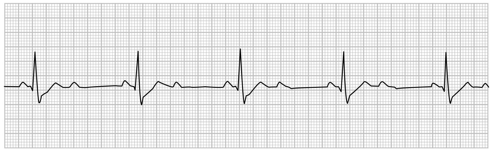

二度房室传导阻滞（Ⅱ 型），又称莫氏 Ⅱ 型，每 2 个、3 个或 4 个心房电冲动中会有 1 个无法下传至心室。

+ 体表心电图可见间歇性 QRS 波群脱落，PR 间期无进行性延长。房室传导比例可为 3:1、4:1、5:1，甚至更严重的阻滞比例，心率低于正常范围。
+ 莫氏 Ⅱ 型房室传导阻滞的阻滞部位位于房室结以下，因此 P 波形态正常；QRS 波可表现为窄波（阻滞位于希氏束）或宽波（阻滞累及束支）。由于阻滞位置特殊，莫氏 Ⅱ 型病情比莫氏 Ⅰ 型更危重，可毫无先兆或仅有轻微征兆地进展为三度房室传导阻滞，甚至心室停搏。

15. 三度房室传导阻滞

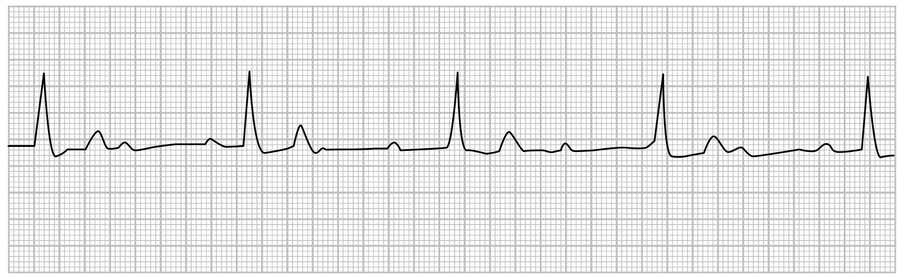

三度房室传导阻滞时，心房电冲动完全不能下传激动心室。心房由窦房结控制激动，心室则依靠房室结内或房室结以下的异位自律起搏点发放电信号激动。

+ 体表心电图可见 P 波与 QRS 波群之间无传导关联，即房室分离。心房与心室各自独立搏动，但二者各自的节律通常规整。
+ 完全性房室传导阻滞的逸搏起搏点若位于希氏束，QRS 波群形态狭窄，心率为 40～60 次 / 分；若逸搏起搏点位于束支水平，则 QRS 波群宽大畸形，心率仅 30～40 次 / 分。
+ 完全性房室传导阻滞可呈一过性或持续性，该病症存在生命危险，可突发进展为心室停搏。

16. 原发性心室停博（心搏停止）

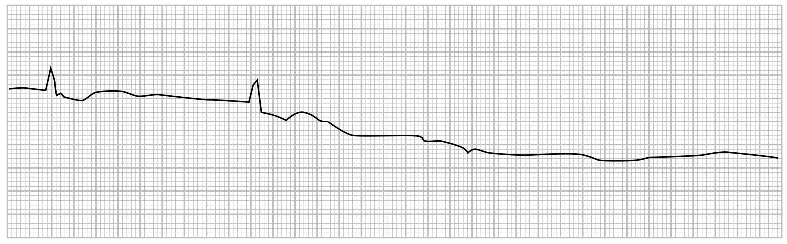

在原发性心室停搏中，心房冲动无法传至心室，异位心室灶也无法引发去极化

+ 心电图仅见 P 波、无 QRS 波群，或全部波形消失。若仍存在 P 波，心室停搏前多为莫氏 Ⅱ 型房室传导阻滞或完全性房室传导阻滞；若未见 P 波，停搏前大概率为室性心动过速或心室颤动。如不立即开展救治，患者会迅速死亡。

17. 室性自主心律

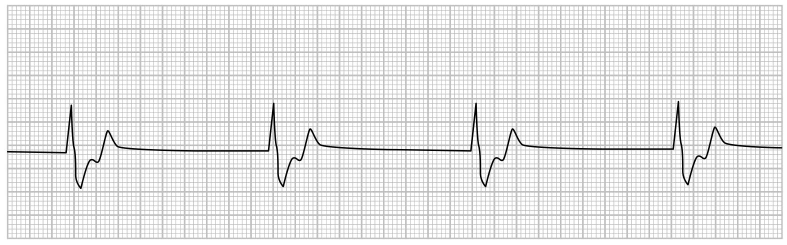

室性自主心律（又称室性逸搏心律）的电冲动起源于心室内的自律起搏灶，其逸搏心率通常为 20～40 次 / 分钟。

+ 室性自主心律的体表心电图表现为宽大畸形 QRS 波群，无 P 波；心律可为一过性或持续性，节律大多规整。
+ 室性自主心律可发生于完全性房室传导阻滞时，或于心室异位起搏点抑制窦房结、房室结自律性时出现。该逸搏心律可为一过性或持续性。持续性室性自主心律常是心室停搏发生前的终末心律。

加速性室性自主心律是心室心肌自律性增高所致，心率维持在 50～100 次 / 分。该心律失常发作常与正常窦性心律交替出现，患者通常可良好耐受此心律。

18. 室性心动过速（VT）

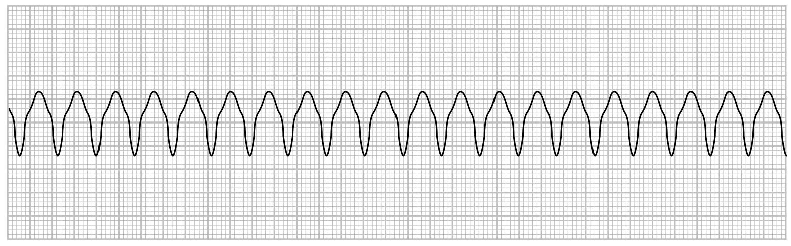

在室性心动过速（VT）中，心率在每分钟140至250次之间。

+ 体表心电图可见宽大、形态畸形的 QRS 波群，无可识别的 P 波。各 QRS 波形态基本一致，其后伴随振幅高大的 T 波，且 T 波方向与 QRS 波群主波方向相反，心律大多规整。
+ 室性心动过速（VT）可分为持续性（发作时长＞30 秒）与非持续性（发作时长＜30 秒），呈阵发性发作。非持续性室速可进展为具有生命危险的持续性室速。
+ 室性心动过速（VT）可分为持续性（发作时长＞30 秒）与非持续性（发作时长＜30 秒），呈阵发性发作。非持续性室速可进展为具有生命危险的持续性室速。

尖端扭转型室速（字面含义：尖端扭转）属于室性心动过速，其 QRS 波群主波极性正负交替，心电图波形看似围绕等电位线扭转；心率波动于 250～350 次 / 分，心律失常发作通常持续时间较短。

19. 室性颤动（VF）

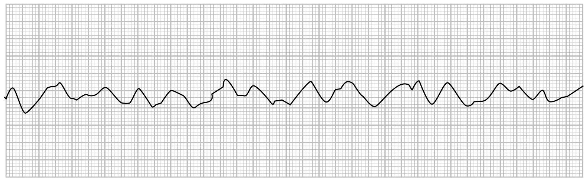

心室颤动（室颤，VF）时心室电活动频率极快，心室呈杂乱无章的颤动，无法有效泵血。

+ 心电图上仅见心室颤动波，无 P 波与 QRS 波群。若颤动波振幅高大，称为粗大型心室颤动；若颤动波细小，则为细小型心室颤动。细小型室颤通常提示心律失常已发作较长时间，患者在电除颤前可能需要先行药物治疗。
+ 心室颤动若不通过电除颤恢复正常心律，患者将会死亡。

20. 伴束支传导阻滞的正常窦性心律

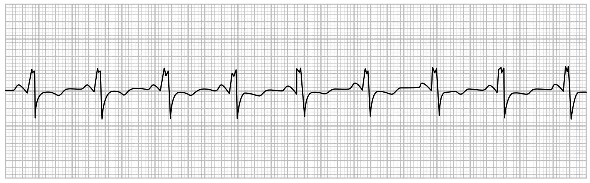

束支传导阻滞（BBB）是指电冲动在心室内右束支或左束支的传导发生延迟。发生阻滞一侧的心室，依靠未发生阻滞一侧传导过来的电冲动完成激动。

+ 束支传导阻滞时，PR 间期正常，QRS 波群增宽（时限≥120 毫秒），可见双峰 R 波；P 波形态正常，心率亦无异常。

+ 鉴别右束支传导阻滞（RBBB）与左束支传导阻滞（LBBB）需依靠 12 导联心电图。
  - 右束支传导阻滞（RBBB）在 V₁或 V₂导联可见 R 波与 R' 波（R 撇波）；其中 R' 波代表右心室除极延迟。
  - 左束支传导阻滞（LBBB）在 V₅、V₆导联可见 R 波与 R' 波（R 撇波），左束支传导阻滞中的 R' 波代表左心室除极延迟。

21. 伴房性早搏的正常窦性心律

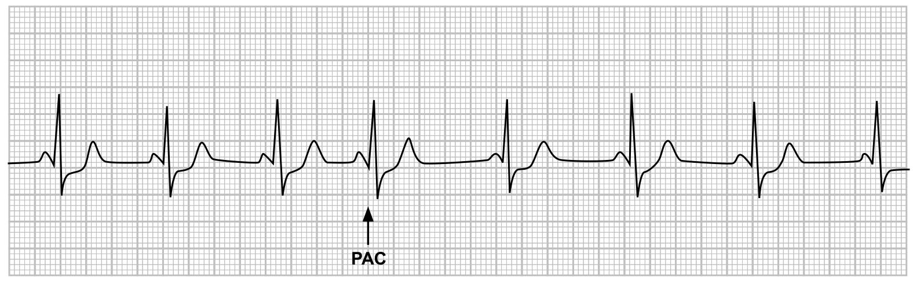

房性早搏（PAC）是起源于心房自律灶的早期搏动。

+ 心电图可见提前出现、形态异常的 P 波。该异位 P 波在 Ⅱ 导联通常直立，且常呈尖顶状；若异位起搏点靠近房室交界区，P 波则倒置。倘若 P 波出现时间过早，可埋藏于 T 波之内而难以辨识。

+ 房性期前收缩可单发、成对、成串出现，也可呈二联律（每间隔 1 个正常心搏出现 1 次早搏）、三联律（每间隔 2 个正常心搏出现 1 次早搏）、四联律（每间隔 3 个正常心搏出现 1 次早搏）。房性期前收缩会让人产生心脏漏跳感，通常无需特殊治疗。

未下传房性期前收缩中，提前出现的异位 P 波无法下传至心室，其后伴随一段代偿间歇；可下传的房性期前收缩则会引发心室提前除极。

22. 交界性早搏（PJC）

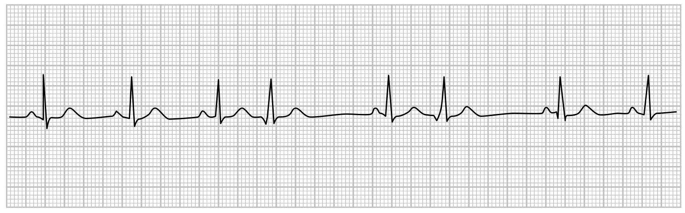

交界性期前收缩（PJC）是起源于房室交界组织的提前心搏。

+ 心电图可见形态异常的 P 波、形态正常的 QRS 波群，其后伴随代偿间歇。激动呈逆向传导，因此 Ⅱ 导联上提前出现的 P 波为负向（倒置）。该异位 P 波可紧邻 QRS 波群之前、紧随其后，或埋藏于 QRS 波群内部。PR 间期≤100 毫秒，心率通常在正常范围。
+ 交界性期前收缩可单发、成对、短阵连发，也可呈二联律、三联律或四联律模式。连续 3 次及以上交界性搏动，则可判定为交界性心律（心率 40～60 次 / 分）、加速性交界性心律（心率 60～100 次 / 分）或交界性心动过速（心率＞100 次 / 分）。

23. 伴单个室性早搏的正常窦性心律

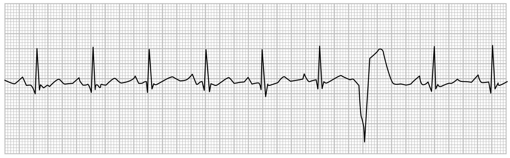

室性期前收缩（PVC）是起源于心室自律起搏灶的提前搏动，早搏过后心律恢复正常窦性节律。

+ 心电图可见提前出现的 QRS 波群，时限≥120 毫秒。与基础心律的 QRS 波群相比，该波形宽大畸形、形态怪异。基础心律对应的窦性 P 波可出现在室性期前收缩之前，也可落在早搏后的 ST 段或 T 波内；室早之后还可能出现逆行 P 波。
+ 室性期前收缩（PVC）后的间歇多为完全代偿间歇。早搏前后两个窦性 R 波的间距，等于基础心律两倍的 R-R 间期。该代偿间歇形成的原因是窦房结仍按固有频率规律发放电冲动。
+ 室性期前收缩可单发、成对、短阵发作，也可呈二联律、三联律或四联律。连续 3 次及以上室性早搏连发，即可诊断为室性心动过速。

起源于心室内多个异位起搏灶的室性期前收缩称为多源性室早。R-on-T 现象是指室性早搏落在心室复极的终末阶段。

24. Other Conditions -- 危及生命的综合征

    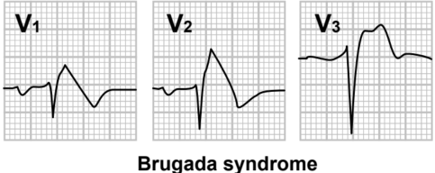
    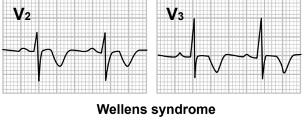

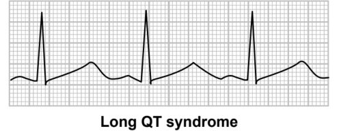

以下综合征均危及生命，但很少出现症状。

+ Brugada 综合征心电图表现为右束支传导阻滞，伴 V₁、V₂、V₃导联 ST 段抬高。该综合征具有家族遗传倾向，患者通常需植入植入式心律转复除颤器（ICD），以预防心源性猝死（SCD）。
+ Wellens 综合征特征为 V₂、V₃导联 T 波倒置，多由冠状动脉前降支狭窄所致，需行支架植入血管成形术或冠状动脉旁路移植术（CABG）治疗。
+ 长 QT 综合征定义为 QT 间期超过心动周期的 1/2。该疾病为遗传性疾病，易使患者发生危险性室性心律失常。

25. Other Conditions -- 电解质紊乱

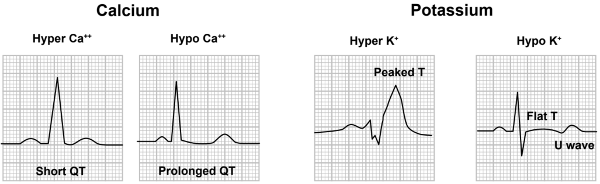

以下为电解质紊乱相关改变，反映心肌组织内钾离子或钙离子水平升高（高）或降低（低）。

+ 高钙血症指血清钙水平升高，心电图表现为 QT 间期缩短，成因是 ST 段消失或显著变短。
+ 低钙血症为血钙水平降低，心电图可见 ST 段延长，进而导致 QT 间期延长。
+ 高钾血症即血清钾浓度升高，心电图特征为 T 波高尖，呈帐篷样改变。
+ 低钾血症指血清钾水平降低，心电图可出现 U 波、T 波低平，部分患者伴 ST 段压低。

26. Other Conditions -- 心房肥大

    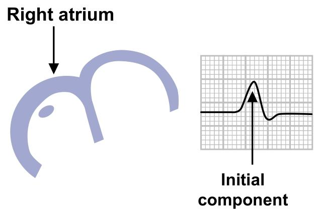
    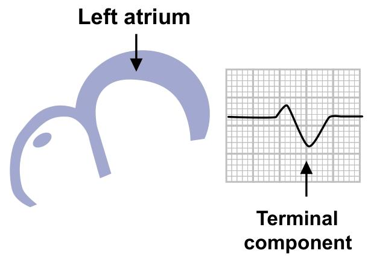

心肌肥厚指心腔室壁因心肌组织增多而出现厚度增加（室壁增厚）

+ 右心房肥厚心电图表现：V₁导联可见双向 P 波，P 波初始正向波宽大、常呈高尖形态，终末负向波细小（正常双向 P 波的终末负向波深度与初始正向波高度相近，可与之区分）。初始波通常为正向。若任一肢体导联 P 波振幅＞2.5 毫米，提示患者大概率存在右心房肥厚。
+ 左心房肥厚的心电图特征：V₁导联呈双向 P 波，P 波初始波细小，终末波宽大，终末波多为负向。高血压是左心房肥厚最常见病因，二尖瓣狭窄也可诱发本病。

27. Other Conditions -- 心室肥大

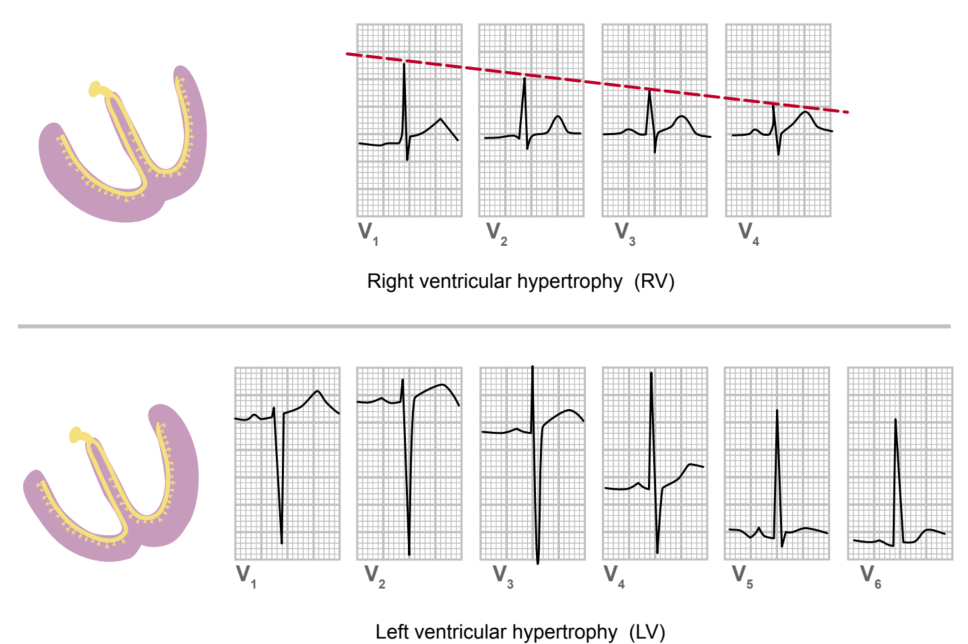

- 右心室肥厚时，心电图V1导联可见高振幅R波；V2、V3、V4等导联的R波振幅逐渐降低。右心室室壁增厚，因此额面心电轴右偏，水平面平均QRS心电向量也会发生偏移。
- 左心室肥厚时，心电图 V₁导联可见深大 S 波，V₅导联可见高振幅 R 波；若 V₁导联 S 波深度与 V₅导联 R 波振幅之和＞35 毫米，即可确诊左心室肥厚。

28. 分支阻滞（Hemiblock）

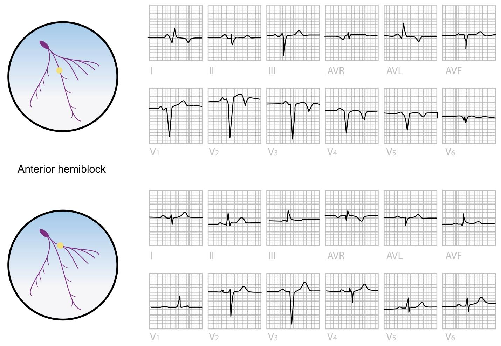

**分支阻滞**是左束支前分支或后分支出现传导延缓，常由心肌梗死引发。

+ 左前分支阻滞为左束支前分支发生传导阻滞。心电特征：QRS电轴≥-40°，I导联可见小q波，且无下壁心肌梗死相关心电图表现
+ 左后分支阻滞是左束支后分支发生传导阻滞。心电图特征：QRS 电轴≥+120°，Ⅲ 导联可见小 q 波，且无右心室肥厚的心电图征象。
+ 双分支阻滞指两支传导分支同时出现传导延缓，通常为右束支传导阻滞合并左束支前分支或左束支后分支阻滞。若左、右束支均发生阻滞，则为完全性左束支传导阻滞。

29. 心肌梗死（Infarction）

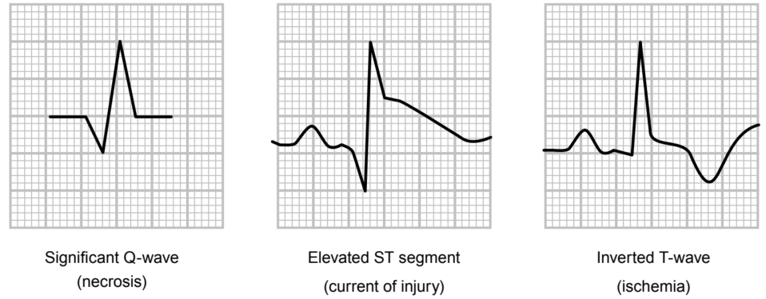

诊断心肌梗死有三项判定标准：心肌坏死、损伤电流、心肌缺血。

- 心肌坏死的心电图特征为病理性Q波：时限≥40ms，或振幅超过同导联QRS波群总高度的1/3。病理性Q波是诊断心肌梗死额依据。
- ST 段抬高代表损伤电流。抬高程度可轻微或显著（≥10 毫米）。ST 段抬高提示急性（新近发生）心肌梗死；随病程进展，ST 段常会回落至等电位基线。
- 心肌缺血时，心电图任意胸导联或肢体导联均可出现对称倒置 T 波。一过性 T 波改变常提示心绞痛，而非心肌梗死。

other conditions see :arrow_right: EnSite System Training Complete WorkBook 1-2 module 2 page 12
