<!-- [[toc]] -->

# Case SVT

## 电生理检查

刺激方法

+ 递减10-50ms/次至室房文氏或室房2:1传导或室房分离或周长达250ms
+ 释放与前传成正比，房室结传导功能决定逆传
+ V-H（S-H）> H-V；逆传H可V前或后
+ 逆传文氏
+ 诱发与终止心动过速

# Case LAA

## [巨大仙人掌型心耳单纯封堵一例丨病例学习](https://www.cmtopdr.com/post/detail/1ac38d2a-237b-4dc8-bfd5-39f4d357b1a1.html)

1. 病史
患者男性，50岁

【主诉】活动后心累、心悸3年余。

【现病史】入院前3年，患者常于活动后出现心累、心悸不适，持续约数分钟，休息后可缓解，无大汗淋漓，无夜间阵发性呼吸困难、端坐呼吸，无咳嗽、咳痰、咯血等，外院就诊诊断“冠状动脉粥样硬化，心脏增大，持续性心房颤动”，口服“华法林3.75 mg qd（INR监测2~3）、瑞舒伐他汀”等药物，症状常反复。

【既往史】否认“糖尿病、高血压病”。患者自诉1年前曾患“急性大面积脑栓塞”，于甘肃某医院行急诊取栓术（具体不详），术后遗留吐词不清，无肢体活动障碍。

【个人史】吸烟20+年，每日1包，饮酒10+年，每日2两白酒。

【家族史】否认家族遗传病史。

**体格检查**

(1)体温36.5℃，脉搏80次/分，呼吸18次/分，血压125/83 mmHg，BMI：25 kg/m2。

(2)双侧颈静脉无充盈，肝颈静脉回流呈阴性，甲状腺无肿大。双肺呼吸音清晰，未闻及干湿啰音。心前区无隆起，心界不大，心率：96次/分，心律不齐，第一心音强弱不等，各瓣膜听诊区未闻及病理性杂音，未闻及心包摩擦音。全腹无压痛、反跳痛及肌紧张，双下肢无水肿。

**实验室检查**

(1)血常规:WBC 6.81×109/L，HGB 147 g/L,PLT 131 ×109/L

(2)生化检查:Cr 103 umol/L,

eGFR 72.6 ml/（min·1.73 m2）

LDL 2.26 mmol/L,TG 4.13 mmol/L,

K+3.75 mmol/L,肝功能示正常

(3)cTNI 5.0 ng/L(0~17.5),NT-proBNP 824.65 ng/L（5~125）

(4)凝血功能:INR 2.25

(5)甲状腺功能:正常

**辅助检查**

(1)心电图：心房颤动，ST-T改变，见图1。

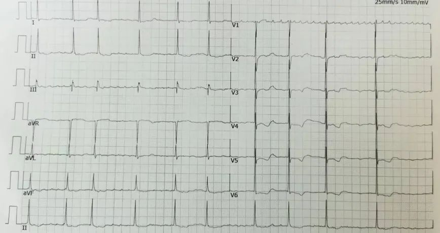

(2)经胸心脏超声图

* LV 60 mm;LA 54 mm;RV 24/36 mm;RA 46 mm;EF 53%;FS 27%；

* 左心、右房增大；三尖瓣、二尖瓣重度反流；主动脉瓣轻度反流；左室收缩功能正常低值

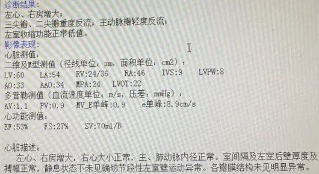

(3)经食管超声图

+ 左心耳内梳状肌发达，回声稍增强，未见确切异常回声；

+ 左心耳充盈及排空速度降低；左、右心房及右心耳未见确切血栓形成

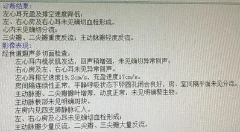

2. 诊断与评估

**(一)入院诊断**

(1)持续性心房颤动

(2)冠状动脉粥样硬化

(3)脑梗死后遗症期

(4)肾功能不全

**(二)术前评估**

手术风险评估 使用卒中风险评分(CHA2DS2-VASc评分)量表(表1-1)和出血风险评分(HAS-BLED评分)量表(表1-2)进行术前评估。

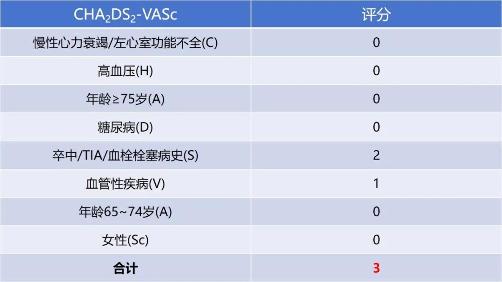

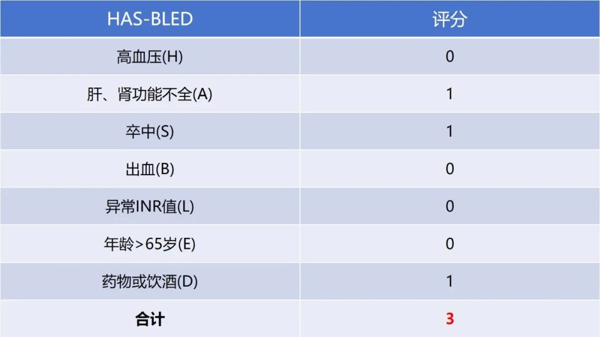

**(三)术前影像检查**

(1)经食管超声

+ 患者左心房自发显影，心耳开口大小25~32 mm，深度29~35 mm（图4）。

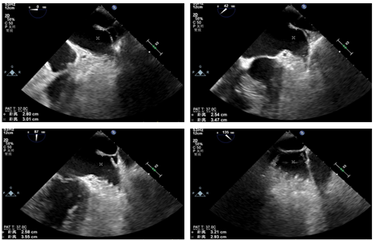

(2)电子计算机体层摄影血管造影

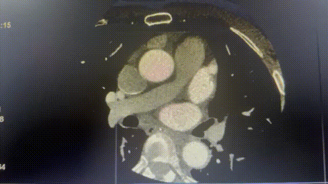

3. 治疗方案

(1)患者有持续性心房颤动，充分抗凝仍发生脑卒中；

(2)预估房颤病史3年余，心脏超声示左心房54 mm；

(3)CHA2DS2-VASc 3分，HAS-BLED 3分，与患者及家属充分沟通后，患者及家属表示不愿意行射频消融术及长期口服抗凝药，同意行左心耳封堵术来预防卒中；

(4)术前食管超声检查排除左心耳内血栓，无明显手术相关禁忌；

(5)拟在全麻下行TEE引导下行左心耳封堵手术。

4. 手术过程

(一)房间隔穿刺

通过术前检查判断，左心耳开口位置较高。因此，房间隔穿刺位点正常靠下靠后即可（图6）。测得左房压＞10 mmHg

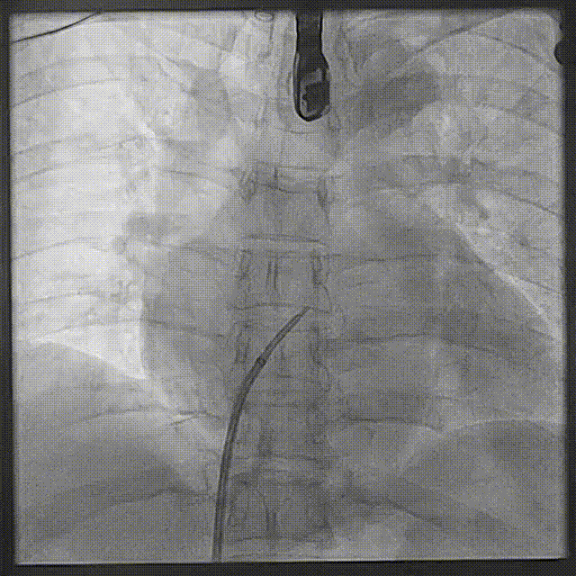

(二)术中左心耳造影

在正常肝位(RAO30°CAU20°)和肩位(RAO30°CRA20°)下多角度造影，获得较清晰的心耳结构（图7）。

  

    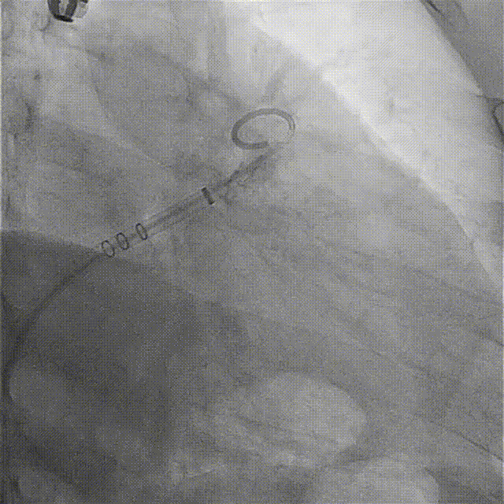
  

  

    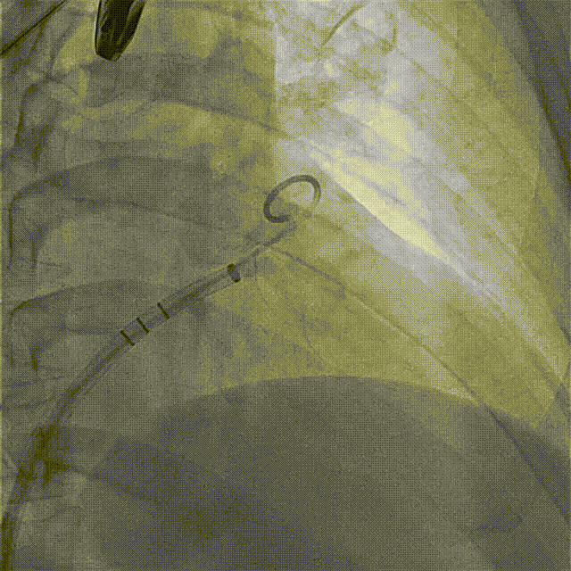
  

图7 术中多体位左心耳造影
 

清晰造影后发现，为仙人掌型心耳，肝位下心耳外口34.8 mm，内口33.3 mm，深度29.5 mm；肩位心耳开口28.5 mm（校准有一定误差，重新换算）。TEE测量心耳开口25~32 mm，心耳呈椭口。（图8）心耳开口较大，考虑放弃心耳外口下缘分叶，封堵内口，利用心耳内部结构增强封堵器稳定性。综上所述：选择33 mm的封堵器。

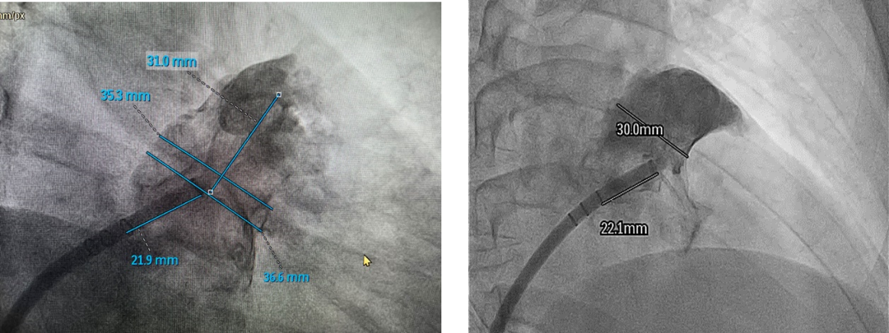

图8 心耳开口和深度测量
 

(三)封堵器展开

DSA屏幕画出左心耳心耳形态水印，明确伞器的着陆区；（图9）。

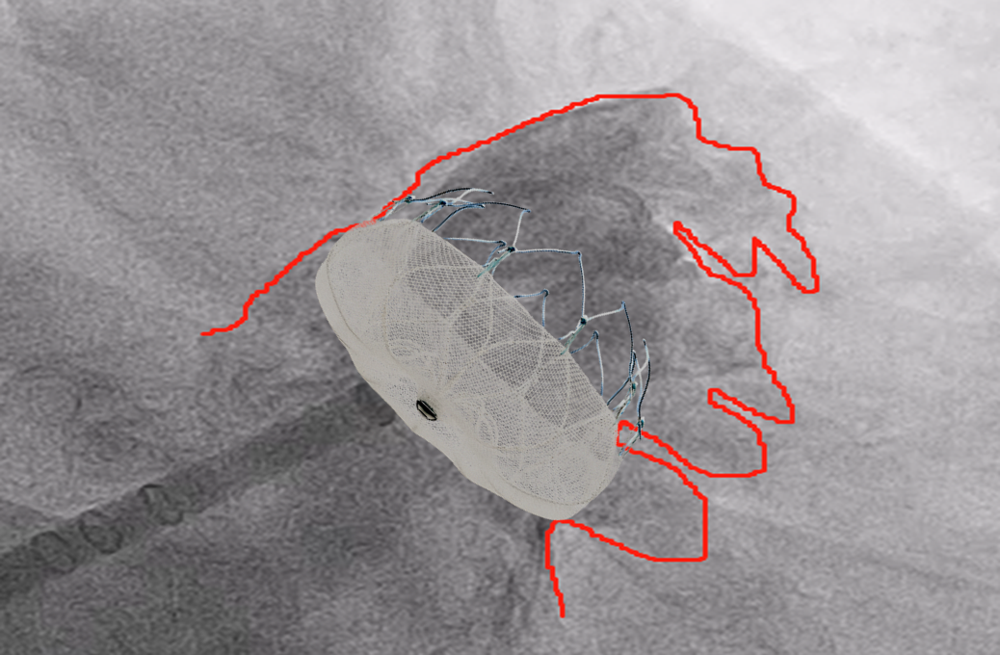

图9 心耳形态水印
 

(1)封堵器第一次展开

鞘管在猪尾的保护下进入心耳体部，撤退猪尾，输送封堵伞，输送系统和导引系统锁合，缓慢退鞘展开，伞器完全展开后，造影观察发现下缘露肩较多，并且有明显残余分流。故准备全回收伞器，重新定位展开。

  

    
  

  

    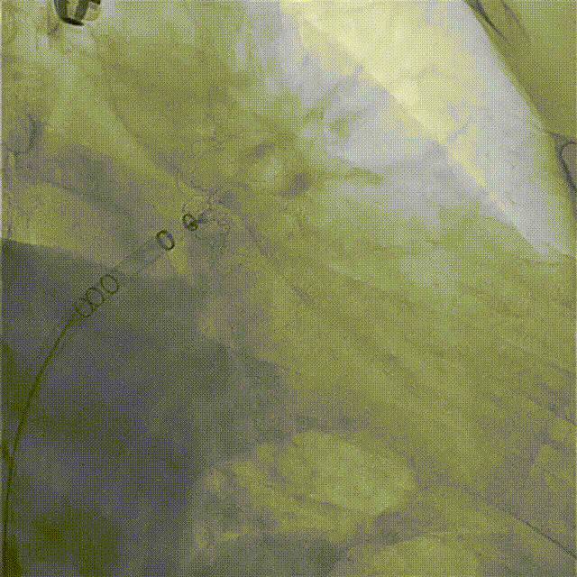
  

图10 封堵器第一次展开过程
 

(2)封堵器第二次展开

封堵器第二次展开后，翻转至心耳口部外侧，不满足封堵心耳的位置条件，故全回收封堵器，重新定位展开。

  

    
  

  

    
  

图11 封堵器第二次展开过程
 

(3)封堵器第三次展开

封堵器第三次展开后，造影观察，封堵效果和预期封堵策略相符（考虑放弃心耳外口下缘分叶，封堵内口，利用心耳内部结构增强封堵器稳定性）。

  

    
  

  

    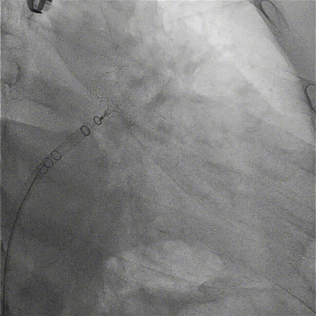
  

图12 封堵器第三次展开过程
 

(四)PASS原则评估

为进一步验证封堵效果，为患者进行镇静麻醉下TEE。在TEE与DSA下综合评估PASS原则。位置Position评估——DSA下造影观察，封堵器位置合适，基本与左心耳平口，下缘无明显露肩（图13）。

图13 DSA下评估封堵效果
 

锚定Anchor评估——牵拉稳定，回弹迅速，DSA下牵拉，封堵器无位移（图14）。

图图14 牵拉测试
 

尺寸 Size——测量多角度压缩比均为15%~24%（表1-3）

  

    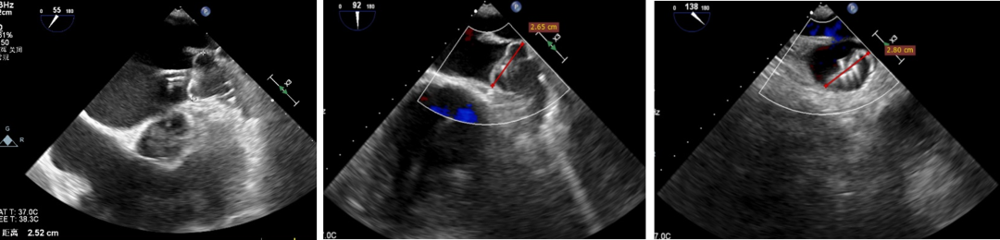
  

  

    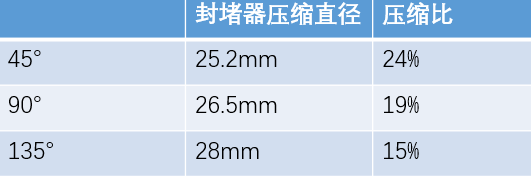
  

TEE下评估封堵效果&压缩比测量数据

封堵Seal评估——多角度下未发现残余分流，符合PASS原则（图16）

  

    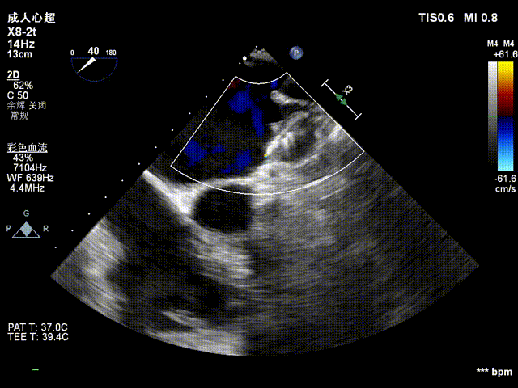
  

  

    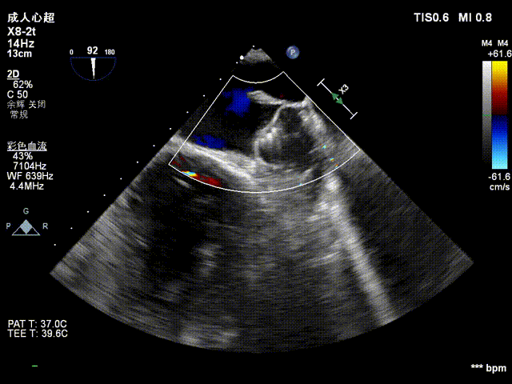
  

  

    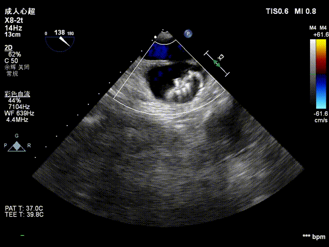
  

  

    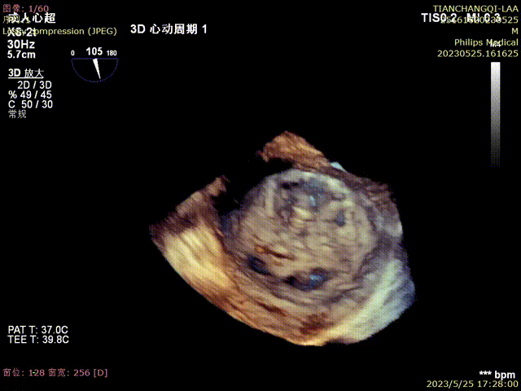
  

图16 TEE下三维评估残余分流

(七)释放封堵器

符合PASS原则，释放封堵器（图17）。

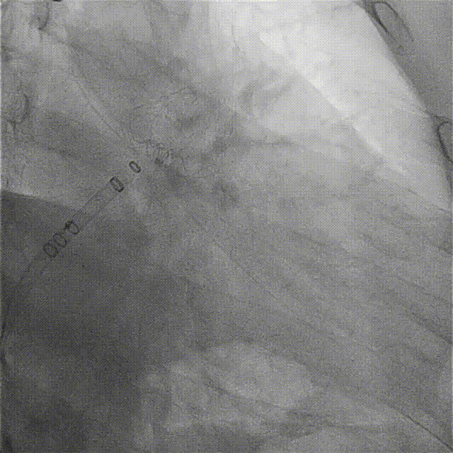

图13 DSA下评估封堵效果
 

5. 术后情况

(一)术后用药

结合患者意愿、出血风险、卒中风险决定：

(1)利伐沙班片15 mg 口服 1天1次

(2)瑞舒伐他汀钙片10 mg 口服 1天1次

(3)琥珀酸美托洛尔缓释片23.75 mg 口服 1天1次

(4)嘱患者出院后45天复查经食管超声心动图（当天禁食禁饮）

(二)随访

术后45~60天TEE随访，封堵效果良好，未见明显残余分流。 

6. 术者小结

对于开口较大的心耳，可以通过封堵策略的调整或者利用心耳本身解剖结构进行封堵。

DSA心耳造影测量数据与食管超声测量数据可以综合参考，共同评估心耳开口实际大小。

此例持续性房颤患者，左房增大，消融成功率较低，充分抗凝仍发生卒中，单纯封堵或是最佳获益方案随着患者年龄增大，合并其他疾病的增加，卒中风险急剧增加；药物经济学角度，一次封堵终身获益，患者获益远大于终身服用抗凝药；低龄患者，对生活质量要求更高，左心耳封堵术可以有效提高患者的生活质量，建立患者的生活信心。

