[[toc]]

# 案例分析

## 第二节 

---

Case 1:

> + 46岁女性，因“阵发心悸10年，加重半年”入院。
> + 既往贫血病史
> + 查体:贫血貌，BP 11868mmHg，心率130次/分，心律
> + 齐，各瓣膜区未闻及杂音，双肺呼吸音清
> + 心动过速心电图
> 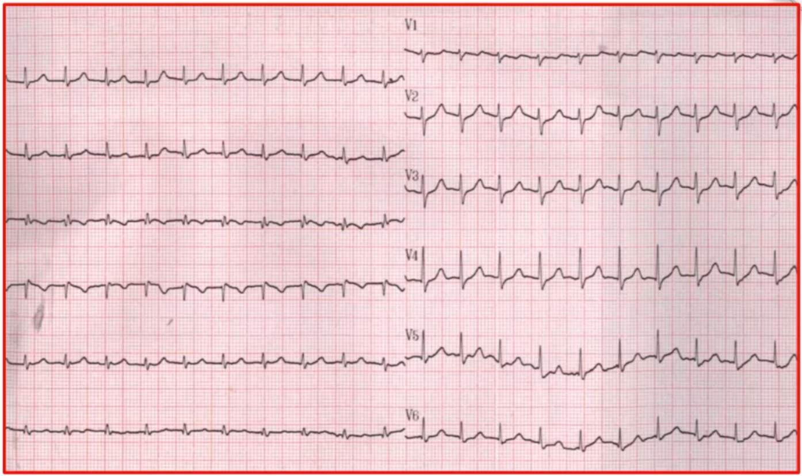
> 
心电图分析：窄QRS心动过速，P波看不到。
 
> + 窦律下心电图：
> 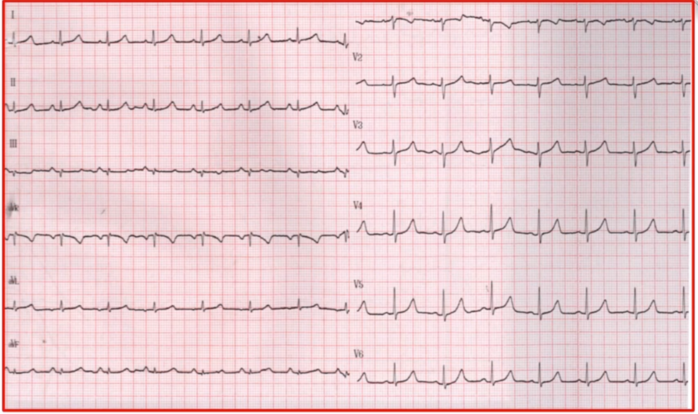
> 
心电图分析：下壁导联P波直立，没有特别的
 

临床上常见的室上速有两种，房室结折返性心动过速和房室折返性心动过速。根据心电图表现，可以判断为AVNRT。可以看到两张图，II、III、AVF的QRS终末期，明显多了一个s'波，aVR和aVL两个导联的中末部似乎多了一个r'波。

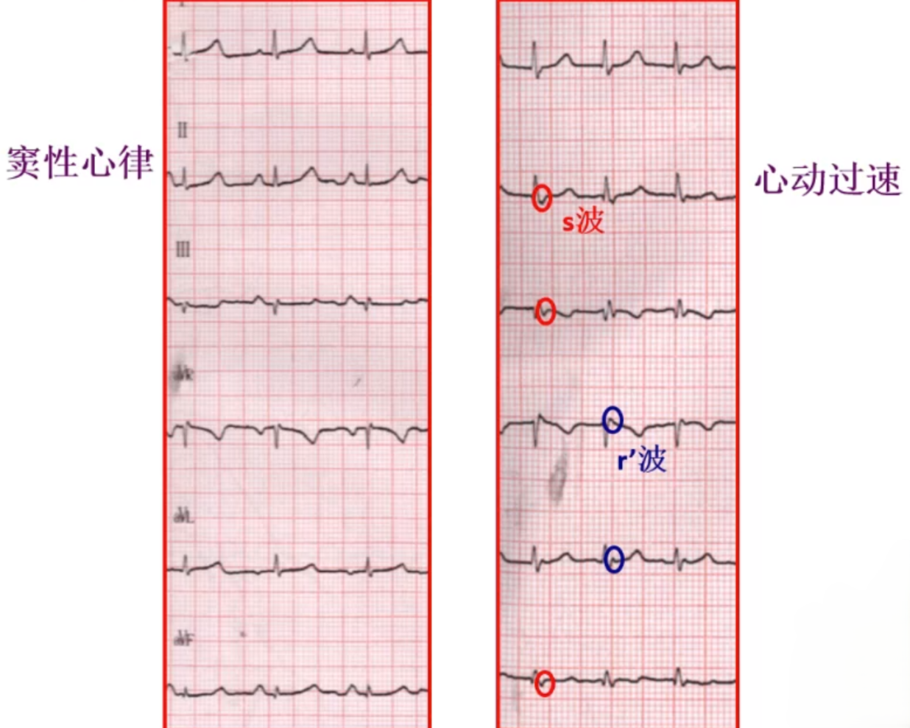

正常的传导路径一般是从窦房结开始，到房室结，从而使整个心房激动，所以下壁导联P波通常是直立的。如果房室结先激动，传导到窦房结，那么下壁导联P波就会是负向的。aVR和aVL应该是直立的。
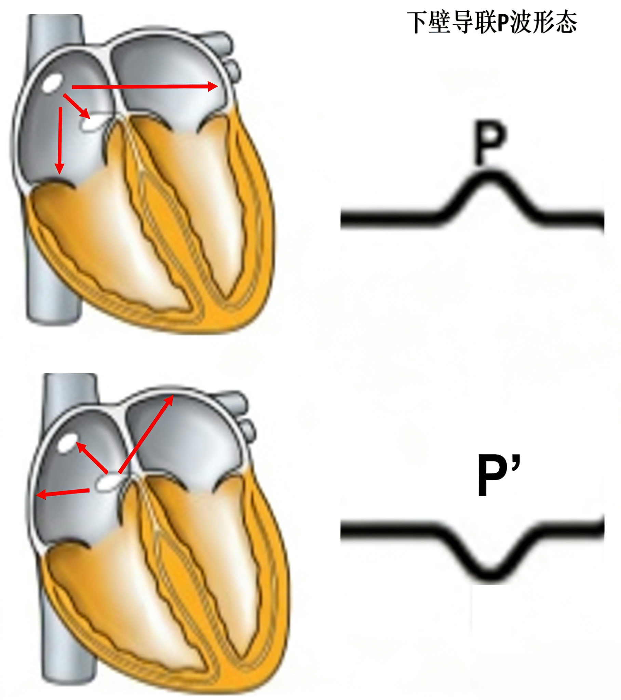

::: tip AVNRT逆P‘波特点
房室结折返性心动过速时，心室前向激动，心房逆向激动，二者同时故理论上QRS波终末可见逆P'波。额面电轴上看，在向下的导联形成假性s波，在向上的导联aVL、aVR形成假性r波。V1导联终末部也常见假性r波。
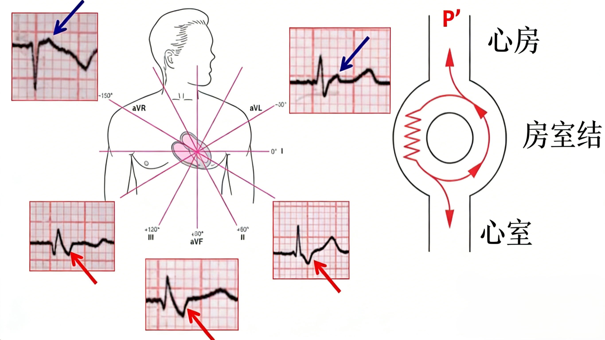

:::

---

Case 2:

> + 70岁男性，因“心悸3天”至急诊
> + 既往无冠心病、高血压、糖尿病等慢性病史
> + 查体:BP 100/78mmHg，心率144次/分，心律齐，各瓣
> + 膜区未闻及杂音，双肺呼吸音清，双下肢不肿
> + 急诊心电图：
> 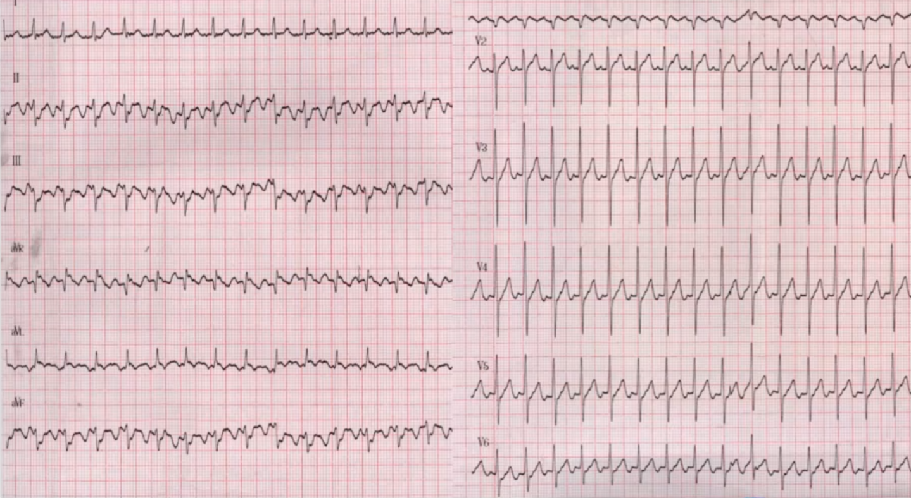

> + 予以地尔硫卓10mg静推后：
> 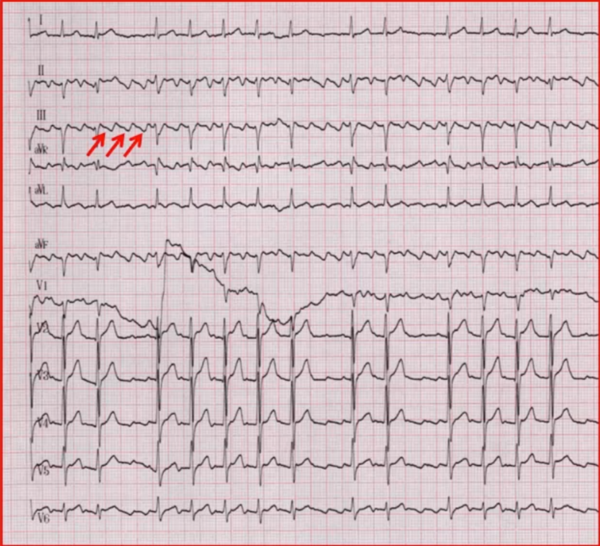
> 很明显可以看出是个房扑的表现：下壁导联没有等电位线，锯齿波，周长200ms，V1可见直立的r波，对应的V6导联是倒置的P波，因此这是一个三尖瓣依赖的逆钟向典型房扑。

::: tip 房扑和室上速区分
房扑2：1发作的时候，如何判断是房扑还是室上速。第二张图的QRS波形态是正常的，第一张心动过速的QRS波形态似乎变宽了。
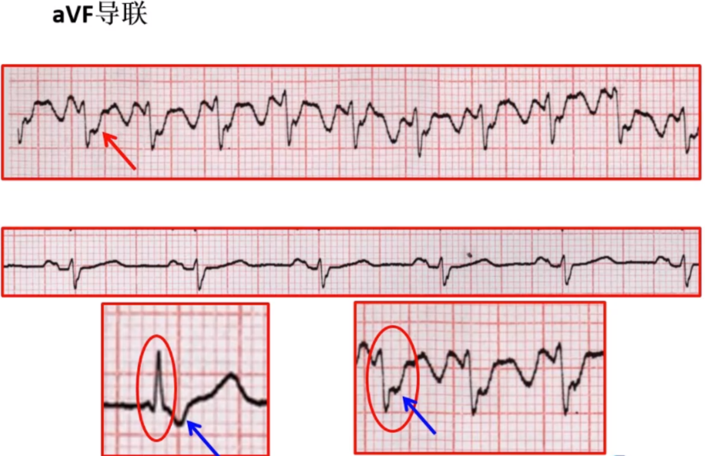

+ 阵发性室上速的逆P波可能隐藏于QRS波当中(不可见)，或者在QRS波终末部，为叠加的r波或s波，但不改变原有的QRS波形，可参见病例一心电图
+ 房扑的锯齿波与QRS波融合，QRS波增宽，终末部可见粗钝切迹
+ 窄QRS波室上速时，下壁导联T波通常直立 (取决于QRS波方向) 。如果窄QRS发作时，下壁导联“T波”负向，且“QT间期”延长很多需要考虑“T波”其实是房扑发作时的F波
:::

---

Case 3:

> + 74岁男性，因“阵发性心悸1年，加重2天”入院
> + 否认冠心病、高血压、糖尿病等病史
> + 查体: BP133/79mmHg，HR70bpm，心律齐，各瓣膜区
> + 未闻及杂音
> + 窦律心电图：
> 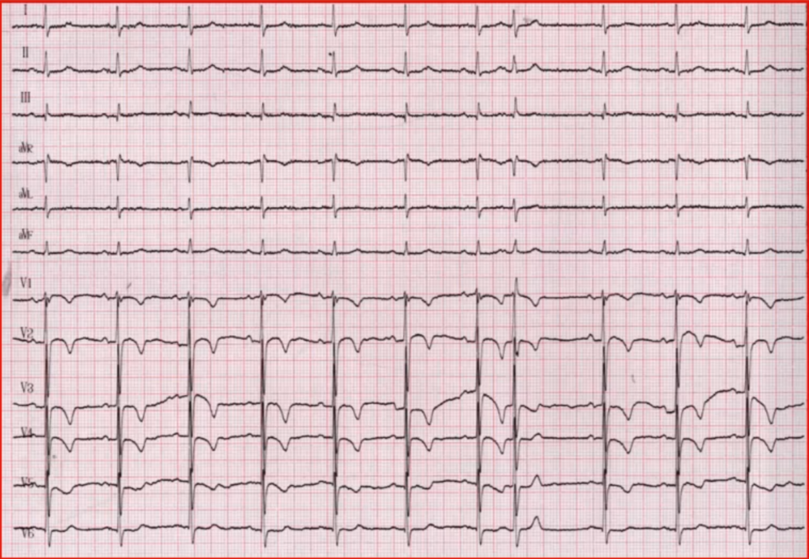
> 
由心电图可见，有一条早搏，胸导联T波倒置
 
> + 心动过速心电图
> 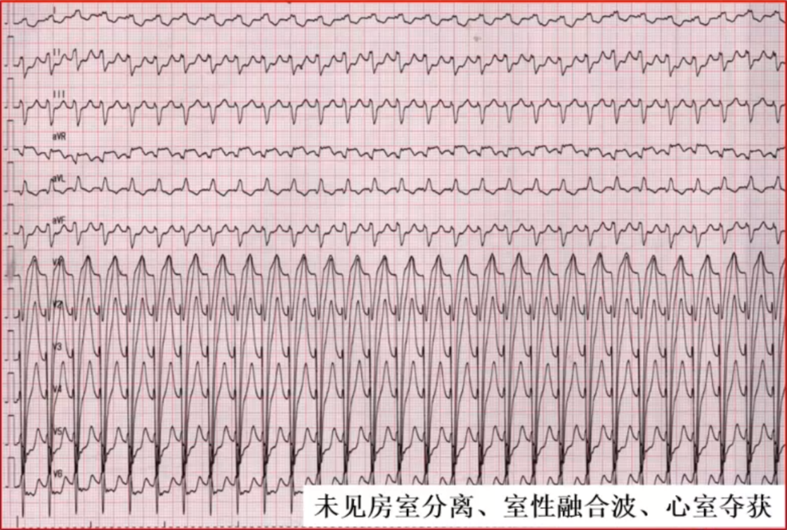
> + 呈左束支阻滞型的宽QRS心动过速，如前支锐利，多为室上速或束支折返性室速。
> 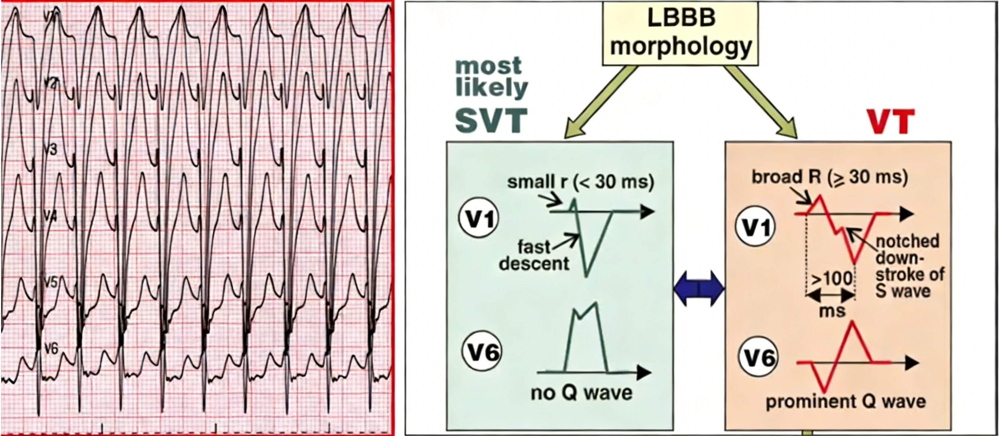

<!-- ---

Case 4:

+ > 10岁男性，因“反复晕厥”就诊
+ > 查体无导常
> + 心电图：
> 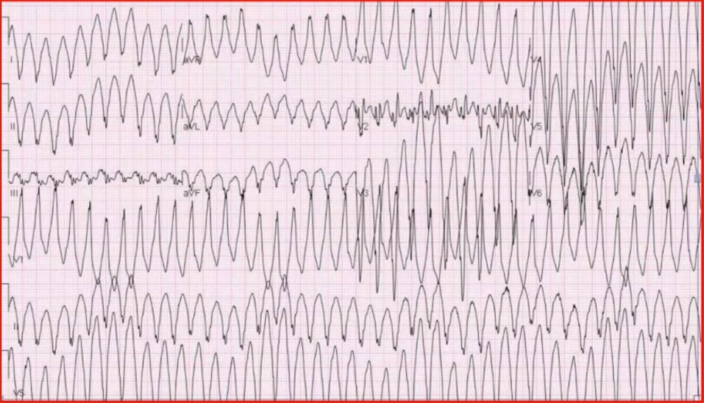
> 
室速，
 
> + 窦律心电图：
> 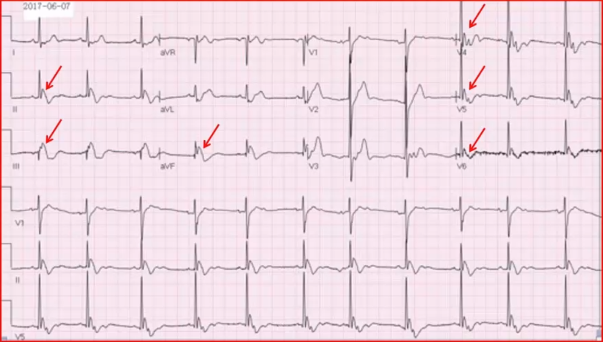
> 
窦律下，下壁导联
  -->
