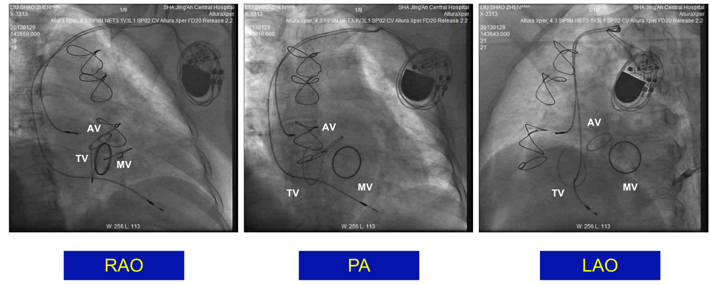

<!-- Electrophysiological examination 电生理检查 From 2025-12-01 孙育民 -->

# 电生理检查

## 第一部分

刺激方法：

+ 心房（RAA/CSm）/心室（B/A）
+ 窦性心律下/心动过速下
+ 单发/多发/连续/（拖带）

**SVT诊断流程--九步**

+ 测定基础窦律下AH，HV
+ 心室S1S1递减刺激，必要时希式旁起搏
+ 心室S1S2递减刺激，观察VA逆传情况（有无VA linking）
+ HRA S1S2递减起搏，观察前传情况和有无回波
+ CSm S1S2递减起搏，观察前传情况和有无回波
+ 诱发心动过速（心房或心室刺激）
+ 测定心动过速下AH，HV，HA间期
+ 希式不应期VES，心室拖带 心房AES/entrainment
+ 终止心动过速，以SVT CL起搏心房或心室

大部分不用这么做，遇到间隔附近起源的SVT完整流程对诊断会有帮助

**我们刺激的目的是鉴别和诊断**
+ 窄QRS心动过速包括：
    + JT
    + AT
    + AVNRT
    + 顺向型AVRT
    + 少数VT
    + 一些合并：AT合并AVNRT、AVNRT合并旁道
+ 宽QRS心动过速
    + VT
    + 逆向型AVRT
    + SVT（AT/AVNRT）伴旁道前传
    + SVT伴束支阻滞/差传

**选择合适的刺激方法**

**窦性心律时**
+ 心动过速终止情况：终止于A（排除AT），终止于QRS（无价值），终止于心室起搏QRS后（排除AT）
+ 希式旁起搏：证实是否存在旁道
**心动过速时**
+ JT和AVNRT诊断/VT/预激性心动过速
    + 心房不应期刺激
    + 心房非不应期刺激
    + 心房拖带
+ AT/AVNRT/顺向型AVRT鉴别
    + 心室不应期刺激

    + 心室非不应期刺激

    + 心室拖带

**解剖体位**

::: warning 注意
+ 标测电极尽量齐全 (RVHIS/CS/HRA）其是HIS标测电极;
+ RV标测电极尽量靠近瓣环 (RV基底部)
+ 重视心动过速诱发阶段和终止阶段;
+ 使用“证实存在什么？”、“排除什么”、“还不能排除什么”等
:::

对于一个窄QRS心动过速，我们需要鉴别AT、AVNRT、顺向型AVRT，需要进行心室刺激。

+ 窦律下：常规刺激+希式束旁起搏
+ 心动过速下：心室RS2刺激+心室拖带

## 第二部分