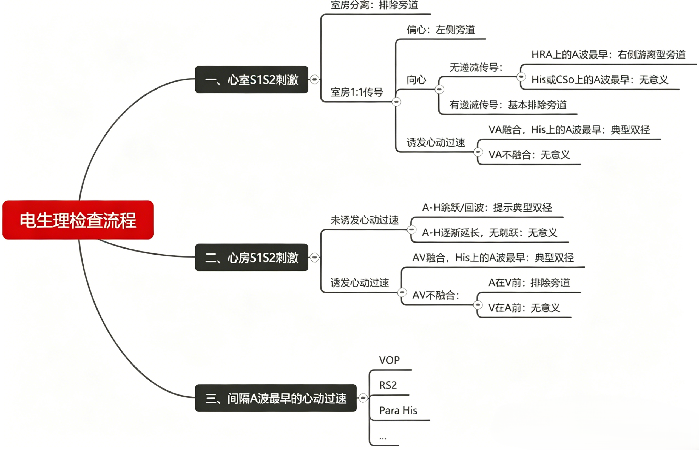
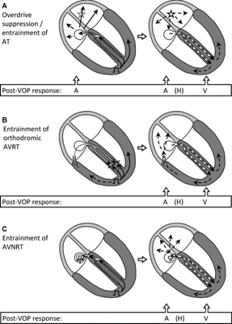
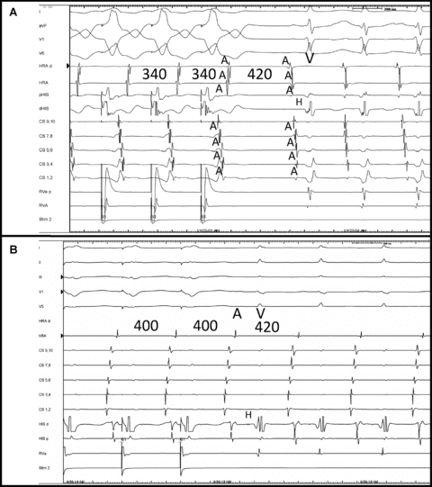
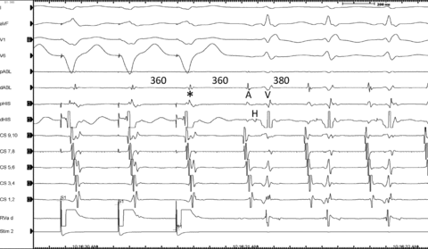
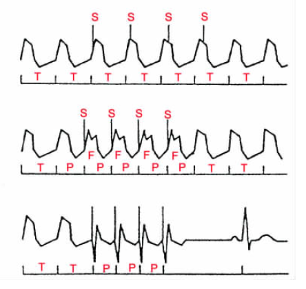

<!-- Electrophysiological examination 电生理检查 From 2025-12-01 孙育民 -->

# 电生理检查

## 第一部分

刺激方法：

+ 心房（RAA/CSm）/心室（B/A）
+ 窦性心律下/心动过速下
+ 单发/多发/连续/（拖带）
+ 测定基础窦律下AH，HV
+ 心室S1S1递减刺激，必要时希式旁起搏
+ 心室S1S2递减刺激，观察VA逆传情况（有无VA linking）
+ HRA S1S2递减起搏，观察前传情况和有无回波
+ CSm S1S2递减起搏，观察前传情况和有无回波
+ 诱发心动过速（心房或心室刺激）
+ 测定心动过速下AH，HV，HA间期
+ 希式不应期VES，心室拖带 心房AES/entrainment
+ 终止心动过速，以SVT CL起搏心房或心室

大部分不用这么做，遇到间隔附近起源的SVT完整流程对诊断会有帮助

**我们刺激的目的是鉴别和诊断**
+ 窄QRS心动过速包括：
    + JT
    + AT
    + AVNRT
    + 顺向型AVRT
    + 少数VT
    + 一些合并：AT合并AVNRT、AVNRT合并旁道
+ 宽QRS心动过速
    + VT
    + 逆向型AVRT
    + SVT（AT/AVNRT）伴旁道前传
    + SVT伴束支阻滞/差传

**心室超速起搏（VOP）：**

::: tip VOP
方法：

+ 测量TCL，以短于TCL 10-40 ms S1S1起搏心室
+ 如果VA=1:1，停止起搏，拖带后第一跳
+ 起搏部位（心尖、基底）

判断标准：

+ 如拖带时VA分离，提示房速
+ V-A-A-V：诊断房速
+ V-A-V：提示AVNRT或AVRT
+ 心室超速刺激（VOP）的陷阱

三种常见室上性心动过速（SVT）机制对心室超速起搏（VOP）的反应
每幅图中：方波代表起搏位点，实心箭头为逆向起搏波前，虚线箭头为顺向波前，点线箭头为前一次心搏产生的顺向波前。
图 A：房性心动过速（AT）
心室超速起搏可对室上速产生超速抑制（局灶性机制，图中淡星号示意）或拖带现象（折返性机制）。末次起搏脉冲经逆传激动心房，随后出现一次房速搏动（星号标注），该搏动再经前传激动心室，因此表现为A-A-V 或 A-A-H 反应。
图 B：顺向型房室折返性心动过速（AVRT）
本图为右侧游离壁旁路介导的顺向型房室折返性心动过速。心室超速起搏的末次脉冲经房室旁路逆传至心房，再沿折返环路经房室结、传导系统前传激动心室，故表现为A-V 或 A-H 反应。起搏产生的逆向波前，与前一次心搏的顺向波前发生碰撞（黑色横条），碰撞部位可位于心内传导系统（如图所示）或心室肌内。
图 C：典型房室结折返性心动过速（AVNRT）
心室超速起搏的末次脉冲经传导系统逆传，进入房室结折返环的可激动间隙，沿快径路激动心房，再经慢径路折返至希氏 - 浦肯野系统并激动心室，因此表现为A-V 或 A-H 反应。心室超速起搏过程中，被刺激产生的逆向波前在房室结慢径路内发生波前碰撞（黑色横条）。

**例子：**

图A：心房性心动过速（周期长度360毫秒）中，停止超速心室起搏（340毫秒）后的反应。心房周期长度（CL）被加速至心室起搏CL，然后在停止起搏后立即减慢。最后一个加速至起搏CL的心房电图是第一个标记为“A”的心房电图。停止起搏后的反应为AAV，表明诊断为房性心动过速（AT）。另请注意，在1:1心室-心房（VA）传导（低至高心房激活）的起搏过程中，室间隔心房电图（pHIS、CS 9、10）先于高右心房（HRA）电图出现，而在AT期间，这种激活方向则相反（高至低心房激活）。在1:1 VA传导的超速心室起搏期间，心房激动顺序的改变也符合房性心动过速（AT）的诊断（事实上，仅心动过速期间心房激动呈下降模式就足以提示AT的诊断）。图B：在利用隐匿性左侧旁路诱发的正向房室折返性心动过速（AVRT）中，停止右心室超速起搏后的反应。心房周期先加速至心室起搏周期，然后在停止起搏后立即减慢至起搏前心动过速的心房周期。VOP期间的心房激动顺序与SVT期间的心房激动顺序相同​​。最后加速至起搏周期的心房电图标记为“A”。停止起搏后的反应为AV，这排除了AT的诊断。 （刺激至心房[SA] = 285 ms；VA = 210 ms；SA-VA = 75 ms；PPI = 520 ms；TCL = 380 ms；PPI-TCL = 140 ms；cPPI-TCL = 120 ms。由于起搏部位与左侧房室折返性心动过速（AVRT）回路的距离，cPPI-TCL 和 SA-VA 的差异处于“临界值”。）

**起搏陷阱：**

一种“伪房室传导阻滞反应”。心房加速至超速起搏周期长度（CL = 360 ms），起搏停止后心动过速恢复（380 ms）。请注意，最后一次起搏后第二个心房电图是最后一次加速至起搏周期长度的心房电图，因此这是一种房室传导阻滞反应。未能识别这一点可能导致将最后一次起搏后的第一个心房电图（*）计入心室后起搏反应，从而错误地得出房室传导阻滞反应的结论。实际上，这是一个快慢型房室结折返性心动过速（PPI = 565 ms；cPPI-TCL = 185 ms；SA = 415 ms；VA = 265 ms；SA-VA = 150 ms）。标记为 pABL 和 dABL 的记录来自右心房。冠状窦导管电极标记为 9、10 为近端，1、2 为远端。

**PPI-TCL：> 115 ms： AVNRT < 115 ms： AVRT**

:::

**解剖体位**

::: warning 注意
+ 标测电极尽量齐全 (RVHIS/CS/HRA）其是HIS标测电极;
+ RV标测电极尽量靠近瓣环 (RV基底部)
+ 重视心动过速诱发阶段和终止阶段;
+ 使用“证实存在什么？”、“排除什么”、“还不能排除什么”等
:::

对于一个窄QRS心动过速，我们需要鉴别AT、AVNRT、顺向型AVRT，需要进行心室刺激。

+ 窦律下：常规刺激+希式束旁起搏
+ 心动过速下：心室RS2刺激+心室拖带

## 第二部分

# 零碎知识

## 拖带

拖带定义
+ 心动过速发作时给与高于心动过速频率（超过心动过速5-10bpm，TCL-20 ms）的连续高频刺激（S1）
+ 刺激发生夺获，使心动过速频率加速至起搏频率
+ 停止起搏后，心动过速频率回复到刺激发放前

解释：第一个没有带起，第二个起搏带起来，且停止起搏后，心动过速频率回复到刺激发放前；第三个拖带停止后回复窦律

**融合波：**当心脏内同时存在两个独立的节律点时, 两者可同时或先后激动心脏的同一心腔(心房或心室), 进而形成心电图中的心房或心室融合波。