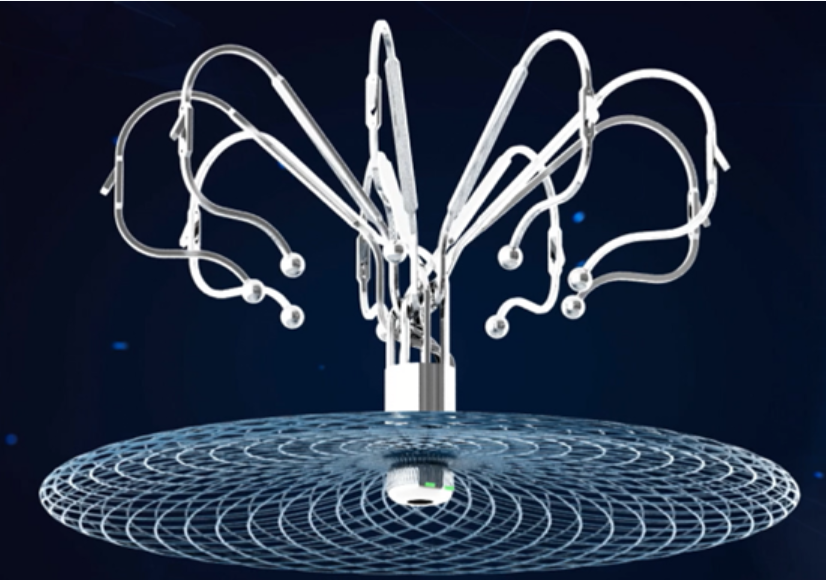
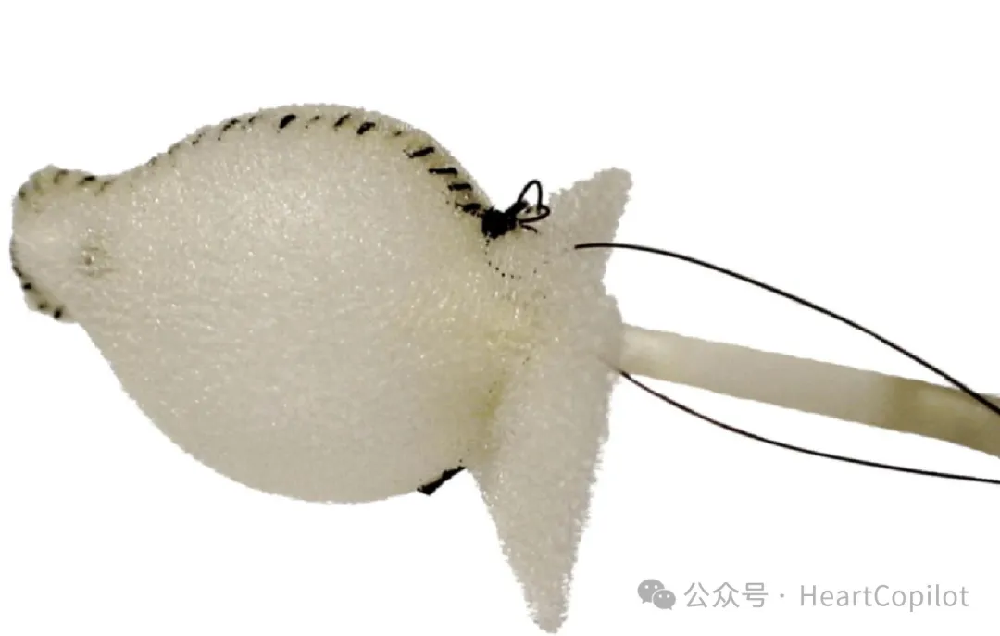

# 左心耳

不同类型的左心耳封堵器械[^1]

## 市面上左心耳型号
### PLAATO封堵器

PLAATO是首个经皮左心耳封堵设备，该装置由覆盖有聚合物膜的自膨胀镍钛合金笼制成，设备直径为15-32 mm，在经食管超声心动图指导下通过12 F鞘管输送。

### Amplatzer Cardiac Plug (ACP I)、Amulet (ACP II)
2003年发表了第一项使用Amplatzer房间隔封堵器封堵左心耳的研究。共有16名58–83岁的非瓣膜性房颤患者在四个中心接受治疗，其中14人在局部麻醉下进行。1例发生急性器械栓塞，4个月随访时未观察到进一步的并发症，所有病例左心耳均完全封堵。

但Amplatzer最初是为封堵房间隔缺损而开发的，不是专用于左心耳的器械。ACP Ⅰ是一款双碟样左心耳封堵装置，其结构类似于Amplatzer房间隔封堵装置，由一个置于左心耳的碟形叶片和一碟形帽构成，期间由凹陷的腰部连接，远端的碟形片置于左心耳防止移位，近端的碟形帽封住左心耳的耳口。

<!--  -->

   

Amplatzer房间隔封堵器（A）、ACP I和ACP II（B-D）左心耳封堵器
 

Amulet是第二代Amplatzer LAAC设备。与ACP相比，Amulet装置具有更多的锚定钩、更深的远端叶、更重要的椎间盘、更长的腰部和凹陷的端部螺钉，以减少左心房中暴露的金属。Amulet前瞻性全球观察性研究招募了1088例患者，82.8%的患者存在长期抗凝的绝对或相对禁忌。手术成功率为99.1%，手术相关不良事件为4%。缺血性卒中发生率为2.2%/年，与CHA2DS2VASc评分预测的发生率相比降低了67%。

### Watchman封堵器

Watchman 2.5是波士顿科学的第一代左心耳封堵器，由输送系统（含预装的封堵器）、14Ｆ导引系统两部分组成。封堵器主体为自膨胀的镍钛合金骨架，骨架带有固定钩和聚对苯二甲酸乙二醇酯（PET）膜，封堵器直径在21~33 mm之间。

   

第一代和第二代Watchman封堵器
 

2009年发表的PROTECT AF 试验纳入707例房颤患者，CHADS2评分≥1，被认为具有高出血风险。患者以2:1随机分配接受Watchman 2.5封堵器或华法林治疗。在平均18 个月的随访中，Watchman 2.5装置在卒中、全身性栓塞和心血管疾病死亡的主要复合终点方面不劣于华法林。

Watchman 2.5于2015年被FDA批准，成为第一个在美国获批的左心耳封堵器械；但第二代Watchman FLX面世后不久，Watchman 2.5就不再销售了。WATCHMAN FLX封堵器在外形结构、骨架技术、锚定钩设计、材料工艺等诸多细节进行了改进，使之能够适用于临床上各种类型的左心耳形态，提高封堵成功率；还兼具进退自如的操控性，进一步提升手术的安全性。据2022年美国心血管研究技术大会（CRT）上发布的真实世界研究数据显示，WATCHMAN FLX手术相关严重不良事件的比例为0.37%，成功率高达98%。

WATCHMAN FLX Pro 左心耳封堵器建立在WATCHMAN FLX 左心耳封堵器的基础上。WATCHMAN FLX左心耳封堵器于2020年7月获得FDA批准。

最新的WATCHMAN FLX Pro装置经过增强，具备抗血栓聚合物涂层、可视化标记和更多样的尺寸选择，以适应更多患者的需求。此前一项临床前研究表明，在装置表面愈合速度更快、更可控。另有数项临床前研究的数据显示，聚合物涂层可在手术后3天内减少了86%的炎症，14天内减少了70%的血栓，并在术后45天内增加50%的内皮组织覆盖率。

产品特点:

抗血栓涂层：WATCHMAN FLX™ Pro配备了专门设计的抗血栓聚合物涂层，有助于减少与装置相关的血栓风险，提高治疗的安全性和效果。

可视化标记：新增的可视化标记使医疗专业人员能够更准确地定位和放置装置，以确保最佳的封堵效果，从而改善治疗结果。

更多样的尺寸选择：WATCHMAN FLX™ Pro提供多种尺寸选项，包括全新推出的40mm尺寸，以适应不同患者的需要，拓展了治疗的范围。

此外，该装置还保留了FLX的关键特性，包括让医生能够安全进入和操纵的全圆形设计，以及取回、重新定位和重新部署，以实现精确的放置。而框架的设计优化了装置与周围组织的接触，确保了长期的稳定性和更快速、更全面的密封效果。

### LAmbre封堵器

LAmbre是一种盘式封堵器，包含一套以镍钛合金管为骨架的自膨式固定伞及通过中心杆相连的封堵盘。固定伞由8个带小钩的爪型杆固定到左心耳壁，上面覆盖一层聚酯合成纤维膜。封堵盘较固定伞直径大4~6 mm，用于封闭左心耳外口。固定伞直径设计为16~36 mm，封堵盘较固定伞大4~6 mm。小伞大盘型号可用于双腔及多腔的左心耳，固定伞直径设计为16~26 mm，封堵盘较固定伞大12~14 mm。

2018年，在欧洲开展的LAmbre左心耳封堵器临床应用的结果显示， 60例口服抗凝剂禁忌的房颤患者接受LAmbre封堵左心耳的手术成功率100%。6个月时的经食道超声心动图显示94.4%的患者左心耳完全封闭（残余分流<5 mm），没有记录到与设备相关的血栓。在12个月时，1例患者出现TIA，3例患者出现轻微出血。

### WaveCrest

WaveCrest封堵器形状与WATCHMAN装置类似，它带有可回收的锚钉，表面附有ePTFE膜，远端设计为相反方向的闭合环。初步临床试用的63例患者中，随访中无严重不良心血管事件发生。

### LARIAT系统

LARIAT不是严格意义上的封堵器械，而是一种环形缝线系统，对左心耳进行结扎，成功率高达96％。

### Ultraseal封堵器

Ultraseal是一种自膨胀封堵器，于2016年获CE标志批准。输送系统为10~12F。多中心经验表明，器械植入成功率97%，2.4%的患者发生重大围术期不良事件（心包积液、卒中或器械栓塞）。

与第一代产品相比，Ultraseal Ⅱ代封堵器的远端固定盘去除了中心固定铆，使得封堵器的径向张力减小，安全性增加。封堵器的总长度从15~21 mm减小至10～18 mm，更能适应浅心耳。心房侧的覆盖盘边缘增加了聚合物裙边，避免了器械对周围组织结构的磨损。

### CLAAS封堵器

CLAAS是一款完全不同于已上市产品的左心耳封堵器，采用专有的基于泡沫的体系结构，旨在通过两种尺寸（27 mm和35 mm）适应大多数解剖结构，以更好地封堵左心耳。

CLAAS的泡沫基质有助于确保安全、无创伤的输送，而其膨胀聚四氟乙烯（ePTFE）覆盖层可减少血栓形成事件。此外，该器械无需经食管超声心动图辅助，以便医生可以在没有全身麻醉的情况下进行手术，这将是一项重大的进步，有可能实现在患者清醒镇静的情况下进行手术操作。

在早期可行性研究中，CLAAS显示出令人满意的效果。在TCT 2020年会上公布的美国多中心试验EFS研究，共纳入22例患者，CHA2DS2-VASc平均评分为4.4分。手术成功率为82%（4例患者由于左心耳太大不适合常规植入），其中1例出现器械相关血栓形成，2例出现器械残余漏。

### LAmbre封堵器

先健科技LAmbre封堵器系统于2016年获欧盟CE认证、2017年获中国NMPA注册批准，是首款上市的中国自主研发左心耳封堵器系统。该封堵器采用伞盘支架设计，径向支撑左心耳，加强固定效果；8个倒刺可插入心耳壁，帮助固定封堵器；8个U型倒钩可嵌入不同结构的梳状肌, 增加锚定稳固性。11种常规型号规格，可对大部分左心耳实现完全封堵。

更稳固的锚定设计：独立伞盘式结构，径向支撑左心耳，加强固定效果；8个倒刺可挂住心耳壁，帮助固定封堵器；8个U型倒钩可抓住梳状肌，增加锚定稳固性。

更大范围地适用于不同的左心耳结构：17种型号规格，能够满足各类左心耳解剖结构的完全封堵；6种小伞大盘型号规格，可实现多分叶、窄锚定区左心耳的封堵；对左心耳深度要求更低，适用于封堵浅心耳。

更可靠的输送及释放机制：左心耳近端锚定，鞘管无需深入心耳，减少组织损伤；术中实现完全回收再释放；8-10Fr. 输送鞘管，最小化病人血管损伤

更快内皮化： 封堵器采用纳米陶瓷(TiN)涂层，促进器械表面内皮化进程，降低血栓形成风险

新一代左心耳封堵器LAxible™由固定盘和密封盘两部分组成，临床使用时通过释放器械于左心耳内，预防左心耳内血栓脱落导致的脑卒中。

产品优势：

固定盘一体化设计能够提高结构的稳固性和耐疲劳性能，使得固定盘稳固性提高18%；

倒刺末端做钝化处理，有助于减少心包积液发生率，提升手术安全性；

固定盘阻流膜全包覆（除倒刺外）使得U型钩更柔软，与心耳接触更安全。

LAxible™左心耳封堵器最大的改进就是对初代的末端倒刺进行了钝化处理，球头末端增加了与心耳接触的表面积，有效降低对心耳壁压力，大大减少心包积液的发生率。此外，LAxible™还扩充了规格型号至22种，针对患者心耳情况的多样性提供了更丰富的选择方案。这都使得其安全性和有效性得到了很大提升。

### LACbes 封堵器

普实医疗的LACbes是我国自行设计研究开发的双盘式结构左心耳封堵器，其独特结构是与固定柱一体化编织并雕刻、具有形状记忆性能的微倒刺。该装置的固定柱周围有10~14个倒刺，设计的倒刺不仅可以固定牢固，而且经过反复回收和释放，倒刺形状和角度均无改变。该装置于2019年上市并应用于临床。

产品特点

1、倒钩反复多次收放不变形

2、覆盖盘边缘钝化，避免 SSA迟发磨损

3、分段式结构，张力灵活可控

4、密网编织，贴合稳固

LACbes 左心耳封堵器是我国自行设计研究开发的双盘式结构左心耳封堵器，其独特结构是与固定柱一体化编织并雕刻、具有形状记忆性能的微倒刺。该装置的固定柱周围有10~14 个倒刺，这也是该装置的主要创新点。倒刺与固定柱自成一体，使用激光雕刻技术完成。这种设计的倒刺不仅可以固定牢固．而且经过反复回收和释放，倒刺形状和角度均无改变。

上市前的临床研究显示，共入组175例患者，手术成功率为98.86%，术后使用双联抗血小板药物，术后3、6、12个月经食道超声随访发现，器械相关血栓发生率仅0.58%，围术期无卒中发生。12个月的随访中发生1例卒中。

### MemoLefort封堵器

乐普医疗的MemoLefort封堵器采用内塞式设计，由形状记忆合金镍钛骨架作为支撑，具备良好的径向支撑力，顺应性突出，适用于大部分左心耳结构。微米级的阻流膜能够有效阻流血液，封堵器边缘的一体式倒刺确保释放后器械稳固于左心耳内部。

产品特点：内塞式设计，保证封堵器内嵌于左心耳内部，植入后不影响心耳周围组织。 

自膨镍钛合金骨架，具备良好顺应性，适应大部分左心耳开口。

一体切割成型倒刺，确保释放后稳固于左心耳内部。

结构特点：采用花苞型内塞设计；远端内扣;五个型号规格，满足98.5%心耳封堵要求。

### Laager®封堵器

心玮医疗研制的Laager®左心耳封堵器，具有圆润钝头倒刺设计，锚定安全稳固，同时一体式圆结构固定盘，适度支撑力更加贴合左心耳内壁，其编织圆形封堵盘及内嵌铆头，助力内皮细胞快速攀附，此外，Laager®封堵器固定盘和封堵盘之间为活连接点，可自适应多样左心耳结构。该产品于2022年4月获得国家药品监督管理局（NMPA）批准上市。

产品特点：

- 术中可进行多次回收重复释放，便于术者精准定位；固定盘为闭合切割支架设计，降低术中心包积液风险。
- 封堵盘铆头内嵌设计，降低DRT风险，助力内皮细胞快速攀附；固定盘具有适度径向支撑力，可柔韧贴合左心耳内壁。
- 盘塞结合设计，封堵截流全方位保证；固定盘和封堵盘均覆盖阻流膜，有效封堵无残余分流；固定盘和封堵盘采用活连接套杆设计，更好地自适应多种左心耳结构。
- 更小输送外径：小外径，大内腔，安全输送；特有定位标记，输送位置掌控自如；综合表现：输送系统三层复合结构，输送更顺滑；输送杆上特有标记位点，缩短手术时间，为术者和患者获益。

### LAMax封堵器

信立泰旗下子公司自主研发的LAMax封堵器系统使用全镍钛合金金属材质，具有MRI兼容、高耐腐蚀性能、收放自如且锚定稳固，以及器械血栓概率低等多项优点。该产品于2022年6月获NMPA批准上市。

结构设计

全镍钛合金金属材质，MRI兼容；

全镍钛合金金属材质，提高耐腐蚀性能；

独立编织锚杆，收放自如，锚定稳固；

螺母突出<1mm，表面光滑，器械血栓概率低。

专利改性技术

封堵盘内创新表面改性聚酯膜，降低器械血栓风险；

编织网盘内嵌无纺密孔聚酯膜，封堵无残余漏。

### Leftear封堵器

2022年9月，脉搏医疗自主研发的Leftear左心耳封堵器系统也获得NMPA的注册批准。Leftear左心耳封堵器在全球现有同类产品结构的基础上创新性地设计出目前全球唯一的“双体内塞型”结构，其独特的梯形结构封堵盘设计，使封堵盘在左心耳内适应性更强，封堵效果更理想。

Leftear®左心耳封堵器系统是一套复杂的精密系统，主要包括左心耳封堵器与输送系统等两大组成部分，其中：左心耳封堵器包括固定盘、封堵盘等主要结构；输送系统包括输送鞘管、扩张器、输送钢缆、装载器等部件。

### SeaLA封堵器

2022年11月，德诺医疗的SeaLA左心耳封堵器也获得NMPA批准注册。据悉，该产品的密封盘和锚定盘的设计均采用了创新的专利设计，锚定盘和封堵盘由镍钛网编织成型，缝合PET覆膜。锚定盘加倒刺的独特设计，保证了其可靠的锚定。

E-SeaLA是新一代带有消融功能的左心耳封堵器，利用PFA能量的非热效应消融技术，集高效左心耳电隔离与左心耳封堵于一体，真正解决临床痛点。E-SeaLA左心耳消融封堵器是带有消融功能的左心耳封堵器，临床中不需借助三维标测设备，仅靠DSA、超声的引导即可完成左心耳的消融与封堵，快速高效地实现左心耳完全电隔离。

左心耳消融封堵器+标测导管优势：

脉冲环状消融可同时消融左心耳口部与颈部

；可完全回收重新释放；

只需DSA、超声的引导；

标测导管实时监测左心耳

电信号。

可调弯输送鞘优势：

头端3D双弯预弯设计；近TIP段可实现30°～90°可调弯，实现封堵器精准释放。

### AnchorMan左心耳封堵器系统

2024年1月5日，上海佐心的AnchorMan®左心耳封堵器系统获NMPA批准上市，成为中国唯一获批的半封闭型左心耳封堵器产品。此外，其已于2023年12月递交了CE标志注册申请。

AnchorMan®左心耳封堵器系统由左心耳封堵器与输送系统组成，适用于非瓣膜性房颤脑卒中危险评分CHA2DS2-VASC≥2，且有长期口服抗凝治疗禁忌或抗凝治疗后仍有卒中风险的非瓣膜性房颤患者。

产品特点

1.尾部12个“3D折叠”单元与网架形成半封闭结构，兼顾了开放式和封闭式封堵器的优点，2.解决了传统内塞式封堵器鞘管必须深入心耳的临床痛点，实现器械稳固锚定；

3.器械远端圆润且柔软，可降低对心耳组织的损伤；         

4.致密的镍钛合金网架设计使其更好地顺应心耳，提升密封效果；

5.有推送和回撤两种释放方式，为术者提供更多选择。

### Laminar左心耳封堵系统

Laminar左心耳封堵系统（LAAX）采用的封堵机制不同于其他现有的左心耳封堵装置。由于左心耳常呈椭圆形而非圆形，因此传统封堵器械在置入左心耳内部时可能出现适配欠佳的情况。而本装置则采用经导管方式，通过一体化的球形结构及锁定机制，实现对左心耳囊袋的隔绝和消除。

Laminar系统使用的是一种自膨式的镍钛合金球体，用以抓持左心耳组织，其锁定装置呈花朵状，由六个相互咬合的“花瓣”构成，可与球体精确配合以实现对组织的压迫闭合。球体在输送鞘内脱鞘后，通过导管导引至左心耳口中央，直至接触到左心耳后壁\[7\]。随后，通过逆时针旋转球体，抓取左心耳口周围的组织，并将组织聚拢后包绕在球体与锁定装置之间的主轴（spindle）上。在透视和经食道超声（TEE）引导下，锁定装置被进一步推进并与球体结合，从而压迫组织并将左心耳完全隔绝。上述步骤在装置最终释放之前均具有可逆性。

在人体植入研究中分别使用了直径为12 mm和16 mm两种规格的球体。对15例患者进行的临床研究显示，所有患者植入成功，随访至术后12个月未发生任何与手术相关的不良事件，也未发现超过5 mm的封堵漏隙。这是首个采用旋转闭合并消除左心耳的经导管介入封堵系统。

### Pmf左心耳封堵器

Pfm Medical公司开发了一种名为Pfm的左心耳封堵系统，该装置由镍钛合金（nitinol）制成，整体结构分为三部分，包括远端锚定装置（distal anchor）、中段连接器（middle-length connector）以及带有次级锚定结构的近端封堵盘（proximal disc with secondary anchor）。

### Occlutech左心耳封堵器械

Occlutech公司左心耳封堵装置（Occlutech LAA occlusion device）采用自膨式结构，由锥形镍钛合金网状支架（nitinol wire mesh）制成，可主动适应左心耳解剖结构。装置远端设有环状边缘结构（distal loop rim），有助于提高植入后的稳定性。该装置的外表面部分覆盖了一层非编织结构（non-woven）、生物稳定的聚氨酯（polyurethane）材料，其近端直径较大，可实现有效的左心耳开口封堵。该装置最初的版本直径范围为18 mm至33 mm。植入时建议超尺寸选择2至4 mm以保证良好的贴合与封堵效果。更新的型号称为Occlutech Plus左心耳封堵装置（Occlutech Plus LAA closure device）。新版装置在原有基础上增加了锚定结构，以进一步确保安全牢固地固定于左心耳内，且聚合物涂层也进行了优化，以改善装置植入后的组织向内生长（ingrowth）。Occlutech Plus封堵装置已在猪模型中进行了相关研究，人体临床试验则处于计划或待启动阶段。

### Sideris Patch封堵系统

经导管补片装置（Transcatheter Patch device）用于封堵心脏缺损，该装置由聚氨酯泡沫（polyurethane foam）制成。使用稀释造影剂充盈支撑球囊，使其扩张直径可达15至25 mm。补片底端缝制有一个2 mm的尼龙环（nylon loop），并连接双股尼龙线，用于装置回收。

[^1]:[微信公众号-不同类型的左心耳封堵器械](https://mp.weixin.qq.com/s/hGfgDCvVlJAnhB6gO7pKHQ)
