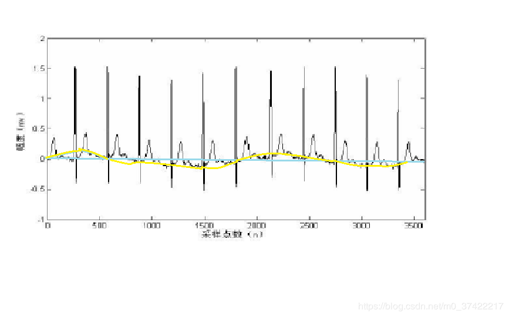
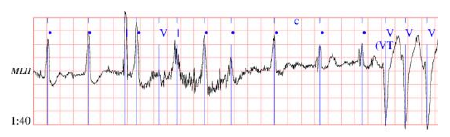
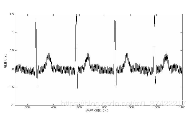

# TIPS 

## 1. 心包积液怎么看
> 正常心包由壁层和脏层两层组成。脏层心包紧贴心外膜，是由单层间皮细胞构成；壁层主要由纤维组织构成，厚度<2mm。这两层结构包绕了心脏的4个腔室，并在大血管根部新城反折，以此构成的腔隙称为心包腔。正常情况下容纳12~35ml的浆液，主要分布于房室沟和室间沟。 

## ECG噪声来源

人体的心电信号是一种非平稳、非线性、随机性比较强的微弱生理信号,幅值约为毫伏(mV)级,频率在0.05-100Hz之间。

心电信号的干扰主要有以下三种:

-   基线漂移,一般是由呼吸和电极滑动变化所异致的,频率一般低于1Hz,其表现为变化比较缓慢的类正弦曲线，对心电波形中的ST段识别影响较大。基线漂移的频率很低，其范围为0.05Hz至几Hz，主要分量在0.1Hz左右，而心电信号的P波、T波及ST段的频率也很低，其范围为0.5Hz至10Hz，两者的频谱非常接近，在消除噪声的同时，不可避免地对心电信号成分造成一定的损失。

肌电干扰,它是由人体肌肉颤抖产生不规则的高频电分扰所导致的,其频率范围很宽,一般在10-1000Hz之间,严重的肌电干扰信号频率在10～300Hz之间，其频谱特性接近于瞬时发生的高斯零均值带限白噪声。

-   工频干扰,主要来源于工频电源以及器件周围环境中的传输线辐射出的电磁场,频率为50Hz或60Hz,在ECG上出现为周期性的细小波纹,其频率成分主要为工频频率及其谐波

