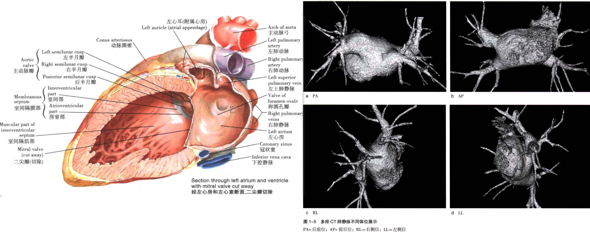
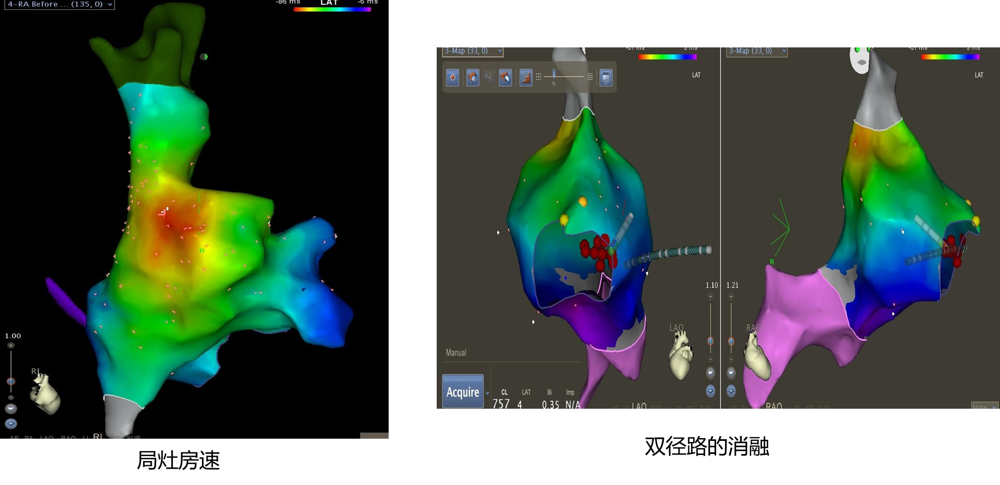
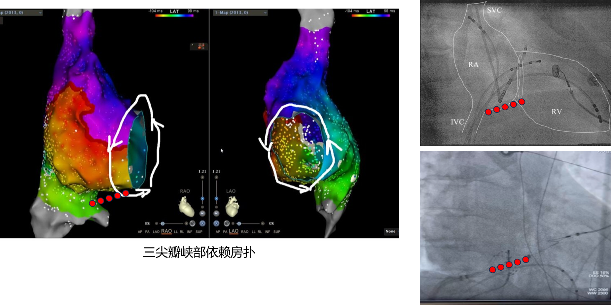

[[toc]]

# 1. 心脏解剖和传导系统

## 心脏解剖

<!-- 

    
    

 -->

  

    
  

  

    
  

心脏位于前方对胸骨体和第2-6肋软骨，约2/3位于正中线的左侧，约1/3位于正中线的右侧。两侧与胸膜腔和肺相邻，上方连出入心的大血管，下方为膈。

  

    
  

  

    
  

+ 右心房

右心房比左心房前、低，IVC-欧氏嵴-Todaro键-房室结快径区，此处有冠状窦口，附近Koch三角。

+ 左心房

## 心脏传导系统

  

    
  

  

    
  

心脏的传导系统功能是发生冲动并传导到心脏的各个部位，使心房肌和心室肌按一定节律性收缩。冲动在窦房结形成后经节间束、房室结、HIS束、左右束支和浦肯野纤维网，最终抵达心室并使之激动。冲动在窦房结形成后，由右心房右上部经房间束（Bachmann束）传导到左心房。

+ 窦房结 60-100 bpm
  + 心脏最主要的起搏位点
  + 位于右房和上腔的交界处
+ 节间束
  + 将窦房结发放的冲动传导到房室结
+ 房室结 40-60 bpm
  + 管理房室传导
  + 交通站：实际上延迟了房室的传导，使心房收缩后心室再收缩
+ 希式束
  + 心室传导系统的开始
  + 激动通过束支传导
  + 使唯一的心房和心室之间的正常传导连接
+ 左右束支
  + 传导激动到心室
+ 浦氏纤维网
  + 整个心室传导的特殊细胞
  + 三级起搏系统
  + 20-40 bpm

# 2. 心脏电生理检查及腔内电图基础

- [ ] 了解电生理导管室的基本配置
- [ ] 描述各种导管及穿刺鞘进入的穿刺位点
- [ ] 清楚识别常规导管的放置
- [ ] 清湖描述心电图的基本信息
- [ ] 了解滤波的概念
- [ ] 能清楚识别和测量各心内心电信号的传到剑气

## 电极导管的放置和记录

心电生理检查时通常把电极导管分别放置在右房侧壁上部和下部（HRA），右室心尖部（RVA），冠状静脉窦（CS）和希式束区域（HBE）。也可根据需要将导管放置在新墙内的其他一些部位，进行左心导管术时应适当给与肝素抗凝。

  1. 右心房（RA）：通常采用下肢静脉穿刺的方式将记录电极经下腔静脉放置在右心房内。右房后壁高部与上腔静脉交接处（HRA）是最常用的记录和刺激部位。
  2. 右心室（RV）：与右心房电极类似，右心室电极多采用下腔静脉的穿刺途径。右室心间部（RVA）是最易辨认的，在此处进行记录和刺激的重复性最高。
  3. 左心房：左心房电活动的巨鹿和起搏较难。因冠状静脉窦围绕二尖瓣环走行，故通常采用将电极导管放置在冠状静脉窦的方式间接记录或起搏左房（CS）。采用自颈静脉的途径较易将电极导管成功送入位于右心房内后方的冠状静脉窦口，常用的冠状静脉窦导管为6级或10级的记录电极，根据各级的先后激动顺序可以协助定位左侧起源的心律失常。
  4. 希式束：位于房间隔的右房侧下部，冠状静脉窦的左上方，卵圆窝的左下方，靠近三尖瓣口的头侧。希式束是心房和心室间主要的或是唯一的传导途径，希式束电图（HBE）也是心脏电生理检查中不可缺少的组成部分。将电极导管经下肢静脉穿刺后送入右心房，在三尖瓣环口贴近间隔处可以记录到希式束电图。希式束电图由一组波群组成，其中心房电位波以A代表，希式束电位波由H代表，心室电位波由V代表。将希式束电图结合右心房和右心室记录的电位，可以测量出激动经心脏不同部位时的传到时间。

# 3. 心律失常概述
## 心脏电生理疾病分类

心率失常按位置分类：
- 不适当窦性心动过速
- 房性早搏
- 房性心动过速（局灶型）
- 心房扑动：典型房扑、不典型房扑（不典型房速）
- 心房颤动:阵发型、持续型
- 阵发型室上性心动过速（PSVT，室上速）：AVRT、AVNRT
- 交界性心动过速
- 室性早搏
- 特发性室性心动过速：流出道起源，分支型室速
- 器质性室性心动过速

---

## 房速

[💡 AT](/docs/electrophysiology/Aarrhythmia#_3-室上性心动过速)

房性心动过速(atrial tachycardia，AT)又称为**局灶房速**，是指信号起源于心房局灶且无需房室结参与维持的一种快速性心律失常（心率>100 bpm）。

---

## 房扑

[💡 AFL](/docs/electrophysiology/Aarrhythmia#_5-房扑)

房扑是一种发生在心房内的快速型异位心律失常，常有固定折返环路。

分类：
+ I型房扑（典型的AFL）：三尖瓣峡部依赖房扑
+ II型房扑（非典型AFL\/AT）除了典型房扑外的房扑类型
  
特点包括：窦性P波消失，代之以频率250~350 bpm 的锯齿状或波浪状F波，QRS波群形态受F波影响，可能呈现差异性。房室传导比例异常，常见2:1或3:1、4:1现象。典型房扑锯齿状明显，容易判断。

从体表心电图判断：体表心电图中，注意锯齿样的F波，根据心电向量的原理，II、III、AVF导联为负向时提示传导由心房峡部逆传到房间隔，进而激动整个心房

典型房扑可不依赖三维标测直接判断为典型房扑，确定消融位置为三峡。

典型房扑可不依赖三维标测直接判断为典型房扑，确定消融位置为三峡

🌟 可以使用花瓣状脉冲消融导管进行三尖瓣峡部消融

---

## PSVT（阵发性室上性心动过速）

[💡 PSVT](/docs/electrophysiology/Aarrhythmia#_3-室上性心动过速)

PSVT分为双径路和旁道，发生机理为折返，频率150~220 bpm。

- AVNRT（双径路）：微折返
- AVRT（旁道）：大折返

室上性心动过速的消融位置：

🌟 找到局灶位置（红色位置）消融即可，双径路消融房室结附近一条通路

---

## 室早（室性期前收缩）/室速

- 室早：起源于心室内部的异位期前收缩。宽大畸形的QRS波，发生机制局灶
- 室速：连续三个以上的宽大畸形QRS波

> 💡 为什么室早室速QRS宽大畸形，房早房速QRS波正常？
> 房早房速电信号通过房室结经希浦系统传入心室走的是高速通道，而室早室速电信号通过心肌细胞间传导速度慢

