本文是《心房颤动导管消融图谱》和《心房颤动导管消融学》的学习笔记

[[toc]]

---

## 一、肺静脉电位的识别
### 右肺静脉电位的识别
> PVI是房颤导管消融中最常用的技术，是目前阵发房产治疗最有效的介入治疗方法，也是持续性/持久性房颤消融的重要组成部分。
> 需要了解3个方面的理论知识：
> - 肺静脉电位的识别
> - 肺静脉在房颤发生维持中的作用
> - 肺静脉-左心房传导阻滞的验证

窦律下左右心房间的电连接
 

由[心脏解剖左心房](./Cardiac-Anatomy.md#3-左心房)右肺静脉开口直接位于房间隔上，右上肺静脉走行在上腔静脉后方，右下肺静脉向右后下走行，有时其间还有较小的中肺静脉。右肺静脉附近能产生电位的解剖结构有左心房、右心房和上腔静脉。

右肺静脉的鉴别：
|  | 性质 | 电位特性 | 窦性心律时时相 | 环肺静脉消融后时相变化 | 冠状窦近端起搏后时相变化 |
| :--- | :--- | :--- | :--- | :--- | :--- |
| 左心房电位 | 远场 | 小、钝 | — | 无变化 | — |
| 肺静脉电位 | 局部 | 尖锐 | 与左心房电位平齐或稍落后 | 落后于左心房电位，隔离后可消失 | 与左心房电位间距加大 |
| 上腔静脉电位 | 远场 | 尖锐 | 提前于左心房电位 | 无变化 | 与左心房电位间差距不明显 |

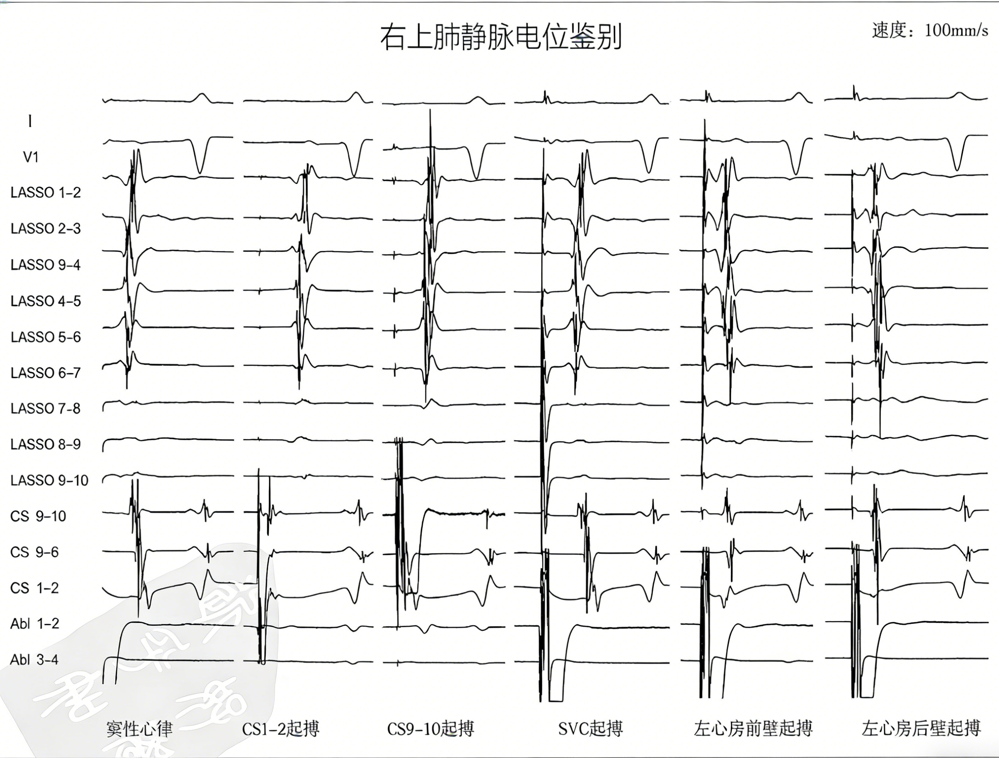
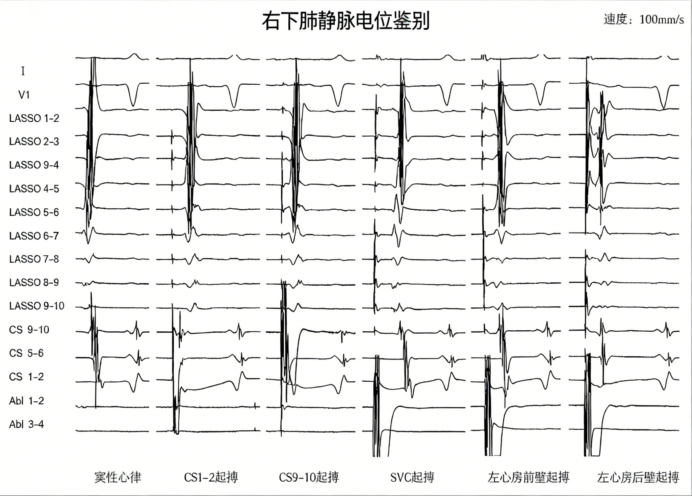

::: tip 窦律下右肺静脉电位
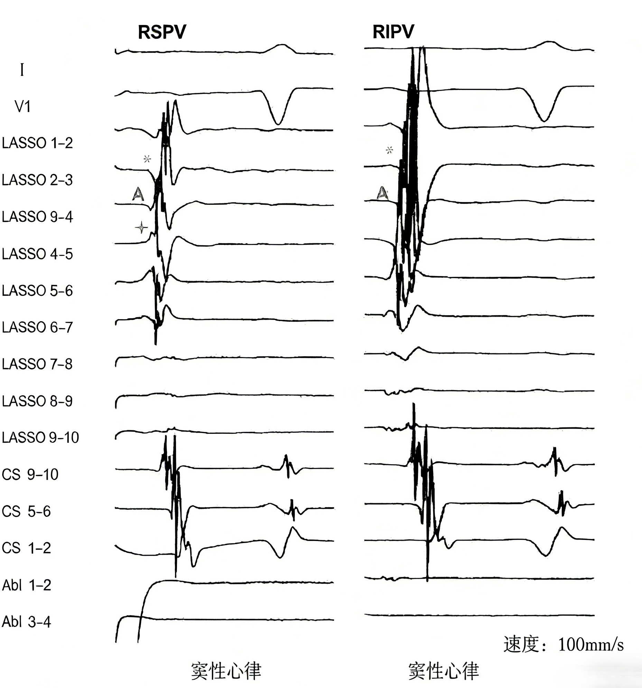
💡 窦性心律下，放置在右上肺静脉的 LASSO电极记录到的电位有三个组成部分:心房电位（A ）、上腔静脉远场电位（+）和肺静脉电位（*）,右下肺静脉走行偏后，一般不可能记录到上腔静脉或右心房远场电位。

💡 LASSO电极放置在肺静脉内时，记录到的心房电位通常是远场电位，比较低钝；如果LASSO电极放置在肺静脉口心房交界处时，记录到的心房电位可以比较高大尖锐，为心房局部电位。

💡 消融前右侧肺静脉电位通常与心房电位同一时相或稍落后，通过在心房其他部位起搏往往也无法鉴别。

<!-- 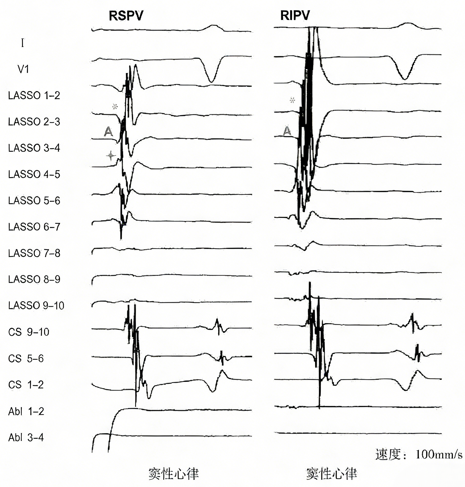 -->

  
  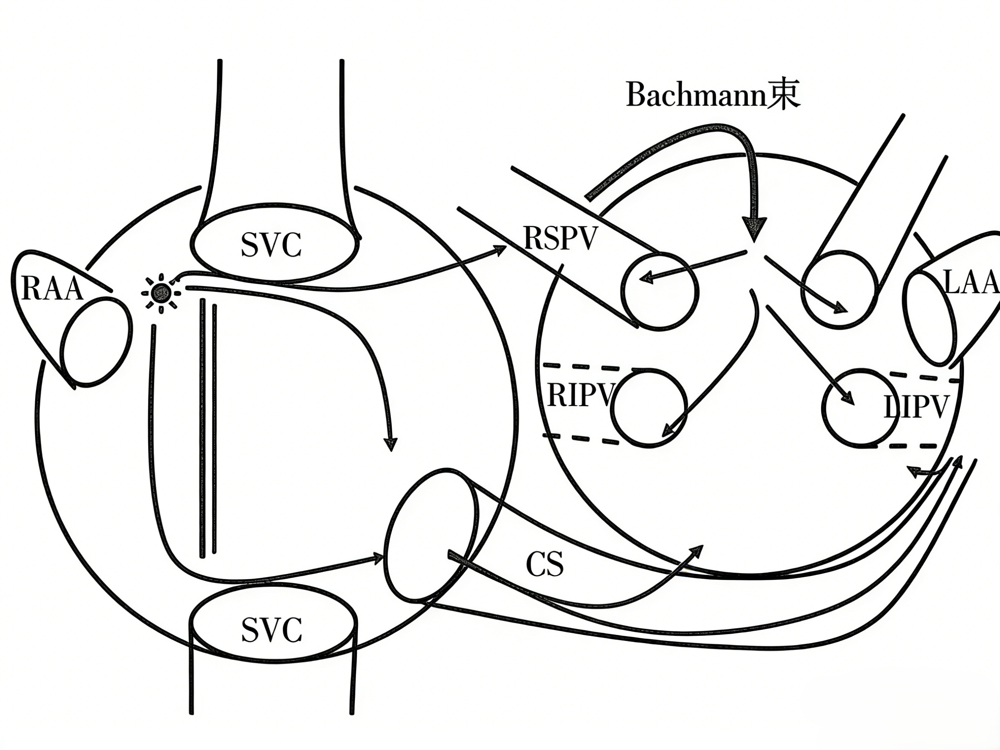

💡 窦性心律下，左心房电激动顺序由房间束（Bachman束）传导向肺静脉，而RSPV的优势传导通常在房顶部，心房电位和肺静脉电位没有拉开难以鉴别。

💡 窦性心律下右侧肺静脉电位和心房电位难以分开,在消融后肺静脉电位延迟，可有利于鉴别。

:::

病例1：
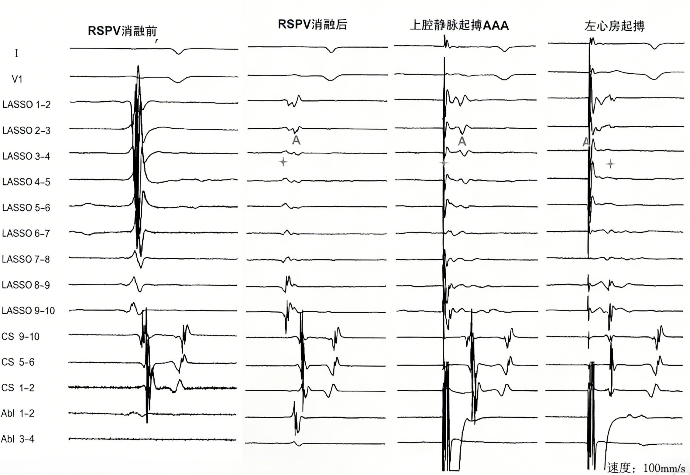

❓ LASSO放置在右上肺静脉，消融前LASSO电极记录到高大尖锐的波，环肺静脉消融后消失，但LASSO记录到的电位有两个组成部分，且LASSO的8-10仍比较尖锐，是否仍有肺静脉电位残余？应该如何鉴别？

💡 起搏上腔静脉可见LASSO的8-10的电位提前到刺激信号后，说明消融后记录到的这个高尖电位是上腔静脉远场电位。

💡 起搏左房顶部可见窦性心律下靠后的成分提前到刺激信号后，而高尖电位依然存在，进一步说明窦性时的前半部分时上腔静脉远场电位，后半部分是左心房远场电位。

---

### 左肺静脉电位的识别

> 由[心脏解剖左心房](./Cardiac-Anatomy.md#3-左心房)左侧通常有两支肺静脉，且共干较多见（10%-30%）；通常做左肺静脉比右肺静脉高，左上肺静脉位于左心耳开口的后上方，左上肺静脉和左心耳之间有一嵴部，局部较厚。
> 
> 因此，左肺静脉附近能产生电位的解剖结构有左心房、左心耳和Marshall韧带，环肺标测电极放置在左肺静脉记录到的电位需要和什么电位鉴别？

| | 性质 | 电位特性 | 窦性心律时时相 | 环肺静脉消融后时相变化 | 冠状窦远端起搏后时相变化 |
| :--- | :--- | :--- | :--- | :--- | :--- |
| 左心房电位 | 局部或远场 | 小钝或高尖 | — | 无变化 | 无变化 |
| 肺静脉电位 | 局部 | 尖锐 | 与左心房电位平齐或稍落后 | 落后于左心房电位，隔离后可消失 | 与左心房电位间距加大 |
| 上腔静脉电位 | 远场 | 尖锐，通常高大 | 与左心房电位平齐或稍落后 | 无变化 | 与左心房电位间差距不明显 |
| Marshall电位 | 远场 | 尖锐，较小 | 落后于左心房电位 | 无变化 | 与左心房电位间距缩小 |

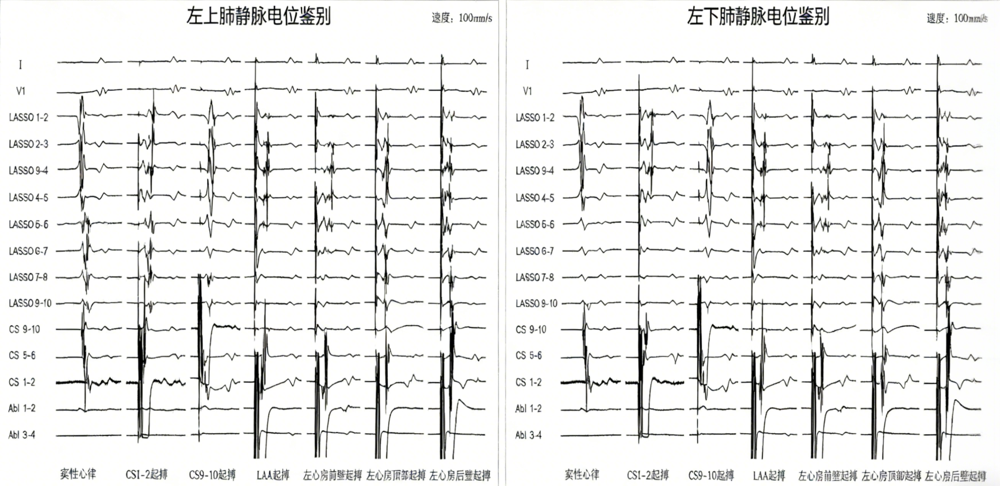

::: tip 窦律下右肺静脉电位
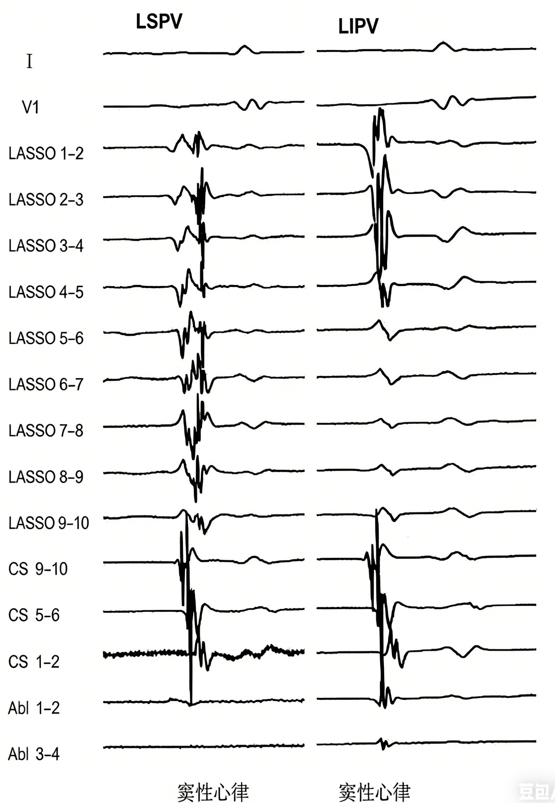
💡 窦性心律下，放置在左侧肺静脉的 LASSO电极记录到的电位有三个组成部分:心房电位（A ）、心耳远场电位（+）和肺静脉电位（*）。

💡 LASSO电极放置在肺静脉内，记录到的心房电位通常是远场电位，比较低钝；如果LASSO放置在肺静脉口心房交界处时，记录到的心房电位可以比较高大尖锐，为心房局部电位。

💡 消融前左侧肺静脉电位通常与心房电位同一时相或稍落后，通过在心房其他部位起搏进行鉴别。

💡 左下肺静脉的左心耳远场电位通常很小。

  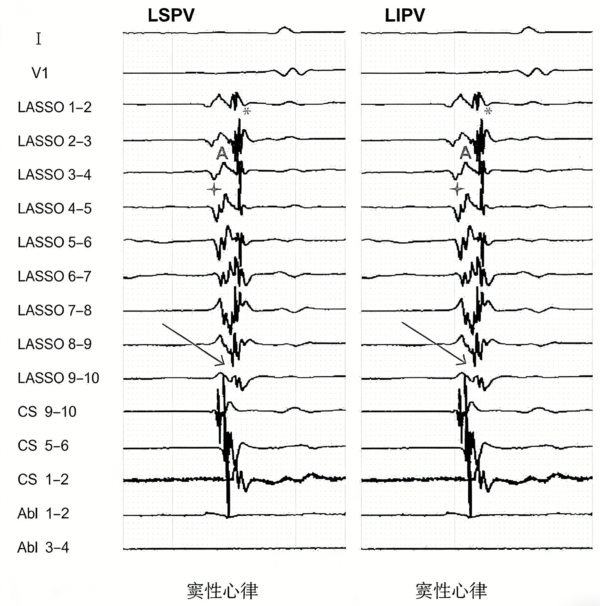
  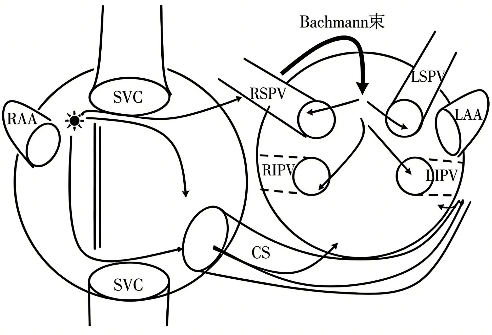

💡 窦性心律下，左心房电激动顺序由房间束（Bachman束）传导向肺静脉，而LSPV的优势传导束通常在左后上，心房电位和肺静脉电位没有拉开难以鉴别。

💡 少数情况下，LSPV肺静脉电位稍落后，在LASSO电极放置正常时，LASSO 9-10最早，也说明优势传导在LSPV后上。

💡 窦性心律下左下肺静脉到电位和心房电位难以分开。

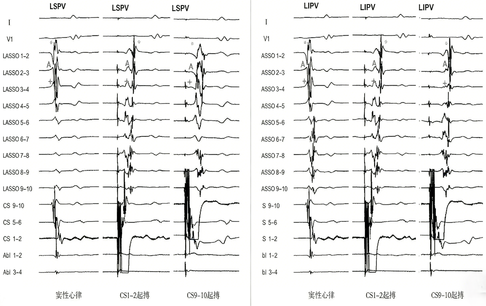
💡 利用心房其他部位起搏可以改变心房内激动顺序，拉开心房电位和左上肺静脉电位之间的距离，可以看到，同样是左心房下部起搏，冠状窦远端起搏效果要优于冠状窦近端起搏，这是因为窦性心律时电激动从房间束从房顶传导到左心房，几乎同时激动左心耳和左侧肺静脉，而冠状窦远端刺激时，通过冠状窦和和左心房间的电连接，左心耳及其周围心房组织先激动后，然后才是肺静脉，可以将其鉴别开

💡 另一例患者，冠状窦远端起搏后，左下肺静脉电位落后于心房电位，而窦性心律和冠状窦近端起搏时电位分开不明显。
:::

病例1：

  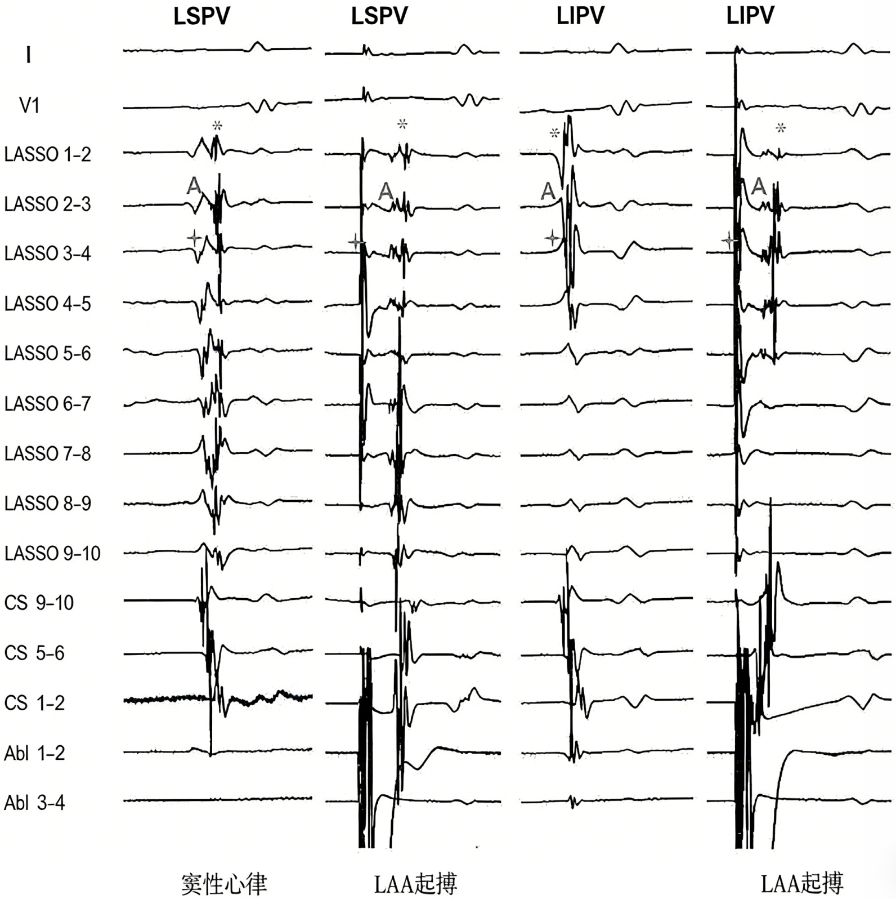
  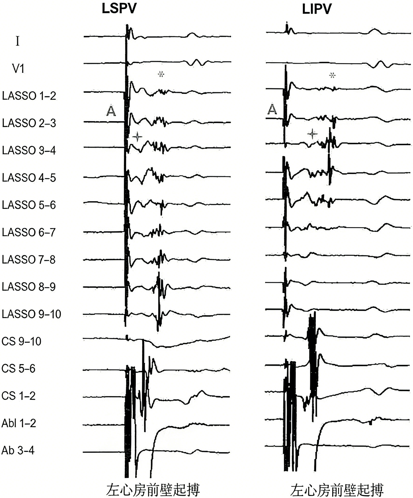

ℹ️ 大头位于左心耳内起搏；

💡 放置在左侧肺静脉的LASSO电极记录到的心耳远场电位和肺静脉电位均高大尖锐，难以鉴别；

💡 通常LSPV内左心耳远场电位较明显，且多见于前壁各组电极；

💡 可通过左心耳刺激将左心耳电位提前，便于与肺静脉电位鉴别。

💡 更改起搏位置有时能将电位鉴别开，比如左心房前壁起搏后，心房电位在前， 左心耳电位和肺静脉电位在后，也有助于电位鉴别，在此例患者中后壁起搏和房顶起搏对电位鉴别没有作用。

  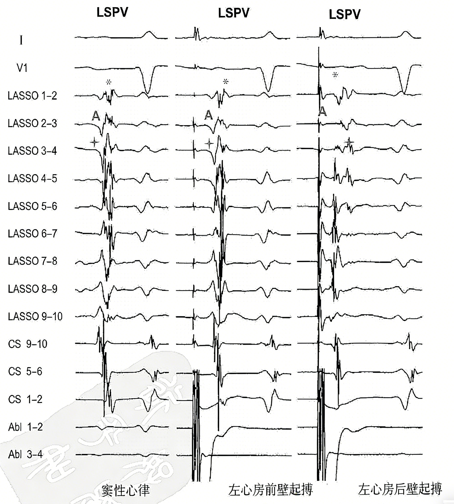

  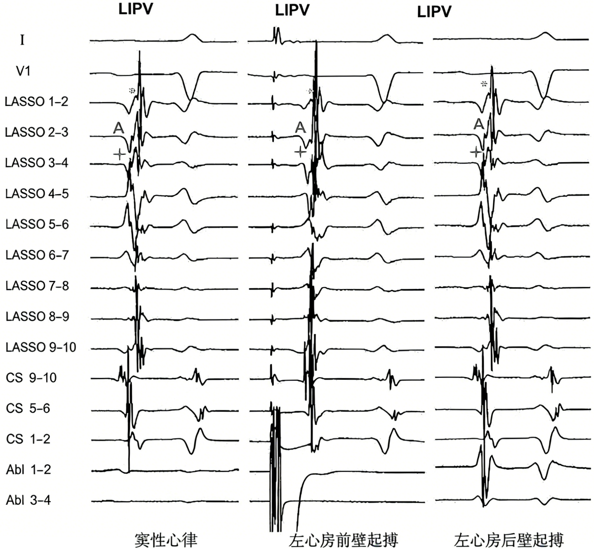

ℹ️ 并非所有的患者左心房前壁起搏都有利于鉴别电位

💡 此患者左心房前壁起搏LSPV电位分开不明显，而后壁起搏电位分开明显

💡 注意起搏后的两个尖锐电位，前一个应该是肺静脉电位，后一个是心耳电位，因为左心耳在心房前侧壁，从后刺激左心耳激动晚于肺静脉

💡此患者左下肺静脉内不管前壁还是后壁起搏均不能清楚分辨肺静脉和心房电位，左心耳电位也很小，无法与肺静脉电位分开。

病例2：

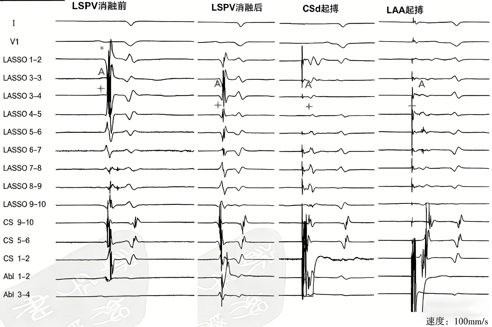

❓ LASSO放置在左上肺静脉，消融前LASSO 1-5电极记录到高大尖锐的波，LASSO 7-9有细小尖锐的波，环肺静脉消融后后者消失，但LASSO 1-7记录到的电位仍比较尖锐，是否仍有肺静脉电位残余？应该如何鉴别？

💡 起搏CSd未见明显分开的电位，说明肺静脉电位的可能性比较小；

💡 心耳起搏后，LASSO 1-5 电极上的高尖电位消失，（应该是被起搏信号掩盖，说明是心耳远场电位），LASSO 5-7 的尖锐电位与心房电位同一时相，推测为局部心房电位。

<!-- 病例3：

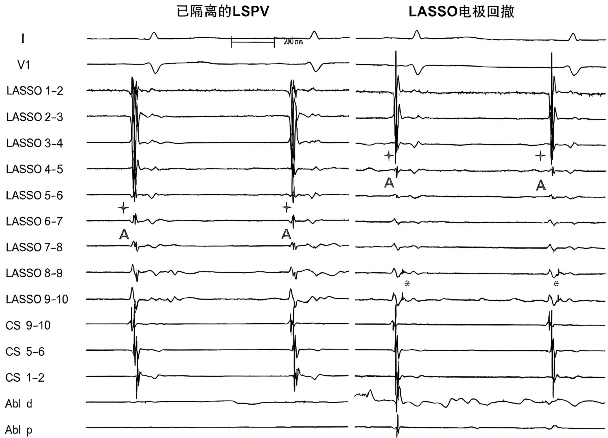

❓ 阵发房颤患者，环左肺静脉消融后，肺静脉电位已经延迟后消失，但将LASSO电极回撤8-9，9-10电极对可见有小电位，如何解释？

💡 通常情况下，行环左肺脉电隔离时，前壁消融线距离LASSO较近，而后壁线距离LASSO较远，消融后整个环肺静脉消融圈内无肺静脉电位。 -->

病例4：

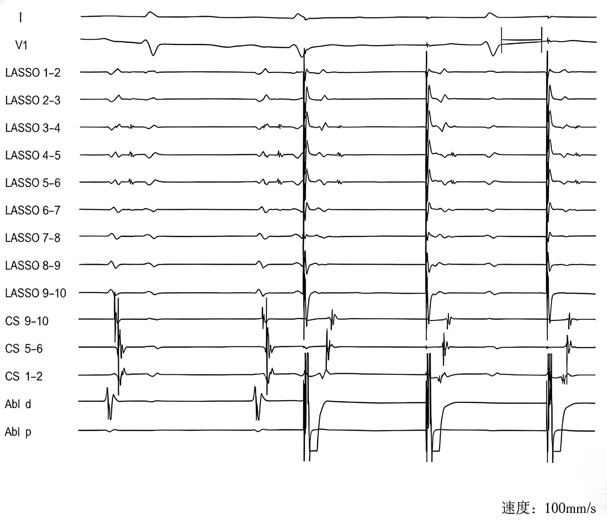

❓ 阵发房颤患者，环左肺静脉消融后，肺静脉电位明确消失，LASSO电极放置在LIPV内，大头电极放置在左心耳内起搏，记录到的窦性心律和左心耳起搏如图，LASSO记录到的是否是肺静脉电位？

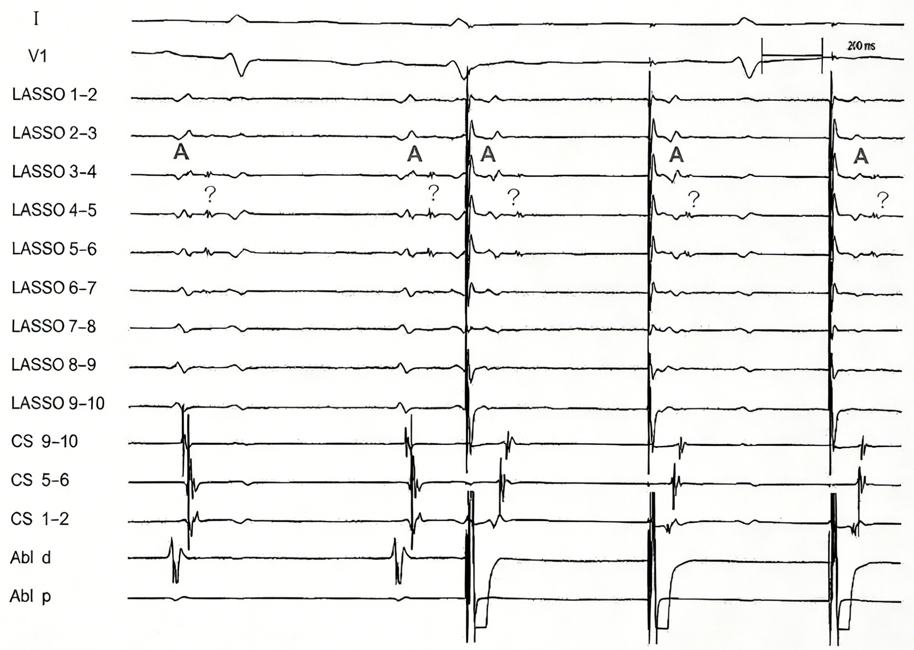

💡 窦性心律时，LSAAO电极对A波后记录到延迟的、小而尖锐的电位，在心耳起搏时（注意大头电极的干扰），该电位仍位于A波后面，据此可排除左心耳远场电位。下一步应该怎么办？

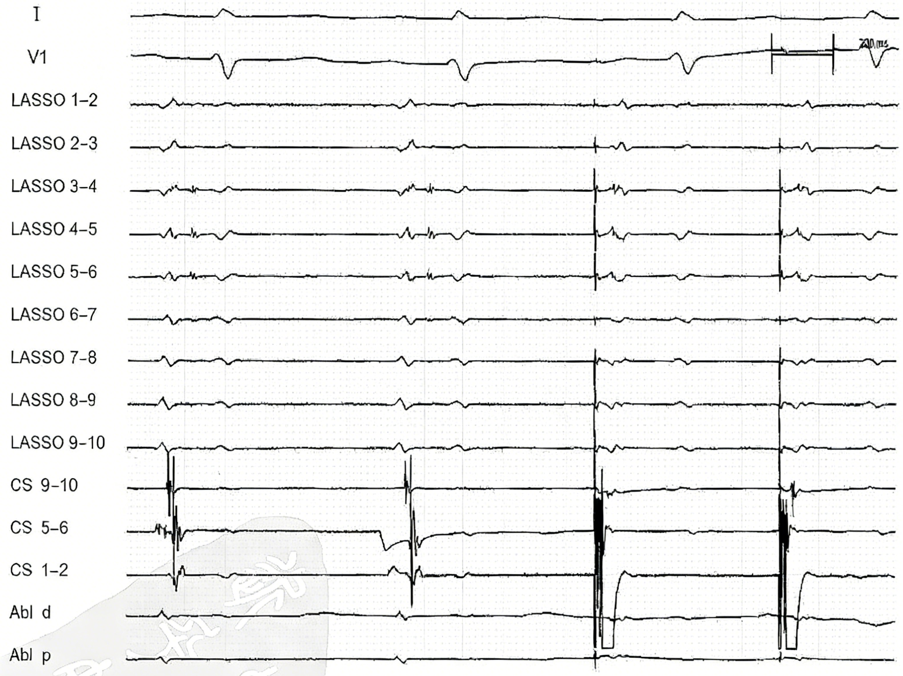

💡 LASSO电极放在LIPV内，记录到的窦性心律和CSd起搏如图，是否有助于判断起搏起源？

::: tip Mrshall静脉

Marshall静脉时冠状窦除心中静脉外的第一分支，走行在嵴的心外膜面，由左上腔静脉退化而来。

Marshall静脉/韧带周围有丰富的交感神经纤维，可能是此处易产生局部兴奋灶的机制。

窦性心律时电冲动沿冠状窦和Marshall静脉/韧带的平滑肌传导至左心房侧壁，但左心房的优势传导束是Bachmann束，Marshall电位通常位于左心房电位后，但CSd刺激时，电激动可以由Marshall静脉传向左心房，Marshall电位被提前到心房电位前。

窦性心律时在A波后面，CSd起搏时（注意CSd电极上的干扰），该电位提前到A波前面，符合Marshall电位的特点。

  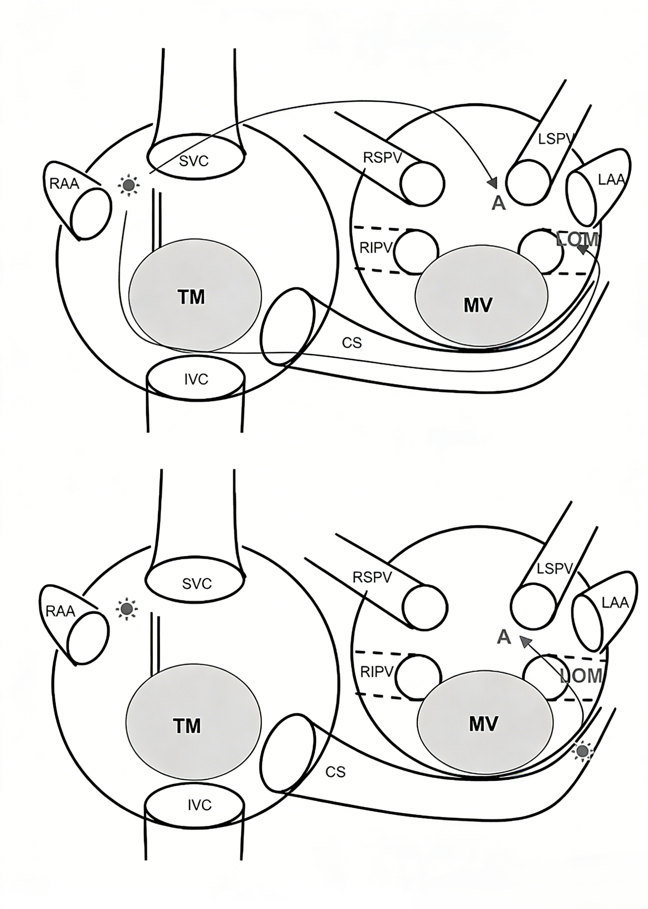

  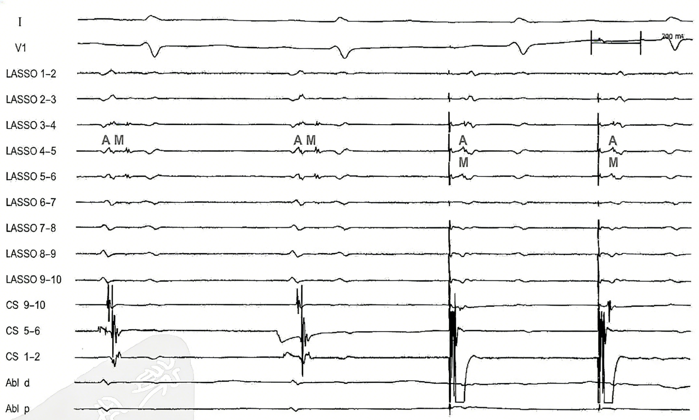

:::

