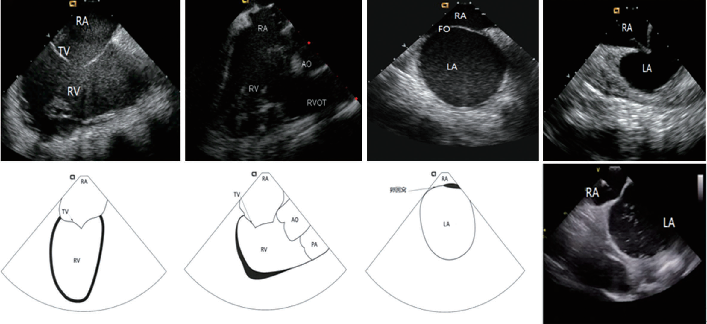
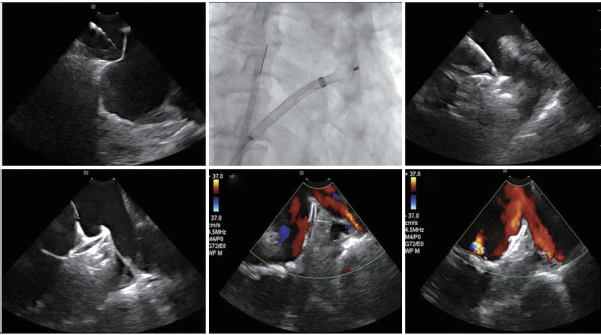

[[toc]]

# 论文笔记

## PFA

## ICE

### 心内超声技术及其在心律失常介入诊疗中的应用进展[^Liu2020]

**摘要** 心内超声技术是将超声探头经股静脉途径送至心腔内，近距离观察心脏结构和功能。与传统的经胸或经食管超 声心动图相比，心内超声的探测声窗不受心外组织结构的干扰，图像质量更加清晰。随着心内超声图像与三维电解剖 标测系统的图像融合技术发展，心内超声已成为复杂心律失常介入诊疗中必不可少的工具之一。

> + 传统的心脏超声技术包括经胸超声心 动图（TTE）和经食道超声心动图（TEE）。TTE容易受到含气的肺组织等其他器官的影响，不能清晰显示远离探头的心房结构和近端心间部结构。
> + TEE 主要显示心底部心脏 结构，特别是左心房、左心耳和心脏瓣膜结构。TEE需要将超声探头经口咽部送至食管，部分患者不耐受TEE检查。TEE还需要全身麻醉和潜在的食管损伤或穿孔的风险；
> + 心内超声（ICE）是将 超声探头送至心腔内进行心脏结构和功能的探测。 由于 ICE 探头周围为心腔内血液，故能提供更加清 晰的图像质量，且不受心脏周围结构的影响、也无 需全身麻醉。

---
**ICE介绍：**
> 目前主要有两种不同的ICE导管，放射状或圆形，直径通常为6F或10F，目前主要两种ICE导管，一种是放射 状或圆形 ICE。该导管直径为 6F 或 10F，提供圆形 扇面图像，类似于血管内超声图像。超声导管位于 图像中间，可同时显示与超声导管垂直的 360°平 面结构。超声频率在 9~12 Hz 之间，适合于 6~8 cm 的近场图像探测，而远场图像不够清晰。另一种是 位相式 ICE，提供楔形扇面图像。该导管直径为 8 F 和 10 F，尖端有 64 个超声晶体矩阵排列，弯度可 以调节。导管尾端有两个控制头端探测角度的旋转 把柄。一个可以使导管头端前俯后仰，简称为 A 弯（前俯）/P 弯（后仰）；另一个可以使导管头端左右旋转，简称L弯（左转）和R弯（右转）。通过上述不同弯度组合，可以调整超声扇面角度，获得理想的目标图像。目前主流的 ICE 导管有 两种，美国雅培公司 ViewFlex 导管和德国西门子公 司 Acunav 导管。

**ICE指导房间隔穿刺：** ICE探头通常采用股静脉途径送至右心房，首先送至三尖瓣水平，适当旋转导管即可看见由右心房、三尖瓣、右心室和右心室流出道共同构成的扇面（**HomeView**），是最基本的切面，术中如果不能寻找到理想的切面时都 需要将 ICE 导管重新回到该扇面后重新操作导管。HomeView 位顺时针旋转导管并适当采用后仰 P 弯 操作，即可清晰显示**房间隔**和**卵圆孔**的位置。如果 后仰角度增大，可看到上腔静脉与房间隔连续部分。 在标准的房间隔穿刺点切面，前方可见房间隔和卵 圆孔，后方可见左心房侧壁相连的左上肺静脉和左 下肺静脉。此刻，逆时针旋转导管可见主动脉窦及 其瓣膜结构，顺时针旋转 ICE 导管可见左心房后壁 结构。

图1A：HomeView位下可见RA、RV和TV；1B：顺时针旋转导管可见AO和LVOT；1C：继续顺时针旋转，可见LA和RA和房间隔及较薄的FO；1D：房间隔穿刺针和鞘的尖端将卵圆窝定向LA形成 **“Tending”** 征；1E~1G：分别对应1A~1C的简化图释；1H：经穿刺针注入生理盐水可见LA内微泡现象，证实鞘管穿过房间隔到达LA。RA：右心房；LA： 左心房；RV：右心室；RA：右心房；TV：三尖瓣；AO：升主动脉；RVOT：右心室流出道；FO：卵圆孔 
 

根据上述切面可精确找到理想的穿刺位点，LAAC通常要求穿刺点偏后偏下、冷冻球囊和PFA消融通常要求穿刺点偏前下方。当房间隔穿刺鞘从上腔静脉向下拉至房间隔、滑落到卵圆孔位置时，稍微推送房间隔穿刺鞘，即可看到鞘管尖端将房间隔顶成帐篷样，称为 **“Tenting”** 征。向前推送房间隔穿刺针即可刺 破卵圆孔，通过针芯注入少量盐水可见左心房内微 泡样图像，即可证实针和鞘管的尖端位于左心房（图 1）。

---

**ICE识别血栓：** 通常需要进行血栓的排查，TEE 是目前术前排查心耳血栓形成最常用的临床检查方法之一。但是，由于心耳位于心脏前部远离 TEE 探头，故对于心耳尖部血栓的判断能力成为 TEE 的难点。有时 TEE 还很难鉴别心耳内附壁血栓与正常梳状肌组织。此外，TEE 检查还受到操作者水平、部分患者不能配合完成检查等因素影响。

---

**ICE下指导房性心律失常：**

---

**ICE下指导室性心律失常：**

---

**ICE指导下LAAC：**由于接受这些手术的患者 往往具有很高的脑卒中和出血风险，故这些患者更 容易在手术麻醉和住院期间出现各种相应并发症。 采用 ICE 技术则可以在局麻下完成经皮左心耳封堵 手术。

利用ICE进行LAA形态和封堵效果等评估可以采用下面三种途径：
1. 右心房途径：在HomeView途径顺时针旋转导管，在主动脉窦扇面即可显示位于主动脉窦后面的左心耳尖部，继续旋转导管至房间隔扇面即可显示左心耳体部和口部；
2. 肺动脉途径：
3. 左心房途径：ICE可经房间隔途径送入左心房，近距离探测左心耳。通常先进行房间隔穿刺，然后将ICE导管经长鞘送入LA，调整ICE导管寻找房间隔穿刺控，之后将ICE导管经穿刺孔送入LA，ICE导管可在左房顶部附近内P弯后仰观察左心耳，亦可 将导管送至左上或左下肺静脉口内探测左心耳，左心房途径能将超声导管送至左心耳口部附近， 近距离扫描左心耳以获得更加清楚的超声图像。

图2A：ICE 指导下房间隔穿刺点位于卵圆孔偏下；；2B：右侧位显示 X 线下 ICE 导管和左心耳封堵器输送系统的位置，封堵器远端位 于左心耳口部；2C：封堵器锚定盘球形释放在左心耳着陆区的 ICE 图像；2D：封堵器封堵盘释放在左心耳口部的 ICE 图像；2E、2F：多个 角度彩色多普勒检查封堵器内无血流信号证实完全封堵。ICE：心内超声 
 

---

**总结：** ICE 具有提供更清晰的实时心脏结 构图像、准确鉴别心耳部血栓形成、指导消融导管 准确到达预定解剖位置、显著降低围手术期并发症 等诸多优点。随着 ICE 超声图像与三维电解剖技术
的融合，ICE 必将成为心律失常介入诊疗中不可缺
少的工具之一。

[^Liu2020]: 刘俊,Jens Erik Nielsen-Kudsk,方丕华.心内超声技术及其在心律失常介入诊疗中的应用进展[J].中国循环杂志,2020,35(06):619-624.
