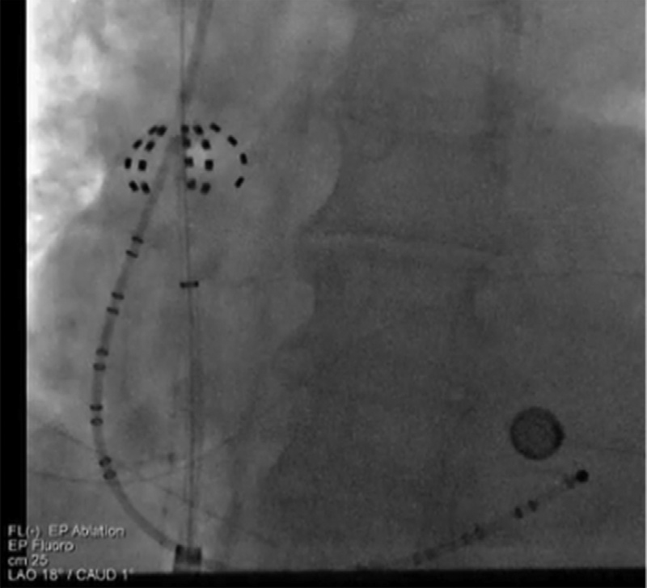
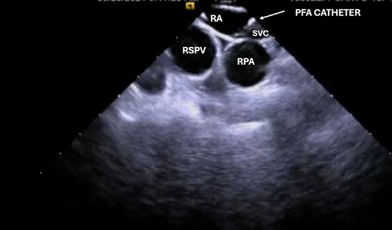
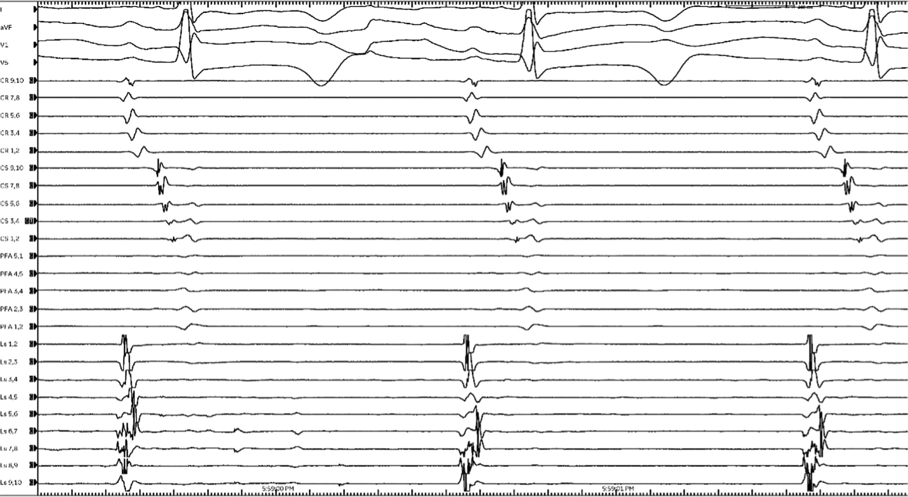
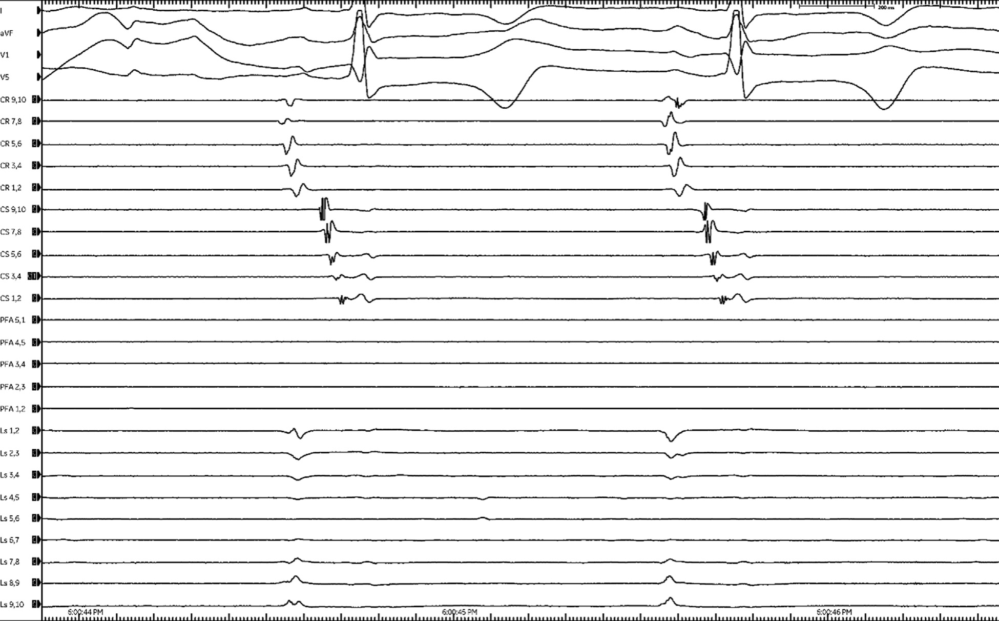
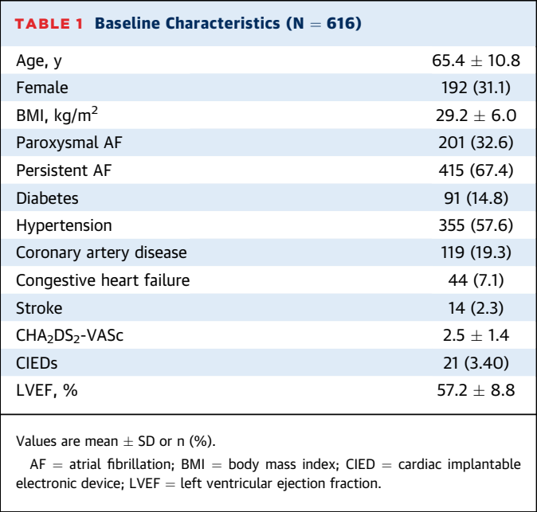
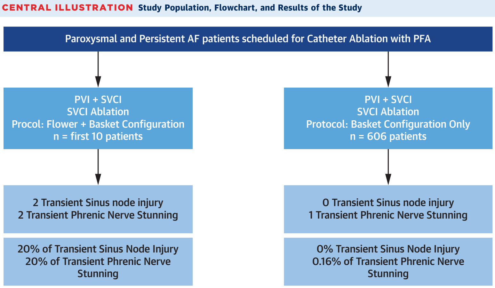
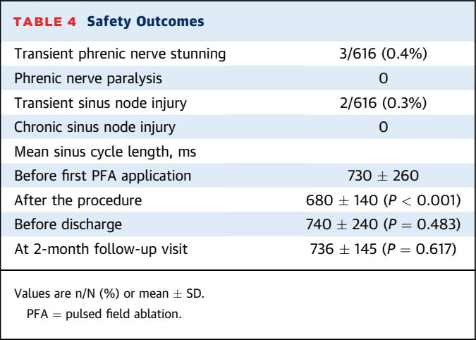
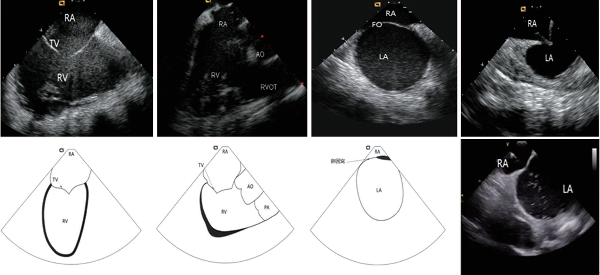
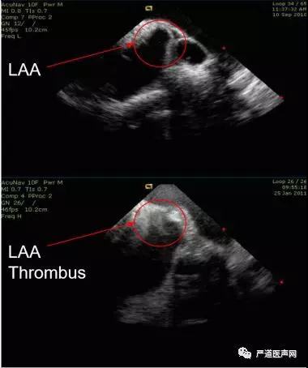
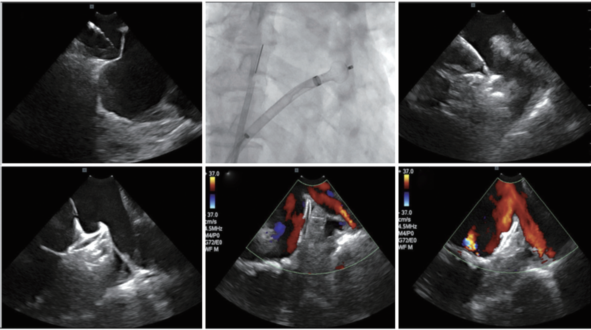

[[toc]]

# 论文笔记

## PFA

### Results of ICE-Guided Isolation of the Superior Vena Cava With Pulsed Field Ablation[^Pierucci2025]

该研究发表于 2025 年《JACC 临床电生理学》期刊，聚焦于心腔内超声（ICE）引导下脉冲电场消融（PFA）用于房颤患者上腔静脉隔离（SVCI）的安全性与可行性

**摘要：** 背景 早期研究已证实，在进行上腔静脉电隔离（SVCI）的射频导管消融术后，可能会出现窦房结损伤和膈神经麻痹等并发症。目的 本研究旨在评估房颤患者接受脉冲电场消融（PFA）时进行上腔静脉隔离（SVCI）的安全性和可行性。方法 本多中心分析纳入了616例连续接受肺静脉隔离联合上腔静脉隔离（SVCI）的脉冲电场消融（PFA）患者。上腔静脉（SVC）消融在心脏内超声心动图的持续引导下进行。将PFA导管置于上腔静脉与右心房的连接处，位于肺动脉下缘水平。共进行4次消融以实现上腔静脉的完全电隔离。在手术过程中、出院前及2个月随访时，均检查窦房结损伤和膈神经麻痹情况。结果 共有616例接受室上性心动过速导管消融术（SVCI）的患者纳入分析。616例患者均实现急性室上性心动过速导管消融成功（100%）。在前10例采用“花形”构型的患者中，观察到2例短暂性窦房结损伤和2例膈神经短暂麻痹，均在手术过程中自行缓解。其余患者采用“篮形”构型，仅记录到1例膈神经短暂麻痹，且在手术结束前恢复。出院时及2个月随访时均未发现永久性损伤。结论 心腔内超声心动图引导下的脉冲电场消融（PFA）能有效隔离上腔静脉（SVC），且安全性良好。

**研究方法：**

**1. 研究人群：**
> 2022年1月至2024年5月期间连续纳入了616名患者，这些患者在这项前瞻性多中心注册研究中接受了肺静脉隔离（PVI）联合上腔静脉隔离（SVCI），并采用脉冲场消融（PFA）治疗阵发性和持续性心房颤动（AF）。

**2. 手术流程：**
> 所有手术均在全身麻醉下进行。所有手术均遵循机构标准化工作流程。1患者在手术前至少4周接受直接口服抗凝剂治疗，围手术期抗凝治疗不间断。静脉注射肝素以维持活化凝血时间＞300秒。经右颈内静脉将十二极导管插入冠状窦。在腔内超声（ICE）引导下进行两次房间隔穿刺。两次房间隔穿刺后，我们为所有患者静脉注射0.2至0.4毫克格隆溴铵，以避免左上肺静脉隔离（PVI）期间出现迷走神经反应。通过CARTO三维系统（Biosense Webster），在左心房插入环状标测导管（CMC），以便在脉冲电场消融（PFA）前后对该心腔进行电解剖标测。每位患者均使用0.035英寸J型导丝（Cook Medical）配合可通过导丝的31极五叶形脉冲电场消融导管（Farawave，Farapulse，Boston Scientific）进行治疗。按照先前描述的方法，1对每个肺静脉（PV）分别采用篮状构型和花状构型各进行4次消融，完成肺静脉隔离。在每种构型下完成前2次消融后，将导管旋转约30/45度，以确保完全环形覆盖。每个肺静脉的消融设置为2.0千伏。每个肺静脉共进行8次脉冲电场消融。额外的肺静脉触发灶由术者酌情消融。若未恢复窦性心律，则进行直流电复律。整个肺静脉隔离手术均在腔内超声引导下进行，以评估消融导管的正确位置以及与肺静脉组织的接触情况。根据超声心动图反馈推进或回撤脉冲电场消融导管，以确保最佳接触。
>
> 上腔静脉隔离术（SVCI）步骤：完成肺静脉隔离（PVI）后，带有冷盐水消融导管（CMC）和五导丝的鞘管均被移回右心房。首先，将CMC推进至上腔静脉（SVC），并使用高输出双极起搏进行膈神经标测，以确定膈神经的位置，同时通过荧光透视观察膈肌随后的运动。在消融前后均使用CMC进行电解剖标测，借助CARTO三维系统验证脉冲场消融（PFA）的效果以及上腔静脉的有效隔离情况。之后，将CMC从上腔静脉撤回，并将J型尖端导丝置于上腔静脉上部。将五极导管沿导丝推进至上腔静脉上部，呈篮状构型（图1）。使用10-F Soundstar导管（Biosense Webster）进行心腔内超声（ICE）检查，该导管通过左股静脉经皮通路置入。整个上腔静脉隔离（SVCI）手术均在置于高位右心房的心腔内超声导管引导下进行，可直接观察到位于右心房与上腔静脉交界处的五极导管；该导管放置于右肺动脉下缘水平（图2）。该探头专门用于评估呈篮状构型时导管的位置。随后根据超声反馈通过推进或撤回导管进行调整，以确保最佳接触。在对上腔静脉（SVC）完成消融后，我们使用 CMC 在先前标测所确定的膈神经位置进行起搏，以检测潜在的膈神经损伤（例如透视下膈肌运动减弱）。在最初 10 例患者的消融过程中，我们对肺静脉（PVs）采用了相同的脉冲电场消融（PFA）方案。然而，在同时使用花瓣状和篮状构型时，由于右心房中1个或多个花瓣脱垂，我们观察到窦性停搏和短暂交界性心律的出现。之后，我们决定仅使用篮状构型。按照肺静脉隔离的标准消融方法，每位患者总共进行4次消融：2次采用篮状构型，另外2次在将消融导管旋转30/45度后进行，以确保完全的环形覆盖。在脉冲电场消融前后均对心率进行了观察。手术的终点是上腔静脉的完全电隔离（图3-5）。在手术过程中及结束时，对患者的膈神经损伤情况进行了评估。

  

    
    
使用10-F Soundstar导管（Biosense Webster公司）进行心腔内超声心动图检查，该导管通过左侧股静脉经皮置入，并放置在右心房高位。

  

  

    
    
导管放置于右肺动脉下缘水平。PFA=脉冲电场消融；RA=右心房；RPA=右肺动脉；RSPV=右上肺静脉；SVC=上腔静脉。

  

  

    
      
图3 脉冲场消融前，位于上腔静脉的环形标测导管记录的上腔静脉电信号

  

  

    
      
图4 脉冲电场消融后，位于上腔静脉的环形标测导管记录到的上腔静脉电信号消失情况。

  

> 常规随访评估包括出院前评估以及在术后 2 个月或出现症状时进行的门诊随访。随访内容包括详细的病史采集，特别关注可能提示膈神经损伤的症状，如咳嗽或呼吸困难，并通过超声评估膈肌运动情况。此外，还进行体格检查、12 导联心电图、24 小时或 7 天动态心电图监测，并筛查不良事件。
消融后继续给予抗凝和抗心律失常药物。在术后 2 个月随访时，根据卒中风险决定是否继续抗凝治疗，而抗心律失常药物则由主治医生根据情况决定是否继续使用。任何房性心动过速或心房扑动发作均被归类为复发。

### 研究结果
1. 患者基线

> 共有616名接受上腔静脉隔离（SVCI）的患者纳入分析（中心插图）。人群的基线特征见表1。平均年龄为65.48±10.83岁，192名（31.1%）为女性，415名（67.4%）患有持续性心房颤动。平均左心室射血分数为57.24%±8.89%，平均\(CHA_{2} DS_{2}\) -VASc评分为2.59±1.47。

    

2. 手术特征

 > 正如先前的研究显示，隔离肺静脉（PVs）、后壁和上腔静脉（SVC）可改善预后，因此所有患者均对这些结构进行了隔离。4,14,15 手术特征见表2。平均脉冲电场消融（PFA）应用次数为60.8±24次。平均手术时间和透视时间分别为77.9±24.7分钟和分别为15.3±16.2分钟。616名患者均成功完成PVI和SVCI（100%）。在前10名患者中，我们采用花瓣状构型进行了4次消融，采用篮状构型进行了4次消融，共8次消融；而在研究人群的其余患者中，仅采用篮状构型进行了4次消融（表3）。
> 
> 急性安全性结果。在前10名患者中，我们采用了花瓣构型，记录到2例短暂性窦房结损伤，表现为交界性心律（占20%），这些损伤在手术结束前已恢复正常窦性心律。此外，在2名患者（占20%）中观察到膈神经麻痹，其特征是当CMC位于上腔静脉且高输出起搏时膈肌活动度降低。其余606名患者（占98.3%）采用了篮状构型。在1名患者（占0.16%）中观察到膈神经麻痹，该患者的膈肌活动度在手术结束前自行恢复正常。
> 
> 术前和术后的平均心率分别为82.34±19.52次/分钟和88.13±9.56次/分钟（\((P<0.001)\)）。首次应用脉冲电场消融前的平均窦性周期长度为730±260毫秒，术后为680±140毫秒（\((P<0.001)\)，P<0.001）。出院前的平均窦性周期长度为740±240毫秒（与首次应用脉冲电场消融前的平均窦性周期长度相比，\((P=0.483\)）。

    
3. 安全性结果：2个月随访时的安全性结果。在2个月的随访中，没有患者失访。安全性结果列于表4中。随访时的平均窦性周期长度为736±145毫秒（与首次PFA应用前的平均窦性周期长度相比，\(P=0.617\)）。没有膈神经麻痹或慢性窦房结损伤的证据或相关症状。

    

### 讨论

本研究为心内膜下腔静脉隔离（SVCI）在腔内超声（ICE）引导下使用脉冲场消融（PFA）的安全性和急性疗效提供了新见解，强调了ICE在提供实时解剖可视化、持续导管监测以及减少手术并发症方面的关键作用。ICE是一种重要工具，可对导管位置进行持续监测，并及早发现手术并发症。Farapulse系统没有接触力传感器，也未与标测系统集成，因此仅使用荧光透视的方法可能无法实现导管的最佳放置。在肺静脉隔离（PVI）的热消融中，ICE的应用已得到广泛评估，并被证明可提高消融效果，同时缩短手术时间和荧光透视时间。最近的一项研究对比了在有ICE和无ICE引导下使用PFA进行PVI的情况，结果显示手术相关指标无显著差异。对于双极双相PFA而言，组织接触而非接触力是决定心肌损伤的基本因素。事实也证明，组织接触对于避免与PFA相关的溶血至关重要。此前有研究表明，大量使用PFA可能会带来溶血和急性肾损伤的潜在风险。在我们的研究中，相对大量的PFA应用也存在溶血和急性肾损伤的潜在风险。不过，所有患者都遵循了先前描述的水化方案，这使得在不增加急性肾损伤可能性的前提下，可以进行更多次数的消融操作。

在心腔内超声和透视的联合引导下，我们采用篮状电极构型，通过 4 次消融即可实现 100% 的首次上腔静脉隔离（SVCI）。这一消融次数并未延长总体手术时间，同时还有可能消除非肺静脉触发灶。

在相当多的病例中，具有热能的上腔静脉隔离（SVCI）并不可行，这是因为窦房结和右膈神经靠近上腔静脉（SVC）的前外侧。14在进行上腔静脉隔离时，理论上膈神经和窦房结都可能受到影响：膈神经对脉冲场消融（PFA）的敏感性具有剂量依赖性，24而如果在窦房结附近释放能量，脉冲场消融可能会对其造成暂时抑制。25出于这些原因，持续检查导管位置并评估其在上腔静脉与右心房（RA）交界处的正确放置情况至关重要。如文献所述，导管移位可能会导致窦房结损伤。25,26我们遇到的窦房结暂时抑制的病例是由呈花朵状构型的其中一个“花瓣”脱入右心房引起的。为避免与脉冲场消融相关的并发症，必须在透视下（但主要是在心内超声引导下）将五叶形导管以篮状构型推入上腔静脉，以确保持续的组织接触和导管的适当定位。

我们无法明确区分短暂迷走神经刺激与窦房结损伤，因为我们没有进行阿托品激发试验。然而，我们在很大程度上可以排除迷走神经效应的可能性，原因如下：根据我们的方案，在第二次房间隔穿刺后，我们给予了0.2至0.4毫克的格隆溴铵，以发挥其抗胆碱能作用。此外，观察到的效应持续了6分钟和8分钟，这进一步降低了迷走神经刺激的可能性。事实上，先前的一项研究表明，消融位于上腔静脉附近的右前神经节会导致副交感神经的减少。此外，在10例患者中，有2例（20%）在以花形构型进行消融时出现了心率减慢和交界性心律的发生，而在606例以篮形构型进行消融的患者中，这一情况的发生率为0（0%）。在最近的一项研究中，Ollitrault等人评估了脉冲电场消融用于上腔静脉隔离（SVCI）的安全性和可行性。在他们的105例患者队列中，所有病例均实现了完全的上腔静脉隔离，且未借助心腔内超声心动图引导，报告显示短暂性膈神经麻痹的发生率为64%（105例中的67例），这些麻痹在手术结束时均已缓解。相比之下，我们发现使用篮形和花形联合构型时，10例中有2例（20%）出现短暂性膈神经麻痹，而仅使用篮形构型时，这一比例为1例（0.16%）。造成这种差异的最合理解释可能是我们的研究系列中使用了心腔内超声（ICE）。心腔内超声心动图引导使我们能够更精确地确定上腔静脉-右心房（SVC-RA）交界处，从而避免在窦房结附近释放能量。因此，我们观察到在花形构型中，仅10例中有2例（20%）出现短暂性窦房结损伤，这是由花瓣脱垂入右心房引起的；而在改为仅使用篮形构型的方案后，606例患者中仅1例（0.16%）出现短暂性窦房结损伤，相比之下，他们的研究中这一发生率为6.7%。消融次数可能是影响结果的另一个因素。与Ollitrault等人的研究相比，我们使用了更少的消融次数来实现上腔静脉隔离（4次 vs 61次）。另一个差异在于所使用的损伤检测方法：他们的方法基于膈肌复合肌动作电位的降低（振幅较基线下降>30%），而我们则通过荧光透视对膈肌运动进行定性评估。

值得注意的是，正如近期的体外研究所述，这种新型能量在对心脏植入式电子设备的影响方面表现出良好的安全性。尽管在位于上腔静脉-右心房交界处有静脉导线的患者中进行了4次应用，但我们并未记录到任何设备故障，这为脉冲电场消融（PFA）的安全性提供了进一步的证据。29在我们的研究中，短暂性窦房结损伤的发生率为616例中的2例（0.3%），而射频消融的发生率为4.5%11，冷冻消融的发生率为7.7%9；膈神经损伤的发生率为616例中的3例（0.4%），而射频消融的发生率为19%11，冷冻消融的发生率为2.1%9。综上所述，上腔静脉隔离术（SVCI）不仅是一种可行且快速的手术，只需4次脉冲电场消融应用即可实现完全隔离，而且在腔内超声（ICE）引导下也是安全的。

### 局限性

首先，我们没有在术后 2 个月对 SVC 进行系统性的重新标测，因此无法确认基于脉冲电场消融（PFA）的上腔静脉隔离（SVCI）的长期稳定性。其次，本研究缺乏未使用心腔内超声（ICE）的对照组。然而，以往未使用 ICE 的研究显示，其并发症发生率远高于本研究系列中所观察到的水平。第三，我们没有系统评估上腔静脉（SVC）的大小以评估上腔静脉狭窄的潜在风险。然而，由于其非热性特点，目前尚无基于脉冲电场消融（PFA）的肺静脉隔离（PVI）术后出现肺静脉（PV）狭窄的报道。此外，在2个月的随访中，所有患者均未出现上腔静脉综合征的迹象。

### 研究结论

使用五样条脉冲电场消融导管进行上腔静脉隔离联合脉冲电场消融不仅可行且迅速，而且如果在心脏内超声心动图引导下进行，还能确保安全，不会留下任何膈神经损伤和窦房结功能障碍的永久性证据。在上腔静脉中使用脉冲电场消融似乎不会影响已有的起搏器或除颤器导线。

## ICE

### 心内超声技术及其在心律失常介入诊疗中的应用进展[^Liu2020]

**摘要** 心内超声技术是将超声探头经股静脉途径送至心腔内，近距离观察心脏结构和功能。与传统的经胸或经食管超 声心动图相比，心内超声的探测声窗不受心外组织结构的干扰，图像质量更加清晰。随着心内超声图像与三维电解剖 标测系统的图像融合技术发展，心内超声已成为复杂心律失常介入诊疗中必不可少的工具之一。

> + 传统的心脏超声技术包括经胸超声心 动图（TTE）和经食道超声心动图（TEE）。TTE容易受到含气的肺组织等其他器官的影响，不能清晰显示远离探头的心房结构和近端心间部结构。
> + TEE 主要显示心底部心脏 结构，特别是左心房、左心耳和心脏瓣膜结构。TEE需要将超声探头经口咽部送至食管，部分患者不耐受TEE检查。TEE还需要全身麻醉和潜在的食管损伤或穿孔的风险；
> + 心内超声（ICE）是将 超声探头送至心腔内进行心脏结构和功能的探测。 由于 ICE 探头周围为心腔内血液，故能提供更加清 晰的图像质量，且不受心脏周围结构的影响、也无 需全身麻醉。

---
**ICE介绍：**
> 目前主要有两种不同的ICE导管，放射状或圆形，直径通常为6F或10F，目前主要两种ICE导管，一种是放射 状或圆形 ICE。该导管直径为 6F 或 10F，提供圆形 扇面图像，类似于血管内超声图像。超声导管位于 图像中间，可同时显示与超声导管垂直的 360°平 面结构。超声频率在 9~12 Hz 之间，适合于 6~8 cm 的近场图像探测，而远场图像不够清晰。另一种是 位相式 ICE，提供楔形扇面图像。该导管直径为 8 F 和 10 F，尖端有 64 个超声晶体矩阵排列，弯度可 以调节。导管尾端有两个控制头端探测角度的旋转 把柄。一个可以使导管头端前俯后仰，简称为 A 弯（前俯）/P 弯（后仰）；另一个可以使导管头端左右旋转，简称L弯（左转）和R弯（右转）。通过上述不同弯度组合，可以调整超声扇面角度，获得理想的目标图像。目前主流的 ICE 导管有 两种，美国雅培公司 ViewFlex 导管和德国西门子公 司 Acunav 导管。

**ICE指导房间隔穿刺：** ICE探头通常采用股静脉途径送至右心房，首先送至三尖瓣水平，适当旋转导管即可看见由右心房、三尖瓣、右心室和右心室流出道共同构成的扇面（**HomeView**），是最基本的切面，术中如果不能寻找到理想的切面时都 需要将 ICE 导管重新回到该扇面后重新操作导管。HomeView 位顺时针旋转导管并适当采用后仰 P 弯 操作，即可清晰显示**房间隔**和**卵圆孔**的位置。如果 后仰角度增大，可看到上腔静脉与房间隔连续部分。 在标准的房间隔穿刺点切面，前方可见房间隔和卵 圆孔，后方可见左心房侧壁相连的左上肺静脉和左 下肺静脉。此刻，逆时针旋转导管可见主动脉窦及 其瓣膜结构，顺时针旋转 ICE 导管可见左心房后壁 结构。

图1A：HomeView位下可见RA、RV和TV；1B：顺时针旋转导管可见AO和LVOT；1C：继续顺时针旋转，可见LA和RA和房间隔及较薄的FO；1D：房间隔穿刺针和鞘的尖端将卵圆窝定向LA形成 **“Tending”** 征；1E~1G：分别对应1A~1C的简化图释；1H：经穿刺针注入生理盐水可见LA内微泡现象，证实鞘管穿过房间隔到达LA。RA：右心房；LA： 左心房；RV：右心室；RA：右心房；TV：三尖瓣；AO：升主动脉；RVOT：右心室流出道；FO：卵圆孔 
 

根据上述切面可精确找到理想的穿刺位点，LAAC通常要求穿刺点偏后偏下、冷冻球囊和PFA消融通常要求穿刺点偏前下方。当房间隔穿刺鞘从上腔静脉向下拉至房间隔、滑落到卵圆孔位置时，稍微推送房间隔穿刺鞘，即可看到鞘管尖端将房间隔顶成帐篷样，称为 **“Tenting”** 征。向前推送房间隔穿刺针即可刺 破卵圆孔，通过针芯注入少量盐水可见左心房内微 泡样图像，即可证实针和鞘管的尖端位于左心房（图 1）。

---

**ICE识别血栓：** 通常需要进行血栓的排查，TEE 是目前术前排查心耳血栓形成最常用的临床检查方法之一。但是，由于心耳位于心脏前部远离 TEE 探头，故对于心耳尖部血栓的判断能力成为 TEE 的难点。有时 TEE 还很难鉴别心耳内附壁血栓与正常梳状肌组织。此外，TEE 检查还受到操作者水平、部分患者不能配合完成检查等因素影响。

---

**ICE下指导房性心律失常：**

---

**ICE下指导室性心律失常：**

---

**ICE指导下LAAC：**由于接受这些手术的患者 往往具有很高的脑卒中和出血风险，故这些患者更 容易在手术麻醉和住院期间出现各种相应并发症。 采用 ICE 技术则可以在局麻下完成经皮左心耳封堵 手术。

利用ICE进行LAA形态和封堵效果等评估可以采用下面三种途径：
1. 右心房途径：在HomeView途径顺时针旋转导管，在主动脉窦扇面即可显示位于主动脉窦后面的左心耳尖部，继续旋转导管至房间隔扇面即可显示左心耳体部和口部；
2. 肺动脉途径：
3. 左心房途径：ICE可经房间隔途径送入左心房，近距离探测左心耳。通常先进行房间隔穿刺，然后将ICE导管经长鞘送入LA，调整ICE导管寻找房间隔穿刺控，之后将ICE导管经穿刺孔送入LA，ICE导管可在左房顶部附近内P弯后仰观察左心耳，亦可 将导管送至左上或左下肺静脉口内探测左心耳，左心房途径能将超声导管送至左心耳口部附近， 近距离扫描左心耳以获得更加清楚的超声图像。

图2A：ICE 指导下房间隔穿刺点位于卵圆孔偏下；；2B：右侧位显示 X 线下 ICE 导管和左心耳封堵器输送系统的位置，封堵器远端位 于左心耳口部；2C：封堵器锚定盘球形释放在左心耳着陆区的 ICE 图像；2D：封堵器封堵盘释放在左心耳口部的 ICE 图像；2E、2F：多个 角度彩色多普勒检查封堵器内无血流信号证实完全封堵。ICE：心内超声 
 

---

**总结：** ICE 具有提供更清晰的实时心脏结 构图像、准确鉴别心耳部血栓形成、指导消融导管 准确到达预定解剖位置、显著降低围手术期并发症 等诸多优点。随着 ICE 超声图像与三维电解剖技术
的融合，ICE 必将成为心律失常介入诊疗中不可缺
少的工具之一。

[^Pierucci2025]: Pierucci N, La Fazia VM, Mohanty S, Schiavone M, Doty B, Gabrah K, Della Rocca DG, Burkhardt JD, Al-Ahmad A, Di Biase L, Casella M, Russo AD, Nair D, Mansour M, Tondo C, Natale A. Results of ICE-Guided Isolation of the Superior Vena Cava With Pulsed Field Ablation. JACC Clin Electrophysiol. 2025 Apr;11(4):752-760. doi: 10.1016/j.jacep.2024.11.009. Epub 2025 Jan 22. PMID: 39846925.

[^Liu2020]: 刘俊,Jens Erik Nielsen-Kudsk,方丕华.心内超声技术及其在心律失常介入诊疗中的应用进展[J].中国循环杂志,2020,35(06):619-624.
