Ensite 房颤流程

1. 建模
  + 点云采集：电场和磁场点云采集
    * 目的：构建左心房模型
    * 注释：绿色的小点既是电场点云，由电极导管产生
    * 磁点云目的：为磁场Field Scaling左准备
    * 注释：橙色的小点既是磁场点云，由磁感应导管产生（Precision版本）
  + Field Scaling：电场和磁场
    * 目的：利用导管参数矫正非线性的电场空间
    * 注释：可以选择自动校正或手动校正
    * 磁场目的：利用磁场点云校正磁场非线性
    * 注释：可以选择自动校正或手动校正（Precision版本）
  + 模型分割
    * 目的：将单个模型分割成多个模型
    * 注释：常用于单腔室建模后内部结构的分离，以便识别不同解剖部位
  + 修整参数
    * 目的：删除模型的假腔和多余部分
    * 注释：删除假腔可以更好地判断导管贴靠，删除多余部分可以美化模型、减少视觉干扰。
  + Fusion
    * 目的：融合Ensite模型与CT模型
    * 注释：融合后可以使用CT模型进行标测和消融
2. 标测

  - 基质标测：
    * 目的：确定左心房窦律下的电压情况
    * 注释：通过基质标测后的电压高低，可以推断左心房的病变区域
  
  <!-- - 激动标测： -->

3. 消融
  - AutoMark：
    * 目的：客观地添加消融标记
    * 注释：使用光感压力导管时，可以采用LSI参数配合AutoMArk功能
  - 肺静脉隔离
    * 目的：实现左右肺静脉的电隔离
    * 注释：肺静脉的环状消融隔离是房颤射频手术的基本术式
  - 二尖瓣峡部线：
    * 目的：阻断二尖瓣峡部线
    * 注释：常作用于围绕二尖瓣环折返的房扑
  - 左心房顶部线消融：
    * 目的：阻断左心房顶部线
    * 注释：常作用于围绕左心房顶部折返的房扑
  - 左心房前壁线消融：一般不做干扰，如果做了roof line + PVI + MI + 左心房前部线消融，可能会造成左心耳电位的延迟甚至隔离，会造成左心耳血栓的产生。前壁线可能会损伤到backman 不bundle和快径。
    * 目的：阻断左心房前壁线
    * 注释：常作用于围绕左心房前壁折返的房扑
4. 电位识别
  - 肺静脉电位隔离判别
    * 目的：判别是否实现肺静脉的电隔离
    * 注释：Lasso导管上延迟的肺静脉电位变小后消失，说明肺静脉传入阻滞；Lasso导管上自发的肺静脉电位不能传出，说明肺静脉传出阻滞。
  - 寻找肺静脉隔离漏点
    * 目的：肺静脉消融后仍有漏点，寻找漏点进行放电以实现肺静脉的电隔离
    * 注释：依据Lasso导管上最早的肺静脉电位判断电位寻找靶点，然后用消融导管在靶点周围寻找比Lasso导管上最早的肺静脉电位更早的肺静脉电位

## CTC2

### 基础电生理检查

目录

+ 正常的激动顺序
+ 程序电刺激
+ 不应期
+ 房室结传导（不应期）曲线
+ 电生理检查
+ 心动过速诱发

1. 电生理检查常用导管放置

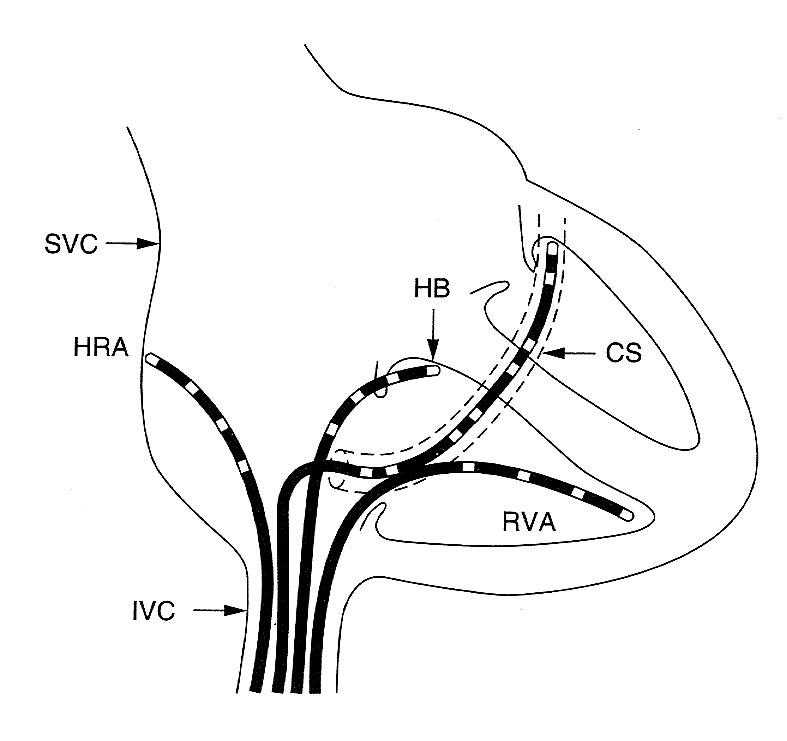

**AH间期和HV间期**

+ AH间期
  - 自房间隔下部径房室结至希式束的传导时间，代表**房室结的传导时间**
  - 再希式束电图上自A波最早点至希式束电位H波起始处，正常**50-140 ms**
+ HV间期
  - 代表**希-浦**系统内的传导时间
  - **希式束电极**记录H波其实至体表QRS波群起始，正常**35-55 ms**

2. 程序电刺激（Programmed Electrical Stimulation(PES)）

PES是一种通过接触心内膜的电极导管间断或持续发送电流的起搏技术，临近电极的细胞会除极并扩布到整个心脏。

影响起搏夺获的因素：

+ 输出能量的大小（电流mA/电压V），常规设置：5mA
+ 刺激脉宽（单个刺激的持续时间），常规设置：0.5-1ms
+ 刺激的频率
+ 导管电极的贴靠程度
+ 电极大小/材料/形状等

程序电刺激的作用：

+ 传导功能测试
+ 心律失常诱发和终止
+ 评估药物和电干预对房室传导系统、心房和心室功能的影响，以及它们在治疗心律失常方面的疗效。

递增刺激（S1S1）

心房起搏通常在高位右心房窦房结区域进行，起搏以略慢于窦性心律的周长开始，随后以10-50 ms的递减幅度逐渐缩短周长，最短缩至250ms和/或出现文氏现象的。每个起搏周长需要持续15-60s，以确保传导间期的稳定性。

额外刺激（S1S2）

+ 指在基础起搏心律中引入单个或多个早搏（期前）刺激，通常用于心律失常诱发
+ 如果需要用到一次额外刺激（S2），如果用到第二个额外刺激（S3）
+ 多于3个额外刺激（S4）会有可能诱发出非临床心律失常。

3. 不应期

+ 相对不应期（RRP）：引起心肌组织传导延长的最长S1S2间期
  - 足够的刺激可引起再次激动
  - 逐渐缩短S1S2间期会引起心肌组织传导的进一步延迟
+ 房室结的有效不应期：不能引起心肌组织再次激动的最长S1S2间期

4. 房室结传导（不应期）曲线

::: danger 房室结传导特点
* **递减传导**：
  - 正常房室结显示**递减传导**
  - 不断缩短的刺激间期会引起传导延迟增加

* 非递减传导：
  - 心房以及心室肌还有大多数旁道（Kent）表现非递减传导，**全或无现象**

:::

**房室结递减传导--AH延长--S1S2刺激， 10ms递减， AH逐渐延长**

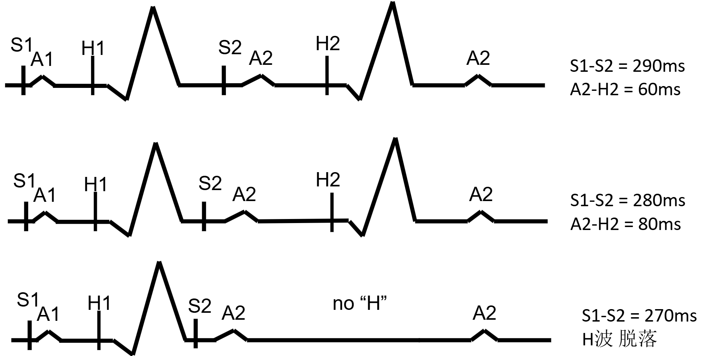

房室结递减传导，S1S2 :arrow_down: -----> A2H2 :arrow_up: （传导延迟逐渐加重） -----> 最终传导阻断、H波消失，验证房室结存在递减传导，测定房室结有效不应期（旁道无递减传导，早搏提前不会出现AH延长）

    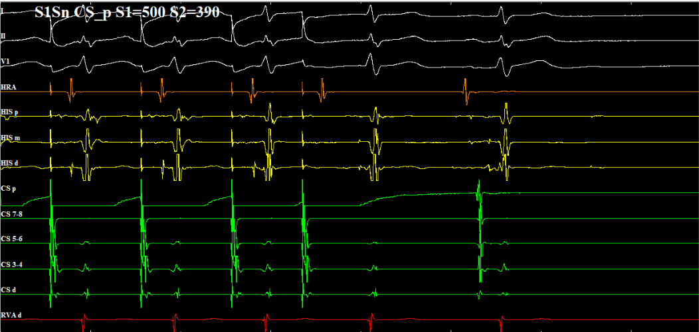
    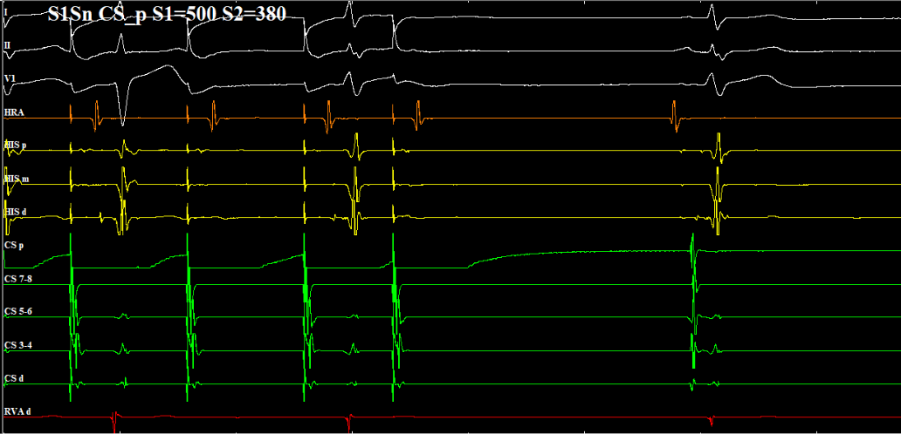

 
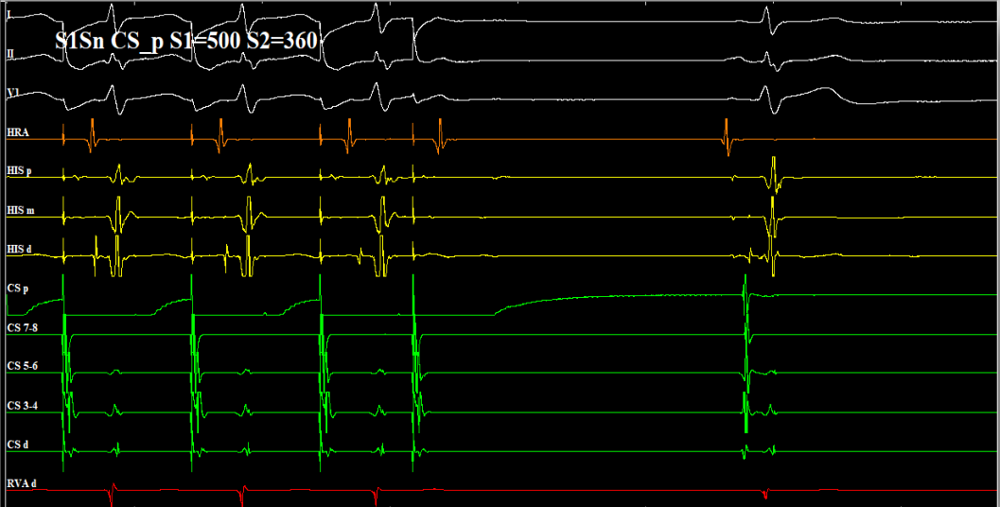

**心房S1S2测量房室结的有效不应期：**常用10ms递减，进入不应期后还需要往下刺激一跳，图中的房室结不应期位380 ms

**文氏现象：**

随着S1S2递增刺激，房室结传导发生**文氏现象**

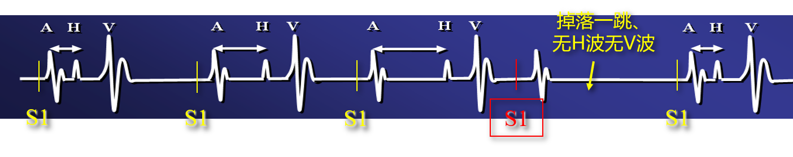

文氏点：发生文氏现象的最低起搏频率（最长S1S1间期）

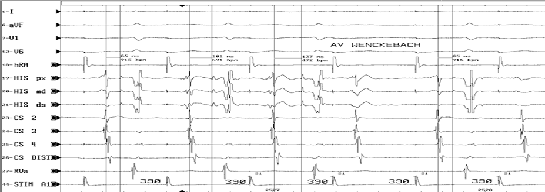

图中，随着S1S1起搏，AH逐渐延长直至脱落，说明房室结发生文氏现象，找到房室结文氏点。文氏点附近刺激容易诱发心动过速，还可以评价消融前后的效果，如果文氏点也就是进入快径的不应期很长，意味着快径传导功能不是很好，消融时需要注意。

4. 电生理检查

常用的基础电生理检查：

+ 心室起搏
  + S1S1（S1S1≥230ms）：
    - 房室结逆传递减传导-正常房室结的逆传现象
    - 房室结逆传全或无-可能存在旁路
    - 诱发心室参与的心动过速（VT、AVRT）
  + S1S2：
    - 房室结逆传功能（心室S1S1刺激时房室结逆传递减不明显，可以选择心室S1S2刺激）
    - 诱发心室参与的心动过速（VT、AVRT）
+ 心房起搏
  + S1S2：（S2间期≥230ms）
    - 房室结前传功能（前传不应期）
    - 鉴别是否存在慢径，有无跳跃和回波
    - 诱发心房参与的心动过速（AT、AVRT）和AVNRT
  + S1S1：
    - 房室结前传递减传导-正常房室结的前传现象（文氏点）
    - 诱发心房参与的心动过速（AT、AVRT）和AVNRT

**通过心室刺激时逆传A波的激动顺序判断传导路径**

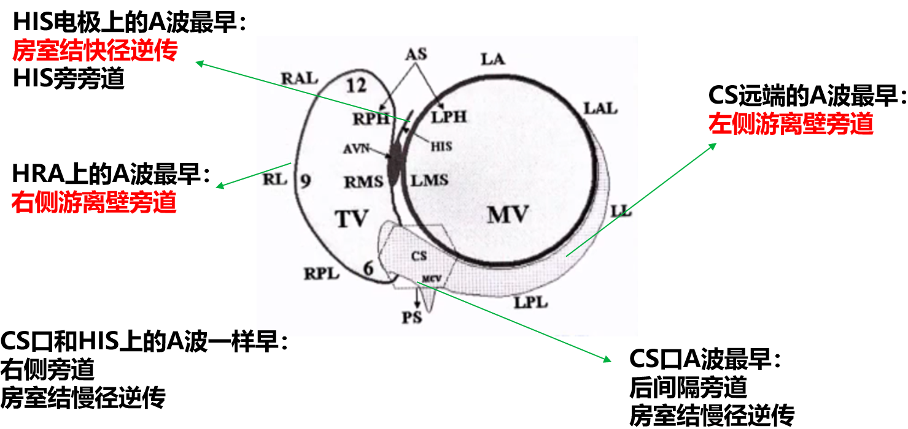

心室刺激下，如果记录到CS远端（12，34，56）A波早，可以诊断出左侧游离壁旁道。如果HRA上A波最早，则诊断出右侧游离壁旁道。CS口A波最早，可能是后间隔旁道或房室结慢径逆传。如果CS口和HIS的A波一样早，则可能是中间隔旁道或房室结慢径逆传A波。如果HIS上A波最早，则可能是房室结快径逆传或HIS旁旁道。

Case：

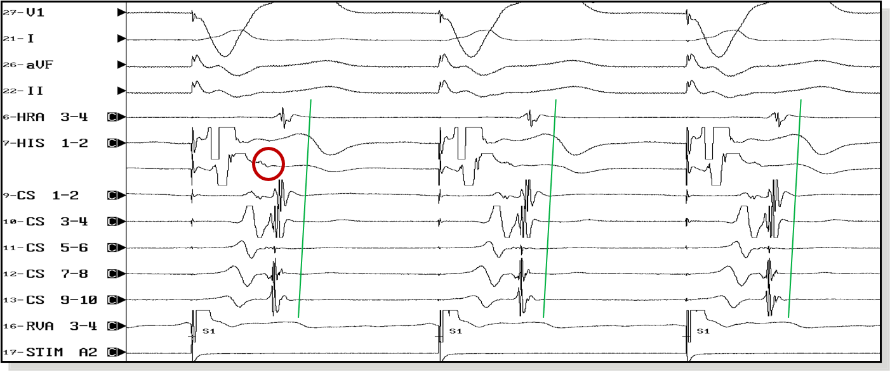

常规右室心尖部刺激，室房（VA）逆传，房室结部位心房肌最早除极（HIS的A波最早），CS激动顺序近端至远端，HRA的A波最晚。由上图可诊断为HIS旁旁道或AVN快径逆传。后续做S1S2看房室结递减现象，大概率是AVN快径逆传。

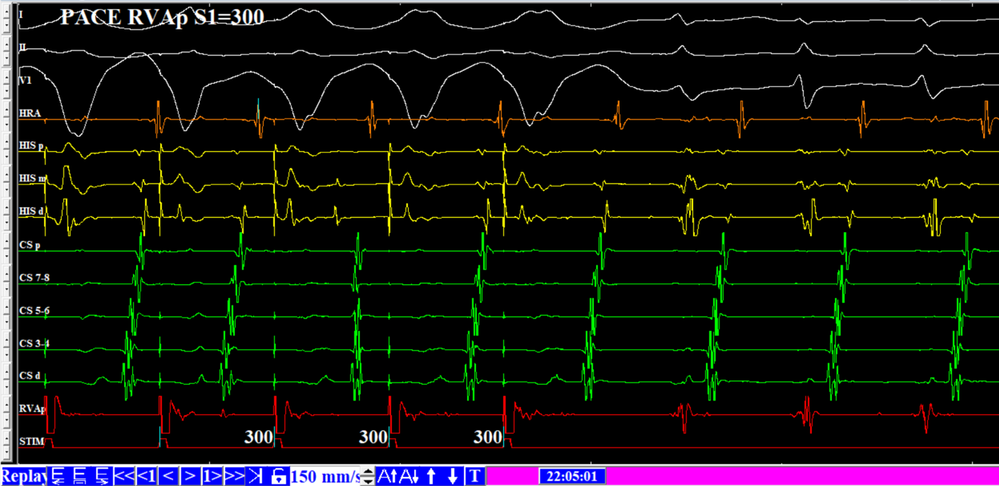

心室S1S1刺激时，CS远端的A波最早，激动通过左侧游离壁旁道逆传回心房。

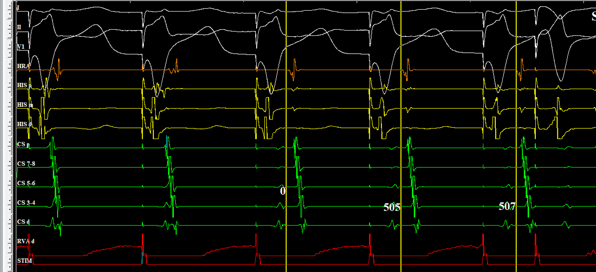

VA传导固定 1:1 ，HRA上A波最早，提示右侧游离壁旁道。

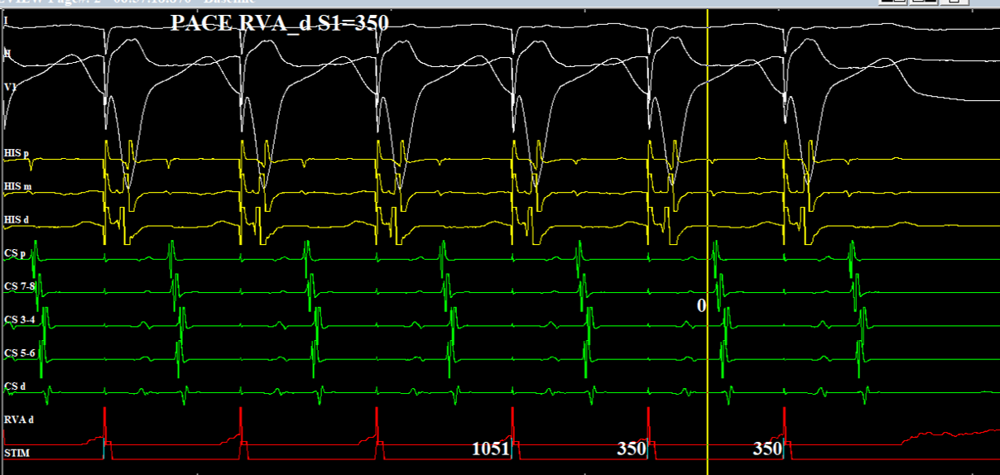

心室S1S1刺激，VA传导固定1：1，CS口和His上的A波一样早，可诊断右侧旁道或AVN慢镜逆传。继续做S1S2刺激判断是否是双径路。

**心室S1S2刺激**

**心房S1S2刺激，AH逐渐延长**

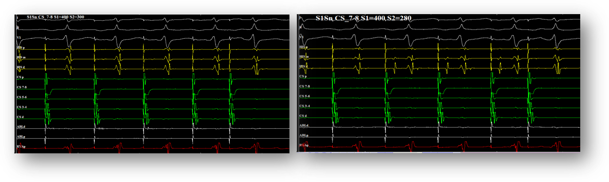

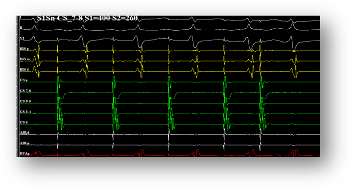

图中，心房S1S2刺激，可见AH逐渐延长（H不明显可以看AV间期）

### 房室结折返性心动过速（AVNRT）

+ 房室结折返性心动过速（AVNRT）是最常见的阵发性室上速
+ 分为慢快型（最常见）、快慢型、慢慢型
+ 目前认为AVNRT的电生理机制为房室结快、慢径之间或快、慢径之间，以及房室结周围心房组织参入形成的折返

1. AVN的解剖结构--Koch三角

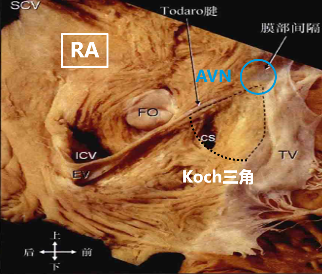

+ 底部是CS口
+ 顶部是HIS区域
+ 两边：Todaro键和三尖瓣环

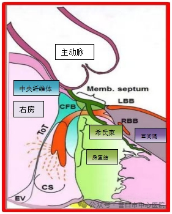

+ 房室结存在两条后延申（慢径），右侧后延伸和左侧右延申
+ 右侧后延伸在三尖瓣和CS口之间
+ 左侧后延伸开始于Todaro键，终止于CS近端的上方的二尖瓣环附近

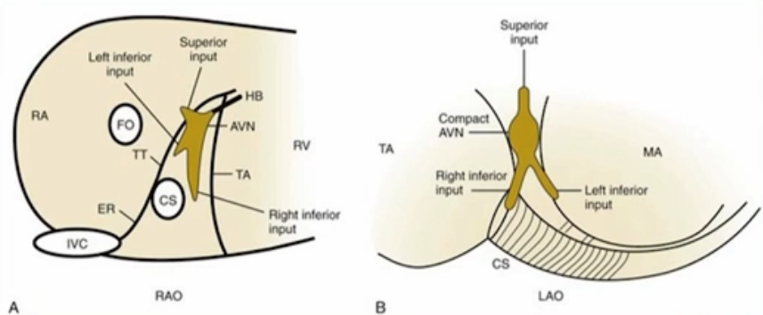

+ 不同体位下双径路的走行，在LAO下可见右后延伸支和左后延伸支分别与CS和MA的连接

2. AVNRT心电图特点

+ 窄QRS心动过速
+ 节律规律
+ 看不到P波
+ V1导联可见假r或肢体导联出现假S
+ 若P波出现在ST段上，RP≤70 ms
+ 可伴有束支阻滞

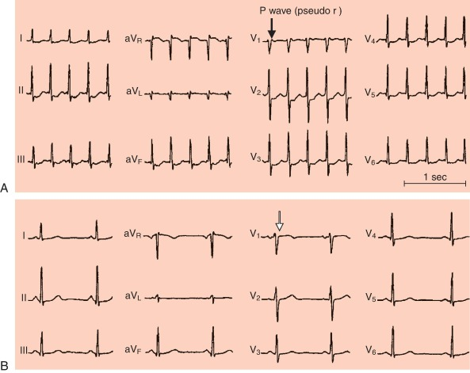

3. 电生理机制

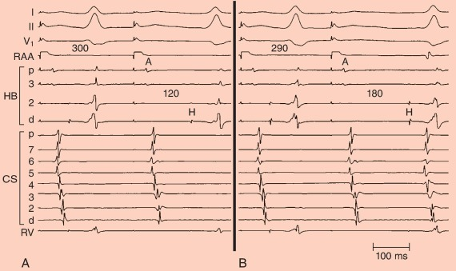

图：从RAA进行S1S2起搏（600-300），可见AH间期逐渐缩短，当做到290 ms时，AH间期从120 ms跳跃到180 ms。可见心房期前刺激先通过慢径前传，随后激动通过快径逆传以激动心房 
 

+ **跳跃**：局部心房电位到希式束电位的传导时间（AH）延长50 ms以上。A1A2逐渐缩短，AH逐渐延，当A1A2在某一点缩短10ms时，AH突然显著延长>10ms，即跳跃显现，呈房室结双径路，若出现多个跳跃，为房室结多径路
+ A2H2逐步缩短，AH逐渐延长，但无跳跃且AH间期多小于 < 200-220ms，称不显现房室结双径路现象
+ A1A2逐步缩短，AH逐渐延长，AH间期大于 > 200 ms，称连续性房室传导曲线的房室结双径路现象。

4. 诊断标准

+ **慢快型**：房室结慢径前传，快径逆传（HIS束A波领先），AH间期明显大于 > HA 间期，且AH ≥ 200ms，平均270-280 ms
+ **快慢型**：房室结快径或另一条慢径前传，逆传呈典型快慢径逆传顺序（CS口水平A波领先）AH间期小于 < HA 间期，且AH间期 < 200 ，平均90 ms。
+ **慢慢型**：房室结慢径前传，逆传呈典型慢径逆传顺序（CS口水平A波领先），AH间期通常大于 > HA间期，且AH ≥ 200ms，平均270-280 ms

> （1）看逆传，快径：HIS束A波早；慢径：CS口水平A波早
> （2）看前传：AH>50ms慢径；AH<50ms，快径

5. AVNRT电生理检查内容和步骤

+ 基础状态下测量各间期，尤其注意PR间期、房室激动顺序
+ 心室递增起搏： 观察室房传导顺序及递增起搏时传导顺序有无变化、VA间期、有无室房递减传导，必要时行心室程序电刺激
+ Para-Hisian起搏（希式束旁刺激）
+ 心房递增起搏及程序电刺激：观察AH间期延长、跳跃、心房回波、房室阻滞、快慢径ERP以及诱发AVNRT窗口
+ 心动过速的诱发：必要时异丙肾上腺素

> Para-Hisian起搏（希式束旁刺激）：
> + 较高电压刺激希氏束旁同时夺获心室肌和His低电压只夺获心室肌，不夺获希氏束
> 观察不夺获His时心房激动顺序;S-A间期;H-A间期变化
>
> 结果判读:
> - 心房激动顺序、S-A间期不变：房室旁路
> - 心房激动顺序不变，S-A间期延长，H-A间期不变：房室结双径路
> - 激动顺序不同：既有旁路也有房室结递传

6. 消融部位

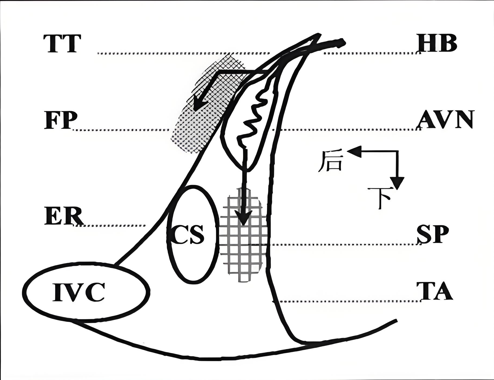

RAO30°下HIS与CSo中点偏下部位

7. 消融终点

+ 房室结前传跳跃现象消失，并且不能诱发AVNRT
+ 房室结前传跳跃现象未消失（伴有或不伴1各心房回波），并且在静滴异丙肾条件下不能诱发AVNRT
+ 消融后新出现的持续性I度或I度以上的房室阻滞