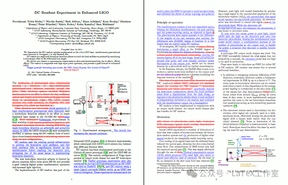
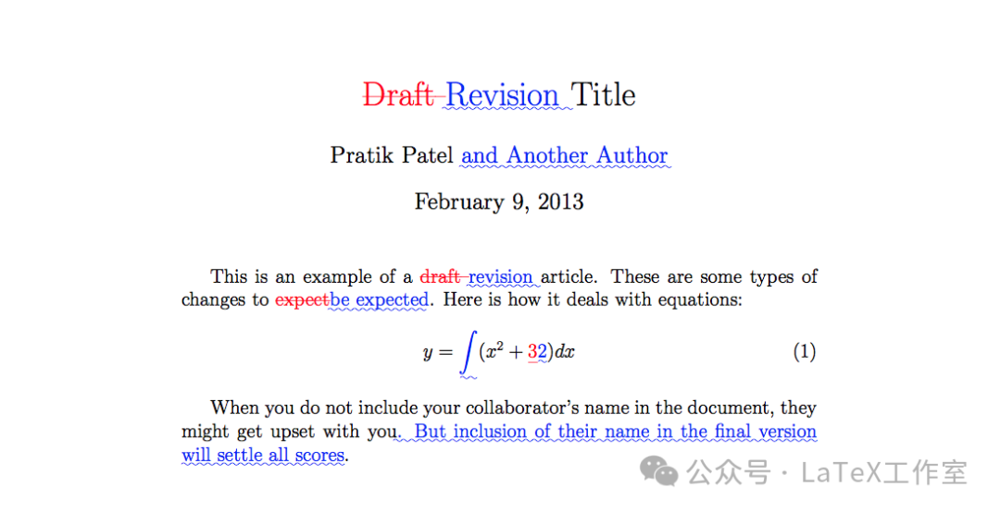
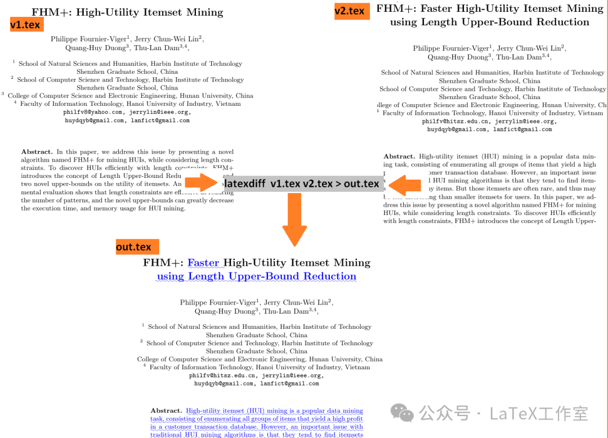
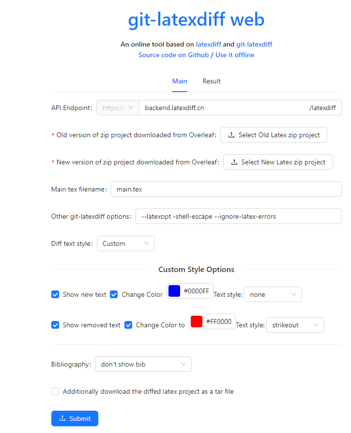
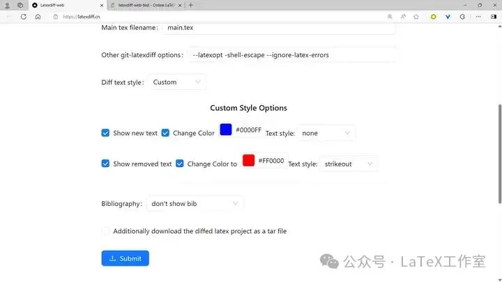
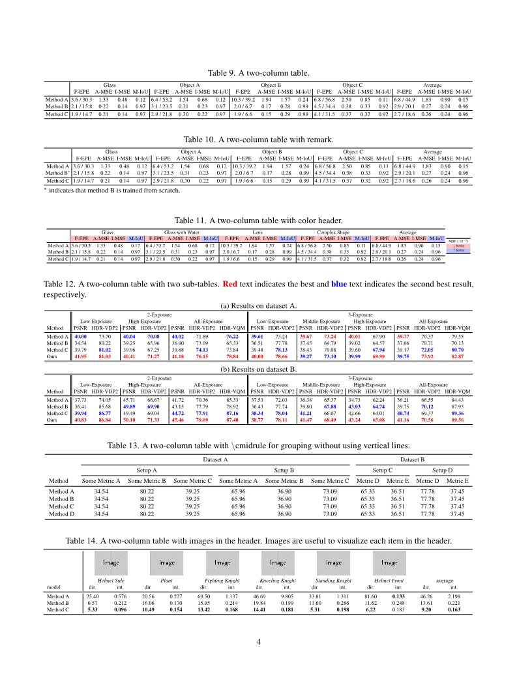
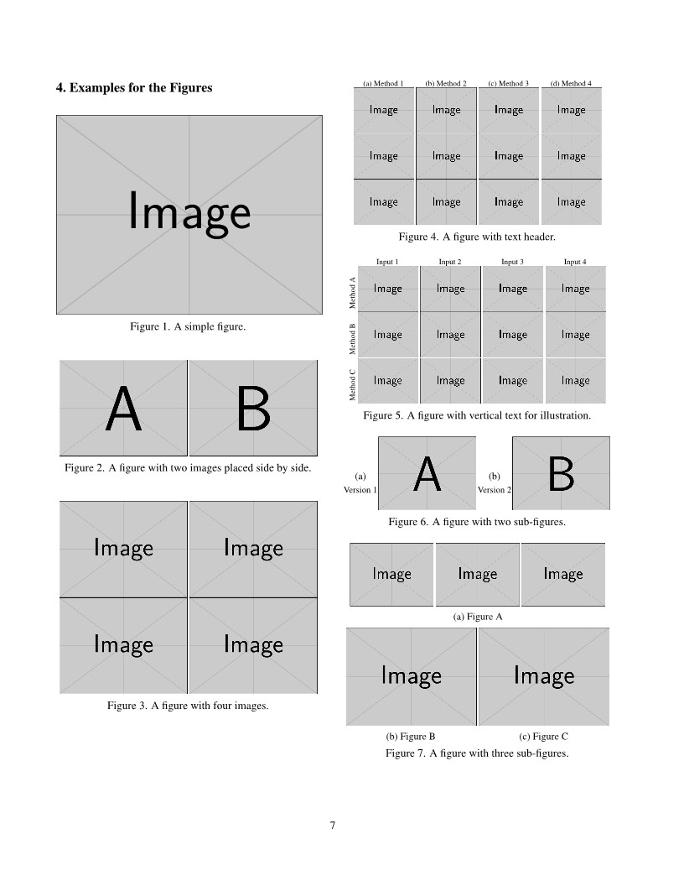
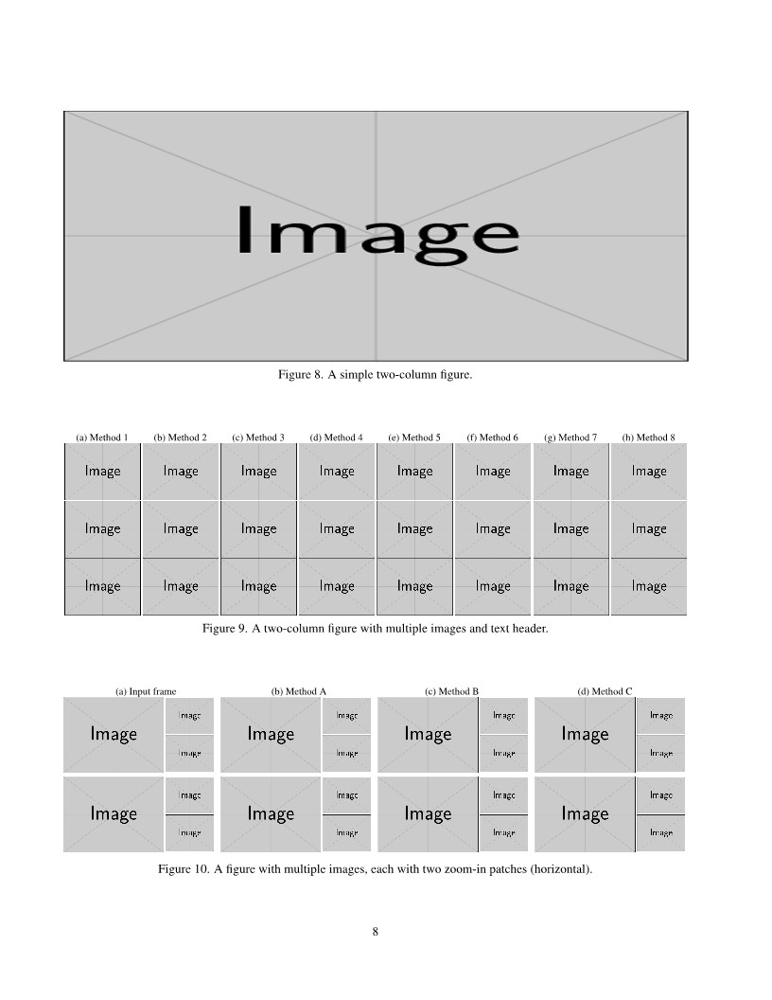
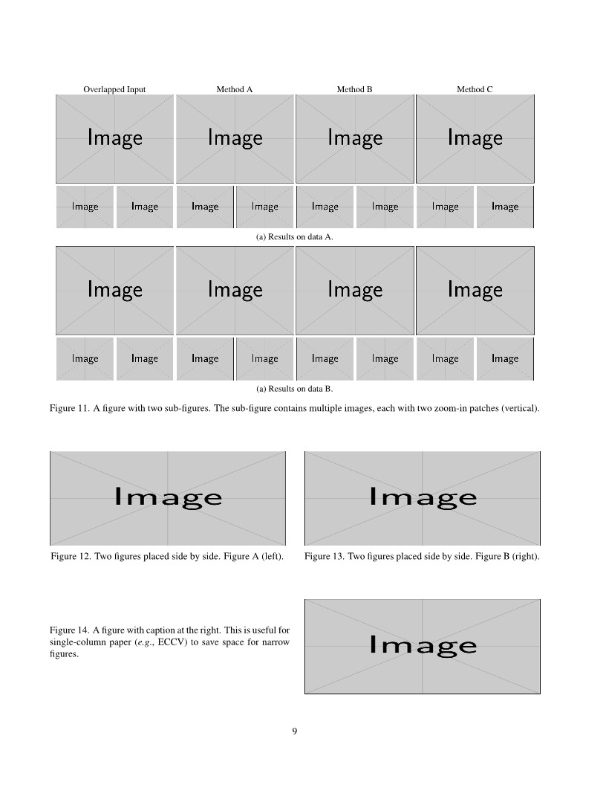
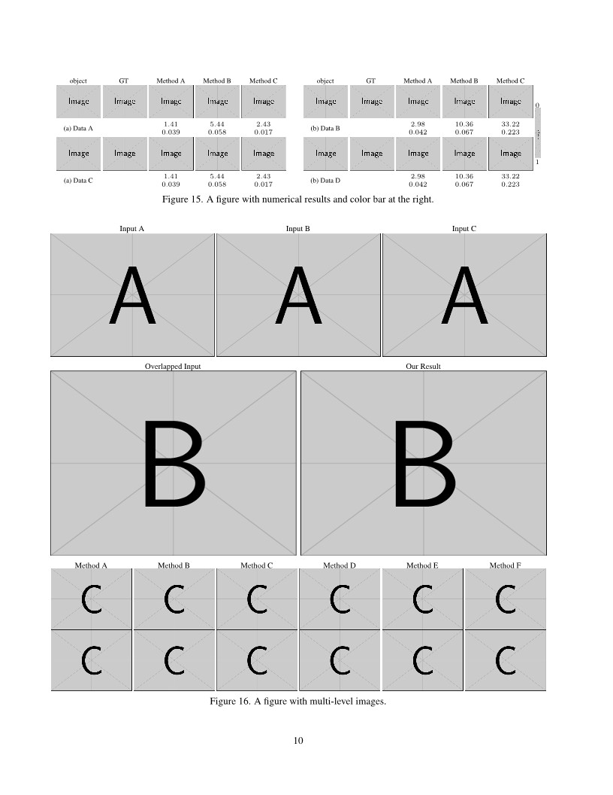

## 审稿阶段如何突出显示论文的修改- latexdiff

用户在投稿阶段的话，到修改文章阶段。往往在邮件中，看到审稿人要求“highlight (e.g. with colored text) all changes within the paper to further facilitate re-review”，也就是要求标记增加的和删掉的内容，编辑或审稿人是希望你突出显示（例如使用彩色文本）论文中的所有更改以进一步促进重审。如下图：




**latexdiff** 
> latexdiff 是一个用于比较两个 LaTeX 文档差异的工具，是 LaTeX 用户在文档修订过程中的有力助手，它简化了文档比较的过程，使得跟踪和展示文档的变更变得更加容易。通过分析 LaTeX 源文件来生成一个包含差异的 LaTeX 文档，这个文档会以高亮的方式显示两个版本之间的变化。这对于跟踪文档的修改历史、审阅文档的变更或者准备会议论文的修订稿非常有用。

主要功能：
1. 差异高亮：latexdiff 会在生成的文档中用不同的颜色或文本样式来标记添加、删除和修改的部分。
2. 合并文档：它可以生成一个文档，其中包含了两个版本的差异，同时保留原始文档的格式。
3. 命令行工具：作为一个命令行工具，latexdiff 可以通过命令行参数来控制比较的细节和输出格式。
4. 兼容性：支持复杂的 LaTeX 文档，处理公式、图表和各种 LaTeX 环境。
5. 选项丰富：提供了多种选项来定制比较结果，比如忽略空白字符、忽略注释等。

### 使用方法：
`latexdiff` 的基本使用方法如下：

`latexdiff old.tex new.tex > diff.tex`
然后 编译差异文档：

`pdflatex diff.tex`

这里的 old.tex 和 new.tex 分别是你要比较的两个 LaTeX 文档，而 diff.tex 是包含差异的输出文档。如下图：



命令行选项：
- `-o` 或 `--oldpreamble`：指定旧文档的前导代码。

- `-n` 或 `--newpreamble`：指定新文档的前导代码。

- `-p` 或 `--preamble`：指定两个文档共享的前导代码。

- `--ignore-spaces`：忽略空格的差异。

- `--ignore-blank-lines`：忽略空白行的差异。

- `--highlight-changes`：高亮显示变化。

- `--report`：生成一个只包含变化的摘要报告。

- `--textsize`：指定生成文档的字体大小。

- `UNDERLINE-` 添加的文本为波浪下划线和蓝色，丢弃的文本被删除并呈红色;

- `CTRADITIONAL`- 添加的文本为蓝色，设置为无衬线体，并为每段丢弃的文本创建一个红色脚注;

- `TRADITIONAL`——喜欢，但没有使用颜色;CTRADITIONAL

- `CFONT`- 添加的文本为蓝色，设置为无衬线，丢弃的文本为红色，尺寸非常小;

- `FONTSTRIKE`- 添加的文本设置为无衬线字体，丢弃的文本变小并删除;

- `CHANGEBAR`- 添加的文本为蓝色，丢弃的文本为红色。此外，更改后的文本在页边距中标有条形图。

::: warning
确保两个比较的 LaTeX 文档具有相同的结构和格式，以便 latexdiff 能够正确地识别差异。
latexdiff 可能无法处理包含大量宏包或自定义命令的复杂文档，这时可能需要手动调整或优化命令行参数。
:::

参考：[LaTeXdiff 官方文档](https://www.ctan.org/pkg/latexdiff)、[LaTeXdiff project](https://github.com/ftilmann/latexdiff/)

[一个简易站点简化使用](https://3142.nl/latex-diff/)

### Overleaf 上使用 latexdiff
假设你原来的论文文档为old.tex，即为旧文档；对应的参考文献条目所在的文档为old-ref.bib。

1. 在旧文档所在文件夹下新建文档 new.tex（_具体在哪里新建文档其实无所谓，只要自行确定好新旧文档相对位置，在代码中把文件路径写正确就可以_），存储你修改后的论文，并将old.tex 中的内容全部复制粘贴到new.tex
2. 创建新的参考文献条目文档new-ref.bib ，将old-ref.bib中的内容全部复制到new-ref.bib
3. 在new.tex中更新参考文献条目的链接为new-ref.bib，之后随意撰写你的新论文（理想情况），并在new-ref.bib中新增新论文需要引用的文献
4. 在相同位置新建文档diff.tex，用于生成对比文档，在文档中书写以下代码：
```LaTeX
\RequirePackage{shellesc}
\ShellEscape{pdfLatex new.tex} %编译新文档
\ShellEscape{pdfLatex old.tex} %编译旧文档
% 上方两行是为保证生成对比文档永远是基于最新的两个论文的版本，但如果你一直手动保存并编译论文，也可以不写上方两行
\ShellEscape{latexdiff old.tex new.tex > diff_result.tex} % 生成对比结果，即为diff_result.tex
\input{diff_result}
\documentclass{dummy}
```
5. 在diff.tex点击编译即可，预览窗口将看到生成的 pdf；
节选自：https://zhuanlan.zhihu.com/p/696176077

### latexdiff.cn网站



+ 网站：https://latexdiff.cn
+ 源码与教程：https://github.com/am009/git-latexdiff-web

如果使用的是 overleaf，可以直接上传 overleaf 上下载的压缩包。

功能上，我们支持仅显示新增的内容，以及任意修改颜色和样式。

1. 仅显示新增的内容
2. 任意修改颜色，可以添加删除线或者波浪下划线。（其他样式开发中）
3. 新增的图表用边框标注显示




::: info 使用场景
当你想要看看哪里有变化。
论文的审稿意见为 major/minor revision 时，可以使用这个和上一个版本对比生成一个 diff（作为参考）。
如果你不想上传自己的项目，可以通过命令行一键在本地运行。


如果你不想暴露自己的 LaTeX 源码，可以自己跑一个 diff 后端并在网页填入本地的 API 地址，文件不会被发送到外部。或者使用我们命令行版本的 latexdiff，一行 docker 命令即可在本地运行。
:::

## 表格例子和图例
参考：https://github.com/guanyingc/latex_paper_writing_tips?tab=readme-ov-file#examples-for-table-organization
overleaf:https://www.overleaf.com/read/hypvpvnzjjwx#970bea

导言区
```LaTeX:line-numbers
% 导言区
\usepackage[pagenumbers]{cvpr} % To force page numbers, e.g. for an arXiv version

% Include other packages here, before hyperref.
\usepackage{graphicx}
\usepackage{amsmath}
\usepackage{amssymb}
\usepackage{booktabs}

% included packages
\usepackage{makecell}
\usepackage{colortbl}
\usepackage{xcolor}

% It is strongly recommended to use hyperref, especially for the review version.
% hyperref with option pagebackref eases the reviewers' job.
% Please disable hyperref *only* if you encounter grave issues, e.g. with the
% file validation for the camera-ready version.
%
% If you comment hyperref and then uncomment it, you should delete
% ReviewTempalte.aux before re-running LaTeX.
% (Or just hit 'q' on the first LaTeX run, let it finish, and you
%  should be clear).
\usepackage[pagebackref,breaklinks,colorlinks]{hyperref}


% Support for easy cross-referencing
\usepackage[capitalize]{cleveref}
\crefname{section}{Sec.}{Secs.}
\Crefname{section}{Section}{Sections}
\Crefname{table}{Table}{Tables}
\crefname{table}{Tab.}{Tabs.}

% For caption setup
\captionsetup[table]{aboveskip=3pt}
\captionsetup[table]{belowskip=2pt}
\captionsetup[figure]{aboveskip=5pt}
\captionsetup[figure]{belowskip=0pt}
\captionsetup{font=normal}

%%%%%%%%% PAPER ID  - PLEASE UPDATE
\def\cvprPaperID{*****} % *** Enter the CVPR Paper ID here
\def\confName{CVPR}
\def\confYear{2022}

% utils
\newcommand{\correct}[1]{\textcolor{blue}{#1 \checkmark}}
\newcommand{\wrong}[1]{\textcolor{red}{#1 $\times$}}
```

### 表格例子

输入：
::: code-group

```makefile
src = paper_writing_tips
#default language: English, compile with pdflatex 
pdf:
	pdflatex $(src).tex
#open pdf
show:
	xdg-open $(src).pdf
mshow:
	open -a skim $(src).pdf
macshow:
	open $(src).pdf
# contain citation 
bib:
	pdflatex $(src).tex
	bibtex $(src).aux
	pdflatex $(src).tex
	pdflatex $(src).tex
clean:
	rm -f *.aux *.log *.blg *.dvi *.nav *.out *.snm *.toc *.brf
```
```LaTeX [table1]
\begin{table}[thb]\centering
    \caption{A simple table with a header row.}
    \label{tab:table1}
    \resizebox{0.48\textwidth}{!}{
    \large
    \begin{tabular}{*{10}{c}}
        \toprule
       Data & Size &  2-Exp & 3-Exp &  4-Exp & 5-Exp &  6-Exp &  7-Exp \\
        \midrule
        A & $1280\times 720$ & 1 & 2 & 3 & 4 & 5 & 4 \\
        B & $1280\times 720$ & 1 & 2 & 3 & 4 & 5 & 4 \\
        Ours & $4096\times 2168$ & 2 & 3 & 4 & 6 & 5 & 4 \\
        \bottomrule
    \end{tabular}
    }
\end{table}

```
```LaTeX [table2]
\begin{table}[thb]\centering
    \caption{A table with multi-column headers.}
    \label{tab:table2}
    \resizebox{0.48\textwidth}{!}{
    \large
    \begin{tabular}{*{10}{c}}
        \toprule
        &  &  \multicolumn{2}{c}{$6-9$ frames} & \multicolumn{2}{c}{$5-7$ frames} & \multicolumn{2}{c}{$50-200$ frames} \\
       Data & Size &  2-Exp & 3-Exp &  2-Exp & 3-Exp &  2-Exp & 3-Exp \\
        \midrule
        A & $1280\times 720$ & 1 & 2 & 3 & 4 & 5 & 4 \\
        B & $1280\times 720$ & 1 & 2 & 3 & 4 & 5 & 4 \\
        Ours & $4096\times 2168$ & 2 & 3 & 4 & 6 & 5 & 4 \\
        \bottomrule
    \end{tabular}
    }
\end{table}
```

```LaTeX [table3]
% require package makecell 
\begin{table}[thb]\centering
    \caption{A table with line break in the header. Line break is useful if the item name is too long.}
    \label{tab:table3}
    \resizebox{0.48\textwidth}{!}{
    \large
    \begin{tabular}{*{10}{c}}
        \toprule
         %&  &  \multicolumn{3}{c}{\makecell{Static Scenes \\ w/ Ground Truth}} & \multicolumn{3}{c}{\makecell{Dynamic Scenes \\ w/o Ground Truth}} \\
        &  &  \multicolumn{3}{c}{$6-9$ frames} & \multicolumn{3}{c}{$5-7$ frames} \\
        Data & Size &  \makecell{2-Exp \\ Scenes} &  \makecell{2-Exp \\ Scenes} &  \makecell{2-Exp \\ Scenes} &  \makecell{2-Exp \\ Scenes} &  \makecell{2-Exp \\ Scenes} &  \makecell{2-Exp \\ Scenes} \\
        \midrule
        A & $1280\times 720$ & 1 & 2 & 3 & 4 & 5 & 4 \\
        B & $1280\times 720$ & 1 & 2 & 3 & 4 & 5 & 4 \\
        Ours & $4096\times 2168$ & 2 & 3 & 4 & 6 & 5 & 4 \\
        \bottomrule
    \end{tabular}
    }
\end{table}
```
```LaTeX [table4]
% require package makecell 
\begin{table}[thb]\centering
    \caption{A table with multi-column headers and vertical lines for grouping.}
    \label{tab:table4}
    \resizebox{0.48\textwidth}{!}{
    \large
    \begin{tabular}{c|c|ccc|ccc}
        \toprule
         %&  &  \multicolumn{3}{c}{\makecell{Static Scenes \\ w/ Ground Truth}} & \multicolumn{3}{c}{\makecell{Dynamic Scenes \\ w/o Ground Truth}} \\
        &  &  \multicolumn{3}{c|}{$6-9$ frames} & \multicolumn{3}{c}{$5-7$ frames} \\
        Data & Size &  \makecell{2-Exp \\ Scenes} &  \makecell{2-Exp \\ Scenes} &  \makecell{2-Exp \\ Scenes} &  \makecell{2-Exp \\ Scenes} &  \makecell{2-Exp \\ Scenes} &  \makecell{2-Exp \\ Scenes} \\
        \midrule
        A & $1280\times 720$ & 1 & 2 & 3 & 4 & 5 & 4 \\
        B & $1280\times 720$ & 1 & 2 & 3 & 4 & 5 & 4 \\
        Ours & $4096\times 2168$ & 2 & 3 & 4 & 6 & 5 & 4 \\
        \bottomrule
    \end{tabular}
    }
\end{table}
```

```LaTeX [table5]
% require package makecell 
\begin{table}[thb]\centering
    \caption{A table with multi-column headers and bold font highlights.}
    \label{tab:table5}
    \resizebox{0.48\textwidth}{!}{
    \large
    \begin{tabular}{c|c|ccc|ccc}
        \toprule
         %&  &  \multicolumn{3}{c}{\makecell{Static Scenes \\ w/ Ground Truth}} & \multicolumn{3}{c}{\makecell{Dynamic Scenes \\ w/o Ground Truth}} \\
        &  &  \multicolumn{3}{c|}{$6-9$ frames} & \multicolumn{3}{c}{$5-7$ frames} \\
        Data & Size &  \makecell{2-Exp \\ Break} &  \makecell{2-Exp \\ Break} &  \makecell{2-Exp \\ Break} &  \makecell{2-Exp \\ Break} &  \makecell{2-Exp \\ Break} &  \makecell{2-Exp \\ Break} \\
        \midrule
        A & $1280\times 720$ & 1 & 2 & 3 & 4 & \textbf{5} & \textbf{7} \\
        B & $1280\times 720$ & 1 & 2 & 3 & 4 & \textbf{5} & \textbf{7} \\
        Ours & $4096\times 2168$ & \textbf{2} & \textbf{3} & \textbf{4} & \textbf{6} & \textbf{5} & 4 \\
        \bottomrule
    \end{tabular}
    }
\end{table}
```
```LaTeX [table6]
% multi-column with parallel lines
% \usepackage{colortbl}  
% \usepackage{xcolor}

\begin{table}[thb]\centering
    \caption{A table with parallel lines for grouping and color highlight.} %
    \label{tab:ablation_study}
    \resizebox{0.48\textwidth}{!}{
    \Large
    \begin{tabular}{*{2}{l}||*{2}{c}||*{2}{c}||*{2}{c}}
        \toprule
        \multicolumn{1}{c}{} & \multicolumn{1}{c||}{} & \multicolumn{2}{c||}{Synthetic Dataset} & \multicolumn{2}{c||}{Static Data} & \multicolumn{2}{c}{Dynamicgt Data} \\
        ID & Method  & PSNRT & VDP & PSNRT & VDP & PSNRT & VDP \\
        \midrule
        0 & ANet  & 39.25 & 70.81 & 40.62 & 74.51 & 44.43 & 77.74 \\ %
        1 & BNet  & 39.69 & 70.95 & 37.61 & 75.30 & 43.70 & 78.97 \\
        \rowcolor{gray!20}
        2 & ANet + BNet  & \textbf{40.34} & \textbf{71.79} & \textbf{41.18} & \textbf{76.15} & \textbf{45.46} & \textbf{79.09} \\
        \midrule
        3 & ANet + BNet w/o C & 39.72 & 71.38 & 40.52 & 74.79 & 45.09 & 78.24 \\ %
        4 & ANet + BNet w/o D & 40.03 & 71.66 & 40.80 & 76.12 & 45.17 & 78.99 \\ %
        \bottomrule
    \end{tabular}
    }
\end{table}
```
```LaTeX [table8]
\begin{table}[thb] \centering
    \caption{A table with images at the left. Images can be useful to illustrate different setups.} 
    \label{tab:res_synth_mirco_baseline}
    \includegraphics[width=0.088\textwidth,height=0.085\textwidth]{example-image-a}
    \includegraphics[width=0.088\textwidth,height=0.085\textwidth]{example-image-b}
    \includegraphics[width=0.088\textwidth,height=0.085\textwidth]{example-image-c}
    \raisebox{0.9\height}{
    \resizebox{0.19\textwidth}{!}{
    \large
    \begin{tabular}{ccc}
        \toprule
        Type & Range & MAE \\
        \midrule
        (a) & 144$\times$144 & 4.21 \\ 
        (b) & 37$\times$37 & 10.90 \\
        (c) & 22$\times$22 & 18.72 \\
        \bottomrule
    \end{tabular}
    }}
    \\
    \vspace{-0.2em}
    \makebox[0.09\textwidth]{\footnotesize (a)} 
    \makebox[0.09\textwidth]{\footnotesize (b)}
    \makebox[0.09\textwidth]{\footnotesize (c)}
    \makebox[0.19\textwidth]{\footnotesize (d) Normal estimation}
    \\
\end{table}
```
```LaTeX [table9-11]
% two-column table with color header
\begin{table*} \centering
    \caption{A two-column table with color header.}
    \label{tab:table9}
    \begin{minipage}{0.93\textwidth}
    \resizebox{\textwidth}{!}{
    \Huge
        \begin{tabular}{c|*{4}{c}|*{4}{c}|*{4}{c}|*{4}{c}|*{4}{c}}
        \toprule
        & \multicolumn{4}{c}{Glass} 
                               & \multicolumn{4}{c}{Glass with Water} 
                               & \multicolumn{4}{c}{Lens} 
                               & \multicolumn{4}{c}{Complex Shape}  
                               & \multicolumn{4}{c}{Average}  \\
                               & \cellcolor{red!25} F-EPE & \cellcolor{red!25}A-MSE & \cellcolor{red!25}I-MSE & \cellcolor{blue!25} M-IoU 
                               & \cellcolor{red!25} F-EPE & \cellcolor{red!25}A-MSE & \cellcolor{red!25}I-MSE & \cellcolor{blue!25} M-IoU 
                               & \cellcolor{red!25} F-EPE & \cellcolor{red!25}A-MSE & \cellcolor{red!25}I-MSE & \cellcolor{blue!25} M-IoU 
                               & \cellcolor{red!25} F-EPE & \cellcolor{red!25}A-MSE & \cellcolor{red!25}I-MSE & \cellcolor{blue!25} M-IoU 
                               & \cellcolor{red!25} F-EPE & \cellcolor{red!25}A-MSE & \cellcolor{red!25}I-MSE & \cellcolor{blue!25} M-IoU \\
        \midrule
        Method A    & 3.6 / 30.3 & 1.33 & 0.48 & 0.12 & 6.4 / 53.2 & 1.54 & 0.68 & 0.12 & 10.3 / 39.2 & 1.94 & 1.57 & 0.24 & 6.8 / 56.8 & 2.50 & 0.85 & 0.11 & 6.8 / 44.9 & 1.83 & 0.90 & 0.15 \\
        Method B$^*$     & 2.1 / 15.8 & 0.22 & 0.14 & 0.97 & 3.1 / 23.5 & 0.31 & 0.23 & 0.97 & 2.0 / 6.7   & 0.17 & 0.28 & 0.99 & 4.5 / 34.4 & 0.38 & 0.33 & 0.92 & 2.9 / 20.1 & 0.27 & 0.24 & 0.96 \\
        \midrule
        Method C       & 1.9 / 14.7 & 0.21 & 0.14 & 0.97 & 2.9 / 21.8 & 0.30 & 0.22 & 0.97 & 1.9 / 6.6   & 0.15 & 0.29 & 0.99 & 4.1 / 31.5 & 0.37 & 0.32 & 0.92 & 2.7 / 18.6 & 0.26 & 0.24 & 0.96 \\
        \bottomrule
    \end{tabular}
    }
    \end{minipage}
    \hspace{-0.6em}
    \begin{minipage}{0.06\textwidth}
        \resizebox{\textwidth}{!}{
        \begin{tabular}{cc}
            \midrule
            MSE ($\cdot10^{-2}$) \\
            \cellcolor{red!25} $\downarrow$ better \\ 
            \cellcolor{blue!25} $\uparrow$ better\\
            \midrule
        \end{tabular}
        }
    \end{minipage}
        \vspace{-0.6em}
    \begin{flushleft}
    	\footnotesize ${^*}$ indicates that method B is trained from scratch.
    \end{flushleft}
\end{table*}
```
```LaTeX [table12]
% two-column table with two sub-tables
\newcommand{\PSNRT}{PSNR\xspace}
\newcommand{\VQM}{HDR-VQM\xspace}
\newcommand{\VDP}{HDR-VDP2\xspace}
\newcommand{\LowExposure}{Low-Exposure\xspace}
\newcommand{\MiddleExposure}{Middle-Exposure\xspace}
\newcommand{\HighExposure}{High-Exposure\xspace}
\newcommand{\AllExposure}{All-Exposure\xspace}

\newcommand{\Frst}[1]{\textcolor{red}{\textbf{#1}}}
\newcommand{\Scnd}[1]{\textcolor{blue}{\textbf{#1}}}

\begin{table*}[t] \centering
    \caption{A two-column table with two sub-tables. \Frst{Red} text indicates the best and \Scnd{blue} text indicates the second best result, respectively.}
    \label{tab:res_real_data_wide}
    \makebox[\textwidth]{\small (a) Results on dataset A.} 
    \resizebox{\textwidth}{!}{
        \Large
    \begin{tabular}{l||*{2}{c}|*{2}{c}|*{3}{c}||*{2}{c}|*{2}{c}|*{2}{c}|*{3}{c}}
        \toprule
        & \multicolumn{7}{c||}{2-Exposure} & \multicolumn{9}{c}{3-Exposure} \\
        & \multicolumn{2}{c}{\LowExposure} & \multicolumn{2}{c}{\HighExposure} & \multicolumn{3}{c||}{\AllExposure} & \multicolumn{2}{c}{\LowExposure} & \multicolumn{2}{c}{\MiddleExposure} & \multicolumn{2}{c}{\HighExposure} & \multicolumn{3}{c}{\AllExposure} \\
        Method & \PSNRT & \VDP & \PSNRT & \VDP  & \PSNRT & \VDP & \VQM & \PSNRT & \VDP & \PSNRT & \VDP  & \PSNRT & \VDP & \PSNRT & \VDP & \VQM \\
        \midrule
        Method A & \Scnd{40.00} & 73.70 & \Scnd{40.04} & \Scnd{70.08} & \Scnd{40.02} & 71.89 & \Scnd{76.22} 
                      & \Scnd{39.61} & 73.24 & \Frst{39.67} & \Frst{73.24} & \Frst{40.01} & 67.90 & \Frst{39.77} & 70.37 & 79.55 \\
        Method B      & 34.54 & 80.22 & 39.25 & 65.96 & 36.90 & 73.09 & 65.33 
                      & 36.51 & 77.78 & 37.45 & 69.79 & 39.02 & 64.57 & 37.66 & 70.71 & 70.13 \\
        Method C  & 39.79 & \Scnd{81.02} & 39.96 & 67.25 & 39.88 & \Scnd{74.13} & 73.84 
                      & 39.48 & \Scnd{78.13} & 38.43 & 70.08 & 39.60 & \Scnd{67.94} & 39.17 & \Scnd{72.05} & \Scnd{80.70} \\
        Ours          & \Frst{41.95} & \Frst{81.03} & \Frst{40.41} & \Frst{71.27} & \Frst{41.18} & \Frst{76.15} & \Frst{78.84}
                      & \Frst{40.00} & \Frst{78.66} & \Scnd{39.27} & \Scnd{73.10} & \Scnd{39.99} & \Frst{69.99} & \Scnd{39.75} & \Frst{73.92} & \Frst{82.87} \\
        \bottomrule
    \end{tabular}
    }

    \vspace{0.5em}
    \makebox[\textwidth]{\small (b) Results on dataset B.} 
    \resizebox{\textwidth}{!}{
        \Large
    \begin{tabular}{l||*{2}{c}|*{2}{c}|*{3}{c}||*{2}{c}|*{2}{c}|*{2}{c}|*{3}{c}}
        \toprule
        & \multicolumn{7}{c||}{2-Exposure} & \multicolumn{9}{c}{3-Exposure} \\
        & \multicolumn{2}{c}{\LowExposure} & \multicolumn{2}{c}{\HighExposure} & \multicolumn{3}{c||}{\AllExposure} & \multicolumn{2}{c}{\LowExposure} & \multicolumn{2}{c}{\MiddleExposure} & \multicolumn{2}{c}{\HighExposure} & \multicolumn{3}{c}{\AllExposure} \\
        Method & \PSNRT & \VDP & \PSNRT & \VDP  & \PSNRT & \VDP & \VQM & \PSNRT & \VDP & \PSNRT & \VDP  & \PSNRT & \VDP & \PSNRT & \VDP & \VQM \\
        \midrule
        Method A & 37.73 & 74.05 & 45.71 & 66.67 & 41.72 & 70.36 & 85.33 
                      & 37.53 & 72.03 & 36.38 & 65.37 & 34.73 & 62.24 & 36.21 & 66.55 & 84.43 \\
        Method B      & 36.41 & 85.68 & \Scnd{49.89} & \Scnd{69.90} & 43.15 & 77.79 & 78.92 
                      & 36.43 & 77.74 & 39.80 & \Scnd{67.88} & \Scnd{43.03} & \Scnd{64.74} & 39.75 & \Scnd{70.12} & 87.93 \\
        Method C  & \Scnd{39.94} & \Scnd{86.77} & 49.49 & 69.04 & \Scnd{44.72} & \Scnd{77.91} & \Scnd{87.16} 
                      & \Scnd{38.34} & \Scnd{78.04} & \Scnd{41.21} & 66.07 & 42.66 & 64.01 & \Scnd{40.74} & 69.37 & \Scnd{89.36}\\
        Ours          & \Frst{40.83} & \Frst{86.84} & \Frst{50.10} & \Frst{71.33} & \Frst{45.46} & \Frst{79.09} & \Frst{87.40} 
                      & \Frst{38.77} & \Frst{78.11} & \Frst{41.47} & \Frst{68.49} & \Frst{43.24} & \Frst{65.08} & \Frst{41.16} & \Frst{70.56} & \Frst{89.56}\\
        \bottomrule
    \end{tabular}
    }
\end{table*}
```
```LaTeX [table13]
% two figure placed side-by-side
\begin{table*}[t]
\centering
    \caption{A two-column table with \textbackslash cmidrule for grouping without using vertical lines.}
\label{tab:quantitative}

\resizebox{1.\textwidth}{!}{
    \begin{tabular}{lcccccccccc}

    \toprule
    {} & \multicolumn{6}{c}{Dataset A} & \multicolumn{4}{c}{Dataset B} \\
    \cmidrule[0.5pt](rl){2-7}
    \cmidrule[0.5pt](rl){8-11}
    {} & \multicolumn{3}{c}{Setup A}  & \multicolumn{3}{c}{Setup B} & \multicolumn{2}{c}{Setup C}  & \multicolumn{2}{c}{Setup D} \\
    \cmidrule[0.5pt](rl){2-4}
    \cmidrule[0.5pt](rl){5-7}
    \cmidrule[0.5pt](rl){8-9}
    \cmidrule[0.5pt](rl){10-11}
        {Method} & {Some Metric A} & {Some Metric B} & {Some Metric C} & {Some Metric A} & {Some Metric B} & {Some Metric C} & {Metric D} & {Metric E} & {Metric D} & {Metric E} \\
    \midrule
    Method A &  34.54 & 80.22 & 39.25 & 65.96 & 36.90 & 73.09 & 65.33 & 36.51 & 77.78 & 37.45 \\
    Method B  &  34.54 & 80.22 & 39.25 & 65.96 & 36.90 & 73.09 & 65.33 & 36.51 & 77.78 & 37.45 \\
    Method C   &  34.54 & 80.22 & 39.25 & 65.96 & 36.90 & 73.09 & 65.33 & 36.51 & 77.78 & 37.45 \\
    Method D   &  34.54 & 80.22 & 39.25 & 65.96 & 36.90 & 73.09 & 65.33 & 36.51 & 77.78 & 37.45 \\
    \bottomrule
    \end{tabular}
}
\end{table*}
```
```LaTeX [table14]
\begin{table*}[t] \centering
    \caption{A two-column table with images in the header. Images are useful to visualize each item in the header.} 
    \label{tab:table10}
    \resizebox{\textwidth}{!}{%
        %\large
        \begin{tabular}{l|*{6}{cc}cc}
            \toprule
            & \multicolumn{2}{c}{\includegraphics[height=0.09\textwidth]{example-image}}
            & \multicolumn{2}{c}{\includegraphics[height=0.09\textwidth]{example-image}}
            & \multicolumn{2}{c}{\includegraphics[height=0.09\textwidth]{example-image}}
            & \multicolumn{2}{c}{\includegraphics[height=0.09\textwidth]{example-image}}
            & \multicolumn{2}{c}{\includegraphics[height=0.09\textwidth]{example-image}}
            & \multicolumn{2}{c}{\includegraphics[height=0.09\textwidth]{example-image}}
            %\vspace{-0.5em}
            \\
            & \multicolumn{2}{c}{\makebox[0.18\textwidth]{\emph{Helmet Side}}}
            & \multicolumn{2}{c}{\makebox[0.18\textwidth]{\emph{Plant}}}
            & \multicolumn{2}{c}{\makebox[0.18\textwidth]{\emph{Fighting Knight}}}
            & \multicolumn{2}{c}{\makebox[0.18\textwidth]{\emph{Kneeling Knight}}}
            & \multicolumn{2}{c}{\makebox[0.18\textwidth]{\emph{Standing Knight}}}
            & \multicolumn{2}{c}{\makebox[0.18\textwidth]{\emph{Helmet Front}}}
            & \multicolumn{2}{c}{\makebox[0.18\textwidth]{average}} 
            \\
            \makebox[0.12\textwidth]{model\hfill}  & dir.    & int.  &  dir.    & int.  &  dir.     & int. &  dir.    & int. & dir.    & int.  &  dir.  & int.  &  dir.  & int. \\
            \midrule
            Method A & 25.40   & 0.576     & 20.56     & 0.227    & 69.50    & 1.137     & 46.69    & 9.805     & 33.81    & 1.311     & 81.60    & \textbf{0.133} & 46.26   & 2.198    \\
            Method B & 6.57	& 0.212	    & 16.06	    & 0.170	   & 15.95 	  & 0.214	  & 19.84	 & 0.199	 & 11.60    & 0.286	    & 11.62	   & 0.248	  & 13.61    & 0.221      \\
            Method C & \textbf{5.33}& \textbf{0.096} & \textbf{10.49} & \textbf{0.154}& \textbf{13.42}& \textbf{0.168} & \textbf{14.41}& \textbf{0.181} & \textbf{5.31} & \textbf{0.198} & \textbf{6.22} & 0.183     & \textbf{9.20} & \textbf{0.163} \\
            \bottomrule
        \end{tabular}
    }
\end{table*}
```
```LaTeX [table15]
% two tables side-by-side
\begin{table*}[t] \centering
\begin{minipage}[t]{0.48\linewidth}
    \caption{Two tables placed side by side. Table A (left).} \label{tab:table10A}
    \resizebox{\textwidth}{!}{
    \large
    \begin{tabular}{*{10}{c}}
        \toprule
        &  &  \multicolumn{2}{c}{$6-9$ frames} & \multicolumn{2}{c}{$5-7$ frames} & \multicolumn{2}{c}{$50-200$ frames} \\
       Data & Size &  2-Exp & 3-Exp &  2-Exp & 3-Exp &  2-Exp & 3-Exp \\
        \midrule
        A & $1280\times 720$ & 1 & 2 & 3 & 4 & 5 & 4 \\
        Ours & $4096\times 2168$ & 2 & 3 & 4 & 6 & 5 & 4 \\
        \bottomrule
    \end{tabular}
    }
\end{minipage}\hfill
    \begin{minipage}[t]{0.48\linewidth}
    \caption{Two tables placed side by side. Table B (right).} \label{tab:table10B}
    \resizebox{\textwidth}{!}{
    \large
    \begin{tabular}{*{10}{c}}
        \toprule
         %&  &  \multicolumn{3}{c}{\makecell{Static Scenes \\ w/ Ground Truth}} & \multicolumn{3}{c}{\makecell{Dynamic Scenes \\ w/o Ground Truth}} \\
        &  &  \multicolumn{3}{c}{$6-9$ frames} & \multicolumn{3}{c}{$5-7$ frames} \\
        Data & Size &  \makecell{2-Exp \\ Scenes} &  \makecell{2-Exp \\ Scenes} &  \makecell{2-Exp \\ Scenes} &  \makecell{2-Exp \\ Scenes} &  \makecell{2-Exp \\ Scenes} &  \makecell{2-Exp \\ Scenes} \\
        \midrule
        A & $1280\times 720$ & 1 & 2 & 3 & 4 & 5 & 4 \\
        Ours & $4096\times 2168$ & 2 & 3 & 4 & 6 & 5 & 4 \\
        \bottomrule
    \end{tabular}
    }
\end{minipage}
\end{table*}
```
```LaTeX [table18]
% two column network arch table
\begin{table*}[thb]
    \centering
    \caption{A two-column table for illustrating the network architecture.}
    \label{tab:table_network1}
	\resizebox{\textwidth}{!}{
    \begin{tabular}{cc}
        \begin{tabular}[t]{|*{6}{l|}}
        \hline
        \multicolumn{6}{|c|}{\textbf{Encoder}} \\
        \hline
        \textbf{layer} & \textbf{k} & \textbf{s} & \textbf{chns} & \textbf{d-f} & \textbf{input} \\
        \hline 
        conv1   & 3     & 1     & 3/16    & 1    & Image \\
        conv1b  & 3     & 1     & 16/16   & 1    & conv1 \\ 
        conv2   & 3     & 2     & 16/16   & 2    & conv1b \\
        conv2b  & 3     & 1     & 16/16   & 2    & conv2 \\ 
        conv3   & 3     & 2     & 16/32   & 4    & conv2b \\
        conv3b  & 3     & 1     & 32/32   & 4    & conv3 \\ 
        conv4   & 3     & 2     & 32/64   & 8    & conv3b \\
        conv4b  & 3     & 1     & 64/64   & 8    & conv4 \\ 
        conv5   & 3     & 2     & 64/128  & 16   & conv4b \\
        conv5b  & 3     & 1     & 128/128 & 16   & conv5 \\ 
        conv6   & 3     & 2     & 128/256 & 32   & conv5b \\
        conv6b  & 3     & 1     & 256/256 & 32   & conv6 \\ 
        conv7   & 3     & 2     & 256/256 & 64   & conv6b \\
        conv7b  & 3     & 1     & 256/256 & 64   & conv7 \\
        \hline
        \end{tabular}
        \begin{tabular}[t]{|*{6}{l|}}
            \hline
            \multicolumn{6}{|c|}{\textbf{Decoder}} \\
            \hline
            \textbf{layer} & \textbf{k} & \textbf{s} & \textbf{chns} & \textbf{d-f} & \textbf{input} \\
            \hline 
            conv\_up7\_m & 3     & 1     & 256/256   & 32  & conv7b \\
            conv\_up7\_a & 3     & 1     & 256/256   & 32  & conv7b \\
            conv\_up7\_f & 3     & 1     & 256/256   & 32  & conv7b \\
            \hline 
            \multicolumn{6}{|c|}{conv\_up7=conv\_up7\_m+conv\_up7\_a+conv\_up7\_f} \\
            \hline
            conv\_up6\_m & 3     & 1     & 256/128   & 16  & conv\_up7+conv6b\\
            conv\_up6\_a & 3     & 1     & 256/128   & 16  & conv\_up7+conv6b\\
            conv\_up6\_f & 3     & 1     & 256/128   & 16  & conv\_up7+conv6b\\
            \hline 
            \multicolumn{6}{|c|}{conv\_up6=conv\_up6\_m+conv\_up6\_a+conv\_up6\_f} \\
            \hline
            conv\_up5\_m & 3     & 1     & 128/64    & 8   & conv\_up6+conv5b \\
            conv\_up5\_a & 3     & 1     & 128/64    & 8   & conv\_up6+conv5b \\
            conv\_up5\_f & 3     & 1     & 128/64    & 8   & conv\_up6+conv5b \\
            \hline
            \multicolumn{6}{|c|}{conv\_up5=conv\_up5\_m+conv\_up5\_a+conv\_up5\_f} \\
            \hline
            m\_4         & 3     & 1     & 128/2     & 8   & conv\_up5+conv4b \\
            a\_4         & 3     & 1     & 128/1     & 8   & conv\_up5+conv4b \\
            f\_4         & 3     & 1     & 128/2     & 8   & conv\_up5+conv4b \\
            conv\_up4\_m & 3     & 1     & 128/32    & 4   & conv\_up5+conv4b \\
            conv\_up4\_a & 3     & 1     & 128/32    & 4   & conv\_up5+conv4b \\
            conv\_up4\_f & 3     & 1     & 128/32    & 4   & conv\_up5+conv4b \\
            \hline
            \multicolumn{6}{|c|}{conv\_up4=conv\_up4\_m+conv\_up4\_a+conv\_up4\_f} \\
            \hline
            m\_3         & 3     & 1     & 69/2      & 4   & conv\_up4+conv3b+(m\_4$^{\times 2}$+a\_4$^{\times 2}$+a\_4$^{\times 2}$) \\
            a\_3         & 3     & 1     & 69/1      & 4   & conv\_up4+conv3b+(m\_4$^{\times 2}$+a\_4$^{\times 2}$+a\_4$^{\times 2}$) \\
            f\_3         & 3     & 1     & 69/2      & 4   & conv\_up4+conv3b+(m\_4$^{\times 2}$+a\_4$^{\times 2}$+a\_4$^{\times 2}$) \\
            conv\_up3\_m & 3     & 1     & 69/16     & 2   & conv\_up4+conv3b+(m\_4$^{\times 2}$+a\_4$^{\times 2}$+a\_4$^{\times 2}$) \\
            conv\_up3\_a & 3     & 1     & 69/16     & 2   & conv\_up4+conv3b+(m\_4$^{\times 2}$+a\_4$^{\times 2}$+a\_4$^{\times 2}$) \\
            conv\_up3\_f & 3     & 1     & 69/16     & 2   & conv\_up4+conv3b+(m\_4$^{\times 2}$+a\_4$^{\times 2}$+a\_4$^{\times 2}$) \\
            \hline
            \multicolumn{6}{|c|}{conv\_up3=conv\_up3\_m+conv\_up3\_a+conv\_up3\_f} \\
            \hline
            m\_2         & 3     & 1     & 37/2      & 2   & conv\_up3+conv2b+(m\_3$^{\times 2}$+a\_3$^{\times 2}$+a\_3$^{\times 2}$) \\
            a\_2         & 3     & 1     & 37/1      & 2   & conv\_up3+conv2b+(m\_3$^{\times 2}$+a\_3$^{\times 2}$+a\_3$^{\times 2}$) \\
            f\_2         & 3     & 1     & 37/2      & 2   & conv\_up3+conv2b+(m\_3$^{\times 2}$+a\_3$^{\times 2}$+a\_3$^{\times 2}$) \\
            conv\_up2\_m & 3     & 1     & 37/16     & 1   & conv\_up3+conv2b+(m\_3$^{\times 2}$+a\_3$^{\times 2}$+a\_3$^{\times 2}$) \\
            conv\_up2\_a & 3     & 1     & 37/16     & 1   & conv\_up3+conv2b+(m\_3$^{\times 2}$+a\_3$^{\times 2}$+a\_3$^{\times 2}$) \\
            conv\_up2\_f & 3     & 1     & 37/16     & 1   & conv\_up3+conv2b+(m\_3$^{\times 2}$+a\_3$^{\times 2}$+a\_3$^{\times 2}$) \\
            \hline
            \multicolumn{6}{|c|}{conv\_up2=conv\_up2\_m+conv\_up2\_a+conv\_up2\_f} \\
            \hline
            m\_1         & 3     & 1     & 37/2      & 1   & conv\_up2+conv1b+(m\_2$^{\times 2}$+a\_2$^{\times 2}$+a\_2$^{\times 2}$) \\
            a\_1         & 3     & 1     & 37/1      & 1   & conv\_up2+conv1b+(m\_2$^{\times 2}$+a\_2$^{\times 2}$+a\_2$^{\times 2}$) \\
            f\_1         & 3     & 1     & 37/2      & 1   & conv\_up2+conv1b+(m\_2$^{\times 2}$+a\_2$^{\times 2}$+a\_2$^{\times 2}$) \\
            \hline                                                                         
        \end{tabular}
    \end{tabular}
    }
\end{table*}

```
:::

输出
 | 
--|--

### 图片例子
输入
::: code-group
```LaTeX [图1]
% single image
\begin{figure}[thb] \centering
    \includegraphics[width=0.48\textwidth]{example-image}
    \caption{A simple figure.} \label{fig:figure1}
\end{figure}
```

```LaTeX [图2]
% A figure with two images placed side by side.
\begin{figure}[thb] \centering
    \includegraphics[width=0.23\textwidth]{example-image-a}
    \includegraphics[width=0.23\textwidth]{example-image-b}
    \caption{A figure with two images placed side by side.} \label{fig:figure2}
\end{figure}
```
```LaTeX [图5]
\begin{figure}[t] \centering
    \makebox[0.01\textwidth]{}
    \makebox[0.108\textwidth]{\scriptsize Input 1}
    \makebox[0.108\textwidth]{\scriptsize Input 2}
    \makebox[0.108\textwidth]{\scriptsize Input 3}
    \makebox[0.108\textwidth]{\scriptsize Input 4}
    \\
    \raisebox{0.1\height}{\makebox[0.01\textwidth]{\rotatebox{90}{\makecell{\scriptsize Method A}}}}
    \includegraphics[width=0.108\textwidth]{example-image}
    \includegraphics[width=0.108\textwidth]{example-image}
    \includegraphics[width=0.108\textwidth]{example-image}
    \includegraphics[width=0.108\textwidth]{example-image}
    \\
    \raisebox{0.1\height}{\makebox[0.01\textwidth]{\rotatebox{90}{\makecell{\scriptsize Method B}}}}
    \includegraphics[width=0.108\textwidth]{example-image}
    \includegraphics[width=0.108\textwidth]{example-image}
    \includegraphics[width=0.108\textwidth]{example-image}
    \includegraphics[width=0.108\textwidth]{example-image}
    \\
    \raisebox{0.1\height}{\makebox[0.01\textwidth]{\rotatebox{90}{\makecell{\scriptsize Method C}}}}
    \includegraphics[width=0.108\textwidth]{example-image}
    \includegraphics[width=0.108\textwidth]{example-image}
    \includegraphics[width=0.108\textwidth]{example-image}
    \includegraphics[width=0.108\textwidth]{example-image}
    \\
    \caption{A figure with vertical text for illustration.} 
    \label{fig:teaser}
\end{figure}
```
```LaTeX [图6]
% A figure with three sub-figures
\begin{figure}[t] \centering
    \raisebox{1.5\height}{\makebox[0.055\textwidth]{\makecell{\small (a) \\ \footnotesize Version 1}}}
    \includegraphics[width=0.175\textwidth]{example-image-a} \hfill
    \raisebox{1.5\height}{\makebox[0.055\textwidth]{\makecell{\small (b) \\ \footnotesize Version 2}}}
    \includegraphics[width=0.175\textwidth]{example-image-b} 
    \\
    \caption{A figure with two sub-figures.} \label{fig:figure6}
\end{figure}
```
``` LaTeX [图9]
% A two-column figure with multiple images and text header
\begin{figure*}[t] \centering
    \makebox[0.12\textwidth]{\footnotesize (a) Method 1}
    \makebox[0.12\textwidth]{\footnotesize (b) Method 2}
    \makebox[0.12\textwidth]{\footnotesize (c) Method 3}
    \makebox[0.12\textwidth]{\footnotesize (d) Method 4}
    \makebox[0.12\textwidth]{\footnotesize (e) Method 5}
    \makebox[0.12\textwidth]{\footnotesize (f) Method 6}
    \makebox[0.12\textwidth]{\footnotesize (g) Method 7}
    \makebox[0.12\textwidth]{\footnotesize (h) Method 8}
    \\
    \includegraphics[width=0.12\textwidth]{example-image}
    \includegraphics[width=0.12\textwidth]{example-image}
    \includegraphics[width=0.12\textwidth]{example-image}
    \includegraphics[width=0.12\textwidth]{example-image}
    \includegraphics[width=0.12\textwidth]{example-image}
    \includegraphics[width=0.12\textwidth]{example-image}
    \includegraphics[width=0.12\textwidth]{example-image}
    \includegraphics[width=0.12\textwidth]{example-image}
    \\
    \includegraphics[width=0.12\textwidth]{example-image}
    \includegraphics[width=0.12\textwidth]{example-image}
    \includegraphics[width=0.12\textwidth]{example-image}
    \includegraphics[width=0.12\textwidth]{example-image}
    \includegraphics[width=0.12\textwidth]{example-image}
    \includegraphics[width=0.12\textwidth]{example-image}
    \includegraphics[width=0.12\textwidth]{example-image}
    \includegraphics[width=0.12\textwidth]{example-image}
    \\
    \includegraphics[width=0.12\textwidth]{example-image}
    \includegraphics[width=0.12\textwidth]{example-image}
    \includegraphics[width=0.12\textwidth]{example-image}
    \includegraphics[width=0.12\textwidth]{example-image}
    \includegraphics[width=0.12\textwidth]{example-image}
    \includegraphics[width=0.12\textwidth]{example-image}
    \includegraphics[width=0.12\textwidth]{example-image}
    \includegraphics[width=0.12\textwidth]{example-image}
    \\
    \caption{A two-column figure with multiple images and text header.} 
    \label{fig:figure8}
\end{figure*}
```
``` latex [图10]
% multiple images with two zoom in patches (horizontal)
\newcommand{\largefigsize}{0.160}
\newcommand{\smallboxsize}{0.076}
\newcommand{\smallfigsize}{0.076}
\newcommand{\rheightsize}{0.77}
\newcommand{\vspacesize}{-2}
\newcommand{\hspacesize}{-3}

\begin{figure*}[t] \centering
    \makebox[0.24\textwidth]{\footnotesize (a) Input frame}
    \makebox[0.24\textwidth]{\footnotesize (b) Method A}
    \makebox[0.24\textwidth]{\footnotesize (c) Method B}
    \makebox[0.24\textwidth]{\footnotesize (d) Method C}
    \\
    \includegraphics[width=\largefigsize\textwidth]{example-image}\hspace{\hspacesize pt}
    \raisebox{\rheightsize\height}{
        \makebox[\smallboxsize\textwidth]{
            \makecell{
                \includegraphics[width=\smallfigsize\textwidth]{example-image}\\[\vspacesize pt]
                \includegraphics[width=\smallfigsize\textwidth]{example-image}
            }
        }
    }\hfill
    \includegraphics[width=\largefigsize\textwidth]{example-image}\hspace{\hspacesize pt}
    \raisebox{\rheightsize\height}{
        \makebox[\smallboxsize\textwidth]{
            \makecell{
                \includegraphics[width=\smallfigsize\textwidth]{example-image}\\[\vspacesize pt]
                \includegraphics[width=\smallfigsize\textwidth]{example-image}
            }
        }
    }\hfill
    \includegraphics[width=\largefigsize\textwidth]{example-image}\hspace{\hspacesize pt}
    \raisebox{\rheightsize\height}{
        \makebox[\smallboxsize\textwidth]{
            \makecell{
                \includegraphics[width=\smallfigsize\textwidth]{example-image}\\[\vspacesize pt]
                \includegraphics[width=\smallfigsize\textwidth]{example-image}
            }
        }
    }\hfill
    \includegraphics[width=\largefigsize\textwidth]{example-image}\hspace{\hspacesize pt}
    \raisebox{\rheightsize\height}{
        \makebox[\smallboxsize\textwidth]{
            \makecell{
                \includegraphics[width=\smallfigsize\textwidth]{example-image}\\[\vspacesize pt]
                \includegraphics[width=\smallfigsize\textwidth]{example-image}
            }
        }
    }
    \\
    \includegraphics[width=\largefigsize\textwidth]{example-image}\hspace{\hspacesize pt}
    \raisebox{\rheightsize\height}{
        \makebox[\smallboxsize\textwidth]{
            \makecell{
                \includegraphics[width=\smallfigsize\textwidth]{example-image}\\[\vspacesize pt]
                \includegraphics[width=\smallfigsize\textwidth]{example-image}
            }
        }
    }\hfill
    \includegraphics[width=\largefigsize\textwidth]{example-image}\hspace{\hspacesize pt}
    \raisebox{\rheightsize\height}{
        \makebox[\smallboxsize\textwidth]{
            \makecell{
                \includegraphics[width=\smallfigsize\textwidth]{example-image}\\[\vspacesize pt]
                \includegraphics[width=\smallfigsize\textwidth]{example-image}
            }
        }
    }\hfill
    \includegraphics[width=\largefigsize\textwidth]{example-image}\hspace{\hspacesize pt}
    \raisebox{\rheightsize\height}{
        \makebox[\smallboxsize\textwidth]{
            \makecell{
                \includegraphics[width=\smallfigsize\textwidth]{example-image}\\[\vspacesize pt]
                \includegraphics[width=\smallfigsize\textwidth]{example-image}
            }
        }
    }\hfill
    \includegraphics[width=\largefigsize\textwidth]{example-image}\hspace{\hspacesize pt}
    \raisebox{\rheightsize\height}{
        \makebox[\smallboxsize\textwidth]{
            \makecell{
                \includegraphics[width=\smallfigsize\textwidth]{example-image}\\[\vspacesize pt]
                \includegraphics[width=\smallfigsize\textwidth]{example-image}
            }
        }
    }
    \\
    \caption{A figure with multiple images, each with two zoom-in patches (horizontal).} 
    \label{fig:fig9}
\end{figure*}


```
```latex [图15]
% A figure with numerical results and color bar at the right.
\begin{figure*}[t] \centering
    \begin{minipage}{0.96\textwidth}%
        \makebox[0.092\linewidth]{\scriptsize object} 
        \makebox[0.092\linewidth]{\scriptsize GT } 
        \makebox[0.092\linewidth]{\scriptsize Method A} 
        \makebox[0.092\linewidth]{\scriptsize Method B} 
        \makebox[0.092\linewidth]{\scriptsize Method C} 
        \hfill
        \makebox[0.092\linewidth]{\scriptsize object} 
        \makebox[0.092\linewidth]{\scriptsize GT } 
        \makebox[0.092\linewidth]{\scriptsize Method A} 
        \makebox[0.092\linewidth]{\scriptsize Method B} 
        \makebox[0.092\linewidth]{\scriptsize Method C} 
        \\
        \makebox[0.092\linewidth]{\includegraphics[width=0.092\linewidth]{example-image}}
        \makebox[0.092\linewidth]{\includegraphics[width=0.092\linewidth]{example-image}}
        \makebox[0.092\linewidth]{\includegraphics[width=0.092\linewidth]{example-image}}
        \makebox[0.092\linewidth]{\includegraphics[width=0.092\linewidth]{example-image}}
        \makebox[0.092\linewidth]{\includegraphics[width=0.092\linewidth]{example-image}} %
        \hfill
        \makebox[0.0920\linewidth]{\includegraphics[width=0.092\linewidth]{example-image}}
        \makebox[0.0920\linewidth]{\includegraphics[width=0.092\linewidth]{example-image}}
        \makebox[0.0920\linewidth]{\includegraphics[width=0.092\linewidth]{example-image}}
        \makebox[0.0920\linewidth]{\includegraphics[width=0.092\linewidth]{example-image}}
        \makebox[0.0920\linewidth]{\includegraphics[width=0.092\linewidth]{example-image}}
        \\
        \makebox[0.092\linewidth]{\scriptsize  (a) Data A} 
        \makebox[0.092\linewidth]{\scriptsize  } 
        \makebox[0.092\linewidth]{\scriptsize  \makecell{\scriptsize $1.41$ \\ \scriptsize$0.039$}} 
        \makebox[0.092\linewidth]{\scriptsize  \makecell{\scriptsize $5.44$ \\ \scriptsize$0.058$}} 
        \makebox[0.092\linewidth]{\scriptsize  \makecell{\scriptsize $2.43$ \\ \scriptsize$0.017$}} 
        \hfill
        \makebox[0.092\linewidth]{\scriptsize  (b) Data B} 
        \makebox[0.092\linewidth]{\scriptsize } 
        \makebox[0.0920\linewidth]{\scriptsize \makecell{\scriptsize$2.98 $ \\ \scriptsize$0.042$}} 
        \makebox[0.0920\linewidth]{\scriptsize \makecell{\scriptsize$10.36$ \\ \scriptsize$0.067$}} 
        \makebox[0.0920\linewidth]{\scriptsize \makecell{\scriptsize$33.22$ \\ \scriptsize$0.223$}} 
        \\
        \makebox[0.092\linewidth]{\includegraphics[width=0.092\linewidth]{example-image}}
        \makebox[0.092\linewidth]{\includegraphics[width=0.092\linewidth]{example-image}}
        \makebox[0.092\linewidth]{\includegraphics[width=0.092\linewidth]{example-image}}
        \makebox[0.092\linewidth]{\includegraphics[width=0.092\linewidth]{example-image}}
        \makebox[0.092\linewidth]{\includegraphics[width=0.092\linewidth]{example-image}} %
        \hfill
        \makebox[0.0920\linewidth]{\includegraphics[width=0.092\linewidth]{example-image}}
        \makebox[0.0920\linewidth]{\includegraphics[width=0.092\linewidth]{example-image}}
        \makebox[0.0920\linewidth]{\includegraphics[width=0.092\linewidth]{example-image}}
        \makebox[0.0920\linewidth]{\includegraphics[width=0.092\linewidth]{example-image}}
        \makebox[0.0920\linewidth]{\includegraphics[width=0.092\linewidth]{example-image}}
        \\
        \makebox[0.092\linewidth]{\scriptsize  (a) Data C} 
        \makebox[0.092\linewidth]{\scriptsize  } 
        \makebox[0.092\linewidth]{\scriptsize  \makecell{\scriptsize $1.41$ \\ \scriptsize$0.039$}} 
        \makebox[0.092\linewidth]{\scriptsize  \makecell{\scriptsize $5.44$ \\ \scriptsize$0.058$}} 
        \makebox[0.092\linewidth]{\scriptsize  \makecell{\scriptsize $2.43$ \\ \scriptsize$0.017$}} 
        \hfill
        \makebox[0.092\linewidth]{\scriptsize  (b) Data D} 
        \makebox[0.092\linewidth]{\scriptsize } 
        \makebox[0.0920\linewidth]{\scriptsize \makecell{\scriptsize$2.98 $ \\ \scriptsize$0.042$}} 
        \makebox[0.0920\linewidth]{\scriptsize \makecell{\scriptsize$10.36$ \\ \scriptsize$0.067$}} 
        \makebox[0.0920\linewidth]{\scriptsize \makecell{\scriptsize$33.22$ \\ \scriptsize$0.223$}} 
    \end{minipage}
    \begin{minipage}{0.01\textwidth} \centering
        \makebox[0.16\textwidth]{\scriptsize $0$} \\ \vspace{0.0em}
        \includegraphics[width=\linewidth,height=10\linewidth]{example-image} \\ \vspace{-0.6em}
        \makebox[0.16\textwidth]{\scriptsize $1$} \\
    \end{minipage}
    \caption{A figure with numerical results and color bar at the right.}
    \label{fig:fig14}
\end{figure*}
```
:::

输出
 | 
--|--
 | 
