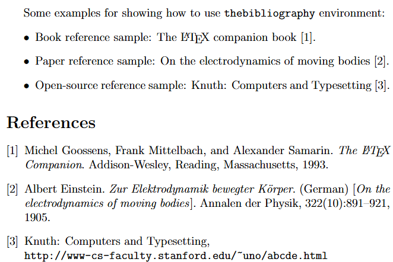

# Latex参考文献

LaTeX主要有两种管理参考文献的方法，第一种方法是在.tex文档中嵌入参考文献，参考文献格式需符合特定的文献引用格式；另一种方法则是使用 BibTeX进行文献管理，文件的拓展名为.bib。其中，使用外部文件BibTeX管理文献更加便捷高效。


在LaTeX中，插入参考文献的一种直接方式是使用thebibliography环境，以列表的形式将参考文献进行整理起来，配以标签，以供正文引用，文档中引用的命令为\cite{}。


## thebibliography 环境
```latex
\documentclass[12pt]{article}

\begin{document}

Some examples for showing how to use \texttt{thebibliography} environment:
\begin{itemize}
    \item Book reference sample: The \LaTeX\ companion book \cite{latexcompanion}.
    \item Paper reference sample: On the electrodynamics of moving bodies \cite{einstein}.
    \item Open-source reference sample: Knuth: Computers and Typesetting \cite{knuthwebsite}.
\end{itemize}

\begin{thebibliography}{9}
\bibitem{latexcompanion} 
Michel Goossens, Frank Mittelbach, and Alexander Samarin. 
\textit{The \LaTeX\ Companion}. 
Addison-Wesley, Reading, Massachusetts, 1993.

\bibitem{einstein} 
Albert Einstein. 
\textit{Zur Elektrodynamik bewegter K{\"o}rper}. (German) 
[\textit{On the electrodynamics of moving bodies}]. 
Annalen der Physik, 322(10):891–921, 1905.

\bibitem{knuthwebsite} 
Knuth: Computers and Typesetting,
\\\texttt{http://www-cs-faculty.stanford.edu/\~{}uno/abcde.html}
\end{thebibliography}

\end{document}
```
编译上述代码，得到文档如图所示。



## Bibtex用法


