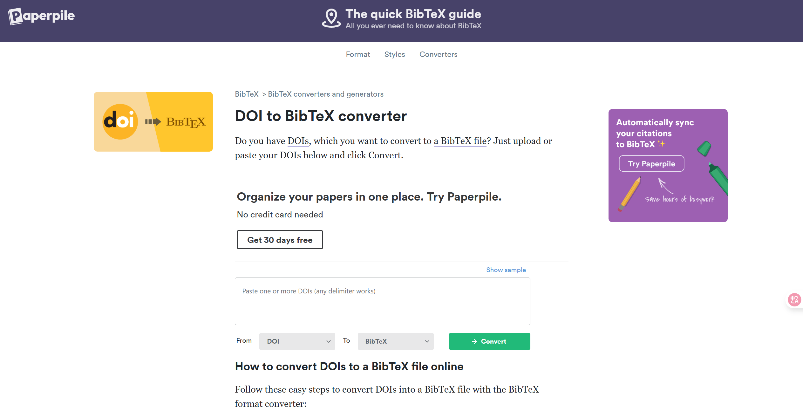

# Latex参考文献

LaTeX主要有两种管理参考文献的方法，第一种方法是在.tex文档中嵌入参考文献，参考文献格式需符合特定的文献引用格式；另一种方法则是使用 BibTeX进行文献管理，文件的拓展名为.bib。其中，使用外部文件BibTeX管理文献更加便捷高效。


在LaTeX中，插入参考文献的一种直接方式是使用thebibliography环境，以列表的形式将参考文献进行整理起来，配以标签，以供正文引用，文档中引用的命令为\cite{}。


## thebibliography 环境
```latex
\documentclass[12pt]{article}

\begin{document}

Some examples for showing how to use \texttt{thebibliography} environment:
\begin{itemize}
    \item Book reference sample: The \LaTeX\ companion book \cite{latexcompanion}.
    \item Paper reference sample: On the electrodynamics of moving bodies \cite{einstein}.
    \item Open-source reference sample: Knuth: Computers and Typesetting \cite{knuthwebsite}.
\end{itemize}

\begin{thebibliography}{9}
\bibitem{latexcompanion} 
Michel Goossens, Frank Mittelbach, and Alexander Samarin. 
\textit{The \LaTeX\ Companion}. 
Addison-Wesley, Reading, Massachusetts, 1993.

\bibitem{einstein} 
Albert Einstein. 
\textit{Zur Elektrodynamik bewegter K{\"o}rper}. (German) 
[\textit{On the electrodynamics of moving bodies}]. 
Annalen der Physik, 322(10):891–921, 1905.

\bibitem{knuthwebsite} 
Knuth: Computers and Typesetting,
\\\texttt{http://www-cs-faculty.stanford.edu/\~{}uno/abcde.html}
\end{thebibliography}

\end{document}
```
编译上述代码，得到文档如图所示。


## Bibtex用法

### Bibtex数据库
BIBTEX 数据库以 `.bib` 作为扩展名，其内容是若干个文献条目，每个条目的格式为：

```bibtex
@⟨type⟩{⟨citation⟩,
    ⟨key1⟩ = {⟨value1⟩},
     ⟨key2⟩ = {⟨value2⟩},
    ...
    }
```

type：文献类型，article为学术论文, book为书籍, incollection 为论文集中的某一篇, ...
+ article 学术论文: 必需字段有 author, title, journal, year;  可选字段包括 volume, number, pages, doi 等； 
+ book  书籍：必需字段有 author/editor, title, publisher, year;  可选字段包括 volume/number, series, address等；
+ incollection 论文集中的某一篇：必需字段有 author, title, booktitle, publisher, year;  可选字段包括 editor, volume/number, chapter, pages, address等；
+ inbook 书籍中的某一篇：必需字段有 author/editor, title, chapter/pages, publisher, year;  可选字段包括 volume/number, series, type, address等；

eg:
```bibtex
@Article{Phan2022-wu,
  author    = {Phan, Thithuha and Jones, John E and Chen, Meng and Bowles, Doug K and Fay, William P and Yu, Qingsong},
  journal   = {Materials (Basel)},
  title     = {A biocompatibility study of plasma nanocoatings onto cobalt chromium {L605} alloy for cardiovascular Stent applications},
  year      = {2022},
  month     = aug,
  number    = {17},
  pages     = {5968},
  volume    = {15},
  keywords  = {NH3/O2 plasma post-treatment; biocompatibility; cardiovascular stent; cell culture; cobalt chromium L605 alloy; plasma nanocoating; restenosis prevention},
  language  = {en},
  publisher = {MDPI AG},
}
```

多数情况下可从文献数据库中直接复制文献条目，如：


<!--  -->
期刊主页：

谷歌学术：

知网：


也可通过BibTeX在线生成器生成：

---
+ [DOI to BibTeX converter](https://www.bibtex.com/c/doi-to-bibtex-converter/)



+ [doi2bib](https://www.doi2bib.org/)


### BIBTEX 样式

一般在导言区使用`\bibliographystyle{⟨bst-name⟩}`设定参考文献格式，可选参数有：plain、unsrt、alpha和abbrv：

| 样式 | 编号 | 条目排序 | 人名缩写 | 月份全称 | 期刊全称|
|------------|-------------|---------|-------|-------|---------------|
| plain      | ❌ | ✔       | ✔ | ✔   | ✔ |
| unsrt      | ❌ | ❌       | ✔ | ✔   | ✔ |
| alpha      | ✔ | ✔       | ✔ | ✔   | ✔ |
| abbrv      | ❌ | ❌       | ❌ | ❌   | ❌ |

使用 `\bibliographystyle` 命令选择不同的参考文献样式：


最小例子：
```latex
\documentclass{article}
\bibliographystyle{plain} %% BIBTEX 样式 // [!code highlight]
\begin{document}
\section{Some  words}
Some  excellent  books,  for  example,  \cite{citation1}
and  \cite{citation2}  \ldots
\bibliography{books} %% BIBTEX 数据库 // [!code highlight]
\end{document}
```

+ 使用的bib数据库不带bib后缀，可从多个数据库引用：``\bibliography{books,articles}``
+ 编译带有参考文献的文件demo.tex，须先编译.tex文件，然后运行biblatex生成文献列表，然后再编译.tex文件两次，得到正确引用的文档(可以略去扩展名)：
```bash
xelatex demo.tex
bibtex demo.aux
xelatex demo.tex
xelatex demo.tex
```
## biblatex 宏包

biblatex 宏包也因其对 UTF-8 和中文参考文献的良好支持，被国内较多 LATEX 模板 采用。基于 biblatex 宏包的方式与基于 BIBTEX 的传统方式有一定区别。
1. 首先是在导言区调用 biblatex 宏包。宏包支持以 ⟨key⟩=⟨value⟩ 形式指定选项，包括参考文 献样式 style、参考文献著录排序的规则 sorting 等。
2. 其次是使用 `\addbibresource{⟨bib-file⟩}` 命令指定 bib 数据库文件，可以指定多个数据库文件，需要写完整的文件名。
3. 最在正文中使用 \cite 命令引用参考文献。除此之外还可以使用丰富的命令达到不同的引用 效果，如\citeauthor 和\citeyear 分别单独引用作者和年份，\textcite 和\parencite 分别类似 natbib 宏包提供的 \citet 和 \citep 命令，以及脚注式引用 \footcite 等。
4. 最后是使用 `\printbibliography` 命令生成参考文献列表。
5. 编译步骤为：
```bash
xelatex  demo 
biber  demo 
xelatex  demo 
xelatex  demo
```
最小例子：
```latex
% File: egbibdata.bib
@book{caimin2006,
  title      = {UML基础和Rose建模教程},
  address    = {北京},
  author     = {蔡敏 and 徐慧慧 and 黄柄强},
  publisher  = {人民邮电出版社},
  year       = {2006},
  month      = {1}
}
% File: demo.tex
\documentclass{ctexart}
% 使用符合 GB/T 7714-2015 规范的参考文献样式
\usepackage[backend=biber,style=gb7714-2015]{biblatex} // [!code highlight]
% 注意加 .bib 扩展名
\addbibresource{egbibdata.bib} // [!code highlight]

\begin{document}

见文献\cite{caimin2006}。// [!code highlight]

\printbibliography // [!code highlight]
\end{document}
```
+ `backend=biber`biber这是默认的后端，也是推荐的后端，因为它为多个命令提供了完整的本地化，并且 biber 的样式由于使用标准L a T e X宏，更易于修改。
+ `style=gb7714-2015`这是符合 GB/T 7714-2015 规范的参考文献样式，它使用 GB/T 7714-2005 标准的格式，但做了部分修改，以符合 GB/T 7714-2015 标准。


## 参考文献管理软件


1. Endnote [](https://support.clarivate.com/Endnote/s/article/Download-EndNote?language=en_US)
2. Jabref [ ](https://www.jabref.org/)
3. Zotero [ ](https://www.zotero.org/)
